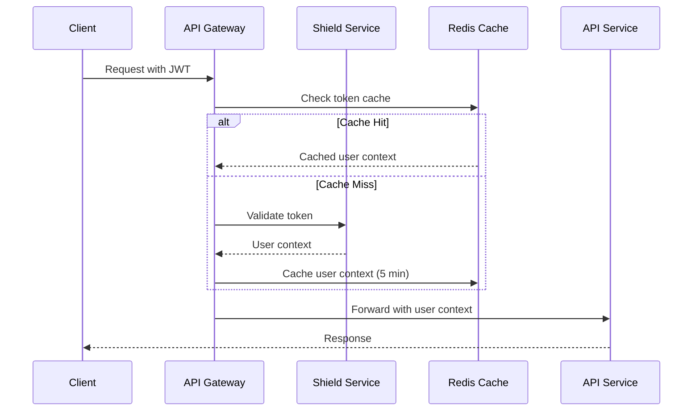
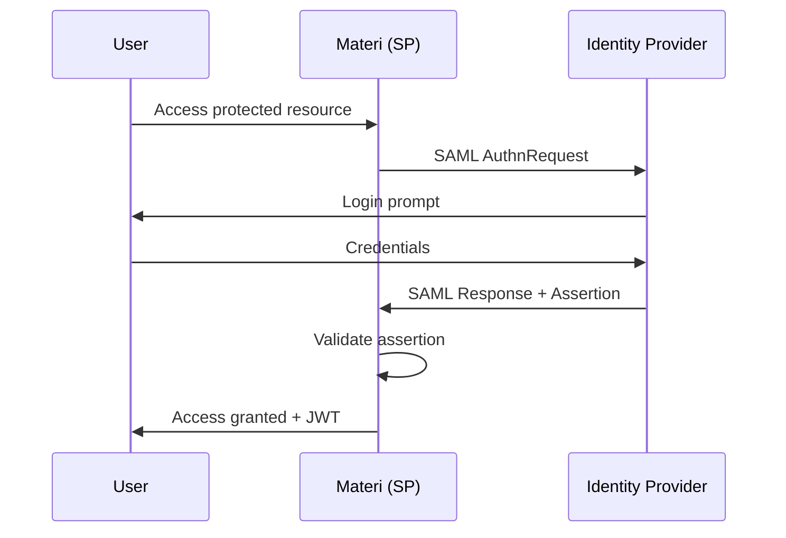

# API Authentication

<Info>
**SDD Classification:** L3-Technical
**Authority:** Engineering Team
**Review Cycle:** Quarterly
</Info>

Materi uses JWT (JSON Web Tokens) for secure, stateless authentication. This guide covers all authentication methods, token management, and security best practices.

---

## Authentication Flow Overview



---

## JWT Token Structure

### Access Token Claims

```json
{
  "user_id": "2441f8c8-0e14-4a71-8f32-8cbbf80382ae",
  "email": "user@example.com",
  "name": "John Doe",
  "workspace_ids": ["ws_123", "ws_456"],
  "roles": ["member", "admin"],
  "permissions": {
    "documents": ["read", "write"],
    "workspaces": ["read"]
  },
  "iat": 1704067200,
  "exp": 1704068100,
  "jti": "token_unique_id",
  "token_type": "access"
}
```

### Token Properties

| Property | Description | Value |
|----------|-------------|-------|
| **Algorithm** | Signing algorithm | RS256 |
| **Key Size** | RSA key size | 2048-bit minimum |
| **Access TTL** | Access token expiry | 15 minutes |
| **Refresh TTL** | Refresh token expiry | 30 days |
| **Collaboration TTL** | WebSocket session token | 60 minutes |

---

## Authentication Methods

### Method 1: Email/Password Login

```bash
POST /auth/login
Content-Type: application/json

{
  "email": "user@example.com",
  "password": "secure_password"
}
```

**Response:**

```json
{
  "access_token": "eyJhbGciOiJSUzI1NiIs...",
  "refresh_token": "eyJhbGciOiJSUzI1NiIs...",
  "token_type": "Bearer",
  "expires_in": 900,
  "user": {
    "id": "2441f8c8-0e14-4a71-8f32-8cbbf80382ae",
    "email": "user@example.com",
    "name": "John Doe"
  }
}
```

### Method 2: OAuth 2.0 Authorization Code

**Step 1: Redirect to Authorization**

```javascript
const authUrl = `https://api.materi.dev/oauth/authorize?
  client_id=${CLIENT_ID}&
  response_type=code&
  scope=documents:read documents:write workspaces:read&
  redirect_uri=${encodeURIComponent(CALLBACK_URL)}&
  state=${generateState()}`;

window.location.href = authUrl;
```

**Step 2: Exchange Code for Tokens**

```bash
POST /oauth/token
Content-Type: application/json

{
  "grant_type": "authorization_code",
  "client_id": "your_client_id",
  "client_secret": "your_client_secret",
  "code": "authorization_code_from_callback",
  "redirect_uri": "https://yourapp.com/callback"
}
```

### Method 3: Client Credentials (Server-to-Server)

```bash
POST /oauth/token
Content-Type: application/json

{
  "grant_type": "client_credentials",
  "client_id": "your_client_id",
  "client_secret": "your_client_secret",
  "scope": "documents:read workspaces:read"
}
```

---

## OAuth Scopes

| Scope | Description | Access Level |
|-------|-------------|--------------|
| `documents:read` | Read document content | Read-only |
| `documents:write` | Create and edit documents | Read/Write |
| `documents:delete` | Delete documents | Full |
| `workspaces:read` | List workspaces and members | Read-only |
| `workspaces:write` | Manage workspace settings | Read/Write |
| `users:read` | Read user profiles | Read-only |
| `users:write` | Update user profiles | Read/Write |
| `ai:generate` | Use AI generation features | Execute |
| `collaborate` | Real-time collaboration | WebSocket |

---

## Token Refresh

Access tokens expire after 15 minutes. Use refresh tokens to obtain new access tokens:

```bash
POST /auth/refresh
Content-Type: application/json

{
  "refresh_token": "eyJhbGciOiJSUzI1NiIs..."
}
```

**Response:**

```json
{
  "access_token": "new_access_token",
  "refresh_token": "new_refresh_token",
  "token_type": "Bearer",
  "expires_in": 900
}
```

<Warning>
Refresh tokens are rotated on each use. The old refresh token becomes invalid immediately. Store the new refresh token securely.
</Warning>

### Automatic Token Refresh Pattern

```javascript
class TokenManager {
  constructor() {
    this.accessToken = null;
    this.refreshToken = null;
    this.refreshPromise = null;
  }

  async getValidToken() {
    if (this.isTokenValid(this.accessToken)) {
      return this.accessToken;
    }

    // Avoid concurrent refresh requests
    if (this.refreshPromise) {
      return this.refreshPromise;
    }

    this.refreshPromise = this.refreshAccessToken();
    try {
      this.accessToken = await this.refreshPromise;
      return this.accessToken;
    } finally {
      this.refreshPromise = null;
    }
  }

  async refreshAccessToken() {
    const response = await fetch('https://api.materi.dev/v1/auth/refresh', {
      method: 'POST',
      headers: { 'Content-Type': 'application/json' },
      body: JSON.stringify({ refresh_token: this.refreshToken })
    });

    if (!response.ok) {
      throw new Error('Token refresh failed');
    }

    const data = await response.json();
    this.refreshToken = data.refresh_token;
    return data.access_token;
  }

  isTokenValid(token) {
    if (!token) return false;
    const payload = JSON.parse(atob(token.split('.')[1]));
    return payload.exp * 1000 > Date.now() + 60000; // 1 min buffer
  }
}
```

---

## Token Revocation

### Revoke Current Token

```bash
POST /auth/revoke
Authorization: Bearer <access_token>
Content-Type: application/json

{
  "refresh_token": "token_to_revoke"
}
```

### Revoke All User Sessions

```bash
POST /auth/revoke-all
Authorization: Bearer <access_token>
```

---

## SSO Integration

### Supported Providers

| Provider | Protocol | Enterprise |
|----------|----------|------------|
| **Google** | OAuth 2.0 | Yes |
| **GitHub** | OAuth 2.0 | Yes |
| **Microsoft** | OAuth 2.0 / SAML | Yes |
| **Okta** | SAML 2.0 | Yes |
| **Azure AD** | SAML 2.0 | Yes |
| **OneLogin** | SAML 2.0 | Yes |

### SAML 2.0 Configuration



**SAML Service Provider Metadata:**

| Property | Value |
|----------|-------|
| **Entity ID** | `https://api.materi.dev/saml/metadata` |
| **ACS URL** | `https://api.materi.dev/auth/saml/acs` |
| **SLO URL** | `https://api.materi.dev/auth/saml/slo` |

---

## Security Best Practices

### Token Storage Recommendations

| Platform | Recommended Storage |
|----------|---------------------|
| **Browser** | HttpOnly cookies or secure memory |
| **Mobile** | Secure keychain/keystore |
| **Server** | Environment variables or secrets manager |

**Never store tokens in:**
- LocalStorage (XSS vulnerable)
- SessionStorage (XSS vulnerable)
- URL parameters
- Log files

### Rate Limiting for Auth Endpoints

| Endpoint | Limit | Window |
|----------|-------|--------|
| `/auth/login` | 5 attempts | 15 minutes per IP |
| `/auth/register` | 3 accounts | 1 hour per IP |
| `/auth/password-reset` | 3 requests | 1 hour per IP |
| `/auth/refresh` | 10 requests | 1 minute |

---

## Public Key Endpoint

Validate JWT tokens locally using the public key:

```bash
GET /.well-known/jwks.json
```

**Response:**

```json
{
  "keys": [
    {
      "kty": "RSA",
      "use": "sig",
      "kid": "key_id_2024",
      "alg": "RS256",
      "n": "base64url_encoded_modulus",
      "e": "AQAB"
    }
  ]
}
```

**Key Rotation Policy:**
- Keys rotate every 90 days
- Dual-key overlap for 7 days
- Cache JWKS for maximum 5 minutes

---

## Authentication Errors

| Error Code | HTTP Status | Description |
|------------|-------------|-------------|
| `INVALID_CREDENTIALS` | 401 | Email or password incorrect |
| `INVALID_TOKEN` | 401 | Token malformed or expired |
| `TOKEN_REVOKED` | 401 | Token has been revoked |
| `REFRESH_TOKEN_EXPIRED` | 401 | Refresh token expired |
| `ACCOUNT_LOCKED` | 403 | Too many failed attempts |
| `ACCOUNT_SUSPENDED` | 403 | Account disabled by admin |
| `INSUFFICIENT_SCOPE` | 403 | Token lacks required scope |

---

## Related Documentation

- [API Overview](/api/introduction/overview) - API fundamentals
- [Rate Limits](/api/introduction/rate-limits) - Request limits
- [Errors](/api/introduction/errors) - Error handling guide
- [Shield Service](/developer/domain/shield/overview) - Authentication service

---

**Document Status:** Complete
**Version:** 2.0
