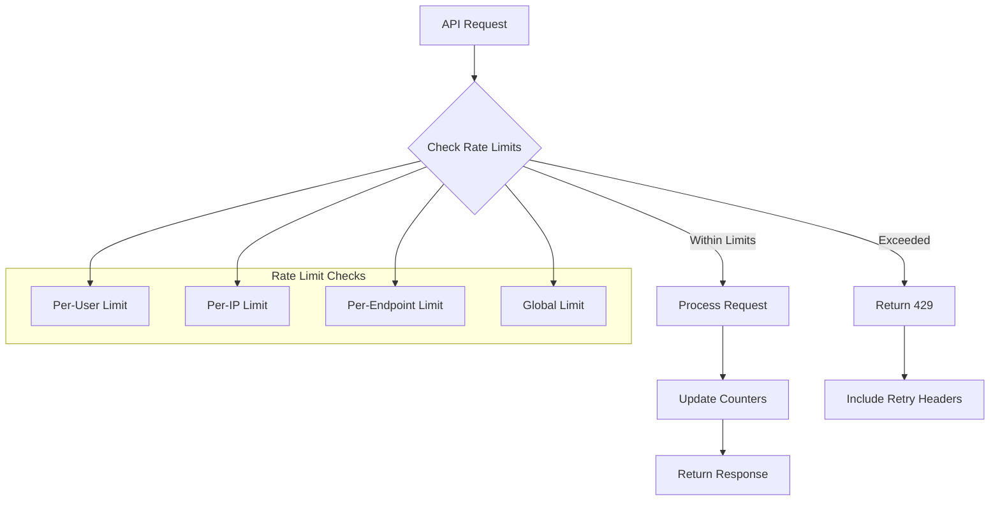
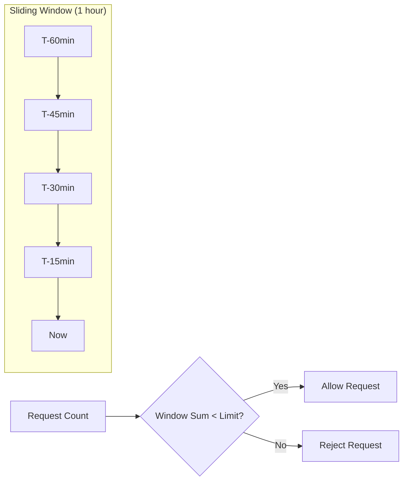

# API Rate Limits

<Info>
**SDD Classification:** L3-Technical
**Authority:** Engineering Team
**Review Cycle:** Quarterly
</Info>

Rate limiting protects the Materi platform from abuse while ensuring fair resource allocation across all users. This guide explains rate limit policies, headers, and best practices for handling limits gracefully.

---

## Rate Limiting Overview



---

## Rate Limits by Plan

### Standard Limits

| Plan | Requests/Hour | Requests/Minute | Burst Allowance | AI Requests/Day |
|------|---------------|-----------------|-----------------|-----------------|
| **Free** | 1,000 | 60 | 100 | 100 |
| **Professional** | 10,000 | 300 | 500 | 1,000 |
| **Team** | 50,000 | 1,000 | 2,000 | 5,000 |
| **Enterprise** | Custom | Custom | Custom | Unlimited |

### Endpoint-Specific Limits

Some endpoints have additional specific limits:

| Endpoint Category | Additional Limit | Notes |
|-------------------|------------------|-------|
| `/auth/*` | 10/min per IP | Prevents brute force |
| `/ai/generate` | Counted against AI quota | Daily limit |
| `/documents/export` | 10/hour | Resource intensive |
| `/search` | 100/min | Query complexity limits |
| WebSocket connections | 5 concurrent | Per user |

---

## Rate Limit Headers

Every API response includes rate limit information:

```http
HTTP/1.1 200 OK
X-RateLimit-Limit: 1000
X-RateLimit-Remaining: 742
X-RateLimit-Reset: 1704067200
X-RateLimit-Policy: sliding-window
```

### Header Reference

| Header | Type | Description |
|--------|------|-------------|
| `X-RateLimit-Limit` | integer | Maximum requests allowed in window |
| `X-RateLimit-Remaining` | integer | Requests remaining in current window |
| `X-RateLimit-Reset` | timestamp | Unix timestamp when window resets |
| `X-RateLimit-Policy` | string | Rate limit algorithm used |
| `X-RateLimit-Retry-After` | integer | Seconds to wait (only on 429) |

---

## Rate Limit Response

When you exceed rate limits, you'll receive a `429 Too Many Requests` response:

```json
{
  "error": {
    "code": "RATE_LIMIT_EXCEEDED",
    "message": "Rate limit exceeded. Please retry after 45 seconds.",
    "details": {
      "limit": 1000,
      "remaining": 0,
      "reset_at": "2025-01-07T11:00:00Z",
      "retry_after": 45,
      "limit_type": "hourly"
    },
    "request_id": "req_abc123"
  }
}
```

### Response Headers on 429

```http
HTTP/1.1 429 Too Many Requests
X-RateLimit-Limit: 1000
X-RateLimit-Remaining: 0
X-RateLimit-Reset: 1704070800
X-RateLimit-Retry-After: 45
Retry-After: 45
```

---

## Rate Limit Algorithm

Materi uses a **sliding window** algorithm that provides smoother rate limiting than fixed windows:



### How It Works

1. **Window Duration**: Configured per limit type (e.g., 1 hour)
2. **Sub-Windows**: Divided into smaller buckets (e.g., 1 minute each)
3. **Weighted Count**: Recent requests weighted more heavily
4. **Smooth Decay**: Old requests gradually stop counting

### Benefits

- No "thundering herd" at window boundaries
- Fairer distribution of requests over time
- Burst allowance within limits
- Predictable behavior for clients

---

## Handling Rate Limits

### Basic Retry Logic

```javascript
async function apiCallWithRetry(endpoint, options, maxRetries = 3) {
  for (let attempt = 0; attempt <= maxRetries; attempt++) {
    const response = await fetch(`https://api.materi.dev/v1${endpoint}`, {
      ...options,
      headers: {
        'Authorization': `Bearer ${accessToken}`,
        'Content-Type': 'application/json',
        ...options?.headers,
      },
    });

    if (response.status === 429) {
      const retryAfter = parseInt(response.headers.get('Retry-After') || '60');

      if (attempt === maxRetries) {
        throw new Error(`Rate limit exceeded after ${maxRetries} retries`);
      }

      console.warn(`Rate limited. Retrying in ${retryAfter}s (attempt ${attempt + 1}/${maxRetries})`);
      await new Promise(resolve => setTimeout(resolve, retryAfter * 1000));
      continue;
    }

    return response;
  }
}
```

### Exponential Backoff with Jitter

```javascript
class RateLimitHandler {
  constructor(baseDelay = 1000, maxDelay = 60000) {
    this.baseDelay = baseDelay;
    this.maxDelay = maxDelay;
  }

  async executeWithBackoff(fn, maxRetries = 5) {
    for (let attempt = 0; attempt <= maxRetries; attempt++) {
      try {
        return await fn();
      } catch (error) {
        if (error.status !== 429 || attempt === maxRetries) {
          throw error;
        }

        // Exponential backoff with jitter
        const exponentialDelay = Math.min(
          this.baseDelay * Math.pow(2, attempt),
          this.maxDelay
        );
        const jitter = Math.random() * 1000;
        const delay = exponentialDelay + jitter;

        console.warn(`Rate limited. Backing off for ${Math.round(delay)}ms`);
        await new Promise(resolve => setTimeout(resolve, delay));
      }
    }
  }
}

// Usage
const handler = new RateLimitHandler();
const result = await handler.executeWithBackoff(() =>
  api.createDocument({ title: 'My Document' })
);
```

### Proactive Rate Limit Monitoring

```javascript
class MateriAPIClient {
  constructor(accessToken) {
    this.accessToken = accessToken;
    this.rateLimitRemaining = Infinity;
    this.rateLimitReset = 0;
  }

  async request(endpoint, options = {}) {
    // Check if we should wait before making request
    if (this.rateLimitRemaining <= 10) {
      const waitTime = Math.max(0, this.rateLimitReset - Date.now());
      if (waitTime > 0) {
        console.log(`Approaching rate limit. Waiting ${waitTime}ms`);
        await new Promise(resolve => setTimeout(resolve, waitTime));
      }
    }

    const response = await fetch(`https://api.materi.dev/v1${endpoint}`, {
      ...options,
      headers: {
        'Authorization': `Bearer ${this.accessToken}`,
        'Content-Type': 'application/json',
      },
    });

    // Update rate limit tracking
    this.rateLimitRemaining = parseInt(
      response.headers.get('X-RateLimit-Remaining') || '1000'
    );
    this.rateLimitReset = parseInt(
      response.headers.get('X-RateLimit-Reset') || '0'
    ) * 1000;

    return response;
  }

  getRateLimitStatus() {
    return {
      remaining: this.rateLimitRemaining,
      resetAt: new Date(this.rateLimitReset).toISOString(),
      percentUsed: ((1000 - this.rateLimitRemaining) / 1000) * 100,
    };
  }
}
```

---

## Request Queuing

For high-throughput applications, implement request queuing:

```javascript
class RequestQueue {
  constructor(requestsPerSecond = 10) {
    this.queue = [];
    this.processing = false;
    this.interval = 1000 / requestsPerSecond;
  }

  async add(fn) {
    return new Promise((resolve, reject) => {
      this.queue.push({ fn, resolve, reject });
      this.process();
    });
  }

  async process() {
    if (this.processing) return;
    this.processing = true;

    while (this.queue.length > 0) {
      const { fn, resolve, reject } = this.queue.shift();

      try {
        const result = await fn();
        resolve(result);
      } catch (error) {
        reject(error);
      }

      // Wait before next request
      await new Promise(r => setTimeout(r, this.interval));
    }

    this.processing = false;
  }
}

// Usage
const queue = new RequestQueue(10); // 10 requests per second

const documents = await Promise.all(
  documentIds.map(id =>
    queue.add(() => api.getDocument(id))
  )
);
```

---

## Special Limits

### AI Generation Limits

AI endpoints have separate daily quotas:

| Plan | Daily AI Requests | Tokens/Request | Total Tokens/Day |
|------|-------------------|----------------|------------------|
| **Free** | 100 | 4,000 | 400,000 |
| **Professional** | 1,000 | 8,000 | 8,000,000 |
| **Team** | 5,000 | 16,000 | 80,000,000 |
| **Enterprise** | Unlimited | 32,000 | Unlimited |

AI responses include additional headers:

```http
X-AI-Quota-Limit: 1000
X-AI-Quota-Remaining: 847
X-AI-Quota-Reset: 1704153600
```

### Concurrent Connection Limits

| Resource | Free | Professional | Team | Enterprise |
|----------|------|--------------|------|------------|
| WebSocket connections | 2 | 5 | 20 | Custom |
| Concurrent uploads | 1 | 3 | 10 | Custom |
| Export jobs | 1 | 3 | 10 | Custom |

---

## Best Practices

### Do

1. **Cache responses** when appropriate to reduce API calls
2. **Use webhooks** instead of polling for event-driven updates
3. **Batch requests** using bulk endpoints where available
4. **Monitor headers** and adjust request rate proactively
5. **Implement queuing** for bulk operations

### Don't

1. **Don't retry immediately** on 429 - always respect `Retry-After`
2. **Don't parallelize aggressively** without rate limiting
3. **Don't ignore remaining count** - throttle before hitting zero
4. **Don't cache rate limit headers** - always read fresh values

---

## Requesting Higher Limits

Enterprise customers can request custom rate limits:

1. Contact sales or support with use case details
2. Provide expected request volumes and patterns
3. Describe peak usage scenarios
4. Allow 2-3 business days for review

**Include in your request:**
- Current plan and usage patterns
- Specific endpoints needing higher limits
- Business justification
- Expected growth trajectory

---

## Related Documentation

- [API Overview](/api/introduction/overview) - API fundamentals
- [Authentication](/api/introduction/authentication) - Token management
- [Errors](/api/introduction/errors) - Error handling

---

**Document Status:** Complete
**Version:** 2.0
