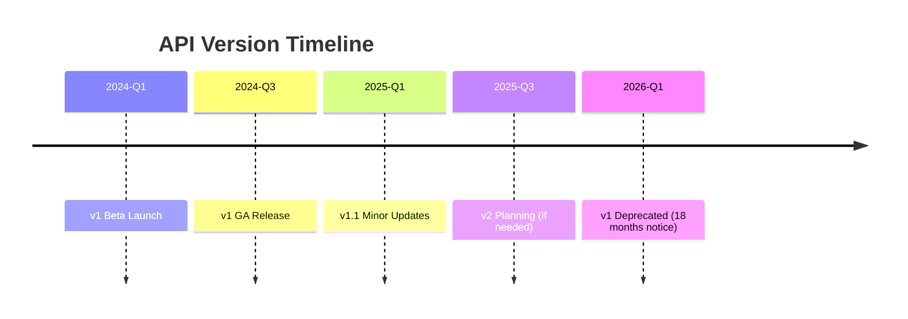
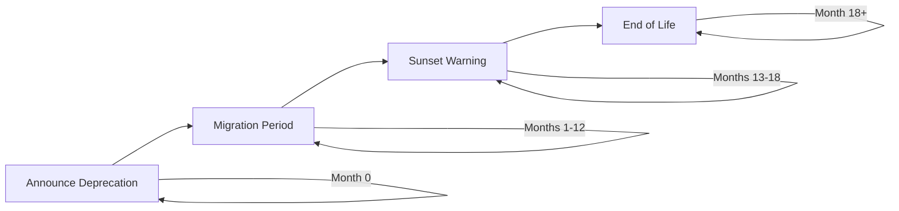

# API Versioning

<Info>
**SDD Classification:** L3-Technical
**Authority:** Engineering Team
**Review Cycle:** Quarterly
</Info>

This guide covers Materi's API versioning strategy, backward compatibility policies, and migration guidance.

---

## Versioning Strategy

Materi uses **URL-based versioning** with a commitment to backward compatibility:

```
https://api.materi.dev/v1/documents
https://api.materi.dev/v2/documents  (future)
```



---

## Current Version

| Property | Value |
|----------|-------|
| **Current Version** | v1 |
| **Status** | Stable |
| **Base URL** | `https://api.materi.dev/v1` |
| **Released** | 2024-Q3 |

---

## Version in Request

### URL Path (Required)

```bash
GET https://api.materi.dev/v1/documents
POST https://api.materi.dev/v1/documents
```

### Accept Header (Optional)

For fine-grained version control within a major version:

```http
Accept: application/vnd.materi.v1+json
Accept: application/vnd.materi.v1.1+json
```

---

## Backward Compatibility

### What We Consider Backward Compatible

These changes are made without version bumps:

| Change Type | Example |
|-------------|---------|
| Adding new endpoints | `POST /api/v1/templates` |
| Adding optional fields | New `metadata` field in response |
| Adding new enum values | New `status: "archived"` option |
| Relaxing validation | Increasing max title length |
| Adding new query parameters | `?include_deleted=true` |
| New response headers | `X-Request-Duration` |

### What Requires New Version

These changes require a new API version:

| Change Type | Example |
|-------------|---------|
| Removing endpoints | Removing `DELETE /users` |
| Removing fields | Removing `legacy_id` from response |
| Changing field types | `id` from integer to string |
| Renaming fields | `user_id` to `owner_id` |
| Changing validation | Stricter email validation |
| Changing default behavior | Different default sort order |

---

## Deprecation Policy

### Timeline



| Phase | Duration | Actions |
|-------|----------|---------|
| **Announcement** | Day 0 | Changelog, email, docs update |
| **Migration Period** | 12 months | Both versions supported |
| **Sunset Warning** | 6 months | Deprecation headers, warnings |
| **End of Life** | After 18 months | Old version returns 410 Gone |

### Deprecation Headers

When using deprecated features:

```http
HTTP/1.1 200 OK
Deprecation: true
Sunset: Sat, 01 Jul 2026 00:00:00 GMT
Link: <https://docs.materi.dev/migration/v1-to-v2>; rel="deprecation"
```

---

## Version Migration

### Checking Your Version

```bash
GET /api/v1/version
```

**Response:**

```json
{
  "version": "v1",
  "build": "2025.01.07.1234",
  "deprecation": {
    "is_deprecated": false,
    "sunset_date": null,
    "migration_guide": null
  }
}
```

### Feature Flags

Request specific features within a version:

```http
X-Materi-Features: new-editor,beta-ai
```

### SDK Version Compatibility

| SDK | API v1 Support | Notes |
|-----|----------------|-------|
| JavaScript 1.x | ✅ | Current |
| JavaScript 2.x | ✅ | Current |
| Python 1.x | ✅ | Current |
| Go 1.x | ✅ | Current |

---

## Changelog

### v1.1 (2025-01-07)

**Added:**
- `POST /ai/analyze` - Document analysis endpoint
- `metadata` field on document responses
- `include_deleted` query parameter

**Changed:**
- Increased rate limits for Professional tier

### v1.0 (2024-09-15)

**Initial Release:**
- Document CRUD operations
- Workspace management
- User authentication
- AI content generation
- Real-time collaboration

---

## Migration Guides

When a new version is released, migration guides will be available:

- [v1 to v2 Migration Guide](#) (future)
- [Breaking Changes Reference](#) (future)
- [SDK Upgrade Guide](#) (future)

---

## API Status

### Health Endpoints

```bash
# API health check
GET /health

# API readiness (includes dependencies)
GET /ready

# API version info
GET /api/v1/version
```

### Status Page

Monitor API status and planned maintenance:
- **Status Page**: https://status.materi.dev
- **Subscribe**: Get notified of incidents

---

## Best Practices

### For API Consumers

1. **Pin to a specific version** in production
2. **Subscribe to changelog** for updates
3. **Test against staging** before production
4. **Handle deprecation headers** in your code
5. **Plan migrations early** during migration period

### Version Detection

```javascript
class MateriClient {
  constructor(config) {
    this.version = config.apiVersion || 'v1';
    this.baseUrl = `https://api.materi.dev/${this.version}`;
  }

  async checkDeprecation(response) {
    if (response.headers.get('Deprecation') === 'true') {
      const sunset = response.headers.get('Sunset');
      const guide = response.headers.get('Link');

      console.warn(`API version deprecated. Sunset: ${sunset}`);
      console.warn(`Migration guide: ${guide}`);
    }
  }
}
```

---

## Related Documentation

- [API Overview](/api/introduction/overview) - API fundamentals
- [Authentication](/api/introduction/authentication) - Auth versioning
- [Errors](/api/introduction/errors) - Version-specific errors

---

**Document Status:** Complete
**Version:** 2.0
