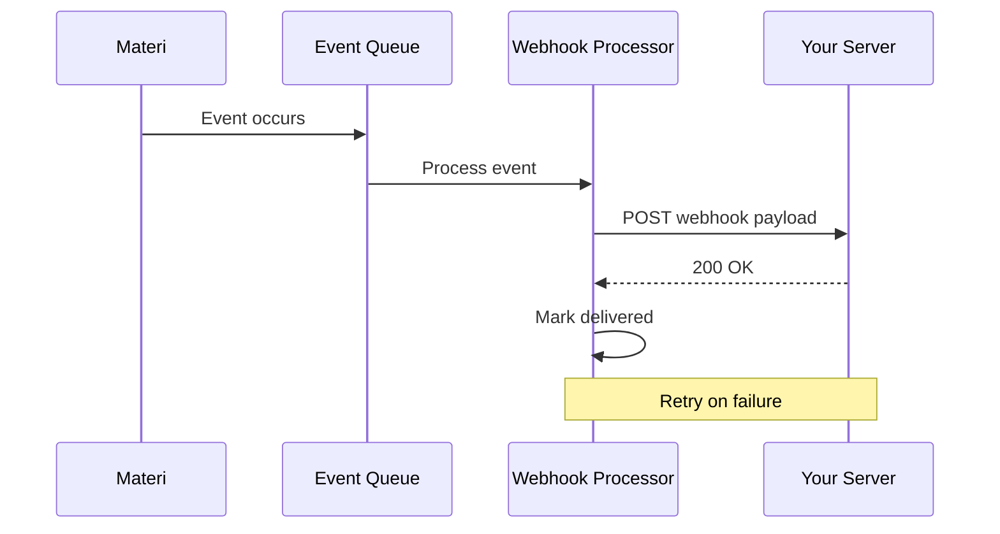
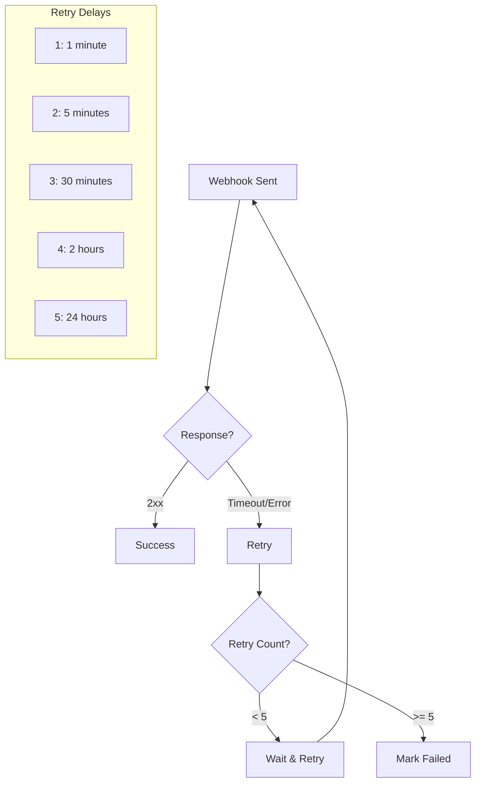

# API Webhooks

<Info>
**SDD Classification:** L3-Technical
**Authority:** Engineering Team
**Review Cycle:** Quarterly
</Info>

Webhooks enable your application to receive real-time notifications when events occur in Materi. This guide covers webhook setup, event types, security, and best practices.

---

## Webhook Overview



---

## Setting Up Webhooks

### Create Webhook Endpoint

```bash
POST /api/v1/webhooks
Authorization: Bearer <token>
Content-Type: application/json

{
  "url": "https://yourapp.com/webhooks/materi",
  "events": ["document.created", "document.updated"],
  "secret": "your_webhook_secret_key",
  "description": "Production webhook for document events"
}
```

**Response:**

```json
{
  "id": "wh_abc123",
  "url": "https://yourapp.com/webhooks/materi",
  "events": ["document.created", "document.updated"],
  "status": "active",
  "created_at": "2025-01-07T10:00:00Z",
  "secret_preview": "your_...key"
}
```

### Webhook Properties

| Property | Type | Required | Description |
|----------|------|----------|-------------|
| `url` | string | Yes | HTTPS endpoint URL |
| `events` | array | Yes | Event types to subscribe |
| `secret` | string | Yes | Signing secret (32+ chars) |
| `description` | string | No | Human-readable description |
| `workspace_id` | string | No | Scope to specific workspace |

---

## Event Types

### Document Events

| Event | Description | Payload |
|-------|-------------|---------|
| `document.created` | Document created | Document object |
| `document.updated` | Document content changed | Document diff |
| `document.deleted` | Document deleted | Document ID |
| `document.shared` | Document shared with user | Share details |
| `document.version.created` | New version saved | Version object |

### Workspace Events

| Event | Description | Payload |
|-------|-------------|---------|
| `workspace.created` | Workspace created | Workspace object |
| `workspace.updated` | Workspace settings changed | Updated fields |
| `workspace.member.added` | User joined workspace | Member details |
| `workspace.member.removed` | User left/removed | Member details |

### Collaboration Events

| Event | Description | Payload |
|-------|-------------|---------|
| `collaboration.started` | User started editing | Session info |
| `collaboration.ended` | User stopped editing | Session summary |
| `comment.created` | Comment added | Comment object |
| `comment.resolved` | Comment resolved | Comment ID |

### AI Events

| Event | Description | Payload |
|-------|-------------|---------|
| `ai.generation.completed` | AI generation finished | Generation result |
| `ai.generation.failed` | AI generation failed | Error details |

---

## Webhook Payload Format

### Standard Payload Structure

```json
{
  "id": "evt_abc123def456",
  "type": "document.created",
  "created_at": "2025-01-07T10:30:00Z",
  "data": {
    "id": "doc_xyz789",
    "title": "New Document",
    "workspace_id": "ws_123",
    "owner_id": "user_456",
    "created_at": "2025-01-07T10:30:00Z"
  },
  "metadata": {
    "workspace_id": "ws_123",
    "triggered_by": "user_456",
    "ip_address": "203.0.113.42"
  }
}
```

### Payload Properties

| Property | Type | Description |
|----------|------|-------------|
| `id` | string | Unique event ID |
| `type` | string | Event type |
| `created_at` | datetime | Event timestamp |
| `data` | object | Event-specific data |
| `metadata` | object | Additional context |

---

## Webhook Security

### Signature Verification

Every webhook includes a signature header for verification:

```http
X-Materi-Signature: sha256=abc123def456...
X-Materi-Timestamp: 1704625800
```

### Verifying Signatures

```javascript
const crypto = require('crypto');

function verifyWebhook(payload, signature, timestamp, secret) {
  // Check timestamp (prevent replay attacks)
  const now = Math.floor(Date.now() / 1000);
  if (Math.abs(now - timestamp) > 300) {
    throw new Error('Timestamp too old');
  }

  // Compute expected signature
  const signedPayload = `${timestamp}.${payload}`;
  const expectedSignature = crypto
    .createHmac('sha256', secret)
    .update(signedPayload)
    .digest('hex');

  // Compare signatures
  const expected = `sha256=${expectedSignature}`;
  if (!crypto.timingSafeEqual(Buffer.from(signature), Buffer.from(expected))) {
    throw new Error('Invalid signature');
  }

  return true;
}

// Express.js middleware
app.post('/webhooks/materi', express.raw({ type: 'application/json' }), (req, res) => {
  const signature = req.headers['x-materi-signature'];
  const timestamp = req.headers['x-materi-timestamp'];

  try {
    verifyWebhook(req.body, signature, timestamp, WEBHOOK_SECRET);

    const event = JSON.parse(req.body);
    handleEvent(event);

    res.status(200).send('OK');
  } catch (error) {
    console.error('Webhook verification failed:', error);
    res.status(400).send('Invalid signature');
  }
});
```

### Python Verification

```python
import hmac
import hashlib
import time

def verify_webhook(payload: bytes, signature: str, timestamp: str, secret: str) -> bool:
    # Check timestamp
    current_time = int(time.time())
    if abs(current_time - int(timestamp)) > 300:
        raise ValueError("Timestamp too old")

    # Compute expected signature
    signed_payload = f"{timestamp}.{payload.decode()}"
    expected_signature = hmac.new(
        secret.encode(),
        signed_payload.encode(),
        hashlib.sha256
    ).hexdigest()

    # Compare signatures
    expected = f"sha256={expected_signature}"
    return hmac.compare_digest(signature, expected)
```

---

## Delivery & Retries

### Retry Policy



### Retry Schedule

| Attempt | Delay | Total Time |
|---------|-------|------------|
| 1 | Immediate | 0 |
| 2 | 1 minute | 1 min |
| 3 | 5 minutes | 6 min |
| 4 | 30 minutes | 36 min |
| 5 | 2 hours | ~2.5 hours |
| 6 | 24 hours | ~26.5 hours |

### Response Requirements

- **Timeout**: 30 seconds
- **Success**: 2xx status codes
- **Failure**: 4xx, 5xx, or timeout

---

## Managing Webhooks

### List Webhooks

```bash
GET /api/v1/webhooks
Authorization: Bearer <token>
```

### Update Webhook

```bash
PATCH /api/v1/webhooks/{webhook_id}
Authorization: Bearer <token>
Content-Type: application/json

{
  "events": ["document.created", "document.updated", "document.deleted"],
  "status": "active"
}
```

### Delete Webhook

```bash
DELETE /api/v1/webhooks/{webhook_id}
Authorization: Bearer <token>
```

### View Delivery History

```bash
GET /api/v1/webhooks/{webhook_id}/deliveries
Authorization: Bearer <token>
```

**Response:**

```json
{
  "data": [
    {
      "id": "del_abc123",
      "event_id": "evt_xyz789",
      "event_type": "document.created",
      "status": "success",
      "response_code": 200,
      "response_time_ms": 145,
      "delivered_at": "2025-01-07T10:30:01Z"
    },
    {
      "id": "del_def456",
      "event_id": "evt_uvw012",
      "event_type": "document.updated",
      "status": "failed",
      "response_code": 500,
      "error": "Internal Server Error",
      "retries": 3,
      "next_retry_at": "2025-01-07T13:00:00Z"
    }
  ]
}
```

---

## Testing Webhooks

### Test Endpoint

Send a test event to your webhook:

```bash
POST /api/v1/webhooks/{webhook_id}/test
Authorization: Bearer <token>
Content-Type: application/json

{
  "event_type": "document.created"
}
```

### Local Development

Use tools like ngrok for local testing:

```bash
# Start ngrok tunnel
ngrok http 3000

# Register webhook with ngrok URL
POST /api/v1/webhooks
{
  "url": "https://abc123.ngrok.io/webhooks/materi",
  "events": ["document.created"]
}
```

---

## Best Practices

### Endpoint Design

1. **Respond quickly** - Return 200 immediately, process async
2. **Idempotency** - Handle duplicate deliveries
3. **Logging** - Log all webhook receipts
4. **Queuing** - Queue events for processing

### Example Handler

```javascript
app.post('/webhooks/materi', async (req, res) => {
  // Verify signature first
  if (!verifySignature(req)) {
    return res.status(400).send('Invalid signature');
  }

  const event = req.body;

  // Acknowledge receipt immediately
  res.status(200).send('OK');

  // Process asynchronously
  try {
    await queueEvent(event);
  } catch (error) {
    console.error('Failed to queue event:', error);
    // Event will be retried
  }
});

async function processEvent(event) {
  // Check for duplicates
  if (await isDuplicate(event.id)) {
    console.log('Duplicate event, skipping:', event.id);
    return;
  }

  // Process based on event type
  switch (event.type) {
    case 'document.created':
      await handleDocumentCreated(event.data);
      break;
    case 'document.updated':
      await handleDocumentUpdated(event.data);
      break;
    // ... other handlers
  }

  // Mark as processed
  await markProcessed(event.id);
}
```

---

## Related Documentation

- [API Overview](/api/introduction/overview) - API fundamentals
- [Authentication](/api/introduction/authentication) - Webhook auth
- [Events](/api/events/overview) - Event schema reference

---

**Document Status:** Complete
**Version:** 2.0
