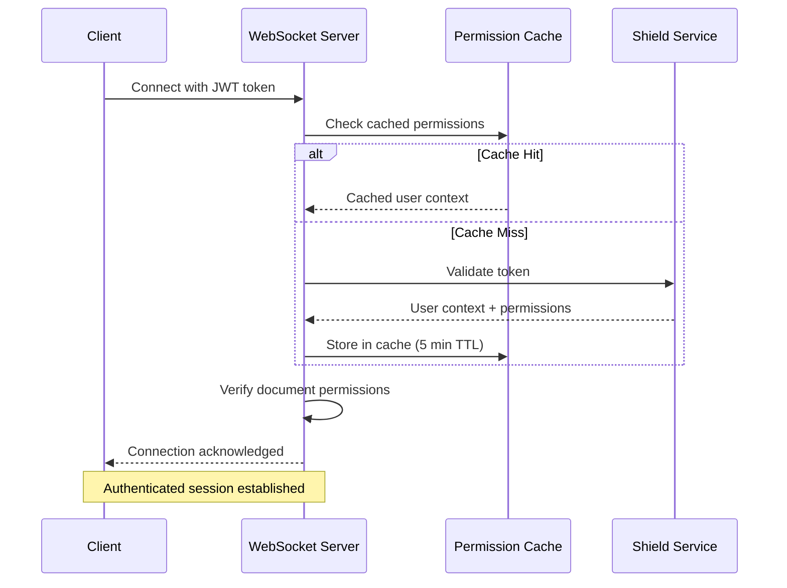
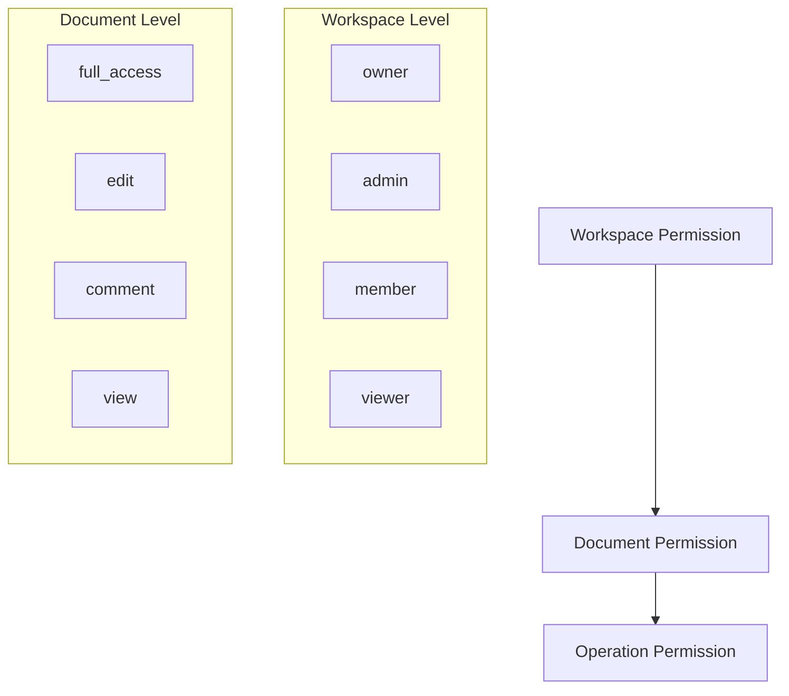

# WebSocket Authentication

<Info>
**SDD Classification:** L3-Technical
**Authority:** Engineering Team
**Review Cycle:** Quarterly
</Info>

WebSocket connections require JWT authentication for secure access to real-time collaboration features. This guide covers authentication flow, token management, and security best practices.

---

## Authentication Flow



---

## Connection Authentication

### Token in Query Parameter

Include the JWT access token when establishing the WebSocket connection:

```javascript
const wsUrl = `wss://api.materi.dev/v1/ws/documents/${documentId}?token=${accessToken}&client_id=${clientId}`;

const ws = new WebSocket(wsUrl);
```

### Token Requirements

| Property | Requirement |
|----------|-------------|
| **Algorithm** | RS256 |
| **Issuer** | `https://api.materi.dev` |
| **Required Claims** | `user_id`, `exp`, `iat` |
| **Max Age** | Must not be expired |

### Token Claims

```json
{
  "user_id": "2441f8c8-0e14-4a71-8f32-8cbbf80382ae",
  "email": "user@example.com",
  "name": "John Doe",
  "workspace_ids": ["ws_123", "ws_456"],
  "permissions": {
    "documents": ["read", "write"],
    "workspaces": ["read"]
  },
  "iat": 1704067200,
  "exp": 1704068100,
  "jti": "token_unique_id",
  "token_type": "access"
}
```

---

## Permission Validation

### Document Permissions

Upon connection, the server validates document-specific permissions:

```json
{
  "type": "system",
  "event": "connection_ack",
  "data": {
    "client_id": "client_abc123",
    "user_id": "user_123",
    "permissions": ["read", "write", "comment"],
    "document_version": 25,
    "workspace_context": {
      "workspace_id": "ws_123",
      "role": "member"
    }
  }
}
```

### Permission Levels

| Permission | Description | Allowed Operations |
|------------|-------------|-------------------|
| `read` | View document | Receive operations, view presence |
| `write` | Edit document | Send operations, create content |
| `comment` | Add comments | Create and reply to comments |
| `moderate` | Manage content | Resolve comments, lock sections |
| `admin` | Full control | All operations, manage permissions |

### Permission Hierarchy



---

## Token Refresh During Session

### Handling Token Expiry

```javascript
class TokenManager {
  constructor(wsClient) {
    this.wsClient = wsClient;
    this.refreshThreshold = 60000; // Refresh 1 minute before expiry
    this.checkInterval = null;
  }

  startMonitoring(token) {
    const payload = this.decodeToken(token);
    const expiresAt = payload.exp * 1000;

    this.checkInterval = setInterval(() => {
      const timeUntilExpiry = expiresAt - Date.now();

      if (timeUntilExpiry < this.refreshThreshold) {
        this.refreshAndReconnect();
      }
    }, 10000);
  }

  async refreshAndReconnect() {
    try {
      // Get new token from your auth system
      const newToken = await this.refreshAccessToken();

      // Close current connection cleanly
      this.wsClient.close(1000, 'Token refresh');

      // Reconnect with new token
      this.wsClient.setToken(newToken);
      this.wsClient.connect();

      // Restart monitoring
      this.startMonitoring(newToken);
    } catch (error) {
      console.error('Token refresh failed:', error);
      this.wsClient.onAuthError();
    }
  }

  decodeToken(token) {
    const payload = token.split('.')[1];
    return JSON.parse(atob(payload));
  }

  stopMonitoring() {
    if (this.checkInterval) {
      clearInterval(this.checkInterval);
      this.checkInterval = null;
    }
  }
}
```

### Server-Initiated Token Refresh

The server may request token refresh if permissions change:

```json
{
  "type": "system",
  "event": "token_refresh_required",
  "data": {
    "reason": "permissions_changed",
    "expires_in": 60
  }
}
```

---

## Authentication Errors

### Error Response Format

```json
{
  "type": "system",
  "event": "error",
  "data": {
    "error_code": "AUTHENTICATION_FAILED",
    "message": "Invalid or expired JWT token",
    "details": {
      "reason": "token_expired",
      "expired_at": "2025-01-07T10:00:00Z"
    },
    "recoverable": false
  }
}
```

### Error Codes

| Code | HTTP Equiv | Description | Action |
|------|------------|-------------|--------|
| `AUTHENTICATION_FAILED` | 401 | Token invalid or expired | Re-authenticate |
| `TOKEN_EXPIRED` | 401 | Token has expired | Refresh token |
| `INSUFFICIENT_PERMISSIONS` | 403 | User lacks document access | Check permissions |
| `DOCUMENT_NOT_FOUND` | 404 | Document doesn't exist | Verify document ID |
| `DOCUMENT_LOCKED` | 423 | Document is locked | Wait and retry |

### Handling Authentication Errors

```javascript
class AuthErrorHandler {
  constructor(wsClient, authService) {
    this.wsClient = wsClient;
    this.authService = authService;
  }

  async handleError(errorMessage) {
    const { error_code, recoverable } = errorMessage.data;

    switch (error_code) {
      case 'AUTHENTICATION_FAILED':
      case 'TOKEN_EXPIRED':
        await this.handleTokenError();
        break;

      case 'INSUFFICIENT_PERMISSIONS':
        this.handlePermissionError();
        break;

      default:
        if (!recoverable) {
          this.handleFatalError(errorMessage);
        }
    }
  }

  async handleTokenError() {
    try {
      // Attempt to refresh the token
      const newToken = await this.authService.refreshToken();
      this.wsClient.setToken(newToken);
      this.wsClient.reconnect();
    } catch (error) {
      // Redirect to login
      this.authService.redirectToLogin();
    }
  }

  handlePermissionError() {
    // Notify user of access issue
    this.wsClient.emit('permission_denied', {
      message: 'You no longer have access to this document'
    });
    this.wsClient.disconnect();
  }
}
```

---

## Permission Cache

### Cache Behavior

Permissions are cached for performance:

| Property | Value |
|----------|-------|
| Cache TTL | 5 minutes |
| Cache hit latency | <1ms |
| Cache miss latency | ~50ms |
| Cache invalidation | Real-time via events |

### Permission Change Events

When permissions change, clients receive immediate notification:

```json
{
  "type": "system",
  "event": "permission_change",
  "data": {
    "permissions": ["read"],
    "removed": ["write", "comment"],
    "reason": "workspace_role_changed",
    "effective_at": "2025-01-07T10:30:00Z"
  }
}
```

---

## Security Best Practices

### Do

1. **Use short-lived tokens** - 15 minute expiry recommended
2. **Implement token refresh** - Refresh before expiry
3. **Handle permission changes** - React to permission events
4. **Validate server identity** - Use WSS with certificate verification
5. **Log authentication events** - For security auditing

### Don't

1. **Don't embed tokens in URLs** - Use query params only for WebSocket
2. **Don't store tokens in localStorage** - Use secure memory or httpOnly cookies
3. **Don't ignore permission changes** - May indicate security issue
4. **Don't retry indefinitely** - Implement max retry limits
5. **Don't share connections** - One connection per user/document

### Secure Connection Setup

```javascript
function createSecureConnection(documentId, accessToken) {
  // Validate inputs
  if (!documentId || !accessToken) {
    throw new Error('Missing required parameters');
  }

  // Verify token structure (basic validation)
  const parts = accessToken.split('.');
  if (parts.length !== 3) {
    throw new Error('Invalid token format');
  }

  // Check token expiry before connecting
  const payload = JSON.parse(atob(parts[1]));
  if (payload.exp * 1000 < Date.now()) {
    throw new Error('Token expired');
  }

  // Create connection with secure URL
  const wsUrl = new URL(`wss://api.materi.dev/v1/ws/documents/${documentId}`);
  wsUrl.searchParams.set('token', accessToken);
  wsUrl.searchParams.set('client_id', generateClientId());

  return new WebSocket(wsUrl.toString());
}
```

---

## Multi-Tab Support

### Session Coordination

When multiple browser tabs connect to the same document:

```javascript
class TabCoordinator {
  constructor() {
    this.channel = new BroadcastChannel('materi_ws_coordination');
    this.tabId = this.generateTabId();
    this.isPrimary = false;
  }

  registerTab(documentId) {
    this.channel.postMessage({
      type: 'tab_register',
      tabId: this.tabId,
      documentId
    });

    this.channel.onmessage = (event) => {
      this.handleCoordinationMessage(event.data);
    };
  }

  handleCoordinationMessage(message) {
    switch (message.type) {
      case 'primary_assigned':
        this.isPrimary = message.tabId === this.tabId;
        break;

      case 'token_refreshed':
        // All tabs update their token
        this.updateToken(message.newToken);
        break;
    }
  }

  broadcastTokenRefresh(newToken) {
    this.channel.postMessage({
      type: 'token_refreshed',
      newToken
    });
  }
}
```

---

## Related Documentation

- [WebSocket Overview](/api/websocket/overview) - API overview
- [Connection](/api/websocket/connection) - Connection lifecycle
- [API Authentication](/api/introduction/authentication) - REST API auth
- [Error Handling](/api/websocket/error-handling) - Error codes

---

**Document Status:** Complete
**Version:** 2.0
