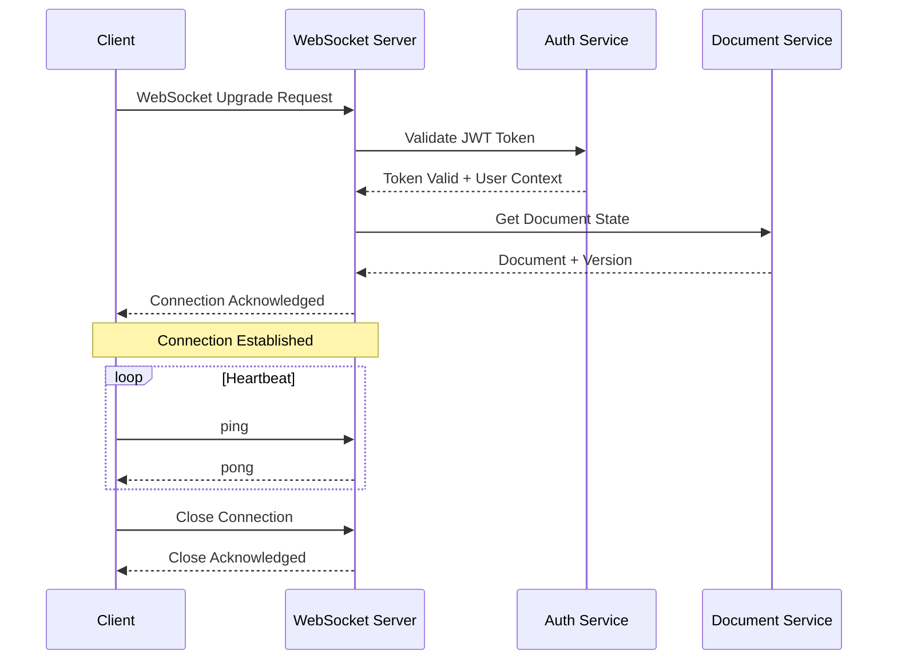

# WebSocket Connection Management

<Info>
**SDD Classification:** L3-Technical
**Authority:** Engineering Team
**Review Cycle:** Quarterly
</Info>

This guide covers WebSocket connection establishment, lifecycle management, reconnection strategies, and best practices for maintaining reliable real-time connections.

---

## Establishing a Connection

### Connection URL Format

```
wss://api.materi.dev/v1/ws/documents/{document_id}?token={jwt_token}&client_id={unique_client_id}
```

### Basic Connection Example

```javascript
class MateriWebSocket {
  constructor(documentId, accessToken) {
    this.documentId = documentId;
    this.accessToken = accessToken;
    this.clientId = this.generateClientId();
    this.ws = null;
    this.isConnected = false;
    this.reconnectAttempts = 0;
    this.maxReconnectAttempts = 5;
    this.messageQueue = [];
  }

  connect() {
    const wsUrl = `wss://api.materi.dev/v1/ws/documents/${this.documentId}?token=${this.accessToken}&client_id=${this.clientId}`;

    this.ws = new WebSocket(wsUrl);

    this.ws.onopen = this.handleOpen.bind(this);
    this.ws.onmessage = this.handleMessage.bind(this);
    this.ws.onclose = this.handleClose.bind(this);
    this.ws.onerror = this.handleError.bind(this);
  }

  handleOpen(event) {
    console.log('WebSocket connected');
    this.isConnected = true;
    this.reconnectAttempts = 0;

    // Send any queued messages
    this.flushMessageQueue();

    // Start heartbeat
    this.startHeartbeat();
  }

  handleMessage(event) {
    const message = JSON.parse(event.data);
    this.processMessage(message);
  }

  handleClose(event) {
    console.log('WebSocket disconnected:', event.code, event.reason);
    this.isConnected = false;
    this.stopHeartbeat();

    // Attempt reconnection if not intentional
    if (event.code !== 1000 && this.reconnectAttempts < this.maxReconnectAttempts) {
      this.reconnect();
    }
  }

  handleError(error) {
    console.error('WebSocket error:', error);
  }

  generateClientId() {
    return 'client_' + Math.random().toString(36).substr(2, 9);
  }
}
```

---

## Connection Lifecycle



### Connection Acknowledgment

Upon successful connection, the server sends a connection acknowledgment:

```json
{
  "type": "system",
  "event": "connection_ack",
  "data": {
    "client_id": "client_abc123",
    "user_id": "user_123",
    "permissions": ["read", "write", "comment"],
    "document_version": 25,
    "server_time": "2025-01-07T10:30:00Z"
  }
}
```

---

## Heartbeat Management

Maintain connection health with periodic heartbeats:

```javascript
class HeartbeatManager {
  constructor(ws, interval = 30000) {
    this.ws = ws;
    this.interval = interval;
    this.timer = null;
    this.lastPong = Date.now();
    this.timeout = interval * 2;
  }

  start() {
    this.timer = setInterval(() => {
      if (Date.now() - this.lastPong > this.timeout) {
        console.warn('Heartbeat timeout, reconnecting...');
        this.ws.close(4000, 'Heartbeat timeout');
        return;
      }

      this.ws.send(JSON.stringify({
        type: 'system',
        event: 'ping',
        data: { timestamp: Date.now() }
      }));
    }, this.interval);
  }

  handlePong(timestamp) {
    this.lastPong = Date.now();
    const latency = this.lastPong - timestamp;
    console.log(`Connection latency: ${latency}ms`);
  }

  stop() {
    if (this.timer) {
      clearInterval(this.timer);
      this.timer = null;
    }
  }
}
```

### Heartbeat Configuration

| Parameter | Default | Description |
|-----------|---------|-------------|
| Ping interval | 30 seconds | How often to send pings |
| Pong timeout | 60 seconds | Max time to wait for pong |
| Server ping | 30 seconds | Server-initiated pings |

---

## Reconnection Strategy

### Exponential Backoff

```javascript
class ReconnectionManager {
  constructor(wsClient) {
    this.wsClient = wsClient;
    this.baseDelay = 1000;
    this.maxDelay = 30000;
    this.maxAttempts = 10;
    this.attempts = 0;
  }

  scheduleReconnect() {
    if (this.attempts >= this.maxAttempts) {
      console.error('Max reconnection attempts reached');
      this.wsClient.onPermanentFailure();
      return;
    }

    // Exponential backoff with jitter
    const delay = Math.min(
      this.baseDelay * Math.pow(2, this.attempts) + Math.random() * 1000,
      this.maxDelay
    );

    this.attempts++;
    console.log(`Reconnecting in ${Math.round(delay)}ms (attempt ${this.attempts}/${this.maxAttempts})`);

    setTimeout(() => {
      this.wsClient.connect();
    }, delay);
  }

  reset() {
    this.attempts = 0;
  }

  getNextDelay() {
    return Math.min(
      this.baseDelay * Math.pow(2, this.attempts),
      this.maxDelay
    );
  }
}
```

### Reconnection Delays

| Attempt | Delay | Total Time |
|---------|-------|------------|
| 1 | 1s | 1s |
| 2 | 2s | 3s |
| 3 | 4s | 7s |
| 4 | 8s | 15s |
| 5 | 16s | 31s |
| 6+ | 30s (max) | varies |

---

## Message Queuing

Queue messages during disconnection for delivery upon reconnection:

```javascript
class MessageQueue {
  constructor(maxSize = 1000) {
    this.queue = [];
    this.maxSize = maxSize;
  }

  enqueue(message) {
    if (this.queue.length >= this.maxSize) {
      // Remove oldest messages if queue is full
      this.queue.shift();
    }
    this.queue.push({
      message,
      timestamp: Date.now(),
      id: this.generateId()
    });
  }

  flush(sendFn) {
    const messages = this.queue.splice(0);
    messages.forEach(item => {
      sendFn(item.message);
    });
    return messages.length;
  }

  clear() {
    this.queue = [];
  }

  get length() {
    return this.queue.length;
  }

  generateId() {
    return 'msg_' + Date.now() + '_' + Math.random().toString(36).substr(2, 9);
  }
}
```

---

## Connection Recovery

### State Synchronization

After reconnection, synchronize state with the server:

```javascript
async function syncAfterReconnect(ws, lastKnownVersion) {
  // Request missed operations
  ws.send(JSON.stringify({
    type: 'system',
    event: 'sync_request',
    data: {
      last_version: lastKnownVersion,
      client_state: 'reconnecting'
    }
  }));

  // Server responds with sync data
  // {
  //   "type": "system",
  //   "event": "document_sync",
  //   "data": {
  //     "document": { ... },
  //     "missed_operations": [ ... ],
  //     "current_version": 30
  //   }
  // }
}
```

### Recovery Response

```json
{
  "type": "system",
  "event": "document_sync",
  "data": {
    "document": {
      "id": "doc_abc123",
      "version": 30,
      "content": "Complete document content..."
    },
    "missed_operations": [
      {
        "type": "insert",
        "position": 100,
        "content": "missed text",
        "version": 26
      }
    ],
    "active_users": [
      {
        "user_id": "user_456",
        "cursor_position": 150
      }
    ]
  }
}
```

---

## Connection Limits

### Per-User Limits

| Limit Type | Value | Notes |
|------------|-------|-------|
| Per document | 5 | Same user, same document |
| Total connections | 20 | Across all documents |
| Connection rate | 10/min | New connections per minute |

### Handling Limit Exceeded

```json
{
  "type": "system",
  "event": "error",
  "data": {
    "error_code": "CONNECTION_LIMIT_EXCEEDED",
    "message": "Maximum connections reached for this document",
    "details": {
      "current_connections": 5,
      "max_connections": 5
    }
  }
}
```

---

## Graceful Disconnection

### Client-Initiated Close

```javascript
function disconnect() {
  // Save any pending changes
  flushMessageQueue();

  // Send disconnect notification
  ws.send(JSON.stringify({
    type: 'system',
    event: 'disconnect',
    data: {
      reason: 'user_initiated'
    }
  }));

  // Close with normal closure code
  ws.close(1000, 'Normal closure');
}
```

### Close Codes

| Code | Name | Description |
|------|------|-------------|
| 1000 | Normal | Clean closure |
| 1001 | Going Away | Page navigation or browser close |
| 1006 | Abnormal | Connection lost without close frame |
| 4000 | Heartbeat Timeout | No pong received |
| 4001 | Auth Expired | Token expired during session |
| 4002 | Permission Denied | Lost document access |
| 4003 | Document Locked | Document locked for editing |

---

## Best Practices

### Do

1. **Generate unique client IDs** - Prevents duplicate connection issues
2. **Implement heartbeats** - Detect dead connections early
3. **Queue messages during disconnect** - Prevent data loss
4. **Use exponential backoff** - Avoid overwhelming server
5. **Handle all close codes** - Respond appropriately to each scenario

### Don't

1. **Don't reconnect immediately** - Always use backoff
2. **Don't ignore close codes** - They contain important information
3. **Don't skip heartbeats** - Connection may silently die
4. **Don't queue indefinitely** - Set reasonable limits
5. **Don't assume connection state** - Always verify

---

## Related Documentation

- [WebSocket Overview](/api/websocket/overview) - API overview
- [Authentication](/api/websocket/authentication) - Connection auth
- [Error Handling](/api/websocket/error-handling) - Error codes

---

**Document Status:** Complete
**Version:** 2.0
