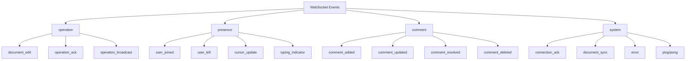

# WebSocket Events

<Info>
**SDD Classification:** L3-Technical
**Authority:** Engineering Team
**Review Cycle:** Quarterly
</Info>

This document provides a complete reference for all WebSocket event types, their payloads, and handling patterns for real-time collaboration.

---

## Event Message Structure

All WebSocket messages follow a standard JSON format:

```json
{
  "type": "operation",
  "event": "document_edit",
  "data": {
    "operation": { ... },
    "version": 15,
    "timestamp": "2025-01-07T10:30:00Z"
  },
  "client_id": "client_abc123",
  "message_id": "msg_1234567890"
}
```

### Message Fields

| Field | Type | Description |
|-------|------|-------------|
| `type` | string | Message category |
| `event` | string | Specific event within category |
| `data` | object | Event-specific payload |
| `client_id` | string | Sending client identifier |
| `message_id` | string | Unique message ID for deduplication |

---

## Event Categories



---

## Document Operation Events

### Insert Operation

Client sends content insertion:

```json
{
  "type": "operation",
  "event": "document_edit",
  "data": {
    "operation": {
      "type": "insert",
      "position": 45,
      "content": "New text content",
      "author": "user_123",
      "attributes": {
        "bold": true,
        "italic": false
      }
    },
    "version": 16,
    "document_id": "doc_abc123"
  }
}
```

### Delete Operation

Client sends content deletion:

```json
{
  "type": "operation",
  "event": "document_edit",
  "data": {
    "operation": {
      "type": "delete",
      "position": 45,
      "length": 5,
      "author": "user_123"
    },
    "version": 17
  }
}
```

### Format Operation

Client applies formatting:

```json
{
  "type": "operation",
  "event": "document_edit",
  "data": {
    "operation": {
      "type": "format",
      "position": 45,
      "length": 10,
      "attributes": {
        "bold": true,
        "heading": 2
      },
      "author": "user_123"
    },
    "version": 18
  }
}
```

### Operation Acknowledgment

Server acknowledges received operation:

```json
{
  "type": "operation",
  "event": "operation_ack",
  "data": {
    "message_id": "msg_1234567890",
    "server_version": 18,
    "timestamp": "2025-01-07T10:30:00Z",
    "acknowledged": true
  }
}
```

### Operation Broadcast

Server broadcasts operation to other clients:

```json
{
  "type": "operation",
  "event": "operation_broadcast",
  "data": {
    "operation": {
      "type": "insert",
      "position": 50,
      "content": "Content from other user",
      "author": "user_456"
    },
    "version": 19,
    "transformed": true,
    "original_position": 45
  }
}
```

---

## Presence Events

### User Joined

When a user connects to the document:

```json
{
  "type": "presence",
  "event": "user_joined",
  "data": {
    "user": {
      "id": "user_456",
      "name": "Jane Smith",
      "avatar_url": "https://cdn.materi.dev/avatars/user_456.jpg",
      "color": "#3b82f6"
    },
    "cursor_position": 0,
    "timestamp": "2025-01-07T10:30:00Z"
  }
}
```

### User Left

When a user disconnects:

```json
{
  "type": "presence",
  "event": "user_left",
  "data": {
    "user_id": "user_456",
    "timestamp": "2025-01-07T10:35:00Z"
  }
}
```

### Cursor Update

Real-time cursor position updates:

```json
{
  "type": "presence",
  "event": "cursor_update",
  "data": {
    "user_id": "user_456",
    "cursor": {
      "position": 157,
      "selection": {
        "start": 157,
        "end": 182
      }
    },
    "timestamp": "2025-01-07T10:30:00Z"
  }
}
```

### Typing Indicator

Shows when a user is actively typing:

```json
{
  "type": "presence",
  "event": "typing_indicator",
  "data": {
    "user_id": "user_456",
    "is_typing": true,
    "position": 157,
    "timestamp": "2025-01-07T10:30:00Z"
  }
}
```

---

## Comment Events

### Comment Added

New comment created:

```json
{
  "type": "comment",
  "event": "comment_added",
  "data": {
    "comment": {
      "id": "comment_xyz789",
      "author_id": "user_123",
      "author_name": "John Doe",
      "content": "This section needs more detail",
      "position": {
        "start": 45,
        "end": 89
      },
      "thread_id": "thread_abc123",
      "created_at": "2025-01-07T10:30:00Z"
    }
  }
}
```

### Comment Updated

Comment content modified:

```json
{
  "type": "comment",
  "event": "comment_updated",
  "data": {
    "comment_id": "comment_xyz789",
    "updates": {
      "content": "Updated comment text"
    },
    "updated_by": "user_123",
    "updated_at": "2025-01-07T10:35:00Z"
  }
}
```

### Comment Resolved

Comment thread resolved:

```json
{
  "type": "comment",
  "event": "comment_resolved",
  "data": {
    "comment_id": "comment_xyz789",
    "thread_id": "thread_abc123",
    "resolved_by": "user_456",
    "resolved_at": "2025-01-07T10:40:00Z"
  }
}
```

### Comment Deleted

Comment removed:

```json
{
  "type": "comment",
  "event": "comment_deleted",
  "data": {
    "comment_id": "comment_xyz789",
    "deleted_by": "user_123",
    "deleted_at": "2025-01-07T10:45:00Z"
  }
}
```

---

## System Events

### Connection Acknowledgment

Sent after successful connection:

```json
{
  "type": "system",
  "event": "connection_ack",
  "data": {
    "client_id": "client_abc123",
    "user_id": "user_123",
    "permissions": ["read", "write", "comment"],
    "document_version": 25,
    "server_time": "2025-01-07T10:30:00Z"
  }
}
```

### Document Sync

Full document state synchronization:

```json
{
  "type": "system",
  "event": "document_sync",
  "data": {
    "document": {
      "id": "doc_abc123",
      "version": 25,
      "content": "Complete document content...",
      "metadata": {
        "word_count": 1247,
        "last_modified": "2025-01-07T10:30:00Z"
      }
    },
    "active_users": [
      {
        "user_id": "user_123",
        "cursor_position": 45
      },
      {
        "user_id": "user_456",
        "cursor_position": 200
      }
    ]
  }
}
```

### Error Event

Error notification:

```json
{
  "type": "system",
  "event": "error",
  "data": {
    "error_code": "INSUFFICIENT_PERMISSIONS",
    "message": "You do not have write permissions for this document",
    "details": {
      "required_permission": "document:write",
      "user_permissions": ["document:read"]
    },
    "recoverable": false,
    "timestamp": "2025-01-07T10:30:00Z"
  }
}
```

### Heartbeat (Ping/Pong)

Connection health check:

**Client sends:**
```json
{
  "type": "system",
  "event": "ping",
  "data": {
    "timestamp": 1704625800000
  }
}
```

**Server responds:**
```json
{
  "type": "system",
  "event": "pong",
  "data": {
    "timestamp": 1704625800000,
    "server_time": 1704625800050
  }
}
```

---

## Event Handling Patterns

### Event Dispatcher

```javascript
class EventDispatcher {
  constructor() {
    this.handlers = new Map();
  }

  on(type, event, handler) {
    const key = `${type}:${event}`;
    if (!this.handlers.has(key)) {
      this.handlers.set(key, []);
    }
    this.handlers.get(key).push(handler);
  }

  dispatch(message) {
    const key = `${message.type}:${message.event}`;
    const handlers = this.handlers.get(key) || [];

    handlers.forEach(handler => {
      try {
        handler(message.data, message);
      } catch (error) {
        console.error(`Error handling ${key}:`, error);
      }
    });
  }
}

// Usage
const dispatcher = new EventDispatcher();

dispatcher.on('operation', 'document_edit', (data) => {
  console.log('Document edited:', data.operation);
});

dispatcher.on('presence', 'user_joined', (data) => {
  console.log('User joined:', data.user.name);
});

ws.onmessage = (event) => {
  const message = JSON.parse(event.data);
  dispatcher.dispatch(message);
};
```

### Event Batching

Handle multiple rapid events efficiently:

```javascript
class EventBatcher {
  constructor(flushInterval = 50) {
    this.queue = [];
    this.flushInterval = flushInterval;
    this.timer = null;
  }

  add(event) {
    this.queue.push(event);

    if (!this.timer) {
      this.timer = setTimeout(() => this.flush(), this.flushInterval);
    }
  }

  flush() {
    if (this.queue.length === 0) return;

    const events = this.queue.splice(0);
    this.timer = null;

    // Process batched events
    this.processBatch(events);
  }

  processBatch(events) {
    // Group by type for efficient processing
    const grouped = events.reduce((acc, event) => {
      const key = event.type;
      if (!acc[key]) acc[key] = [];
      acc[key].push(event);
      return acc;
    }, {});

    // Process each group
    Object.entries(grouped).forEach(([type, typeEvents]) => {
      this.processEventGroup(type, typeEvents);
    });
  }
}
```

---

## Event Reference Table

| Type | Event | Direction | Description |
|------|-------|-----------|-------------|
| `operation` | `document_edit` | C→S | Client edits document |
| `operation` | `operation_ack` | S→C | Server acknowledges operation |
| `operation` | `operation_broadcast` | S→C | Broadcast operation to others |
| `presence` | `user_joined` | S→C | User connected |
| `presence` | `user_left` | S→C | User disconnected |
| `presence` | `cursor_update` | Bidirectional | Cursor position change |
| `presence` | `typing_indicator` | Bidirectional | Typing status |
| `comment` | `comment_added` | Bidirectional | New comment |
| `comment` | `comment_updated` | Bidirectional | Comment modified |
| `comment` | `comment_resolved` | Bidirectional | Comment resolved |
| `comment` | `comment_deleted` | Bidirectional | Comment removed |
| `system` | `connection_ack` | S→C | Connection established |
| `system` | `document_sync` | S→C | Full state sync |
| `system` | `error` | S→C | Error notification |
| `system` | `ping` | C→S | Client heartbeat |
| `system` | `pong` | S→C | Server heartbeat response |

---

## Related Documentation

- [WebSocket Overview](/api/websocket/overview) - API overview
- [Operations](/api/websocket/operations) - Document operations
- [Presence](/api/websocket/presence) - Presence management
- [Error Handling](/api/websocket/error-handling) - Error codes

---

**Document Status:** Complete
**Version:** 2.0
