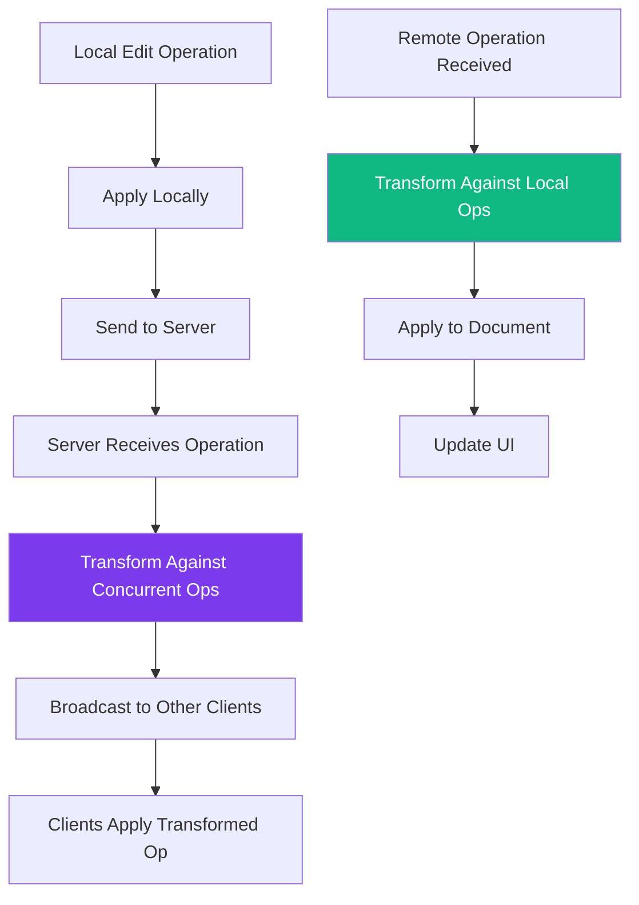

# WebSocket Document Operations

<Info>
**SDD Classification:** L3-Technical
**Authority:** Engineering Team
**Review Cycle:** Quarterly
</Info>

This guide covers document operations in real-time collaboration, including operational transform, conflict resolution, and best practices for implementing collaborative editing.

---

## Operational Transform Overview



### How OT Works

1. **Local First**: Operations apply locally immediately for responsiveness
2. **Server Transform**: Server transforms operations against concurrent changes
3. **Broadcast**: Transformed operations sent to all other clients
4. **Client Transform**: Clients transform incoming operations against pending local ops

---

## Operation Types

### Insert Operation

Add content at a position:

```json
{
  "type": "insert",
  "position": 45,
  "content": "New text to insert",
  "attributes": {
    "bold": false,
    "italic": false,
    "link": null
  }
}
```

| Field | Type | Description |
|-------|------|-------------|
| `position` | integer | Character index for insertion |
| `content` | string | Text to insert |
| `attributes` | object | Formatting attributes (optional) |

### Delete Operation

Remove content from a range:

```json
{
  "type": "delete",
  "position": 45,
  "length": 10
}
```

| Field | Type | Description |
|-------|------|-------------|
| `position` | integer | Starting character index |
| `length` | integer | Number of characters to delete |

### Retain Operation

Keep content unchanged (used in compound operations):

```json
{
  "type": "retain",
  "length": 45
}
```

| Field | Type | Description |
|-------|------|-------------|
| `length` | integer | Number of characters to retain |

### Format Operation

Apply formatting to a range:

```json
{
  "type": "format",
  "position": 45,
  "length": 20,
  "attributes": {
    "bold": true,
    "heading": 2,
    "color": "#ff0000"
  }
}
```

| Field | Type | Description |
|-------|------|-------------|
| `position` | integer | Starting character index |
| `length` | integer | Number of characters to format |
| `attributes` | object | Formatting to apply |

---

## Sending Operations

### Operation Message Format

```json
{
  "type": "operation",
  "event": "document_edit",
  "data": {
    "operation": {
      "type": "insert",
      "position": 45,
      "content": "Hello"
    },
    "base_version": 15,
    "client_id": "client_abc123"
  },
  "message_id": "msg_1234567890"
}
```

### Client Implementation

```javascript
class OperationManager {
  constructor(ws, documentVersion) {
    this.ws = ws;
    this.serverVersion = documentVersion;
    this.clientVersion = 0;
    this.pendingOperations = [];
    this.acknowledgedVersion = documentVersion;
  }

  sendOperation(operation) {
    // Apply locally first for immediate feedback
    this.applyLocally(operation);

    // Track pending operation
    const pendingOp = {
      operation,
      clientVersion: this.clientVersion++,
      baseVersion: this.serverVersion
    };
    this.pendingOperations.push(pendingOp);

    // Send to server
    this.ws.send(JSON.stringify({
      type: 'operation',
      event: 'document_edit',
      data: {
        operation,
        base_version: this.serverVersion,
        client_id: this.clientId
      },
      message_id: this.generateMessageId()
    }));
  }

  handleAcknowledgment(ackMessage) {
    const { server_version, message_id } = ackMessage;

    // Remove acknowledged operation
    this.pendingOperations = this.pendingOperations.filter(
      op => op.messageId !== message_id
    );

    // Update server version
    this.serverVersion = server_version;
    this.acknowledgedVersion = server_version;
  }

  handleRemoteOperation(remoteOp) {
    // Transform remote operation against pending local ops
    let transformedOp = remoteOp.operation;

    for (const pending of this.pendingOperations) {
      transformedOp = this.transform(transformedOp, pending.operation);
    }

    // Apply transformed operation
    this.applyLocally(transformedOp);

    // Update server version
    this.serverVersion = remoteOp.version;
  }
}
```

---

## Operational Transform Algorithm

### Transform Rules

#### Insert vs Insert

```javascript
function transformInsertInsert(op1, op2) {
  // op1 is the operation to transform
  // op2 is the operation already applied

  if (op1.position < op2.position) {
    // op1 before op2: no change needed
    return op1;
  } else if (op1.position > op2.position) {
    // op1 after op2: shift position by inserted length
    return {
      ...op1,
      position: op1.position + op2.content.length
    };
  } else {
    // Same position: use client ID for tiebreaker
    if (op1.clientId < op2.clientId) {
      return op1;
    } else {
      return {
        ...op1,
        position: op1.position + op2.content.length
      };
    }
  }
}
```

#### Insert vs Delete

```javascript
function transformInsertDelete(insertOp, deleteOp) {
  if (insertOp.position <= deleteOp.position) {
    // Insert before delete: no change
    return insertOp;
  } else if (insertOp.position >= deleteOp.position + deleteOp.length) {
    // Insert after delete: shift back
    return {
      ...insertOp,
      position: insertOp.position - deleteOp.length
    };
  } else {
    // Insert within deleted region: place at delete position
    return {
      ...insertOp,
      position: deleteOp.position
    };
  }
}
```

#### Delete vs Insert

```javascript
function transformDeleteInsert(deleteOp, insertOp) {
  if (deleteOp.position >= insertOp.position) {
    // Delete after insert: shift forward
    return {
      ...deleteOp,
      position: deleteOp.position + insertOp.content.length
    };
  } else if (deleteOp.position + deleteOp.length <= insertOp.position) {
    // Delete before insert: no change
    return deleteOp;
  } else {
    // Delete spans insert position: split delete
    return {
      ...deleteOp,
      length: deleteOp.length + insertOp.content.length
    };
  }
}
```

#### Delete vs Delete

```javascript
function transformDeleteDelete(op1, op2) {
  const start1 = op1.position;
  const end1 = op1.position + op1.length;
  const start2 = op2.position;
  const end2 = op2.position + op2.length;

  if (end1 <= start2) {
    // op1 entirely before op2: no change
    return op1;
  } else if (start1 >= end2) {
    // op1 entirely after op2: shift back
    return {
      ...op1,
      position: op1.position - op2.length
    };
  } else if (start1 >= start2 && end1 <= end2) {
    // op1 within op2: becomes no-op
    return { type: 'retain', length: 0 };
  } else {
    // Overlapping: calculate remaining delete
    const newStart = Math.min(start1, start2);
    const newLength = Math.max(end1, end2) - Math.min(start1, start2) - op2.length;
    return {
      ...op1,
      position: newStart,
      length: Math.max(0, newLength)
    };
  }
}
```

---

## Conflict Resolution

### Version Conflict

When operations are based on outdated versions:

```json
{
  "type": "system",
  "event": "error",
  "data": {
    "error_code": "VERSION_CONFLICT",
    "message": "Operation based on outdated document version",
    "details": {
      "client_version": 15,
      "server_version": 18,
      "operations_behind": 3
    },
    "recoverable": true
  }
}
```

### Handling Conflicts

```javascript
class ConflictResolver {
  handleVersionConflict(errorData) {
    // Request state sync
    this.requestSync();
  }

  requestSync() {
    this.ws.send(JSON.stringify({
      type: 'system',
      event: 'sync_request',
      data: {
        last_known_version: this.serverVersion
      }
    }));
  }

  handleSyncResponse(syncData) {
    // Apply missed operations
    for (const op of syncData.missed_operations) {
      this.handleRemoteOperation(op);
    }

    // Re-apply pending local operations
    const pendingOps = [...this.pendingOperations];
    this.pendingOperations = [];

    for (const pending of pendingOps) {
      this.sendOperation(pending.operation);
    }
  }
}
```

---

## Rich Text Operations

### Supported Attributes

| Attribute | Type | Values |
|-----------|------|--------|
| `bold` | boolean | true/false |
| `italic` | boolean | true/false |
| `underline` | boolean | true/false |
| `strike` | boolean | true/false |
| `heading` | integer | 1-6 or null |
| `link` | string | URL or null |
| `color` | string | Hex color |
| `background` | string | Hex color |
| `font` | string | Font family |
| `size` | integer | Font size |

### Applying Formatting

```javascript
function applyFormatting(position, length, attributes) {
  const operation = {
    type: 'format',
    position,
    length,
    attributes: {
      // Only include changed attributes
      ...attributes
    }
  };

  operationManager.sendOperation(operation);
}

// Example: Make text bold
applyFormatting(10, 20, { bold: true });

// Example: Create a link
applyFormatting(50, 15, { link: 'https://materi.dev' });

// Example: Remove formatting
applyFormatting(10, 20, { bold: null, italic: null });
```

---

## Undo/Redo Support

### Operation Inversion

```javascript
class UndoManager {
  constructor(operationManager) {
    this.operationManager = operationManager;
    this.undoStack = [];
    this.redoStack = [];
    this.maxStackSize = 100;
  }

  recordOperation(operation) {
    const inverse = this.invertOperation(operation);
    this.undoStack.push(inverse);

    if (this.undoStack.length > this.maxStackSize) {
      this.undoStack.shift();
    }

    // Clear redo stack on new operation
    this.redoStack = [];
  }

  invertOperation(operation) {
    switch (operation.type) {
      case 'insert':
        return {
          type: 'delete',
          position: operation.position,
          length: operation.content.length
        };

      case 'delete':
        return {
          type: 'insert',
          position: operation.position,
          content: operation.deletedContent // Must store this
        };

      case 'format':
        return {
          type: 'format',
          position: operation.position,
          length: operation.length,
          attributes: operation.previousAttributes // Must store this
        };

      default:
        return operation;
    }
  }

  undo() {
    if (this.undoStack.length === 0) return;

    const operation = this.undoStack.pop();
    this.operationManager.sendOperation(operation);
    this.redoStack.push(this.invertOperation(operation));
  }

  redo() {
    if (this.redoStack.length === 0) return;

    const operation = this.redoStack.pop();
    this.operationManager.sendOperation(operation);
    this.undoStack.push(this.invertOperation(operation));
  }
}
```

---

## Performance Optimization

### Operation Batching

Combine rapid operations for efficiency:

```javascript
class OperationBatcher {
  constructor(operationManager, flushDelay = 100) {
    this.operationManager = operationManager;
    this.flushDelay = flushDelay;
    this.pendingOps = [];
    this.timer = null;
  }

  queueOperation(operation) {
    this.pendingOps.push(operation);

    if (!this.timer) {
      this.timer = setTimeout(() => this.flush(), this.flushDelay);
    }
  }

  flush() {
    if (this.pendingOps.length === 0) return;

    // Compose operations
    const composed = this.composeOperations(this.pendingOps);
    this.pendingOps = [];
    this.timer = null;

    // Send composed operation
    this.operationManager.sendOperation(composed);
  }

  composeOperations(operations) {
    // Combine consecutive inserts at same position
    // Merge adjacent deletes
    // Combine formatting operations

    return operations.reduce((composed, op) => {
      return this.compose(composed, op);
    });
  }
}
```

### Debouncing Cursor Updates

```javascript
class CursorDebouncer {
  constructor(sendFn, delay = 50) {
    this.sendFn = sendFn;
    this.delay = delay;
    this.timer = null;
    this.lastPosition = null;
  }

  updateCursor(position, selection) {
    this.lastPosition = { position, selection };

    if (!this.timer) {
      this.timer = setTimeout(() => {
        this.sendFn(this.lastPosition);
        this.timer = null;
      }, this.delay);
    }
  }
}
```

---

## Best Practices

### Do

1. **Apply operations locally first** - Immediate feedback improves UX
2. **Use base version** - Always include version for conflict detection
3. **Batch rapid operations** - Reduce network overhead
4. **Store operation history** - Enable undo/redo functionality
5. **Handle offline gracefully** - Queue operations for later sync

### Don't

1. **Don't skip transformation** - Always transform remote operations
2. **Don't ignore acknowledgments** - They confirm server state
3. **Don't send empty operations** - Filter no-ops before sending
4. **Don't assume operation order** - Network may reorder messages
5. **Don't lose operations** - Persist pending ops locally

---

## Related Documentation

- [WebSocket Overview](/api/websocket/overview) - API overview
- [Events](/api/websocket/events) - Event reference
- [Presence](/api/websocket/presence) - Cursor tracking
- [Error Handling](/api/websocket/error-handling) - Error codes

---

**Document Status:** Complete
**Version:** 2.0
