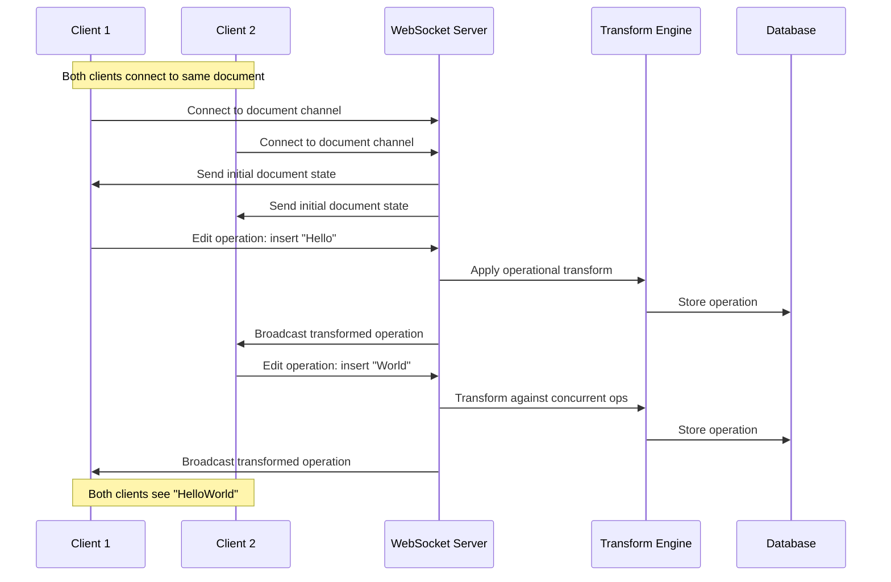
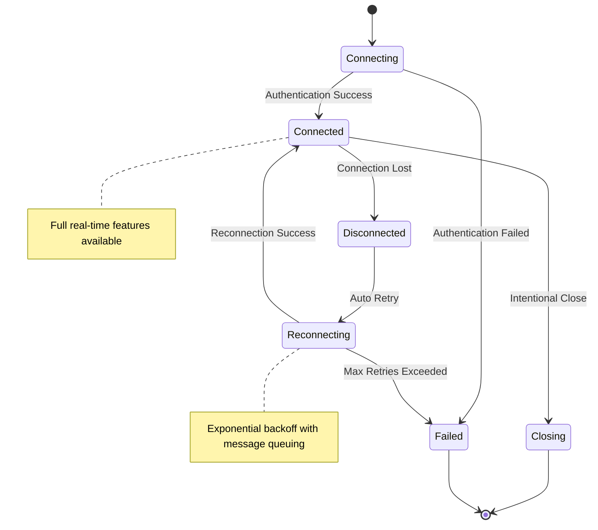

# WebSocket API Overview

<Info>
**SDD Classification:** L3-Technical
**Authority:** Engineering Team
**Review Cycle:** Quarterly
</Info>

Materi's WebSocket API enables real-time collaboration features including live editing, presence awareness, instant comments, and synchronized document state. This guide covers the architecture, capabilities, and integration patterns.

---

## Real-Time Collaboration Architecture



---

## Key Features

| Feature | Description |
|---------|-------------|
| **Operational Transform** | Conflict-free concurrent editing with automatic conflict resolution |
| **Presence Awareness** | Real-time user cursors, selections, and activity indicators |
| **Instant Comments** | Live comment threads and discussions |
| **Document Sync** | Automatic state synchronization across all connected clients |
| **Connection Recovery** | Resilient connection handling with automatic reconnection |

---

## Connection URLs

### Production Environment

| Property | Value |
|----------|-------|
| **WebSocket URL** | `wss://api.materi.dev/v1/ws` |
| **Document URL** | `wss://api.materi.dev/v1/ws/documents/{document_id}` |
| **Region** | Global with edge routing |
| **Protocol** | WSS (TLS 1.3 required) |

### Staging Environment

| Property | Value |
|----------|-------|
| **WebSocket URL** | `wss://api-staging.materi.dev/v1/ws` |
| **Document URL** | `wss://api-staging.materi.dev/v1/ws/documents/{document_id}` |
| **Purpose** | Testing and development |

---

## Connection URL Format

```
wss://api.materi.dev/v1/ws/documents/{document_id}?token={jwt_token}&client_id={unique_client_id}
```

### Query Parameters

| Parameter | Required | Description |
|-----------|----------|-------------|
| `token` | Yes | JWT access token for authentication |
| `client_id` | Yes | Unique identifier for this client instance |
| `version` | No | Protocol version (default: `1`) |

---

## Protocol Overview

### Message Types

All WebSocket communication uses JSON messages with a standard structure:

| Type | Direction | Description |
|------|-----------|-------------|
| `operation` | Bidirectional | Document edit operations |
| `presence` | Bidirectional | User presence and cursor updates |
| `comment` | Bidirectional | Comment creation and updates |
| `system` | Server→Client | System notifications and state sync |

### Message Structure

```json
{
  "type": "operation",
  "event": "document_edit",
  "data": {
    "operation": { ... },
    "version": 15,
    "timestamp": "2025-01-07T10:30:00Z"
  },
  "client_id": "client_abc123",
  "message_id": "msg_1234567890"
}
```

---

## Connection Lifecycle



### Connection States

| State | Description |
|-------|-------------|
| **Connecting** | Establishing WebSocket and authenticating |
| **Connected** | Full real-time functionality available |
| **Disconnected** | Temporary loss, preparing to reconnect |
| **Reconnecting** | Actively trying to restore connection |
| **Closing** | Intentionally closing connection |
| **Failed** | Connection permanently failed |

---

## Rate Limits

### Connection Limits

| Resource | Free | Professional | Enterprise |
|----------|------|--------------|------------|
| Concurrent connections | 2 | 5 | Custom |
| Per-document connections | 5 | 10 | Custom |
| Operations/second | 10 | 50 | Custom |

### Operation Throttling

Operations exceeding rate limits receive throttling responses:

```json
{
  "type": "system",
  "event": "rate_limited",
  "data": {
    "retry_after": 1000,
    "message": "Operation rate limit exceeded"
  }
}
```

---

## Security

### Authentication

- JWT token required for connection establishment
- Token validated on connect and periodically during session
- Automatic disconnection on token expiry
- Permission validation for every operation

### Encryption

- WSS (TLS 1.3) required for all connections
- No plain WebSocket (ws://) connections accepted
- Certificate pinning supported for mobile clients

---

## SDKs and Libraries

### Official SDKs

**JavaScript/TypeScript**

```bash
npm install @materi/realtime
```

```javascript
import { MateriRealtime } from '@materi/realtime';

const realtime = new MateriRealtime({
  accessToken: 'your_token',
  documentId: 'doc_123',
});

realtime.on('operation', (op) => {
  console.log('Received operation:', op);
});

await realtime.connect();
```

**Python**

```bash
pip install materi-realtime
```

```python
from materi_realtime import MateriRealtime

realtime = MateriRealtime(
    access_token='your_token',
    document_id='doc_123'
)

@realtime.on('operation')
def handle_operation(op):
    print('Received operation:', op)

await realtime.connect()
```

---

## Health and Diagnostics

### Connection Health Check

```javascript
// Check connection health
realtime.on('heartbeat', (latency) => {
  console.log(`Connection latency: ${latency}ms`);
});

// Check connection state
console.log(realtime.connectionState); // 'connected' | 'disconnected' | etc.
```

### Debugging

Enable debug logging:

```javascript
const realtime = new MateriRealtime({
  accessToken: 'your_token',
  documentId: 'doc_123',
  debug: true, // Enable debug logging
});
```

---

## Related Documentation

- [Connection Management](/api/websocket/connection) - Connection lifecycle
- [Authentication](/api/websocket/authentication) - WebSocket auth
- [Events](/api/websocket/events) - Event reference
- [Operations](/api/websocket/operations) - Document operations
- [Presence](/api/websocket/presence) - Presence tracking
- [Error Handling](/api/websocket/error-handling) - Error codes

---

**Document Status:** Complete
**Version:** 2.0
