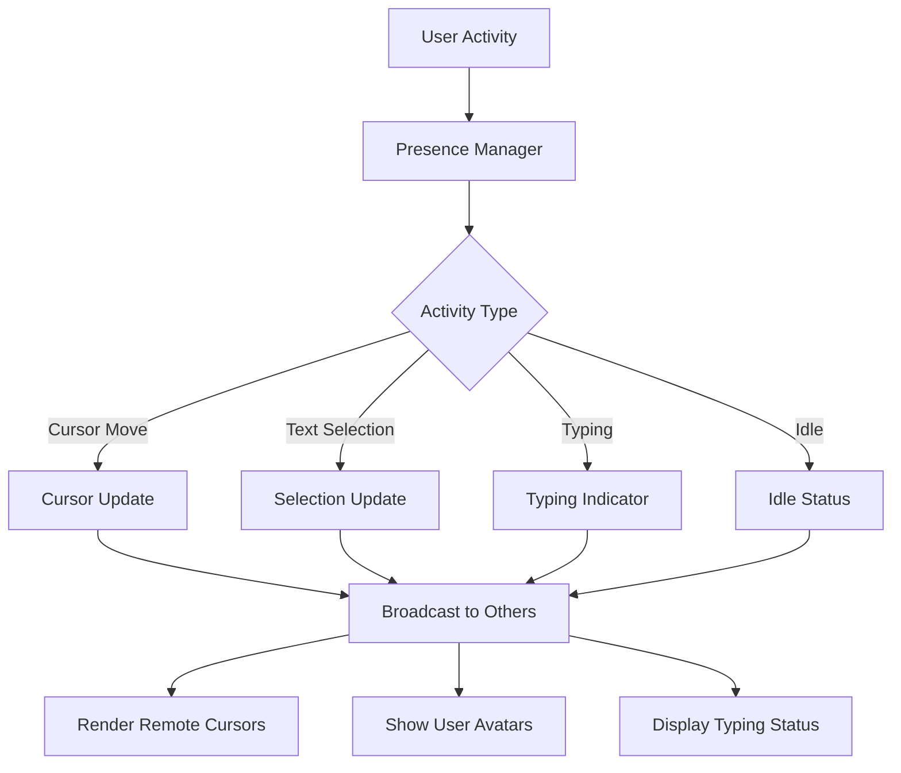

# WebSocket Presence Management

<Info>
**SDD Classification:** L3-Technical
**Authority:** Engineering Team
**Review Cycle:** Quarterly
</Info>

Presence management enables awareness of other users in real-time collaboration, including cursor positions, selections, typing indicators, and activity status.

---

## Presence Overview



---

## Presence Data Structure

### User Presence Object

```json
{
  "user": {
    "id": "user_456",
    "name": "Jane Smith",
    "avatar_url": "https://cdn.materi.dev/avatars/user_456.jpg",
    "color": "#3b82f6"
  },
  "cursor": {
    "position": 157,
    "selection": {
      "start": 157,
      "end": 182
    }
  },
  "activity": {
    "is_typing": false,
    "is_idle": false,
    "last_activity": "2025-01-07T10:30:00Z"
  },
  "viewport": {
    "start_line": 1,
    "end_line": 50
  }
}
```

---

## Presence Events

### User Joined

When a user connects to the document:

```json
{
  "type": "presence",
  "event": "user_joined",
  "data": {
    "user": {
      "id": "user_456",
      "name": "Jane Smith",
      "avatar_url": "https://cdn.materi.dev/avatars/user_456.jpg",
      "color": "#3b82f6"
    },
    "cursor_position": 0,
    "timestamp": "2025-01-07T10:30:00Z"
  }
}
```

### User Left

When a user disconnects:

```json
{
  "type": "presence",
  "event": "user_left",
  "data": {
    "user_id": "user_456",
    "timestamp": "2025-01-07T10:35:00Z"
  }
}
```

### Cursor Update

Real-time cursor position:

```json
{
  "type": "presence",
  "event": "cursor_update",
  "data": {
    "user_id": "user_456",
    "cursor": {
      "position": 157,
      "selection": null
    },
    "timestamp": "2025-01-07T10:30:00Z"
  }
}
```

### Selection Update

When user selects text:

```json
{
  "type": "presence",
  "event": "cursor_update",
  "data": {
    "user_id": "user_456",
    "cursor": {
      "position": 182,
      "selection": {
        "start": 157,
        "end": 182,
        "direction": "forward"
      }
    },
    "timestamp": "2025-01-07T10:30:00Z"
  }
}
```

### Typing Indicator

Shows when user is actively typing:

```json
{
  "type": "presence",
  "event": "typing_indicator",
  "data": {
    "user_id": "user_456",
    "is_typing": true,
    "timestamp": "2025-01-07T10:30:00Z"
  }
}
```

---

## Presence Manager Implementation

```javascript
class PresenceManager {
  constructor(websocket, currentUser) {
    this.ws = websocket;
    this.currentUser = currentUser;
    this.activeUsers = new Map();
    this.cursorUpdateThrottle = 50; // ms
    this.typingTimeout = 3000; // ms
    this.idleTimeout = 60000; // ms
    this.lastCursorUpdate = 0;
    this.typingTimer = null;
    this.idleTimer = null;
  }

  // Initialize presence tracking
  initialize() {
    // Track local cursor
    document.addEventListener('selectionchange', () => {
      this.handleLocalCursorChange();
    });

    // Track typing
    document.addEventListener('keypress', () => {
      this.handleLocalTyping();
    });

    // Track activity for idle detection
    ['mousemove', 'keydown', 'scroll'].forEach(event => {
      document.addEventListener(event, () => {
        this.resetIdleTimer();
      });
    });

    this.resetIdleTimer();
  }

  // Handle local cursor changes
  handleLocalCursorChange() {
    const now = Date.now();

    // Throttle updates
    if (now - this.lastCursorUpdate < this.cursorUpdateThrottle) {
      return;
    }

    this.lastCursorUpdate = now;

    const selection = window.getSelection();
    const cursorData = this.getCursorFromSelection(selection);

    this.sendCursorUpdate(cursorData);
  }

  getCursorFromSelection(selection) {
    if (!selection.rangeCount) return null;

    const range = selection.getRangeAt(0);
    const position = this.getDocumentPosition(range.endContainer, range.endOffset);

    if (range.collapsed) {
      return { position, selection: null };
    }

    return {
      position,
      selection: {
        start: this.getDocumentPosition(range.startContainer, range.startOffset),
        end: this.getDocumentPosition(range.endContainer, range.endOffset),
        direction: selection.focusNode === range.endContainer ? 'forward' : 'backward'
      }
    };
  }

  sendCursorUpdate(cursor) {
    this.ws.send(JSON.stringify({
      type: 'presence',
      event: 'cursor_update',
      data: {
        cursor,
        timestamp: new Date().toISOString()
      }
    }));
  }

  // Handle typing indicators
  handleLocalTyping() {
    if (!this.isTyping) {
      this.isTyping = true;
      this.sendTypingIndicator(true);
    }

    // Reset typing timer
    if (this.typingTimer) {
      clearTimeout(this.typingTimer);
    }

    this.typingTimer = setTimeout(() => {
      this.isTyping = false;
      this.sendTypingIndicator(false);
    }, this.typingTimeout);
  }

  sendTypingIndicator(isTyping) {
    this.ws.send(JSON.stringify({
      type: 'presence',
      event: 'typing_indicator',
      data: {
        is_typing: isTyping,
        timestamp: new Date().toISOString()
      }
    }));
  }

  // Handle idle detection
  resetIdleTimer() {
    if (this.isIdle) {
      this.isIdle = false;
      this.sendActivityStatus('active');
    }

    if (this.idleTimer) {
      clearTimeout(this.idleTimer);
    }

    this.idleTimer = setTimeout(() => {
      this.isIdle = true;
      this.sendActivityStatus('idle');
    }, this.idleTimeout);
  }

  // Handle remote presence updates
  handlePresenceUpdate(message) {
    const { event, data } = message;

    switch (event) {
      case 'user_joined':
        this.addUser(data);
        break;

      case 'user_left':
        this.removeUser(data.user_id);
        break;

      case 'cursor_update':
        this.updateUserCursor(data);
        break;

      case 'typing_indicator':
        this.updateUserTyping(data);
        break;
    }
  }

  addUser(data) {
    this.activeUsers.set(data.user.id, {
      ...data.user,
      cursor: { position: data.cursor_position },
      isTyping: false,
      lastActivity: data.timestamp
    });

    this.renderUserCursor(data.user.id);
    this.emit('user_joined', data.user);
  }

  removeUser(userId) {
    this.activeUsers.delete(userId);
    this.removeUserCursor(userId);
    this.emit('user_left', { user_id: userId });
  }

  updateUserCursor(data) {
    const user = this.activeUsers.get(data.user_id);
    if (!user) return;

    user.cursor = data.cursor;
    user.lastActivity = data.timestamp;

    this.renderUserCursor(data.user_id);
  }

  updateUserTyping(data) {
    const user = this.activeUsers.get(data.user_id);
    if (!user) return;

    user.isTyping = data.is_typing;
    this.renderTypingIndicator(data.user_id);
  }

  // Get all active users
  getActiveUsers() {
    return Array.from(this.activeUsers.values());
  }
}
```

---

## Rendering Remote Cursors

### Cursor Component

```javascript
class CursorRenderer {
  constructor(editorElement) {
    this.editor = editorElement;
    this.cursorElements = new Map();
  }

  renderCursor(userId, userData) {
    let cursorEl = this.cursorElements.get(userId);

    if (!cursorEl) {
      cursorEl = this.createCursorElement(userData);
      this.cursorElements.set(userId, cursorEl);
      this.editor.appendChild(cursorEl);
    }

    // Position cursor
    const position = this.calculatePosition(userData.cursor.position);
    cursorEl.style.left = `${position.x}px`;
    cursorEl.style.top = `${position.y}px`;

    // Update selection highlight
    if (userData.cursor.selection) {
      this.renderSelection(userId, userData);
    } else {
      this.clearSelection(userId);
    }
  }

  createCursorElement(userData) {
    const container = document.createElement('div');
    container.className = 'remote-cursor';
    container.dataset.userId = userData.id;

    // Cursor line
    const cursor = document.createElement('div');
    cursor.className = 'cursor-line';
    cursor.style.backgroundColor = userData.color;
    container.appendChild(cursor);

    // User label
    const label = document.createElement('div');
    label.className = 'cursor-label';
    label.style.backgroundColor = userData.color;
    label.textContent = userData.name;
    container.appendChild(label);

    return container;
  }

  renderSelection(userId, userData) {
    const { selection } = userData.cursor;
    let selectionEl = document.getElementById(`selection-${userId}`);

    if (!selectionEl) {
      selectionEl = document.createElement('div');
      selectionEl.id = `selection-${userId}`;
      selectionEl.className = 'remote-selection';
      selectionEl.style.backgroundColor = `${userData.color}33`; // 20% opacity
      this.editor.appendChild(selectionEl);
    }

    // Calculate selection bounds
    const startPos = this.calculatePosition(selection.start);
    const endPos = this.calculatePosition(selection.end);

    // Handle multi-line selection
    this.positionSelection(selectionEl, startPos, endPos);
  }

  removeCursor(userId) {
    const cursorEl = this.cursorElements.get(userId);
    if (cursorEl) {
      cursorEl.remove();
      this.cursorElements.delete(userId);
    }
    this.clearSelection(userId);
  }

  clearSelection(userId) {
    const selectionEl = document.getElementById(`selection-${userId}`);
    if (selectionEl) {
      selectionEl.remove();
    }
  }
}
```

### CSS Styles

```css
.remote-cursor {
  position: absolute;
  pointer-events: none;
  z-index: 10;
}

.cursor-line {
  width: 2px;
  height: 1.2em;
  animation: cursor-blink 1s infinite;
}

.cursor-label {
  position: absolute;
  top: -20px;
  left: 0;
  padding: 2px 6px;
  border-radius: 4px;
  font-size: 11px;
  color: white;
  white-space: nowrap;
  opacity: 0;
  transition: opacity 0.2s;
}

.remote-cursor:hover .cursor-label {
  opacity: 1;
}

.remote-selection {
  position: absolute;
  pointer-events: none;
  z-index: 5;
}

@keyframes cursor-blink {
  0%, 100% { opacity: 1; }
  50% { opacity: 0.3; }
}

.typing-indicator {
  display: flex;
  align-items: center;
  gap: 4px;
  padding: 4px 8px;
  background: #f3f4f6;
  border-radius: 12px;
  font-size: 12px;
}

.typing-dots {
  display: flex;
  gap: 2px;
}

.typing-dots span {
  width: 4px;
  height: 4px;
  background: #6b7280;
  border-radius: 50%;
  animation: typing-bounce 1.4s infinite;
}

.typing-dots span:nth-child(2) { animation-delay: 0.2s; }
.typing-dots span:nth-child(3) { animation-delay: 0.4s; }

@keyframes typing-bounce {
  0%, 80%, 100% { transform: translateY(0); }
  40% { transform: translateY(-4px); }
}
```

---

## User List Component

### React Implementation

```jsx
function ActiveUsersList({ presenceManager }) {
  const [users, setUsers] = useState([]);

  useEffect(() => {
    const updateUsers = () => {
      setUsers(presenceManager.getActiveUsers());
    };

    presenceManager.on('user_joined', updateUsers);
    presenceManager.on('user_left', updateUsers);
    presenceManager.on('presence_update', updateUsers);

    updateUsers();

    return () => {
      presenceManager.off('user_joined', updateUsers);
      presenceManager.off('user_left', updateUsers);
      presenceManager.off('presence_update', updateUsers);
    };
  }, [presenceManager]);

  return (
    <div className="active-users">
      <div className="user-avatars">
        {users.slice(0, 5).map(user => (
          <div
            key={user.id}
            className="user-avatar"
            style={{ borderColor: user.color }}
            title={user.name}
          >
            
            {user.isTyping && (
              <div className="typing-badge">
                <span className="typing-dots">
                  <span></span><span></span><span></span>
                </span>
              </div>
            )}
          </div>
        ))}
        {users.length > 5 && (
          <div className="user-overflow">
            +{users.length - 5}
          </div>
        )}
      </div>

      {users.some(u => u.isTyping) && (
        <TypingIndicator users={users.filter(u => u.isTyping)} />
      )}
    </div>
  );
}

function TypingIndicator({ users }) {
  const names = users.map(u => u.name);
  let text;

  if (names.length === 1) {
    text = `${names[0]} is typing...`;
  } else if (names.length === 2) {
    text = `${names[0]} and ${names[1]} are typing...`;
  } else {
    text = `${names[0]} and ${names.length - 1} others are typing...`;
  }

  return (
    <div className="typing-indicator">
      <div className="typing-dots">
        <span></span><span></span><span></span>
      </div>
      <span>{text}</span>
    </div>
  );
}
```

---

## Presence Throttling

### Update Frequency Limits

| Update Type | Minimum Interval | Description |
|-------------|------------------|-------------|
| Cursor position | 50ms | Prevents flooding |
| Selection change | 50ms | Prevents flooding |
| Typing indicator | 500ms (debounced) | Shows typing status |
| Viewport scroll | 200ms | Tracks visible area |

### Server-Side Throttling

The server may throttle presence updates:

```json
{
  "type": "system",
  "event": "presence_throttled",
  "data": {
    "message": "Presence updates throttled",
    "retry_after": 100
  }
}
```

---

## Best Practices

### Do

1. **Throttle updates** - Prevent network flooding
2. **Use distinct colors** - Make users easily identifiable
3. **Show cursor labels on hover** - Don't clutter the UI
4. **Handle disconnect gracefully** - Remove stale cursors
5. **Animate cursor movements** - Smooth visual updates

### Don't

1. **Don't send every keystroke** - Batch typing indicators
2. **Don't track mouse position** - Only cursor/selection
3. **Don't persist presence data** - It's ephemeral
4. **Don't block on presence updates** - Handle asynchronously
5. **Don't ignore idle users** - Update their status appropriately

---

## Related Documentation

- [WebSocket Overview](/api/websocket/overview) - API overview
- [Events](/api/websocket/events) - Event reference
- [Operations](/api/websocket/operations) - Document operations
- [Connection](/api/websocket/connection) - Connection management

---

**Document Status:** Complete
**Version:** 2.0
