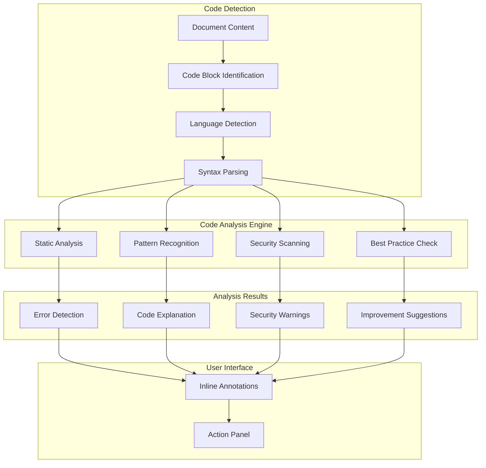
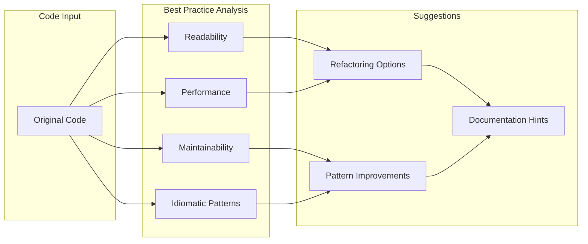

# AI Code Analysis

Aria's code analysis features help you understand, review, and improve code embedded in your documents. Whether you're documenting APIs, writing technical tutorials, or reviewing code snippets shared by your team, Aria provides intelligent insights without leaving Materi.

## How Code Analysis Works



## Supported Languages

Aria supports analysis for a wide range of programming languages:

<Tabs>
  <Tab title="Primary Languages">
    Full analysis support with deep understanding:

    | Language | Analysis Features |
    |----------|-------------------|
    | JavaScript/TypeScript | Full analysis, React/Vue patterns, async handling |
    | Python | Full analysis, Django/Flask patterns, type hints |
    | Go | Full analysis, error handling, concurrency patterns |
    | Rust | Full analysis, ownership patterns, unsafe blocks |
    | Java | Full analysis, Spring patterns, threading |
    | C# | Full analysis, .NET patterns, LINQ |
  </Tab>
  <Tab title="Secondary Languages">
    Standard analysis with good coverage:

    | Language | Analysis Features |
    |----------|-------------------|
    | Ruby | Syntax, Rails patterns, metaprogramming |
    | PHP | Syntax, Laravel patterns, security |
    | Swift | Syntax, iOS patterns, optionals |
    | Kotlin | Syntax, Android patterns, coroutines |
    | C/C++ | Syntax, memory patterns, pointer analysis |
    | SQL | Syntax, injection risks, optimization |
  </Tab>
  <Tab title="Markup & Config">
    Configuration and markup language support:

    | Language | Analysis Features |
    |----------|-------------------|
    | HTML/CSS | Structure, accessibility, best practices |
    | JSON/YAML | Schema validation, syntax errors |
    | Markdown | Formatting, link validation |
    | Docker | Dockerfile best practices, security |
    | Terraform | HCL syntax, resource patterns |
    | Kubernetes | YAML manifests, common issues |
  </Tab>
</Tabs>

## Code Analysis Features

### Code Explanation

Get plain-language explanations of code blocks:

<Steps>
  <Step title="Select Code Block">
    Click on a code block or select specific lines within the block.
  </Step>
  <Step title="Request Explanation">
    - Press `Cmd/Ctrl + J` and type "explain"
    - Right-click and select "Explain with Aria"
    - Type `/explain` in the command palette
  </Step>
  <Step title="Choose Detail Level">
    Select explanation depth:

    | Level | Output | Best For |
    |-------|--------|----------|
    | Brief | 2-3 sentence overview | Quick understanding |
    | Standard | Paragraph with key concepts | General documentation |
    | Detailed | Line-by-line breakdown | Learning, onboarding |
    | Expert | Deep dive with context | Code review, debugging |
  </Step>
  <Step title="Review Explanation">
    Aria generates an explanation that includes:
    - What the code does
    - How it works
    - Key concepts used
    - Potential issues or considerations
  </Step>
</Steps>

### Error Detection

Aria identifies potential issues in code blocks:

| Issue Type | Example | Severity |
|------------|---------|----------|
| Syntax errors | Missing brackets, typos | Error |
| Type mismatches | Wrong type assignment | Error |
| Null references | Potential null pointer | Warning |
| Unused variables | Declared but never used | Info |
| Deprecated APIs | Using outdated methods | Warning |
| Logic issues | Unreachable code, infinite loops | Warning |

<Note>
  Code analysis is performed on snippets, not full projects. Some issues that require project context may not be detected.
</Note>

### Security Analysis

Aria scans code for common security vulnerabilities:

<AccordionGroup>
  <Accordion title="Injection Vulnerabilities">
    - SQL injection patterns
    - Command injection risks
    - XSS vulnerabilities
    - LDAP injection
    - XML external entity (XXE)
  </Accordion>
  <Accordion title="Authentication Issues">
    - Hardcoded credentials
    - Weak password patterns
    - Missing authentication checks
    - Insecure session handling
    - JWT misconfigurations
  </Accordion>
  <Accordion title="Data Exposure">
    - Sensitive data in logs
    - Unencrypted data storage
    - Exposed API keys
    - PII handling issues
    - Debug information leaks
  </Accordion>
  <Accordion title="Configuration Problems">
    - Insecure defaults
    - Missing security headers
    - Overly permissive settings
    - Debug mode in production
    - Missing input validation
  </Accordion>
</AccordionGroup>

<Warning>
  Security analysis provides guidance based on static patterns. It does not replace professional security audits or penetration testing.
</Warning>

### Best Practice Suggestions

Aria suggests improvements based on language-specific best practices:



**Categories of suggestions:**

| Category | Examples |
|----------|----------|
| Readability | Variable naming, function length, complexity reduction |
| Performance | Algorithm efficiency, memory usage, caching opportunities |
| Maintainability | Code organization, separation of concerns, DRY violations |
| Idioms | Language-specific patterns, modern syntax usage |
| Documentation | Missing comments, unclear function purposes |

## Using Code Analysis

### Inline Analysis

Enable automatic code analysis for all code blocks:

1. Navigate to **Settings > Editor > Code Analysis**
2. Toggle "Automatic code analysis" to ON
3. Configure analysis sensitivity and categories
4. Code blocks will show indicators for issues

### On-Demand Analysis

Analyze specific code blocks manually:

<Tabs>
  <Tab title="Keyboard Shortcut">
    1. Click inside a code block
    2. Press `Cmd/Ctrl + Shift + A`
    3. View analysis results in the panel
  </Tab>
  <Tab title="Context Menu">
    1. Right-click on a code block
    2. Select "Analyze with Aria"
    3. Choose analysis type (Full, Security, Performance)
  </Tab>
  <Tab title="Slash Command">
    1. Place cursor in code block
    2. Type `/analyze` or `/code-review`
    3. Specify analysis focus if needed
  </Tab>
</Tabs>

### Analysis Results Panel

The code analysis panel displays:

| Section | Content |
|---------|---------|
| Overview | Summary of findings, severity counts |
| Issues | Detailed list of detected problems |
| Suggestions | Improvement recommendations |
| Explanation | Plain-language code description |
| References | Links to relevant documentation |

## Code Transformation

### Code Refactoring

Request Aria to refactor code while preserving functionality:

**Available refactoring operations:**

| Operation | Description | Command |
|-----------|-------------|---------|
| Simplify | Reduce complexity | `/refactor simplify` |
| Modernize | Use current language features | `/refactor modernize` |
| Optimize | Improve performance | `/refactor optimize` |
| Document | Add comments and docs | `/refactor document` |
| Extract | Create reusable functions | `/refactor extract` |

### Code Translation

Convert code between languages:

<Steps>
  <Step title="Select Source Code">
    Highlight the code block you want to translate.
  </Step>
  <Step title="Invoke Translation">
    Type `/translate to [language]` (e.g., `/translate to python`)
  </Step>
  <Step title="Review Translation">
    Aria shows the translated code with notes about:
    - Feature differences between languages
    - Required library equivalents
    - Idiom adjustments made
  </Step>
  <Step title="Accept or Modify">
    Insert the translated code or request adjustments.
  </Step>
</Steps>

<Note>
  Code translation provides functionally equivalent code, but may require adjustments for specific frameworks or project conventions.
</Note>

### Code Generation from Comments

Generate code from descriptive comments:

```
// Example input comment:
// Create a function that validates email addresses
// using regex and returns true/false

// Aria generates:
function validateEmail(email: string): boolean {
  const emailRegex = /^[^\s@]+@[^\s@]+\.[^\s@]+$/;
  return emailRegex.test(email);
}
```

## Integration Features

### Documentation Generation

Generate documentation from code:

| Output Type | Description | Command |
|-------------|-------------|---------|
| JSDoc/Docstring | Function documentation | `/document function` |
| README section | Usage documentation | `/document readme` |
| API reference | Endpoint documentation | `/document api` |
| Type definitions | TypeScript/Schema types | `/document types` |

### Code Embedding

Smart code block features in Materi documents:

- **Syntax highlighting**: Automatic language detection
- **Copy button**: One-click code copying
- **Line numbers**: Optional line numbering
- **Diff view**: Show code changes
- **Run button**: Execute supported languages (sandbox)

### Version Comparison

Compare code versions with AI-enhanced diff:

<Steps>
  <Step title="Select Code Versions">
    Use version history or paste two code snippets.
  </Step>
  <Step title="Request Comparison">
    Type `/compare` or select "Compare Versions" from the menu.
  </Step>
  <Step title="Review Analysis">
    Aria shows:
    - Line-by-line differences
    - Semantic changes (vs. just textual)
    - Impact assessment
    - Potential issues introduced
  </Step>
</Steps>

## Analysis Settings

### Sensitivity Configuration

| Setting | Options | Description |
|---------|---------|-------------|
| Error threshold | Strict, Normal, Lenient | What counts as an error |
| Warning level | All, Important, Critical | Which warnings to show |
| Suggestion frequency | Minimal, Moderate, Comprehensive | How many suggestions |
| Security strictness | Standard, Enhanced, Paranoid | Security check depth |

### Language-Specific Settings

Configure analysis rules per language:

<AccordionGroup>
  <Accordion title="JavaScript/TypeScript">
    - ESLint rule alignment
    - React/Vue/Angular awareness
    - Module system preference (ESM/CJS)
    - TypeScript strictness level
  </Accordion>
  <Accordion title="Python">
    - PEP 8 enforcement level
    - Type hint expectations
    - Framework detection (Django, Flask, FastAPI)
    - Python version targeting
  </Accordion>
  <Accordion title="Go">
    - Go fmt alignment
    - Error handling patterns
    - Concurrency best practices
    - Module vs GOPATH mode
  </Accordion>
</AccordionGroup>

## Troubleshooting

<AccordionGroup>
  <Accordion title="Code language not detected correctly">
    **Solutions:**
    1. Specify language in code block: ` ```python `
    2. Add a comment indicating language at the top
    3. Use the language selector in the code block toolbar
    4. Check that syntax matches the intended language
  </Accordion>
  <Accordion title="Analysis misses obvious issues">
    **Solutions:**
    1. Ensure the code is syntactically complete (not a fragment)
    2. Increase analysis sensitivity in settings
    3. Check that the relevant analysis category is enabled
    4. Provide more context (e.g., include imports)
  </Accordion>
  <Accordion title="Too many false positives">
    **Solutions:**
    1. Lower analysis sensitivity
    2. Configure language-specific rules
    3. Add exceptions for intentional patterns
    4. Use inline comments to suppress warnings: `// aria-ignore`
  </Accordion>
  <Accordion title="Code explanation is inaccurate">
    **Solutions:**
    1. Ensure code is complete and not truncated
    2. Include necessary imports/context
    3. Specify the framework being used
    4. Use detailed explanation level for complex code
  </Accordion>
</AccordionGroup>

## Best Practices

<Tip>
  **Include context.** When analyzing code snippets, include relevant imports, type definitions, or comments that help Aria understand the full picture.
</Tip>

<Tip>
  **Use specific commands.** Instead of just "analyze," specify what you want: "analyze for security," "explain for junior developers," or "suggest performance improvements."
</Tip>

<Warning>
  **Review security suggestions carefully.** While Aria identifies common vulnerability patterns, security requirements vary by context. Consult security professionals for critical applications.
</Warning>

<Note>
  **Code stays in your workspace.** Code analysis is performed with the same privacy guarantees as other AI features. Your code is not stored or used for training.
</Note>

## Related Documentation

<CardGroup cols={2}>
  <Card title="Aria Overview" icon="sparkles" href="/ai/overview">
    Learn about all of Aria's AI capabilities.
  </Card>
  <Card title="Safety Gates" icon="shield-check" href="/ai/safety-gates">
    Understand AI safety and content moderation.
  </Card>
  <Card title="Technical Documentation" icon="book" href="/documents/technical">
    Best practices for technical documentation.
  </Card>
  <Card title="API Reference" icon="code" href="/api/ai-endpoints">
    Integrate code analysis via API.
  </Card>
</CardGroup>

---

<Info>
  **Usage Limits:** Code analysis counts toward your plan's AI usage quota. Simple analyses (error detection, syntax) use fewer credits than complex operations (full review, translation).
</Info>
