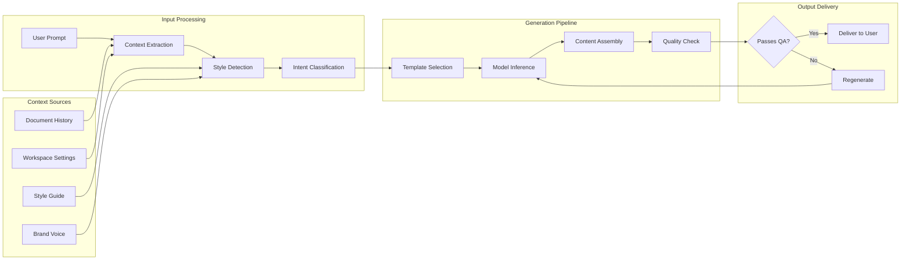

# AI Content Generation

Aria's content generation capabilities help you overcome writer's block, create first drafts quickly, and produce structured content from simple prompts or outlines. Whether you're writing documentation, marketing copy, or technical specifications, Aria adapts to your needs and workspace style.

## How Content Generation Works



## Generation Modes

Aria offers multiple content generation modes tailored to different use cases:

<Tabs>
  <Tab title="Free-Form Generation">
    Generate content from a natural language prompt without constraints.

    **Best for:**
    - Blog posts and articles
    - Creative writing
    - Email drafts
    - Social media content

    **How to use:**
    ```
    /generate Write a compelling introduction for a blog post about
    sustainable manufacturing practices in the automotive industry
    ```
  </Tab>
  <Tab title="Structured Generation">
    Generate content following a specific structure or template.

    **Best for:**
    - Technical documentation
    - Product specifications
    - Meeting notes
    - Reports

    **How to use:**
    ```
    /generate Create a product requirements document with sections for:
    - Overview
    - User Stories
    - Technical Requirements
    - Success Metrics
    ```
  </Tab>
  <Tab title="Expansion Mode">
    Expand on existing content or bullet points into full prose.

    **Best for:**
    - Fleshing out outlines
    - Adding detail to summaries
    - Elaborating on key points

    **How to use:**
    1. Select your bullet points or outline
    2. Press `Cmd/Ctrl + J`
    3. Choose "Expand into full content"
  </Tab>
  <Tab title="Continuation Mode">
    Continue writing from where you left off, matching your existing style.

    **Best for:**
    - Completing drafts
    - Adding sections
    - Maintaining consistency

    **How to use:**
    1. Place cursor at end of content
    2. Press `Cmd/Ctrl + J`
    3. Choose "Continue writing"
  </Tab>
</Tabs>

## Content Types and Templates

<AccordionGroup>
  <Accordion title="Documentation Templates">
    | Template | Description | Typical Length |
    |----------|-------------|----------------|
    | API Reference | Endpoint documentation with examples | 500-1000 words |
    | User Guide | Step-by-step instructions | 1000-3000 words |
    | FAQ | Question and answer format | 200-500 words |
    | Release Notes | Version update summary | 300-800 words |
    | README | Project overview and setup | 500-1500 words |
  </Accordion>
  <Accordion title="Marketing Templates">
    | Template | Description | Typical Length |
    |----------|-------------|----------------|
    | Landing Page | Hero copy and feature descriptions | 300-800 words |
    | Email Campaign | Subject lines and body copy | 150-400 words |
    | Social Media | Platform-specific posts | 50-280 characters |
    | Case Study | Customer success narrative | 800-2000 words |
    | Press Release | News announcement format | 400-600 words |
  </Accordion>
  <Accordion title="Business Templates">
    | Template | Description | Typical Length |
    |----------|-------------|----------------|
    | Executive Summary | High-level overview | 200-500 words |
    | Project Proposal | Scope and objectives | 1000-3000 words |
    | Meeting Minutes | Action items and decisions | 300-800 words |
    | Status Report | Progress update | 400-1000 words |
    | Policy Document | Guidelines and procedures | 1000-5000 words |
  </Accordion>
</AccordionGroup>

## Using Content Generation

<Steps>
  <Step title="Invoke Aria">
    Open the Aria palette using one of these methods:
    - Press `Cmd/Ctrl + J`
    - Type `/generate` in the editor
    - Click the Aria icon in the toolbar
  </Step>
  <Step title="Describe Your Content">
    Provide a clear description of what you want to generate:
    - **Topic**: What is the content about?
    - **Audience**: Who will read this?
    - **Purpose**: What should readers do or learn?
    - **Length**: Approximate word count or sections
  </Step>
  <Step title="Set Parameters">
    Adjust generation settings as needed:

    | Parameter | Options | Default |
    |-----------|---------|---------|
    | Tone | Professional, Casual, Technical, Friendly | Workspace default |
    | Length | Short, Medium, Long, Custom | Medium |
    | Format | Prose, Bullets, Numbered, Mixed | Auto-detect |
    | Creativity | Conservative, Balanced, Creative | Balanced |
  </Step>
  <Step title="Review and Refine">
    Aria generates content for your review:
    - **Accept**: Insert the generated content
    - **Regenerate**: Get a new version
    - **Edit**: Modify before inserting
    - **Refine**: Ask Aria to adjust specific aspects
  </Step>
</Steps>

## Generation Settings

### Tone Configuration

<Tabs>
  <Tab title="Professional">
    Formal, business-appropriate language suitable for:
    - Corporate communications
    - Client-facing documents
    - Legal and compliance content

    **Characteristics:**
    - Third person perspective
    - Formal vocabulary
    - Structured sentences
    - Minimal contractions
  </Tab>
  <Tab title="Technical">
    Precise, detailed language for:
    - API documentation
    - Engineering specs
    - Technical guides

    **Characteristics:**
    - Accurate terminology
    - Code examples when relevant
    - Step-by-step instructions
    - Version-specific details
  </Tab>
  <Tab title="Conversational">
    Friendly, approachable language for:
    - User guides
    - Help content
    - Onboarding materials

    **Characteristics:**
    - Second person (you/your)
    - Contractions allowed
    - Encouraging tone
    - Clear examples
  </Tab>
  <Tab title="Marketing">
    Persuasive, engaging language for:
    - Landing pages
    - Promotional emails
    - Social media

    **Characteristics:**
    - Action-oriented
    - Benefit-focused
    - Emotionally engaging
    - Clear CTAs
  </Tab>
</Tabs>

### Creativity Levels

| Level | Behavior | Best For |
|-------|----------|----------|
| Conservative | Follows patterns closely, minimal variation | Legal, compliance, technical accuracy |
| Balanced | Mix of predictable and novel approaches | General business content |
| Creative | More varied language, unique angles | Marketing, storytelling, thought leadership |

<Warning>
  Higher creativity levels may produce content that requires more thorough review. Always verify facts and claims in creative outputs.
</Warning>

## Advanced Features

### Multi-Section Generation

Generate complete documents with multiple sections in one request:

```
/generate Create a comprehensive product launch plan with:

1. Executive Summary (100 words)
2. Market Analysis (300 words)
3. Target Audience (200 words)
4. Launch Timeline (bullet points)
5. Marketing Channels (table format)
6. Success Metrics (numbered list)
7. Risk Assessment (200 words)
```

### Variable Insertion

Use variables to generate personalized content:

```
/generate Write a customer onboarding email:
- Customer name: {{customer_name}}
- Product: {{product_name}}
- Account manager: {{am_name}}
- Getting started link: {{docs_url}}
```

### Batch Generation

Generate multiple variations for testing:

<Steps>
  <Step title="Enable Batch Mode">
    Click "Generate Multiple" in the Aria palette or add `--batch 3` to your command.
  </Step>
  <Step title="Set Variation Parameters">
    Choose what should vary between versions:
    - Tone variations
    - Length variations
    - Opening hook variations
    - CTA variations
  </Step>
  <Step title="Compare and Select">
    Review all generated versions side-by-side and select the best one or combine elements from multiple versions.
  </Step>
</Steps>

## Quality Controls

### Automatic Checks

Aria performs these checks on all generated content:

| Check | Description | Action |
|-------|-------------|--------|
| Factual Consistency | Verifies claims against provided context | Flags uncertain statements |
| Brand Alignment | Ensures tone matches workspace settings | Auto-adjusts or warns |
| Readability | Analyzes complexity for target audience | Suggests simplification |
| Plagiarism | Checks for copied content patterns | Regenerates if detected |
| PII Detection | Scans for personal information | Redacts or warns |

### Manual Review Indicators

Aria marks content that needs human attention:

<Note>
  **Yellow highlights** indicate content where Aria is less confident and recommends review.
</Note>

<Tip>
  **Blue suggestions** show optional enhancements you might consider but aren't required.
</Tip>

<Warning>
  **Red flags** mark content that may contain issues requiring immediate attention before use.
</Warning>

## Integration with Workflows

### Document Templates

Connect Aria generation to your document templates:

1. Navigate to **Workspace Settings > Templates**
2. Create or edit a template
3. Add Aria generation blocks with preset prompts
4. Users can trigger generation when creating from template

### Automation Rules

Trigger content generation based on events:

| Trigger | Action | Example |
|---------|--------|---------|
| New document created | Generate outline | Auto-create meeting agenda from invite |
| Status changed | Generate summary | Create release notes when version ships |
| Deadline approaching | Generate draft | Start report draft 3 days before due |
| Review requested | Generate checklist | Create review criteria list |

## Troubleshooting

<AccordionGroup>
  <Accordion title="Generated content doesn't match expected style">
    **Solutions:**
    1. Check workspace style settings at **Settings > AI > Style Preferences**
    2. Provide explicit tone instructions in your prompt
    3. Include an example of the desired style
    4. Use a template that enforces your preferred format
  </Accordion>
  <Accordion title="Content is too short or too long">
    **Solutions:**
    1. Specify exact word count: "Write approximately 500 words"
    2. Define section lengths individually
    3. Use "expand" or "condense" commands on generated content
    4. Adjust the Length parameter before generating
  </Accordion>
  <Accordion title="Generation fails or times out">
    **Common causes:**
    1. Request too complex - break into smaller parts
    2. Rate limit reached - wait a few minutes
    3. Network issues - check connection
    4. Content policy violation - review prompt for restricted terms
  </Accordion>
  <Accordion title="Content contains inaccuracies">
    **Prevention:**
    1. Provide source context in your prompt
    2. Use "cite sources" option for research content
    3. Enable fact-checking in workspace settings
    4. Always review AI-generated factual claims

    <Warning>
      Aria generates content based on patterns, not verified facts. Always verify claims in generated content, especially for statistics, dates, and proper nouns.
    </Warning>
  </Accordion>
</AccordionGroup>

## Best Practices

<Tip>
  **Start with an outline.** Even a simple bullet list helps Aria understand your structure and produces more coherent long-form content.
</Tip>

<Tip>
  **Iterate, don't restart.** If the first generation isn't perfect, use refinement commands like "make this more concise" or "add more technical detail" rather than regenerating from scratch.
</Tip>

<Note>
  **Leverage workspace context.** Aria can access your other documents for context. Reference related docs in your prompt: "Using the style from our Q3 report, write..."
</Note>

## Related Documentation

<CardGroup cols={2}>
  <Card title="Aria Overview" icon="sparkles" href="/ai/overview">
    Learn about all of Aria's AI capabilities.
  </Card>
  <Card title="Enhancement Suggestions" icon="wand-magic-sparkles" href="/ai/enhancement-suggestions">
    Improve generated content with AI-powered suggestions.
  </Card>
  <Card title="Templates Guide" icon="file-lines" href="/documents/templates">
    Create reusable templates with AI generation blocks.
  </Card>
  <Card title="Style Guide Settings" icon="palette" href="/workspace/style-guide">
    Configure your workspace's tone and voice preferences.
  </Card>
</CardGroup>

---

<Info>
  **Usage Limits:** Content generation counts toward your plan's AI usage quota. Check your current usage at **Settings > Usage & Billing > AI Usage**.
</Info>
