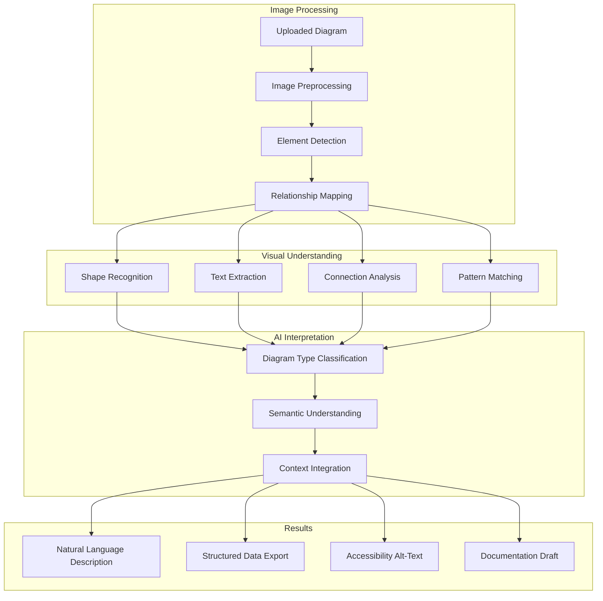
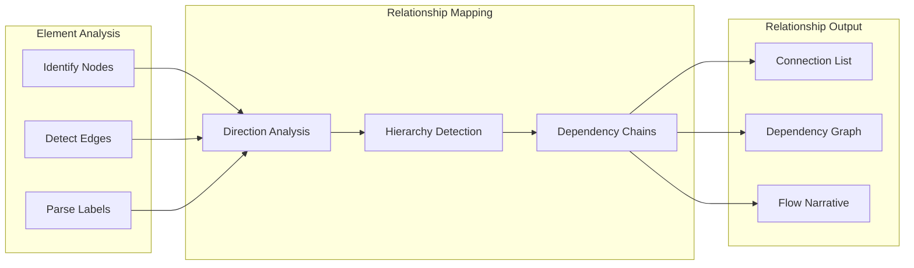

# AI Diagram Analysis

Aria's diagram analysis capabilities enable you to extract meaning from visual content in your documents. Whether you're working with flowcharts, architecture diagrams, wireframes, or technical schematics, Aria can describe, explain, and help document visual information.

## How Diagram Analysis Works



## Supported Diagram Types

<Tabs>
  <Tab title="Technical Diagrams">
    | Diagram Type | Analysis Capabilities |
    |--------------|----------------------|
    | Flowcharts | Process flow, decision points, outcomes |
    | Architecture diagrams | Components, connections, data flow |
    | System diagrams | Services, dependencies, interactions |
    | Network diagrams | Topology, connections, protocols |
    | Database schemas | Tables, relationships, cardinality |
    | UML diagrams | Classes, sequences, state machines |
  </Tab>
  <Tab title="Business Diagrams">
    | Diagram Type | Analysis Capabilities |
    |--------------|----------------------|
    | Organizational charts | Hierarchy, reporting lines, roles |
    | Process maps | Steps, swimlanes, handoffs |
    | BPMN diagrams | Business processes, events, gateways |
    | Gantt charts | Timeline, dependencies, milestones |
    | Mind maps | Concepts, relationships, hierarchy |
    | Value stream maps | Flow, waste identification, metrics |
  </Tab>
  <Tab title="Design Assets">
    | Diagram Type | Analysis Capabilities |
    |--------------|----------------------|
    | Wireframes | Layout, components, user flow |
    | Mockups | UI elements, interactions, states |
    | Infographics | Data visualization, key points |
    | Charts/Graphs | Trends, comparisons, data points |
    | Blueprints | Spatial layout, annotations |
    | Technical drawings | Components, dimensions, specs |
  </Tab>
</Tabs>

## Diagram Analysis Features

### Automatic Description

Aria generates natural language descriptions of diagrams:

<Steps>
  <Step title="Upload or Select Diagram">
    Add an image to your document or select an existing diagram:
    - Drag and drop image files
    - Paste from clipboard
    - Insert from file browser
    - Select existing embedded image
  </Step>
  <Step title="Request Analysis">
    Invoke Aria analysis:
    - Right-click image and select "Analyze with Aria"
    - Press `Cmd/Ctrl + J` with image selected
    - Type `/describe` in the command palette
    - Click the Aria icon on the image toolbar
  </Step>
  <Step title="Choose Output Type">
    Select what you need from the analysis:

    | Output | Description | Best For |
    |--------|-------------|----------|
    | Brief description | 2-3 sentence overview | Quick understanding |
    | Detailed explanation | Full breakdown of all elements | Documentation |
    | Alt-text | Accessible description | Screen readers |
    | Structured data | JSON/YAML representation | Automation |
  </Step>
  <Step title="Review and Use">
    Aria provides the analysis with options to:
    - Insert as caption
    - Add as alt-text
    - Create documentation section
    - Copy to clipboard
  </Step>
</Steps>

### Element Extraction

Aria identifies and lists individual elements in diagrams:

**Extracted elements include:**

| Element Type | Information Extracted |
|--------------|----------------------|
| Shapes | Type, label, position, color |
| Connections | Source, target, direction, label |
| Text | Content, font style, emphasis |
| Groups | Contained elements, boundaries |
| Annotations | Notes, callouts, legends |
| Data points | Values, labels, scales |

<Note>
  Element extraction works best with clear, high-resolution images. Hand-drawn diagrams may have reduced accuracy.
</Note>

### Relationship Mapping

Aria understands how elements connect and relate:



**Relationship types detected:**

- **Directional flows**: A leads to B, B depends on A
- **Hierarchies**: A contains B, A is parent of B
- **Associations**: A relates to B, bidirectional connection
- **Dependencies**: A requires B, blocking relationships
- **Sequences**: A happens before B, temporal ordering

### Text Extraction (OCR)

Aria extracts text from diagrams with high accuracy:

<AccordionGroup>
  <Accordion title="Supported Text Types">
    - Node/box labels
    - Connection annotations
    - Legends and keys
    - Titles and headings
    - Data values
    - Callout text
    - Watermarks (optional)
  </Accordion>
  <Accordion title="Language Support">
    - English (primary)
    - Spanish, French, German, Italian
    - Portuguese, Dutch, Polish
    - Chinese (Simplified and Traditional)
    - Japanese, Korean
    - Arabic, Hebrew (RTL support)
  </Accordion>
  <Accordion title="Output Formats">
    - Plain text (preserves reading order)
    - Structured (maintains spatial relationships)
    - Labeled (element type + text)
    - Machine-readable (JSON with coordinates)
  </Accordion>
</AccordionGroup>

## Using Diagram Analysis

### Quick Analysis

For immediate insights:

1. Select or hover over a diagram
2. Press `Cmd/Ctrl + Shift + D`
3. View the quick description overlay
4. Click "More details" for full analysis

### Detailed Analysis

For comprehensive documentation:

<Tabs>
  <Tab title="Analysis Panel">
    1. Select the diagram
    2. Open the Analysis Panel (right sidebar)
    3. Click "Analyze Diagram"
    4. Review all extracted information
    5. Export or insert as needed
  </Tab>
  <Tab title="Command Palette">
    Use slash commands for specific analyses:

    | Command | Output |
    |---------|--------|
    | `/describe` | Natural language description |
    | `/extract-elements` | List of all elements |
    | `/extract-text` | All text in the diagram |
    | `/explain-flow` | Step-by-step process explanation |
    | `/generate-alt` | Accessibility alt-text |
  </Tab>
  <Tab title="Batch Analysis">
    Analyze multiple diagrams at once:

    1. Select multiple images (Cmd/Ctrl + click)
    2. Right-click and choose "Analyze Selected"
    3. Review analysis for each diagram
    4. Export all as documentation
  </Tab>
</Tabs>

### Contextual Analysis

Aria uses document context for better understanding:

<Tip>
  **Include surrounding text.** Aria produces better analyses when it can reference the text around a diagram. Headings, captions, and adjacent paragraphs help Aria understand the diagram's purpose.
</Tip>

**Context factors:**

| Context Element | How It Helps |
|-----------------|--------------|
| Document title | Overall topic understanding |
| Section heading | Specific subject area |
| Caption | Intended meaning |
| Adjacent text | Technical details, terminology |
| Related diagrams | Consistency, relationships |

## Diagram Documentation

### Auto-Generate Documentation

Create documentation from diagrams automatically:

<Steps>
  <Step title="Select Diagram">
    Choose the diagram you want to document.
  </Step>
  <Step title="Choose Documentation Type">
    Select the documentation format:

    | Type | Output | Use Case |
    |------|--------|----------|
    | Technical spec | Detailed component breakdown | Engineering docs |
    | User guide | Step-by-step process explanation | End-user docs |
    | Overview | High-level summary | Executive briefings |
    | API reference | Endpoint/service documentation | Developer docs |
  </Step>
  <Step title="Review and Edit">
    Aria generates draft documentation that includes:
    - Overview section
    - Component descriptions
    - Relationship explanations
    - Usage notes
  </Step>
  <Step title="Insert or Export">
    - Insert into current document
    - Create new linked document
    - Export as standalone file
  </Step>
</Steps>

### Accessibility Alt-Text

Generate compliant alt-text for accessibility:

**Alt-text guidelines followed:**

| Standard | Compliance |
|----------|------------|
| WCAG 2.1 AA | Full compliance |
| Section 508 | Full compliance |
| ADA | Supports compliance |
| EN 301 549 | EU accessibility standard |

**Alt-text options:**

- **Concise**: Under 125 characters for simple diagrams
- **Extended**: Full description in longdesc attribute
- **Structured**: Hierarchical description for complex diagrams

<Note>
  Generated alt-text should always be reviewed for accuracy and completeness, especially for critical accessibility requirements.
</Note>

### Diagram-to-Code

Convert visual diagrams to code representations:

| Diagram Type | Code Output |
|--------------|-------------|
| Flowcharts | Mermaid, PlantUML |
| Sequence diagrams | Mermaid, PlantUML |
| ER diagrams | SQL DDL, DBML |
| State machines | XState, state pattern code |
| Architecture | Terraform, Kubernetes YAML |

**Example conversion:**

```
// From uploaded architecture diagram, Aria generates:

flowchart TB
    subgraph Frontend
        A[React App]
        B[Mobile App]
    end

    subgraph Backend
        C[API Gateway]
        D[Auth Service]
        E[Core Service]
    end

    subgraph Data
        F[(PostgreSQL)]
        G[(Redis)]
    end

    A --> C
    B --> C
    C --> D
    C --> E
    E --> F
    E --> G
```

## Analysis Settings

### Accuracy Configuration

| Setting | Options | Impact |
|---------|---------|--------|
| Detail level | Low, Medium, High, Maximum | Analysis depth |
| Confidence threshold | 50-95% | Element inclusion cutoff |
| OCR mode | Fast, Balanced, Accurate | Text extraction quality |
| Relationship depth | Immediate, Extended, Full | Connection analysis scope |

### Output Preferences

<AccordionGroup>
  <Accordion title="Description Settings">
    - **Length**: Brief (50 words), Standard (150 words), Detailed (300+ words)
    - **Tone**: Technical, Accessible, Mixed
    - **Structure**: Paragraph, Bullets, Sections
    - **Terminology**: Use diagram labels, Use standard terms, Define terms
  </Accordion>
  <Accordion title="Export Settings">
    - **Format**: Markdown, HTML, Plain text, JSON
    - **Include**: Original image reference, Element list, Relationships
    - **Metadata**: Diagram type, Analysis timestamp, Confidence scores
  </Accordion>
  <Accordion title="Accessibility Settings">
    - **Alt-text length**: Concise, Standard, Extended
    - **Include data**: Yes/No for charts and graphs
    - **Reading order**: Left-to-right, Top-to-bottom, Flow-based
  </Accordion>
</AccordionGroup>

## Quality and Limitations

### Best Results

Aria performs best with:

| Factor | Optimal | Acceptable | Challenging |
|--------|---------|------------|-------------|
| Resolution | 300+ DPI | 150-300 DPI | Below 150 DPI |
| Contrast | High | Medium | Low |
| Complexity | 5-20 elements | 20-50 elements | 50+ elements |
| Text clarity | Typed, clear | Mixed | Handwritten |
| Format | PNG, SVG | JPEG, WebP | GIF, BMP |

### Known Limitations

<AccordionGroup>
  <Accordion title="Image quality constraints">
    - Blurry or low-resolution images reduce accuracy
    - Heavy compression artifacts affect text extraction
    - Very small text (under 10px) may not be readable
    - Poor contrast between elements and background
  </Accordion>
  <Accordion title="Diagram complexity limits">
    - Diagrams with 100+ elements may have incomplete analysis
    - Deeply nested hierarchies may lose relationships
    - Overlapping elements can cause misidentification
    - Dense diagrams may require multiple analysis passes
  </Accordion>
  <Accordion title="Content type challenges">
    - Hand-drawn diagrams have lower accuracy
    - 3D representations may not parse correctly
    - Animated GIFs analyze first frame only
    - Heavily stylized designs may confuse element detection
  </Accordion>
</AccordionGroup>

<Warning>
  Diagram analysis provides interpretations based on visual patterns. Always verify critical information, especially for technical specifications or compliance documentation.
</Warning>

## Troubleshooting

<AccordionGroup>
  <Accordion title="Analysis fails to start">
    **Solutions:**
    1. Check image file format (use PNG, JPEG, or WebP)
    2. Verify file size is under 20MB
    3. Ensure image is not corrupted
    4. Try re-uploading the image
  </Accordion>
  <Accordion title="Text not extracted correctly">
    **Solutions:**
    1. Use higher resolution image
    2. Improve contrast in source diagram
    3. Try OCR mode "Accurate" instead of "Fast"
    4. Specify the language if non-English
  </Accordion>
  <Accordion title="Elements missing from analysis">
    **Solutions:**
    1. Increase detail level to "Maximum"
    2. Lower confidence threshold
    3. Ensure all elements have distinct boundaries
    4. Try analyzing sections separately
  </Accordion>
  <Accordion title="Relationships incorrectly identified">
    **Solutions:**
    1. Ensure arrows/lines are clear and distinct
    2. Add labels to connection lines
    3. Use standard flowchart symbols
    4. Provide context in surrounding document text
  </Accordion>
  <Accordion title="Analysis takes too long">
    **Solutions:**
    1. Reduce image resolution (if very high)
    2. Use "Fast" OCR mode
    3. Lower detail level
    4. Split complex diagrams into sections
  </Accordion>
</AccordionGroup>

## Best Practices

<Tip>
  **Use standard conventions.** Diagrams following standard flowchart, UML, or architecture conventions are analyzed more accurately than custom visual languages.
</Tip>

<Tip>
  **Label everything.** Text labels on shapes and connections significantly improve analysis accuracy and documentation quality.
</Tip>

<Note>
  **Provide context.** Add a brief caption or heading near diagrams. Aria uses this context to produce more relevant and accurate descriptions.
</Note>

<Warning>
  **Review generated alt-text.** While Aria produces good alt-text, accessibility requirements often need human review to ensure the description truly conveys the diagram's meaning to non-visual users.
</Warning>

## Related Documentation

<CardGroup cols={2}>
  <Card title="Aria Overview" icon="sparkles" href="/ai/overview">
    Learn about all of Aria's AI capabilities.
  </Card>
  <Card title="Content Generation" icon="pen-fancy" href="/ai/content-generation">
    Generate documentation from diagram analysis.
  </Card>
  <Card title="Images in Documents" icon="image" href="/documents/images">
    Working with images and visual content.
  </Card>
  <Card title="Accessibility Guide" icon="universal-access" href="/accessibility/overview">
    Creating accessible content in Materi.
  </Card>
</CardGroup>

---

<Info>
  **Usage Limits:** Diagram analysis counts toward your plan's AI usage quota. Complex diagrams may use multiple analysis units. Check usage at **Settings > Usage & Billing > AI Usage**.
</Info>
