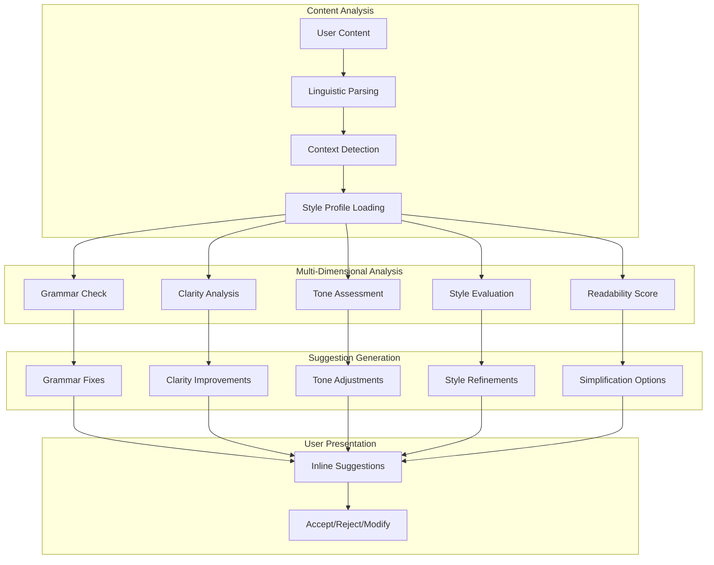
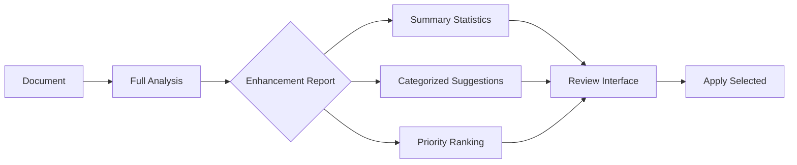

# AI Enhancement Suggestions

Aria's enhancement suggestions help you refine your writing by identifying opportunities to improve grammar, clarity, tone, and style. Whether you're polishing a quick email or perfecting a critical document, Aria provides intelligent, context-aware suggestions that respect your voice while elevating your content.

## How Enhancement Suggestions Work

## Enhancement Categories

<Tabs>
  <Tab title="Grammar">
    Aria catches grammatical errors and suggests corrections:

    | Issue Type | Example | Correction |
    |------------|---------|------------|
    | Subject-verb agreement | "The team are working" | "The team is working" |
    | Tense consistency | "He walked and sees" | "He walked and saw" |
    | Pronoun reference | "Everyone brought their" | "Everyone brought his or her" (or suggests rewrite) |
    | Article usage | "I need a information" | "I need information" |
    | Comma splices | "I went, he stayed" | "I went; he stayed" |
    | Dangling modifiers | "Running fast, the finish line appeared" | "Running fast, she saw the finish line" |
  </Tab>
  <Tab title="Clarity">
    Aria identifies unclear passages and suggests improvements:

    **Common clarity issues:**
    - Ambiguous pronoun references
    - Overly complex sentences
    - Passive voice overuse
    - Jargon without explanation
    - Missing context or transitions

    **Example:**
    > Before: "The implementation of the system that was developed by the team that was hired last year has been completed."
    >
    > After: "The team hired last year has completed the system implementation."
  </Tab>
  <Tab title="Tone">
    Aria analyzes and adjusts the emotional tone of your writing:

    | Current Tone | Target Tone | Aria Action |
    |--------------|-------------|-------------|
    | Aggressive | Professional | Soften language, remove charged words |
    | Casual | Formal | Remove contractions, elevate vocabulary |
    | Passive | Confident | Use active voice, stronger verbs |
    | Impersonal | Warm | Add personal touches, inclusive language |
    | Negative | Constructive | Reframe criticism as suggestions |
  </Tab>
  <Tab title="Style">
    Aria ensures consistency with your workspace style guide:

    **Style elements checked:**
    - Brand voice adherence
    - Terminology consistency
    - Formatting conventions
    - Heading structure
    - List formatting
    - Citation style
  </Tab>
</Tabs>

## Using Enhancement Suggestions

<Steps>
  <Step title="Enable Real-Time Suggestions">
    Enhancement suggestions can appear automatically as you type:

    1. Navigate to **Settings > Editor > AI Suggestions**
    2. Toggle "Real-time enhancements" to ON
    3. Configure suggestion sensitivity (Low, Medium, High)
    4. Choose which enhancement types to enable
  </Step>
  <Step title="Access On-Demand Enhancements">
    For focused enhancement of existing content:

    - Select text and press `Cmd/Ctrl + Alt + J`
    - Type `/enhance` in the command palette
    - Click the enhancement icon in the toolbar
    - Right-click and select "Enhance with Aria"
  </Step>
  <Step title="Review Suggestions">
    Suggestions appear as inline highlights or in the suggestion panel:

    | Highlight Color | Meaning |
    |-----------------|---------|
    | Red underline | Grammar error |
    | Blue underline | Clarity improvement |
    | Purple underline | Tone adjustment |
    | Green underline | Style suggestion |
    | Yellow underline | Optional refinement |
  </Step>
  <Step title="Apply or Dismiss">
    For each suggestion:
    - **Click** the highlight to see the suggestion
    - **Tab** to accept and move to next
    - **Escape** to dismiss
    - **Cmd/Ctrl + Enter** to accept all suggestions
  </Step>
</Steps>

## Enhancement Settings

### Suggestion Sensitivity

Configure how aggressively Aria suggests improvements:

| Level | Behavior | Best For |
|-------|----------|----------|
| Low | Only clear errors, high-confidence suggestions | Quick emails, informal content |
| Medium | Errors plus moderate improvements | Business documents, reports |
| High | Comprehensive enhancement opportunities | Published content, formal documents |

### Category Controls

Enable or disable specific enhancement categories:

<AccordionGroup>
  <Accordion title="Grammar Settings">
    | Setting | Description | Default |
    |---------|-------------|---------|
    | Spelling | Check for misspelled words | Enabled |
    | Grammar | Check grammatical correctness | Enabled |
    | Punctuation | Check punctuation usage | Enabled |
    | Capitalization | Check proper capitalization | Enabled |
    | Oxford comma | Enforce Oxford comma usage | Workspace setting |
  </Accordion>
  <Accordion title="Clarity Settings">
    | Setting | Description | Default |
    |---------|-------------|---------|
    | Sentence length | Flag overly long sentences | Enabled |
    | Passive voice | Suggest active alternatives | Enabled |
    | Complex words | Suggest simpler alternatives | Enabled |
    | Redundancy | Flag redundant phrases | Enabled |
    | Ambiguity | Flag unclear references | Enabled |
  </Accordion>
  <Accordion title="Tone Settings">
    | Setting | Description | Default |
    |---------|-------------|---------|
    | Target tone | Default tone to enforce | Professional |
    | Confidence level | Suggest stronger language | Medium |
    | Inclusivity | Flag non-inclusive language | Enabled |
    | Hedging | Flag excessive hedging | Disabled |
  </Accordion>
  <Accordion title="Style Settings">
    | Setting | Description | Default |
    |---------|-------------|---------|
    | Brand voice | Enforce brand guidelines | Workspace setting |
    | Terminology | Use approved terms | Enabled |
    | Formatting | Enforce style guide | Enabled |
    | Consistency | Flag inconsistent patterns | Enabled |
  </Accordion>
</AccordionGroup>

## Advanced Enhancement Features

### Bulk Enhancement

Enhance an entire document at once:

<Steps>
  <Step title="Open Bulk Enhancement">
    Click **Document > Enhance Document** or press `Cmd/Ctrl + Shift + E`
  </Step>
  <Step title="Review Enhancement Report">
    Aria analyzes the entire document and presents:
    - Total issues found by category
    - Readability score before/after
    - Estimated improvement percentage
    - High-priority items flagged
  </Step>
  <Step title="Select Enhancements">
    Review suggestions in batches:
    - **Accept All**: Apply all suggestions
    - **Accept Category**: Apply all of one type
    - **Review Individual**: Go through one by one
    - **Skip Low Priority**: Only apply important fixes
  </Step>
</Steps>

### Tone Transformation

Transform the entire document's tone:

| Transformation | From | To | Use Case |
|----------------|------|-----|----------|
| Formalize | Casual | Professional | Draft to final |
| Simplify | Technical | Accessible | Expert to general audience |
| Energize | Neutral | Enthusiastic | Internal to marketing |
| Soften | Direct | Diplomatic | Feedback delivery |
| Condense | Verbose | Concise | Long-form to summary |

**How to use:**
1. Select content or entire document
2. Type `/tone [target]` (e.g., `/tone professional`)
3. Review and accept transformed content

### Readability Optimization

Aria can optimize content for specific readability levels:

| Level | Grade | Audience | Characteristics |
|-------|-------|----------|-----------------|
| Basic | 6-8 | General public | Short sentences, common words |
| Standard | 9-12 | Business | Moderate complexity |
| Advanced | 13+ | Specialists | Technical terminology OK |

<Note>
  Readability optimization uses the Flesch-Kincaid scale. Aria shows the current and target scores during enhancement.
</Note>

### Context-Aware Suggestions

Aria adapts suggestions based on document context:

<Tabs>
  <Tab title="Email Context">
    When editing emails, Aria:
    - Suggests appropriate greetings/closings
    - Checks for missing attachments mentioned
    - Ensures call-to-action clarity
    - Validates recipient tone appropriateness
  </Tab>
  <Tab title="Technical Docs">
    For technical documentation, Aria:
    - Preserves code terminology
    - Maintains precision over simplicity
    - Suggests consistent formatting
    - Flags undefined acronyms
  </Tab>
  <Tab title="Marketing Copy">
    For marketing content, Aria:
    - Emphasizes action verbs
    - Suggests power words
    - Checks CTA effectiveness
    - Ensures benefit-focused language
  </Tab>
  <Tab title="Legal/Compliance">
    For legal documents, Aria:
    - Maintains formal language
    - Preserves precise terminology
    - Flags potential ambiguities
    - Suggests defined terms
  </Tab>
</Tabs>

## Integration with Style Guides

### Workspace Style Guide

Connect Aria to your organization's style guide:

<Steps>
  <Step title="Upload Style Guide">
    Navigate to **Workspace Settings > Style Guide** and upload your style documentation or configure rules manually.
  </Step>
  <Step title="Configure Rules">
    Define specific rules for:
    - Preferred terminology (use "customers" not "clients")
    - Forbidden phrases
    - Capitalization rules
    - Formatting standards
  </Step>
  <Step title="Enable Enforcement">
    Toggle "Enforce style guide" in enhancement settings. Aria will suggest corrections when content deviates from your guide.
  </Step>
</Steps>

### Custom Dictionary

Add organization-specific terms:

| Feature | Description |
|---------|-------------|
| Approved terms | Words Aria should accept |
| Preferred terms | Replacements Aria should suggest |
| Forbidden terms | Words Aria should flag |
| Acronyms | Expansions Aria should know |

<Tip>
  Build your custom dictionary over time by clicking "Add to dictionary" when Aria incorrectly flags a valid term.
</Tip>

## Enhancement Reports

### Document Quality Score

Aria provides an overall quality score for your document:

| Score Range | Rating | Meaning |
|-------------|--------|---------|
| 90-100 | Excellent | Publication-ready |
| 80-89 | Good | Minor improvements possible |
| 70-79 | Fair | Several areas need attention |
| 60-69 | Needs Work | Significant improvements needed |
| Below 60 | Poor | Major revision recommended |

### Detailed Analytics

Access detailed enhancement analytics:

- **Grammar accuracy**: Percentage of text without errors
- **Readability score**: Flesch-Kincaid grade level
- **Tone consistency**: How consistent the tone is throughout
- **Style compliance**: Adherence to workspace style guide
- **Improvement suggestions**: Ranked by impact

<Note>
  Access enhancement analytics via **Document > View Enhancement Report** or the Analytics tab in the document panel.
</Note>

## Troubleshooting

<AccordionGroup>
  <Accordion title="Too many suggestions appearing">
    **Solutions:**
    1. Lower the sensitivity level to Medium or Low
    2. Disable specific enhancement categories
    3. Create exceptions for your common writing patterns
    4. Add frequently-flagged terms to your custom dictionary
  </Accordion>
  <Accordion title="Suggestions don't match my style">
    **Solutions:**
    1. Configure your workspace style guide
    2. Set the appropriate target tone
    3. Train Aria by consistently accepting/rejecting suggestions
    4. Provide feedback on incorrect suggestions (click "Report")
  </Accordion>
  <Accordion title="Technical terms incorrectly flagged">
    **Solutions:**
    1. Add terms to your custom dictionary
    2. Set document type to "Technical" in document settings
    3. Disable "Suggest simpler words" for technical docs
    4. Import a technical glossary to your workspace
  </Accordion>
  <Accordion title="Enhancement suggestions are slow">
    **Solutions:**
    1. Reduce suggestion sensitivity
    2. Disable real-time suggestions for large documents
    3. Use on-demand enhancement instead
    4. Break large documents into smaller sections
  </Accordion>
  <Accordion title="Suggestions disappear before I can review">
    **Solutions:**
    1. Increase suggestion display time in Settings > Editor > AI Suggestions
    2. Use the Suggestions Panel for persistent view
    3. Enable "Keep suggestions visible until dismissed"
  </Accordion>
</AccordionGroup>

## Best Practices

<Tip>
  **Start with grammar, end with tone.** Fix grammatical errors first, then work on clarity and style. This prevents making stylistic changes to text that will be rewritten for grammar.
</Tip>

<Tip>
  **Use bulk enhancement for final polish.** Write your draft first without interruption, then use bulk enhancement to review all suggestions at once.
</Tip>

<Warning>
  **Don't accept all suggestions blindly.** Aria's suggestions are recommendations. Your judgment as the author should determine the final content, especially for tone and style choices.
</Warning>

<Note>
  **Calibrate over time.** Aria learns from your accept/reject patterns. Consistently providing feedback improves suggestion quality for your specific writing style.
</Note>

## Keyboard Shortcuts

| Shortcut | Action |
|----------|--------|
| `Cmd/Ctrl + Alt + J` | Enhance selection |
| `Cmd/Ctrl + Shift + E` | Bulk enhance document |
| `Tab` | Accept suggestion and move to next |
| `Shift + Tab` | Move to previous suggestion |
| `Escape` | Dismiss current suggestion |
| `Cmd/Ctrl + Enter` | Accept all suggestions |
| `Cmd/Ctrl + .` | Show suggestion details |

## Related Documentation

<CardGroup cols={2}>
  <Card title="Aria Overview" icon="sparkles" href="/ai/overview">
    Learn about all of Aria's AI capabilities.
  </Card>
  <Card title="Content Generation" icon="pen-fancy" href="/ai/content-generation">
    Generate new content with AI assistance.
  </Card>
  <Card title="Style Guide Setup" icon="palette" href="/workspace/style-guide">
    Configure your workspace style preferences.
  </Card>
  <Card title="Editor Settings" icon="gear" href="/editor/settings">
    Customize your editing experience.
  </Card>
</CardGroup>

---

<Info>
  **Unlimited Enhancements:** Enhancement suggestions are unlimited on all plans. Only content generation and summarization count toward AI usage quotas.
</Info>
