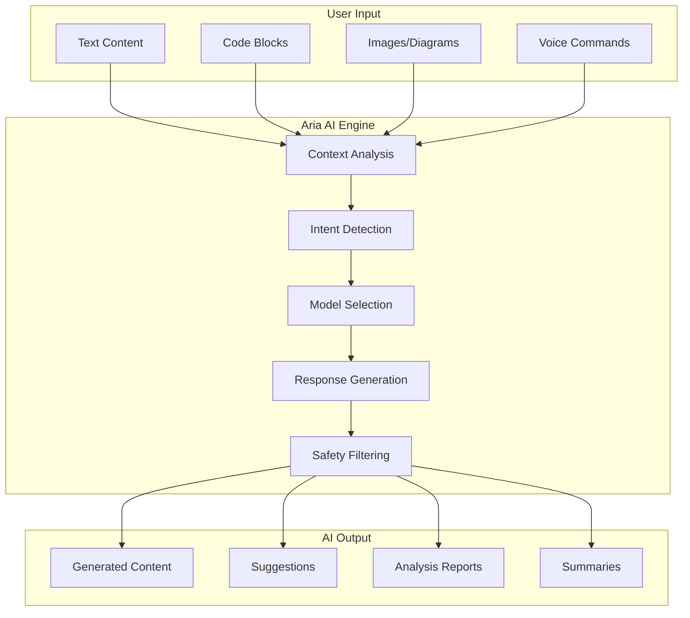

# Aria AI Overview

Aria is Materi's integrated AI assistant, designed to enhance your content creation workflow with intelligent writing assistance, analysis capabilities, and real-time suggestions. Built on enterprise-grade language models, Aria helps teams create better content faster while maintaining quality and consistency.

## What is Aria?

Aria is an AI-powered assistant embedded throughout Materi's platform. Unlike standalone AI tools, Aria understands your workspace context, team preferences, and document history to provide relevant, personalized assistance.

## Core Capabilities

<CardGroup cols={2}>
  <Card title="Content Generation" icon="pen-fancy" href="/ai/content-generation">
    Generate drafts, expand ideas, and create structured content from prompts or outlines.
  </Card>
  <Card title="Summarization" icon="compress" href="/ai/summarization">
    Condense long documents into concise summaries, key points, or executive briefings.
  </Card>
  <Card title="Enhancement Suggestions" icon="wand-magic-sparkles" href="/ai/enhancement-suggestions">
    Improve grammar, clarity, tone, and style with intelligent real-time suggestions.
  </Card>
  <Card title="Code Analysis" icon="code" href="/ai/code-analysis">
    Review code blocks, explain logic, identify issues, and suggest improvements.
  </Card>
  <Card title="Diagram Analysis" icon="diagram-project" href="/ai/diagram-analysis">
    Understand and describe visual diagrams, flowcharts, and architectural drawings.
  </Card>
  <Card title="Safety Gates" icon="shield-check" href="/ai/safety-gates">
    Enterprise-grade content moderation and safety filtering for all AI operations.
  </Card>
</CardGroup>

## How Aria Works

<Steps>
  <Step title="Context Gathering">
    When you invoke Aria, it analyzes the current document context, including:
    - Document type and purpose
    - Existing content and structure
    - Workspace style guidelines
    - Your historical preferences
  </Step>
  <Step title="Intent Recognition">
    Aria determines what you're trying to accomplish:
    - Writing new content
    - Editing existing text
    - Asking a question
    - Requesting analysis
  </Step>
  <Step title="Model Selection">
    Based on the task, Aria selects the optimal AI model:
    - Fast models for quick suggestions
    - Advanced models for complex generation
    - Specialized models for code or technical content
  </Step>
  <Step title="Response Generation">
    Aria generates a response tailored to your needs, applying:
    - Workspace tone and style settings
    - Brand voice guidelines
    - Content policies and restrictions
  </Step>
  <Step title="Safety Filtering">
    All outputs pass through safety gates to ensure:
    - Content appropriateness
    - Factual accuracy checks
    - Brand compliance
    - PII detection and handling
  </Step>
</Steps>

## Accessing Aria

Aria is available throughout Materi in multiple ways:

<Tabs>
  <Tab title="Keyboard Shortcut">
    Press `Cmd/Ctrl + J` anywhere in the editor to open the Aria command palette.

    | Shortcut | Action |
    |----------|--------|
    | `Cmd/Ctrl + J` | Open Aria palette |
    | `Cmd/Ctrl + Shift + J` | Quick summarize |
    | `Cmd/Ctrl + Alt + J` | Enhance selection |
    | `Escape` | Close Aria |
  </Tab>
  <Tab title="Slash Commands">
    Type `/` in the editor to access Aria commands:

    - `/generate` - Create new content
    - `/summarize` - Summarize selected text
    - `/enhance` - Improve selected content
    - `/explain` - Get explanation of content
    - `/translate` - Translate to another language
  </Tab>
  <Tab title="Context Menu">
    Select text and right-click to access Aria options:

    1. Select the content you want to work with
    2. Right-click to open the context menu
    3. Choose from Aria suggestions under "AI Actions"
  </Tab>
  <Tab title="Sidebar Panel">
    Open the Aria sidebar for extended conversations:

    1. Click the Aria icon in the right sidebar
    2. Start a conversation about your document
    3. Aria maintains context throughout the session
  </Tab>
</Tabs>

## Feature Comparison by Plan

| Feature | Free | Pro | Business | Enterprise |
|---------|------|-----|----------|------------|
| Content Generation | 50/month | Unlimited | Unlimited | Unlimited |
| Summarization | 20/month | Unlimited | Unlimited | Unlimited |
| Enhancement Suggestions | Unlimited | Unlimited | Unlimited | Unlimited |
| Code Analysis | 10/month | Unlimited | Unlimited | Unlimited |
| Diagram Analysis | 5/month | 100/month | Unlimited | Unlimited |
| Custom AI Models | - | - | - | Yes |
| AI Usage Analytics | - | Basic | Advanced | Full |
| Priority Processing | - | - | Yes | Yes |
| Dedicated Capacity | - | - | - | Yes |

## Privacy and Data Handling

<AccordionGroup>
  <Accordion title="How is my data used?">
    Your content is processed by Aria only when you explicitly request AI assistance. Materi does not use your content to train AI models. All processing occurs in isolated environments, and content is not retained after the request is completed.
  </Accordion>
  <Accordion title="Where is AI processing performed?">
    AI processing occurs in your workspace's designated region. Enterprise customers can specify processing locations to meet data residency requirements.

    | Region | Processing Location |
    |--------|---------------------|
    | US | United States (us-east-1, us-west-2) |
    | EU | European Union (eu-west-1, eu-central-1) |
    | APAC | Asia Pacific (ap-southeast-1) |
  </Accordion>
  <Accordion title="Can I opt out of AI features?">
    Yes. Workspace administrators can disable AI features at the workspace level. Individual users can also disable AI suggestions in their personal settings.
  </Accordion>
  <Accordion title="What about sensitive content?">
    Aria includes automatic PII detection and can be configured to block AI processing of sensitive content. Enterprise customers can define custom sensitivity rules.
  </Accordion>
</AccordionGroup>

## Best Practices

<Tip>
  **Be specific with your requests.** Instead of "make this better," try "make this paragraph more concise and professional in tone."
</Tip>

<Note>
  Aria works best when given context. Include relevant background information in your prompts for more accurate results.
</Note>

<Warning>
  Always review AI-generated content before publishing. While Aria is highly capable, it may occasionally produce content that requires human editing.
</Warning>

### Effective Prompting

| Instead of... | Try... |
|---------------|--------|
| "Write about AI" | "Write a 300-word introduction to machine learning for business executives" |
| "Fix this" | "Correct grammar errors and improve sentence flow in this paragraph" |
| "Make it better" | "Enhance clarity and add concrete examples to support the main argument" |
| "Summarize" | "Create a 3-bullet executive summary highlighting key decisions needed" |

## Troubleshooting

<AccordionGroup>
  <Accordion title="Aria is not responding">
    1. Check your internet connection
    2. Verify you haven't exceeded your plan's AI usage limits
    3. Try refreshing the page
    4. Check the [Materi Status Page](https://status.materi.io) for service issues
  </Accordion>
  <Accordion title="Responses are slow">
    Response times vary based on request complexity:
    - Simple suggestions: 1-3 seconds
    - Content generation: 5-15 seconds
    - Complex analysis: 15-30 seconds

    If responses are consistently slow, try reducing the scope of your request.
  </Accordion>
  <Accordion title="Quality of suggestions is poor">
    1. Provide more context in your prompt
    2. Be specific about the desired output format
    3. Try breaking complex requests into smaller parts
    4. Check your workspace style settings are configured correctly
  </Accordion>
  <Accordion title="AI features are disabled">
    Contact your workspace administrator. AI features may be:
    - Disabled at the workspace level
    - Restricted by your role permissions
    - Limited due to plan restrictions
  </Accordion>
</AccordionGroup>

## Related Documentation

<CardGroup cols={2}>
  <Card title="Getting Started with Materi" icon="rocket" href="/getting-started/quickstart">
    New to Materi? Start here for a complete platform overview.
  </Card>
  <Card title="Workspace Settings" icon="gear" href="/workspace/settings">
    Configure AI preferences and permissions for your workspace.
  </Card>
  <Card title="API Reference" icon="code" href="/api/ai-endpoints">
    Integrate Aria capabilities into your applications via API.
  </Card>
  <Card title="Security & Compliance" icon="lock" href="/security/overview">
    Learn about Materi's security practices and compliance certifications.
  </Card>
</CardGroup>

---

<Info>
  **Need help?** Contact our support team at support@materi.io or visit our [Help Center](https://help.materi.io) for additional resources.
</Info>
