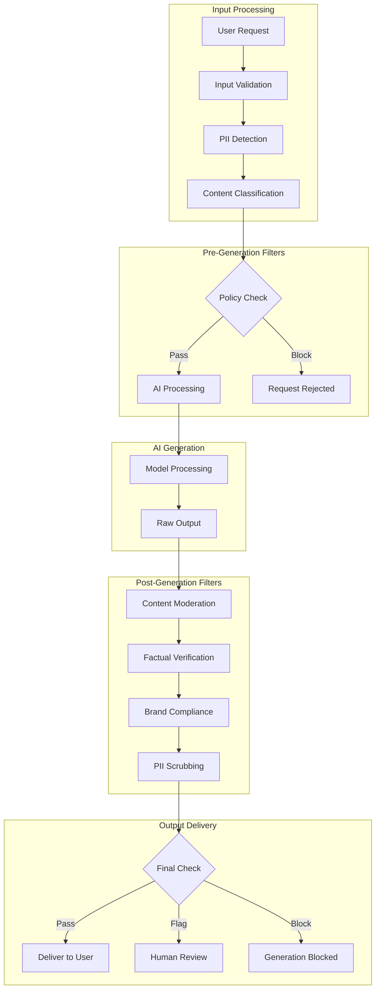
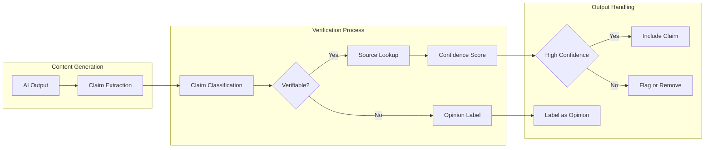
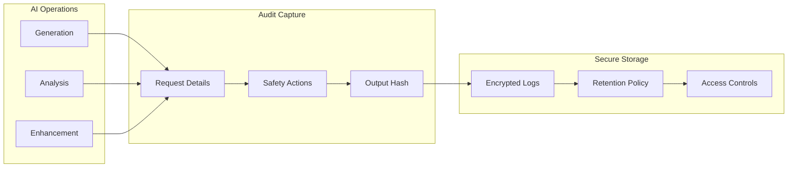

# AI Safety Gates

Materi's AI Safety Gates provide enterprise-grade content moderation and safety filtering for all Aria operations. These systems ensure AI-generated content meets your organization's standards, complies with regulations, and protects your users and brand reputation.

## Safety Architecture Overview

## Safety Components

<CardGroup cols={2}>
  <Card title="Content Moderation" icon="filter">
    Filters harmful, inappropriate, or policy-violating content from AI inputs and outputs.
  </Card>
  <Card title="PII Protection" icon="user-shield">
    Detects and handles personally identifiable information to prevent data exposure.
  </Card>
  <Card title="Factual Verification" icon="check-double">
    Cross-references generated claims against reliable sources when applicable.
  </Card>
  <Card title="Brand Compliance" icon="building">
    Ensures AI outputs align with your organization's voice, values, and guidelines.
  </Card>
  <Card title="Bias Detection" icon="balance-scale">
    Identifies and mitigates potential biases in AI-generated content.
  </Card>
  <Card title="Audit Logging" icon="clipboard-list">
    Comprehensive logging of all AI operations for compliance and review.
  </Card>
</CardGroup>

## Content Moderation

### Moderation Categories

Aria filters content across multiple categories:

<Tabs>
  <Tab title="Harmful Content">
    | Category | Description | Default Action |
    |----------|-------------|----------------|
    | Violence | Graphic violence, threats, harm promotion | Block |
    | Hate speech | Discrimination, slurs, targeted harassment | Block |
    | Self-harm | Suicide, self-injury content | Block |
    | Illegal activity | Drug manufacturing, weapons, fraud | Block |
    | Harassment | Bullying, intimidation, stalking | Block |
  </Tab>
  <Tab title="Sensitive Content">
    | Category | Description | Default Action |
    |----------|-------------|----------------|
    | Adult content | Sexual content, explicit material | Block/Warn |
    | Profanity | Strong language, vulgar terms | Warn/Allow |
    | Controversial topics | Politics, religion, social issues | Warn |
    | Medical advice | Health claims, treatment suggestions | Warn |
    | Legal advice | Legal opinions, recommendations | Warn |
  </Tab>
  <Tab title="Business Content">
    | Category | Description | Default Action |
    |----------|-------------|----------------|
    | Competitor mentions | References to competitors | Configurable |
    | Price claims | Pricing, discount statements | Verify |
    | Performance claims | Product/service assertions | Verify |
    | Testimonials | Customer quotes, reviews | Verify |
    | Regulatory claims | Compliance, certification statements | Flag |
  </Tab>
</Tabs>

### Moderation Levels

Configure moderation strictness for your workspace:

| Level | Behavior | Use Case |
|-------|----------|----------|
| Strict | Block all flagged content, no exceptions | Public-facing content, regulated industries |
| Standard | Block harmful, warn on sensitive | Most business use cases |
| Permissive | Block only harmful content | Internal, creative content |
| Custom | Define your own thresholds | Specific industry needs |

<Warning>
  Moderation levels affect all AI operations in your workspace. Changes require admin permissions and take effect immediately.
</Warning>

## PII Protection

### Detection Capabilities

Aria automatically detects and handles PII in AI operations:

<AccordionGroup>
  <Accordion title="Personal Identifiers">
    | Data Type | Detection | Default Handling |
    |-----------|-----------|------------------|
    | Full names | High accuracy | Redact/Mask |
    | Email addresses | High accuracy | Redact |
    | Phone numbers | High accuracy | Redact |
    | Social Security Numbers | High accuracy | Block |
    | Passport/ID numbers | High accuracy | Block |
    | Physical addresses | Medium accuracy | Redact |
  </Accordion>
  <Accordion title="Financial Data">
    | Data Type | Detection | Default Handling |
    |-----------|-----------|------------------|
    | Credit card numbers | High accuracy | Block |
    | Bank account numbers | High accuracy | Block |
    | Financial records | Medium accuracy | Flag |
    | Tax identifiers | High accuracy | Block |
    | Salary information | Medium accuracy | Flag |
  </Accordion>
  <Accordion title="Health Information">
    | Data Type | Detection | Default Handling |
    |-----------|-----------|------------------|
    | Medical record numbers | High accuracy | Block |
    | Health conditions | Medium accuracy | Flag |
    | Prescription information | Medium accuracy | Block |
    | Insurance IDs | High accuracy | Block |
    | Treatment details | Medium accuracy | Flag |
  </Accordion>
</AccordionGroup>

### PII Handling Options

Configure how Aria handles detected PII:

<Steps>
  <Step title="Detection">
    Aria scans input content and AI outputs for PII patterns:
    - Pattern matching for structured data (SSN, credit cards)
    - Named entity recognition for names, locations
    - Context analysis for sensitive information
  </Step>
  <Step title="Classification">
    Detected PII is classified by:
    - Sensitivity level (Low, Medium, High, Critical)
    - Data type (Personal, Financial, Health, Legal)
    - Regulatory category (GDPR, HIPAA, CCPA, PCI-DSS)
  </Step>
  <Step title="Action">
    Based on configuration, Aria takes action:

    | Action | Description |
    |--------|-------------|
    | Block | Prevent AI operation entirely |
    | Redact | Replace with [REDACTED] placeholder |
    | Mask | Partial display (***-**-1234) |
    | Flag | Allow but log for review |
    | Allow | No action (for permitted contexts) |
  </Step>
  <Step title="Logging">
    All PII detections are logged:
    - Timestamp and user
    - Type of PII detected
    - Action taken
    - Context (for audit purposes)
  </Step>
</Steps>

## Factual Verification

### Verification Process

Aria includes optional factual verification for generated content:

### Verification Categories

| Claim Type | Verification Method | Confidence Required |
|------------|---------------------|---------------------|
| Statistics | Source cross-reference | 85%+ |
| Dates/Events | Historical database | 90%+ |
| Company facts | Official sources | 80%+ |
| Product claims | Internal knowledge base | 75%+ |
| Scientific claims | Peer-reviewed sources | 90%+ |
| Legal statements | Legal database | 95%+ |

<Note>
  Factual verification is not a guarantee of accuracy. It provides additional confidence but human review remains essential for critical content.
</Note>

### Verification Settings

| Setting | Options | Description |
|---------|---------|-------------|
| Auto-verify | On/Off | Automatically verify claims |
| Confidence threshold | 70-99% | Minimum confidence to include |
| Source requirements | 1-3 sources | Number of confirming sources |
| Citation mode | Inline, Footnote, None | How sources are referenced |
| Uncertainty handling | Remove, Flag, Disclose | Action for low-confidence claims |

## Brand Compliance

### Voice and Tone Enforcement

Ensure AI outputs match your brand guidelines:

<Tabs>
  <Tab title="Voice Settings">
    Define your brand voice attributes:

    | Attribute | Options | Example |
    |-----------|---------|---------|
    | Formality | Casual to Formal (1-5) | 3 = Professional but approachable |
    | Personality | List of traits | Helpful, Knowledgeable, Friendly |
    | Avoid | Forbidden characteristics | Pushy, Condescending, Vague |
    | Examples | Sample content | Approved content excerpts |
  </Tab>
  <Tab title="Terminology">
    Enforce consistent terminology:

    | Setting | Description |
    |---------|-------------|
    | Preferred terms | Use "customers" not "users" |
    | Forbidden terms | Never use "cheap" or "discount" |
    | Product names | Exact capitalization and spelling |
    | Competitor handling | How to refer (or not refer) to competitors |
  </Tab>
  <Tab title="Messaging">
    Control key messaging:

    | Element | Configuration |
    |---------|---------------|
    | Value propositions | Approved claims only |
    | Pricing mentions | Current pricing or "contact sales" |
    | Guarantee language | Legal-approved text only |
    | Competitive claims | Pre-approved comparisons |
  </Tab>
</Tabs>

### Compliance Checks

Aria validates AI outputs against your brand rules:

| Check | Description | Action on Violation |
|-------|-------------|---------------------|
| Terminology | Uses approved terms | Auto-correct or flag |
| Tone | Matches configured voice | Rewrite suggestion |
| Claims | Validated messaging | Remove or flag |
| Formatting | Brand style guide | Auto-correct |
| Legal | Required disclaimers | Auto-append |

## Bias Detection and Mitigation

### Bias Categories Monitored

<AccordionGroup>
  <Accordion title="Demographic Bias">
    - Gender bias in language and examples
    - Racial and ethnic stereotyping
    - Age-related assumptions
    - Socioeconomic stereotypes
    - Cultural and religious sensitivity
  </Accordion>
  <Accordion title="Representation Bias">
    - Default pronouns and names
    - Example diversity
    - Image description fairness
    - Role and profession stereotypes
    - Geographic representation
  </Accordion>
  <Accordion title="Perspective Bias">
    - Political viewpoint balance
    - Industry perspective diversity
    - Problem framing fairness
    - Solution recommendation equity
    - Accessibility assumptions
  </Accordion>
</AccordionGroup>

### Mitigation Strategies

| Strategy | Description | When Applied |
|----------|-------------|--------------|
| Balanced examples | Diverse names, scenarios | Content generation |
| Neutral language | Gender-neutral defaults | All outputs |
| Multi-perspective | Present multiple viewpoints | Opinion content |
| Inclusive review | Accessibility considerations | All outputs |
| Stereotype flagging | Alert on potential stereotypes | Review mode |

## Audit and Compliance

### Audit Logging

All AI operations are logged for compliance:

### Log Contents

| Data Point | Description | Retention |
|------------|-------------|-----------|
| Timestamp | Operation time (UTC) | Per policy |
| User ID | Requesting user | Per policy |
| Operation type | Generation, analysis, etc. | Per policy |
| Input hash | SHA-256 of input | Per policy |
| Output hash | SHA-256 of output | Per policy |
| Safety actions | Filters applied, content blocked | Per policy |
| PII detections | Types detected, actions taken | Per policy |
| Model used | AI model identifier | Per policy |

### Compliance Reports

Generate compliance reports for auditors:

<Steps>
  <Step title="Navigate to Reports">
    Go to **Admin > Compliance > AI Safety Reports**
  </Step>
  <Step title="Select Report Type">
    | Report | Contents |
    |--------|----------|
    | Usage Summary | Operations count, user breakdown |
    | Safety Actions | Blocks, flags, moderations |
    | PII Events | Detection and handling summary |
    | Audit Trail | Detailed operation logs |
  </Step>
  <Step title="Set Parameters">
    - Date range
    - Users or teams (optional)
    - Operation types
    - Safety categories
  </Step>
  <Step title="Generate and Export">
    Download in PDF, CSV, or JSON format for compliance documentation.
  </Step>
</Steps>

## Configuration

### Workspace Safety Settings

<Tabs>
  <Tab title="Basic Settings">
    | Setting | Location | Default |
    |---------|----------|---------|
    | Moderation level | Admin > AI > Safety | Standard |
    | PII handling | Admin > AI > Privacy | Redact |
    | Factual verification | Admin > AI > Quality | Off |
    | Audit logging | Admin > Compliance | Enabled |
  </Tab>
  <Tab title="Advanced Settings">
    | Setting | Location | Description |
    |---------|----------|-------------|
    | Custom categories | Admin > AI > Moderation | Define custom content categories |
    | Override rules | Admin > AI > Policies | Exceptions for specific contexts |
    | Integration hooks | Admin > AI > Webhooks | Custom safety processing |
    | Model restrictions | Admin > AI > Models | Limit available AI models |
  </Tab>
</Tabs>

### Role-Based Safety

Configure different safety levels by role:

| Role | Moderation | PII Access | Audit Access |
|------|------------|------------|--------------|
| Admin | Configure all | Full | Full |
| Compliance Officer | View only | Redacted | Full |
| Team Lead | View team | Redacted | Team only |
| Member | Applied | None | None |
| Guest | Strict | None | None |

## Troubleshooting

<AccordionGroup>
  <Accordion title="Content blocked unexpectedly">
    **Solutions:**
    1. Review the block reason in the notification
    2. Check workspace moderation level settings
    3. Review custom category configurations
    4. Request admin review if content is legitimate
    5. Check for false positive PII detection
  </Accordion>
  <Accordion title="PII not being detected">
    **Solutions:**
    1. Verify PII detection is enabled
    2. Check detection category settings
    3. Report false negatives to improve detection
    4. Consider custom PII patterns for unique identifiers
  </Accordion>
  <Accordion title="Brand compliance flagging too much">
    **Solutions:**
    1. Review and refine brand voice settings
    2. Add legitimate terms to allowed list
    3. Adjust compliance strictness level
    4. Create context-specific exceptions
  </Accordion>
  <Accordion title="Audit logs missing entries">
    **Solutions:**
    1. Verify audit logging is enabled
    2. Check retention period settings
    3. Ensure user has audit access permissions
    4. Review log filter settings
  </Accordion>
</AccordionGroup>

## Regulatory Compliance

### Supported Frameworks

| Framework | Features | Documentation |
|-----------|----------|---------------|
| GDPR | PII handling, data minimization, audit trails | [GDPR Guide](/compliance/gdpr) |
| HIPAA | PHI detection, access controls, audit logs | [HIPAA Guide](/compliance/hipaa) |
| CCPA | Consumer data handling, opt-out support | [CCPA Guide](/compliance/ccpa) |
| SOC 2 | Security controls, monitoring, logging | [SOC 2 Guide](/compliance/soc2) |
| PCI-DSS | Payment data detection and blocking | [PCI Guide](/compliance/pci) |

<Note>
  Materi's AI Safety Gates support compliance but do not guarantee it. Work with your compliance team to ensure all requirements are met for your specific use case.
</Note>

## Best Practices

<Tip>
  **Start with Standard moderation.** Begin with default settings and adjust based on your specific needs rather than starting with the most permissive configuration.
</Tip>

<Tip>
  **Review flagged content.** Regularly review items flagged for human review to calibrate your safety settings and catch false positives or negatives.
</Tip>

<Warning>
  **Don't disable safety features for convenience.** Safety gates exist to protect your organization. If they're blocking legitimate use cases, adjust settings rather than disabling protection.
</Warning>

<Note>
  **Train your team.** Ensure users understand why content may be blocked or modified. This reduces frustration and improves prompt quality.
</Note>

## Related Documentation

<CardGroup cols={2}>
  <Card title="Aria Overview" icon="sparkles" href="/ai/overview">
    Learn about all of Aria's AI capabilities.
  </Card>
  <Card title="Security Overview" icon="lock" href="/security/overview">
    Materi's comprehensive security practices.
  </Card>
  <Card title="Privacy Policy" icon="eye-slash" href="/legal/privacy">
    How Materi handles your data.
  </Card>
  <Card title="Compliance Center" icon="certificate" href="/compliance/overview">
    Regulatory compliance documentation.
  </Card>
</CardGroup>

---

<Info>
  **Enterprise Features:** Advanced safety features including custom moderation categories, dedicated compliance support, and custom model restrictions are available on Enterprise plans. Contact sales@materi.io for details.
</Info>
