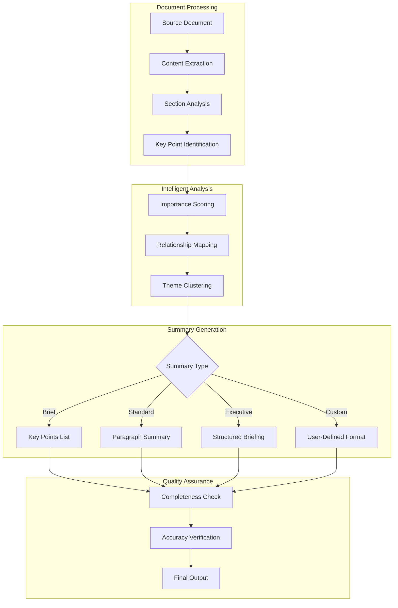
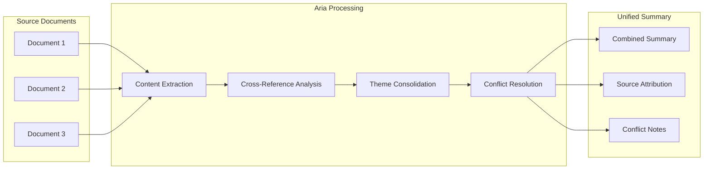

# AI Summarization

Aria's summarization capabilities help you quickly understand long documents, extract key insights, and create concise briefings for stakeholders. Whether you need a quick overview or a detailed executive summary, Aria adapts the output to your specific needs.

## How Summarization Works



## Summarization Types

<Tabs>
  <Tab title="Quick Summary">
    A brief overview in 2-3 sentences, perfect for at-a-glance understanding.

    **Output:** 50-100 words
    **Best for:**
    - Email previews
    - Document cards
    - Quick reviews

    **Example output:**
    > This quarterly report shows 23% revenue growth driven by expansion into European markets. Key challenges include supply chain delays affecting Q4 projections. Three strategic recommendations are proposed for board consideration.
  </Tab>
  <Tab title="Key Points">
    Bulleted list of the most important takeaways.

    **Output:** 5-10 bullet points
    **Best for:**
    - Meeting preparation
    - Stakeholder updates
    - Quick decision-making

    **Example output:**
    - Revenue increased 23% YoY, exceeding targets
    - European market expansion contributed 40% of new revenue
    - Supply chain issues expected to impact Q4 by $2.3M
    - Customer satisfaction scores improved to 4.6/5.0
    - Three new product lines planned for next fiscal year
  </Tab>
  <Tab title="Executive Summary">
    Structured summary with context, findings, and recommendations.

    **Output:** 200-500 words
    **Best for:**
    - Board presentations
    - Stakeholder reports
    - Strategic documents

    **Includes:**
    - Background/Context
    - Key Findings
    - Implications
    - Recommendations
    - Next Steps
  </Tab>
  <Tab title="Custom Format">
    Define your own summary structure and length.

    **Output:** User-defined
    **Best for:**
    - Specific report formats
    - Compliance requirements
    - Team standards

    **Customizable:**
    - Section headings
    - Word limits per section
    - Inclusion/exclusion criteria
    - Output format (prose, bullets, table)
  </Tab>
</Tabs>

## Using Summarization

<Steps>
  <Step title="Select Content">
    Choose what to summarize:
    - **Full document**: Summarize the entire document
    - **Selection**: Highlight specific text to summarize
    - **Multiple documents**: Select several docs for combined summary
    - **Section**: Right-click a section heading to summarize just that part
  </Step>
  <Step title="Invoke Summarization">
    Access Aria summarization:
    - Press `Cmd/Ctrl + Shift + J` for quick summary
    - Type `/summarize` in the command palette
    - Right-click and select "Summarize with Aria"
    - Click the summarize icon in the toolbar
  </Step>
  <Step title="Configure Options">
    Set your summarization preferences:

    | Option | Values | Description |
    |--------|--------|-------------|
    | Type | Quick, Key Points, Executive, Custom | Output format |
    | Length | Short, Medium, Long, Exact word count | Summary length |
    | Focus | General, Technical, Business, Custom | Emphasis area |
    | Audience | Executive, Technical, General | Language level |
  </Step>
  <Step title="Review Output">
    Aria generates the summary with options to:
    - **Insert**: Add summary to document
    - **Copy**: Copy to clipboard
    - **Regenerate**: Create new version
    - **Adjust**: Modify length or focus
    - **Expand**: Add more detail to specific points
  </Step>
</Steps>

## Summary Options and Settings

### Focus Areas

Configure what aspects of the content to emphasize:

| Focus | Emphasizes | Best For |
|-------|------------|----------|
| General | Balanced coverage of all topics | Standard summaries |
| Technical | Implementation details, specifications | Engineering reviews |
| Business | Metrics, outcomes, recommendations | Executive briefings |
| Financial | Numbers, forecasts, ROI | Financial reports |
| Legal | Obligations, risks, compliance | Contract reviews |
| Action Items | Tasks, deadlines, responsibilities | Meeting notes |

### Audience Adaptation

Aria adjusts language complexity based on target audience:

<AccordionGroup>
  <Accordion title="Executive Level">
    - High-level strategic focus
    - Business impact emphasized
    - Minimal technical jargon
    - Decision-oriented framing
    - Metrics and outcomes highlighted

    **Reading level:** General business
  </Accordion>
  <Accordion title="Technical Level">
    - Implementation details included
    - Technical terminology preserved
    - Architecture and design covered
    - Dependencies noted
    - Code references when relevant

    **Reading level:** Technical professional
  </Accordion>
  <Accordion title="General Audience">
    - Accessible language
    - Concepts explained
    - Jargon defined or avoided
    - Context provided
    - Examples included

    **Reading level:** General public
  </Accordion>
</AccordionGroup>

## Advanced Summarization Features

### Multi-Document Summarization

Summarize multiple related documents into a unified summary:



**How to use:**
1. Select multiple documents in the document browser
2. Right-click and choose "Summarize Selected"
3. Aria identifies common themes and conflicting information
4. Review the unified summary with source attribution

### Incremental Summarization

For very long documents, Aria can create hierarchical summaries:

| Level | Description | Typical Length |
|-------|-------------|----------------|
| Document | Overall summary of entire document | 200-500 words |
| Section | Summary of each major section | 50-100 words each |
| Paragraph | Key point from each paragraph | 1-2 sentences each |

<Tip>
  Use incremental summarization for documents over 10,000 words. This helps maintain accuracy and allows you to drill down into specific sections.
</Tip>

### Comparative Summarization

Compare multiple versions or related documents:

<Steps>
  <Step title="Select Documents to Compare">
    Choose 2-5 documents for comparison. These can be:
    - Different versions of the same document
    - Competing proposals
    - Related reports from different time periods
  </Step>
  <Step title="Choose Comparison Type">
    Select your comparison focus:
    - **Changes**: What's different between versions
    - **Consensus**: What all documents agree on
    - **Conflicts**: Where documents disagree
    - **Evolution**: How content has changed over time
  </Step>
  <Step title="Review Comparison Summary">
    Aria generates a summary highlighting:
    - Key similarities
    - Notable differences
    - Recommendations based on comparison
  </Step>
</Steps>

### Extractive vs. Abstractive Summaries

<Tabs>
  <Tab title="Extractive">
    Pulls exact sentences from the original document.

    **Advantages:**
    - Preserves original wording
    - Higher accuracy for quotes
    - Clear source attribution

    **Best for:**
    - Legal documents
    - Compliance reports
    - Quotable content

    **Enable:** Add `--extractive` to summarize command or select "Use original wording" in options.
  </Tab>
  <Tab title="Abstractive">
    Generates new sentences that capture the meaning.

    **Advantages:**
    - More concise
    - Better flow
    - Synthesizes information

    **Best for:**
    - General summaries
    - Executive briefings
    - Cross-document summaries

    **Enable:** This is the default mode.
  </Tab>
</Tabs>

## Integration Features

### Automatic Summary Generation

Configure automatic summaries for your workspace:

| Trigger | Summary Type | Location |
|---------|--------------|----------|
| Document creation | Quick summary | Document metadata |
| Document sharing | Key points | Share notification |
| Version save | Change summary | Version history |
| Weekly digest | Executive summary | Email digest |

**Setup:**
Navigate to **Workspace Settings > AI > Auto-Summarization** to configure triggers.

### Summary Templates

Create reusable summary templates for consistent outputs:

```yaml
# Example: Weekly Status Report Summary Template
name: "Weekly Status Summary"
type: executive
sections:
  - name: "Accomplishments"
    focus: completed_items
    length: 100
  - name: "In Progress"
    focus: ongoing_items
    length: 100
  - name: "Blockers"
    focus: issues
    length: 75
  - name: "Next Week"
    focus: upcoming
    length: 75
audience: executive
total_length: 350
```

### API Access

Programmatically generate summaries via the Materi API:

```bash
curl -X POST https://api.materi.io/v1/ai/summarize \
  -H "Authorization: Bearer YOUR_API_KEY" \
  -H "Content-Type: application/json" \
  -d '{
    "document_id": "doc_abc123",
    "type": "executive",
    "length": 300,
    "focus": "business",
    "audience": "executive"
  }'
```

## Quality and Accuracy

### Completeness Indicators

Aria indicates confidence in summary completeness:

| Indicator | Meaning | Action |
|-----------|---------|--------|
| Green checkmark | High confidence, comprehensive | Ready to use |
| Yellow warning | Some content may be omitted | Review for completeness |
| Orange alert | Significant content excluded | Consider longer summary |

### Source Attribution

For compliance and verification, Aria can include source references:

<Note>
  Enable **"Include citations"** in summary options to add references back to the original document sections. This is especially useful for legal, compliance, and research summaries.
</Note>

### Handling Uncertainty

When Aria encounters ambiguous content:

- **Conflicting information**: Noted with "[Conflicting views on...]"
- **Unclear references**: Marked with "[Unclear reference]"
- **Missing context**: Indicated with "[Additional context may be needed]"

<Warning>
  Summaries are AI-generated interpretations. Always verify critical information against the source document, especially for legal, financial, or compliance purposes.
</Warning>

## Troubleshooting

<AccordionGroup>
  <Accordion title="Summary misses important points">
    **Solutions:**
    1. Use a longer summary format (Executive instead of Quick)
    2. Specify focus areas: `/summarize --focus=financial`
    3. Use Key Points format to ensure comprehensive coverage
    4. Try incremental summarization for very long documents
  </Accordion>
  <Accordion title="Summary is too generic">
    **Solutions:**
    1. Provide context: "Summarize for a technical audience"
    2. Specify what to emphasize: "Focus on action items and deadlines"
    3. Use extractive mode to preserve specific details
    4. Request a custom format with specific sections
  </Accordion>
  <Accordion title="Multi-document summary has conflicts">
    **This is expected behavior.** Aria identifies and reports conflicts between documents. Review the conflict notes section and:
    1. Determine which source is authoritative
    2. Use comparative summarization for detailed analysis
    3. Request separate summaries if documents are too different
  </Accordion>
  <Accordion title="Summarization times out">
    **For very long documents:**
    1. Summarize sections individually
    2. Use incremental summarization
    3. Reduce summary length
    4. Contact support if issues persist with documents under 50,000 words
  </Accordion>
</AccordionGroup>

## Best Practices

<Tip>
  **Match summary type to purpose.** Use Quick summaries for triage, Key Points for meetings, and Executive summaries for stakeholders.
</Tip>

<Tip>
  **Specify your audience.** A summary for engineers should differ from one for executives. Always set the audience parameter.
</Tip>

<Note>
  **Review before sharing.** Even high-quality summaries benefit from a quick human review, especially for external communications.
</Note>

## Related Documentation

<CardGroup cols={2}>
  <Card title="Aria Overview" icon="sparkles" href="/ai/overview">
    Learn about all of Aria's AI capabilities.
  </Card>
  <Card title="Content Generation" icon="pen-fancy" href="/ai/content-generation">
    Generate new content from summaries and outlines.
  </Card>
  <Card title="Document Management" icon="folder" href="/documents/management">
    Organize and manage your documents effectively.
  </Card>
  <Card title="API Reference" icon="code" href="/api/ai-endpoints">
    Integrate summarization into your applications.
  </Card>
</CardGroup>

---

<Info>
  **Usage Limits:** Summarization counts toward your plan's AI usage quota. Large documents may consume multiple units. Check usage at **Settings > Usage & Billing > AI Usage**.
</Info>
