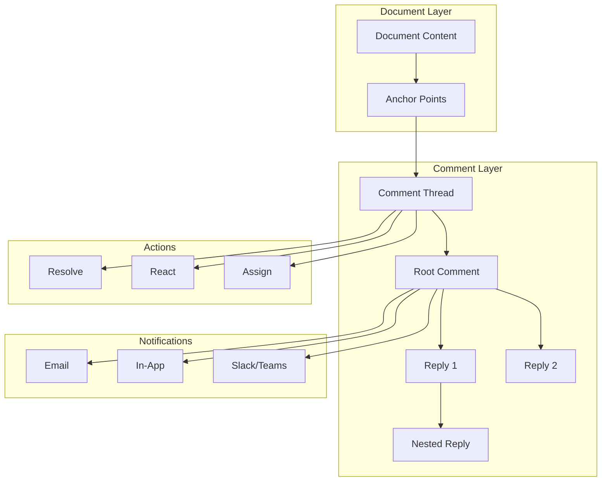

# Comments & Discussions

Materi's commenting system enables rich, contextual conversations directly within your documents. Add feedback, ask questions, start discussions, and resolve issues without leaving your workflow.

## Comment System Architecture



Comments are anchored to specific content in your document. As the document changes, comments intelligently reposition to stay attached to the relevant text, even when content is moved or edited.

## Creating Comments

<Steps>
  <Step title="Select Content">
    Highlight the text or element you want to comment on. For point comments, simply place your cursor at the desired location.
  </Step>
  <Step title="Open Comment Panel">
    Use any of these methods:
    - Click the **comment icon** in the floating toolbar
    - Press `Cmd/Ctrl + Shift + M`
    - Right-click and select **Add Comment**
  </Step>
  <Step title="Write Your Comment">
    Enter your comment in the text field. You can use:
    - **Markdown** for formatting (bold, italic, lists, code)
    - **@mentions** to notify specific users
    - **Emoji** reactions and expressions
    - **Links** to external resources or other documents
  </Step>
  <Step title="Submit Comment">
    Click **Comment** or press `Cmd/Ctrl + Enter` to post. The comment appears immediately for all collaborators.
  </Step>
</Steps>

## Comment Types

<Tabs>
  <Tab title="Inline Comments">
    **Anchored to specific text or elements**

    Inline comments attach to selected content and move with it as the document is edited. They're ideal for:
    - Specific feedback on wording or content
    - Questions about particular sections
    - Suggestions for changes
    - Corrections and edits

    Visual indicator: Yellow highlight on anchored text with comment icon in margin.
  </Tab>
  <Tab title="Point Comments">
    **Attached to a specific position**

    Point comments mark a location without highlighting text. Use them for:
    - Noting where content should be added
    - Marking structural issues
    - Indicating missing elements
    - General position-based notes

    Visual indicator: Comment pin icon at the exact position.
  </Tab>
  <Tab title="Document Comments">
    **General feedback not tied to specific content**

    Document-level comments appear in the comments panel but aren't anchored to content. Perfect for:
    - Overall document feedback
    - General questions
    - Meta-discussions about approach
    - Summary reviews

    Access via the **Comments** panel > **Document Comments** tab.
  </Tab>
  <Tab title="Suggestion Comments">
    **Proposed changes with accept/reject workflow**

    Suggestions are special comments that propose specific text changes:
    - Show before/after comparison
    - One-click accept or reject
    - Batch operations for multiple suggestions
    - Track who suggested and who resolved

    Create by selecting text and clicking **Suggest Edit** instead of **Comment**.
  </Tab>
</Tabs>

## Comment Features

### Formatting Options

Comments support rich formatting via Markdown:

| Format | Syntax | Result |
|--------|--------|--------|
| Bold | `**text**` | **text** |
| Italic | `*text*` | *text* |
| Code | `` `code` `` | `code` |
| Link | `[text](url)` | [text](url) |
| List | `- item` | - item |
| Numbered | `1. item` | 1. item |
| Quote | `> quote` | > quote |
| Strikethrough | `~~text~~` | ~~text~~ |

<Tip>
  Use triple backticks for code blocks with syntax highlighting:
  ~~~
  ```javascript
  const example = "highlighted code";
  ```
  ~~~
</Tip>

### Reactions

Add quick reactions to comments without creating a reply:

| Reaction | Shortcut | Common Use |
|----------|----------|------------|
| Thumbs up | `:+1:` | Agreement, approval |
| Thumbs down | `:-1:` | Disagreement |
| Heart | `:heart:` | Love it |
| Celebration | `:tada:` | Celebration |
| Confused | `:confused:` | Confusion, need clarity |
| Eyes | `:eyes:` | Looking into it |
| Check | `:check:` | Done, confirmed |

### Thread Management

<AccordionGroup>
  <Accordion title="Resolving Comments">
    Mark a comment thread as resolved when the feedback has been addressed:

    1. Click the **checkmark icon** on the comment
    2. Optionally add a resolution note
    3. Click **Resolve**

    Resolved comments are hidden by default but can be viewed via **Show Resolved** in the comments panel.

    **Who can resolve:**
    - Comment author
    - Document owner
    - Anyone with Admin permission
    - Assigned resolver (if set)
  </Accordion>
  <Accordion title="Reopening Comments">
    If an issue resurfaces, reopen a resolved comment:

    1. Show resolved comments in the panel
    2. Click on the resolved thread
    3. Click **Reopen**
    4. Add a note explaining why it's reopened

    Reopening notifies the original participants.
  </Accordion>
  <Accordion title="Deleting Comments">
    Remove comments you've created:

    1. Click the **three-dot menu** on your comment
    2. Select **Delete**
    3. Confirm deletion

    <Warning>
      Deleting a root comment removes the entire thread. This action cannot be undone.
    </Warning>

    **Delete permissions:**
    - Authors can delete their own comments
    - Document owners can delete any comment
    - Workspace admins can delete any comment
  </Accordion>
  <Accordion title="Editing Comments">
    Modify comments after posting:

    1. Click the **three-dot menu** on your comment
    2. Select **Edit**
    3. Make your changes
    4. Click **Save**

    Edited comments show "(edited)" with a timestamp. Edit history is available to document owners.
  </Accordion>
</AccordionGroup>

## Comment Assignment

Assign comments to specific team members for action:

<Steps>
  <Step title="Create or Open Comment">
    Either create a new comment or open an existing thread.
  </Step>
  <Step title="Add Assignee">
    Click the **Assign** button (person icon) in the comment toolbar.
  </Step>
  <Step title="Select Team Member">
    Search for and select the person responsible for addressing this comment.
  </Step>
  <Step title="Set Due Date (Optional)">
    Add a due date to create urgency and enable deadline tracking.
  </Step>
</Steps>

Assigned comments:
- Appear in the assignee's task list
- Send notification to the assignee
- Can be filtered in the comments panel
- Track assignment history

## Comments Panel

Access the full comments panel by clicking the **Comments** icon in the toolbar or pressing `Cmd/Ctrl + Shift + C`.

### Panel Views

| View | Description | Filter |
|------|-------------|--------|
| All | Every comment on the document | None |
| Open | Unresolved comments only | Status = Open |
| Resolved | Resolved comments only | Status = Resolved |
| My Comments | Comments you authored | Author = You |
| Assigned to Me | Comments assigned to you | Assignee = You |
| Mentions | Comments where you're mentioned | Contains @you |

### Sorting Options

- **Position**: Order by location in document (default)
- **Newest First**: Most recent comments first
- **Oldest First**: Oldest comments first
- **Most Replies**: Most active threads first
- **Unread First**: Prioritize comments you haven't seen

## Comment Notifications

<Tabs>
  <Tab title="In-App Notifications">
    Real-time notifications appear in:
    - Bell icon in navigation (badge count)
    - Document comment indicator
    - Activity feed

    Configure in **Settings > Notifications > In-App**.
  </Tab>
  <Tab title="Email Notifications">
    Receive email digests for:
    - New comments on your documents
    - Replies to your comments
    - @mentions
    - Comment assignments

    Options: Instant, Hourly digest, Daily digest, Off

    Configure in **Settings > Notifications > Email**.
  </Tab>
  <Tab title="Slack/Teams Integration">
    Forward comment notifications to channels:

    1. Go to **Settings > Integrations**
    2. Connect Slack or Microsoft Teams
    3. Configure which comment events to send
    4. Select target channel(s)

    Notifications include comment preview and direct link to document.
  </Tab>
</Tabs>

## Comment Permissions

| Permission Level | Can Comment | Can Resolve | Can Delete Others | Can Assign |
|-----------------|-------------|-------------|-------------------|------------|
| View | No | No | No | No |
| Comment | Yes | Own only | No | No |
| Edit | Yes | Yes | No | Yes |
| Admin | Yes | Yes | Yes | Yes |
| Owner | Yes | Yes | Yes | Yes |

<Note>
  Workspace administrators always have full comment permissions regardless of document-level settings.
</Note>

## Advanced Features

<AccordionGroup>
  <Accordion title="Comment Templates">
    Create reusable templates for common feedback:

    1. Go to **Settings > Comments > Templates**
    2. Click **Create Template**
    3. Name your template and write the content
    4. Save and use via the template picker in comments

    Example templates:
    - "Needs citation: Please add a source for this claim."
    - "Clarity: This section could be clearer. Consider..."
    - "Approved: LGTM! Ready for publication."
  </Accordion>
  <Accordion title="Comment Export">
    Export all comments for external review:

    1. Open the Comments panel
    2. Click **Export** (download icon)
    3. Choose format: CSV, JSON, or PDF
    4. Select which comments to include
    5. Download the export

    Exports include:
    - Comment text and formatting
    - Author and timestamp
    - Anchored text excerpt
    - Resolution status
    - Replies and reactions
  </Accordion>
  <Accordion title="Comment Analytics">
    Track commenting patterns and engagement:

    **Available metrics:**
    - Comments per document
    - Average time to resolution
    - Most active commenters
    - Comment sentiment analysis
    - Response time statistics

    Access via **Document Settings > Analytics > Comments**.
  </Accordion>
  <Accordion title="Private Comments">
    Create comments visible only to specific users:

    1. Start a new comment
    2. Click the **visibility icon** (eye)
    3. Select **Private**
    4. Choose who can see this comment
    5. Post the comment

    <Warning>
      Private comments are still visible to workspace administrators and included in compliance exports.
    </Warning>
  </Accordion>
</AccordionGroup>

## Keyboard Shortcuts

| Action | Mac | Windows/Linux |
|--------|-----|---------------|
| Add comment | `Cmd + Shift + M` | `Ctrl + Shift + M` |
| Open comments panel | `Cmd + Shift + C` | `Ctrl + Shift + C` |
| Next comment | `Cmd + ]` | `Ctrl + ]` |
| Previous comment | `Cmd + [` | `Ctrl + [` |
| Resolve comment | `Cmd + Enter` | `Ctrl + Enter` |
| Reply to comment | `R` (when focused) | `R` (when focused) |

## Troubleshooting

<AccordionGroup>
  <Accordion title="Comment not appearing for others">
    1. Check your internet connection and sync status
    2. Ensure you have Comment permission or higher
    3. Verify the comment was successfully submitted (not stuck as draft)
    4. Ask collaborators to refresh their view
    5. Check if you accidentally created a private comment
  </Accordion>
  <Accordion title="Cannot add comments">
    Verify:
    - You have Comment, Edit, or Admin permission
    - The document isn't in read-only mode
    - The document isn't archived
    - Comments aren't disabled for this document

    Contact document owner if you need elevated permissions.
  </Accordion>
  <Accordion title="Comment anchors are wrong">
    If comments appear attached to the wrong text:

    1. This can happen after major document restructuring
    2. Click the comment to see original anchored text
    3. Use **Reanchor** option to attach to correct content
    4. If persistent, report to support with document ID
  </Accordion>
  <Accordion title="Missing comment notifications">
    Check notification settings:

    1. **Settings > Notifications** - ensure comments are enabled
    2. Check email spam folder
    3. Verify email address is correct
    4. Check Slack/Teams integration status
    5. Ensure you're not muted on the document
  </Accordion>
</AccordionGroup>

## Related Documentation

- [Real-Time Collaboration Overview](/collaboration/overview)
- [@Mentions and Notifications](/collaboration/mentions)
- [Document Permissions](/documents/permissions)
- [Notification Settings](/settings/notifications)
- [Comments API Reference](/api-reference/comments)

<Info>
  Need help with comments? Contact support@materi.io or visit our [Community Forum](https://community.materi.io).
</Info>
