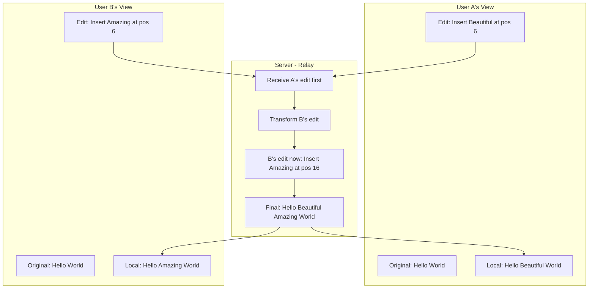
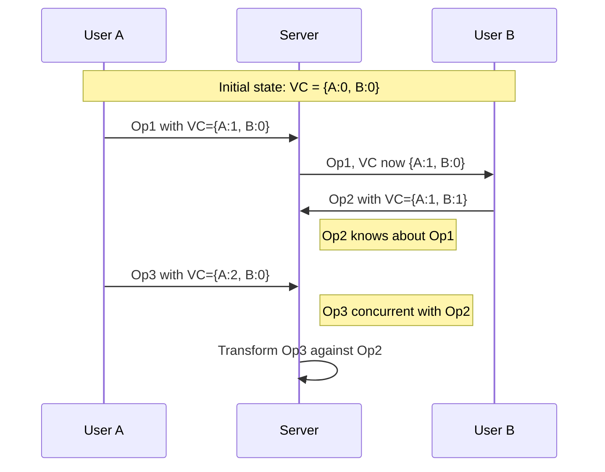

# Conflict Resolution

When multiple users edit the same document simultaneously, conflicts are inevitable. Materi uses Operational Transform (OT) technology to automatically resolve these conflicts in real-time, ensuring that everyone's changes are preserved and the document remains consistent across all users.

## Understanding Conflict Resolution



Operational Transform works by mathematically transforming operations so that when applied in different orders, they still produce the same final result. This means no matter what order edits arrive at the server, all users end up with an identical document.

## How Operational Transform Works

<Steps>
  <Step title="User Makes Edit">
    When you type, delete, or format text, Materi captures this as an **operation** with:
    - Operation type (insert, delete, retain)
    - Position in document
    - Content or length
    - Timestamp and vector clock
  </Step>
  <Step title="Local Application">
    The operation is immediately applied to your local document for instant feedback. You never wait for server confirmation to see your changes.
  </Step>
  <Step title="Server Processing">
    The operation is sent to Materi's Relay service, which:
    - Validates the operation
    - Transforms it against any concurrent operations
    - Assigns a global sequence number
    - Broadcasts to all other clients
  </Step>
  <Step title="Transformation">
    If another user's operation arrived first, your operation is **transformed** to account for their changes. The position and content are adjusted so your intent is preserved.
  </Step>
  <Step title="Convergence">
    All clients apply operations in the same transformed order, guaranteeing that everyone's document converges to the same state.
  </Step>
</Steps>

## Operation Types

<Tabs>
  <Tab title="Insert Operations">
    Adding new content to the document.

    ```json
    {
      "type": "insert",
      "position": 42,
      "content": "new text",
      "attributes": {
        "bold": true
      }
    }
    ```

    **Transformation rule**: If a concurrent insert happens before this position, increment position by the inserted length.
  </Tab>
  <Tab title="Delete Operations">
    Removing content from the document.

    ```json
    {
      "type": "delete",
      "position": 42,
      "length": 10
    }
    ```

    **Transformation rule**: If concurrent delete overlaps, adjust position and length to avoid double-deletion.
  </Tab>
  <Tab title="Retain Operations">
    Keeping content unchanged (used for positioning).

    ```json
    {
      "type": "retain",
      "length": 42,
      "attributes": {
        "italic": true
      }
    }
    ```

    **Transformation rule**: Adjust length based on concurrent inserts/deletes in the retained range.
  </Tab>
  <Tab title="Format Operations">
    Changing text attributes without modifying content.

    ```json
    {
      "type": "format",
      "position": 10,
      "length": 20,
      "attributes": {
        "bold": true,
        "color": "#FF0000"
      }
    }
    ```

    **Transformation rule**: Last-writer-wins for conflicting format changes on the same range.
  </Tab>
</Tabs>

## Conflict Scenarios

<AccordionGroup>
  <Accordion title="Same Position Insert">
    **Scenario**: Two users insert text at the exact same position.

    **Resolution**: Operations are ordered by timestamp. The earlier insert stays at the original position, the later insert is placed after it.

    ```
    Original: "Hello World"
    User A (10:00:00.100): Insert "A" at position 6
    User B (10:00:00.150): Insert "B" at position 6

    Result: "Hello AB World"
    ```

    <Note>
      If timestamps are identical (extremely rare), user ID is used as a tiebreaker for deterministic ordering.
    </Note>
  </Accordion>
  <Accordion title="Overlapping Delete">
    **Scenario**: Two users delete overlapping ranges of text.

    **Resolution**: The union of deleted ranges is removed. No content is deleted twice.

    ```
    Original: "Hello Beautiful World"
    User A: Delete positions 6-15 ("Beautiful")
    User B: Delete positions 10-21 ("tiful World")

    Result: "Hello " (union: positions 6-21 deleted)
    ```
  </Accordion>
  <Accordion title="Insert into Deleted Range">
    **Scenario**: One user inserts text while another deletes the surrounding content.

    **Resolution**: The insert is preserved. Content is deleted around it.

    ```
    Original: "Hello World"
    User A: Insert "Beautiful " at position 6
    User B: Delete positions 5-11 (" World")

    Result: "HelloBeautiful "
    ```

    This preserves User A's intent to add content while respecting User B's deletion.
  </Accordion>
  <Accordion title="Conflicting Formats">
    **Scenario**: Two users apply different formatting to the same text range.

    **Resolution**: Last-writer-wins for each attribute independently.

    ```
    Original: "Hello World" (no formatting)
    User A (10:00:00.100): Make bold
    User B (10:00:00.150): Make italic

    Result: "Hello World" (bold AND italic)
    ```

    For conflicting values of the same attribute:
    ```
    User A: Color = Red
    User B: Color = Blue (later timestamp)

    Result: Color = Blue (later wins)
    ```
  </Accordion>
</AccordionGroup>

## Vector Clocks

Materi uses vector clocks to establish causality between operations:



Vector clocks help determine:
- **Causal ordering**: Which operations happened "before" others
- **Concurrency detection**: Which operations are truly concurrent
- **Consistency verification**: Whether all clients have seen the same operations

## Consistency Guarantees

| Guarantee | Description |
|-----------|-------------|
| **Convergence** | All clients eventually reach the same document state |
| **Intention Preservation** | Each user's edit intent is preserved, even if position changes |
| **Causality** | If operation A caused operation B, A is applied before B everywhere |
| **Real-time** | Operations are applied within milliseconds of creation |

<Tip>
  Materi's OT implementation has been tested with up to 50 concurrent editors making continuous rapid edits. In our tests, documents always converge correctly within 100ms.
</Tip>

## Handling Edge Cases

<Tabs>
  <Tab title="Network Partitions">
    When a user loses connection:

    1. Local operations continue to be captured
    2. Operations are queued for sync
    3. On reconnection, queued operations are sent
    4. Server transforms against operations that happened during partition
    5. Full sync ensures consistency

    See [Offline Mode](/collaboration/offline-mode) for details.
  </Tab>
  <Tab title="High Latency">
    For users with slow connections:

    1. Local optimistic updates provide instant feedback
    2. Server acknowledgments may be delayed
    3. Occasional rollback if local prediction was wrong
    4. Visual indicator shows sync status

    Materi handles latencies up to 5 seconds gracefully.
  </Tab>
  <Tab title="Rapid Edits">
    When many edits happen in quick succession:

    1. Operations are batched client-side (50ms window)
    2. Batches are sent as compound operations
    3. Server processes batches atomically
    4. Reduces network overhead and transformation complexity
  </Tab>
  <Tab title="Large Documents">
    For documents over 1MB:

    1. Document is chunked into sections
    2. Only affected chunks are synced
    3. Transformations happen per-chunk
    4. Full document consistency maintained

    This allows efficient collaboration on documents up to 10MB.
  </Tab>
</Tabs>

## Undo/Redo with OT

Undo and redo work correctly even with concurrent edits:

<AccordionGroup>
  <Accordion title="How Undo Works">
    Each operation has an **inverse** operation:
    - Insert inverse is Delete at same position
    - Delete inverse is Insert the deleted content
    - Format inverse is Apply previous format values

    When you undo:
    1. Find the inverse of your last operation
    2. Transform the inverse against all operations that happened since
    3. Apply the transformed inverse

    This ensures your undo doesn't accidentally undo someone else's changes.
  </Accordion>
  <Accordion title="Undo Stack Management">
    Your undo stack tracks only **your** operations:

    | Stack | Contents |
    |-------|----------|
    | Your Undo Stack | Your operations only |
    | Server History | All operations from all users |

    Pressing undo reverts your most recent change, properly transformed to the current document state.
  </Accordion>
  <Accordion title="Redo After Others' Edits">
    If someone edits between your undo and redo:

    1. Your redo operation is transformed
    2. Your original content is re-inserted
    3. Position may differ from original
    4. Intent is preserved
  </Accordion>
</AccordionGroup>

## Conflict Visualization

Materi provides optional conflict visualization for transparency:

### Enabling Conflict Indicators

1. Open **Document Settings**
2. Go to **Collaboration** > **Advanced**
3. Enable **Show conflict resolutions**

When enabled:
- Brief highlight when text is transformed
- Tooltip shows original vs. transformed operation
- Activity log shows all conflict resolutions

### Conflict History

View past conflict resolutions:

1. Open **Document History**
2. Select **Conflict Log**
3. See timestamp, users involved, resolution applied

This is useful for understanding how the document evolved during intense collaborative sessions.

## Performance Characteristics

| Metric | Typical Value | Maximum Tested |
|--------|---------------|----------------|
| Transformation latency | < 5ms | 20ms |
| Server processing | < 10ms | 50ms |
| End-to-end sync | < 50ms | 200ms |
| Concurrent users | 10-20 typical | 50 max |
| Operations/second | 100/user | 500/user |
| Document size | < 1MB | 10MB |

<Note>
  Performance degrades gracefully under extreme load. Materi prioritizes consistency over speed - documents will always converge correctly, even if slightly delayed.
</Note>

## Troubleshooting

<AccordionGroup>
  <Accordion title="Content appearing in wrong location">
    This can happen when:

    1. **High latency**: Your view may temporarily differ from others
    2. **Rapid concurrent edits**: Transformations may briefly show unexpected positions
    3. **Browser cache**: Stale local state can cause display issues

    **Solutions**:
    - Wait a moment for sync to complete
    - Refresh the page to get latest state
    - Check network connection quality
    - If persistent, contact support with document ID
  </Accordion>
  <Accordion title="Edits disappearing">
    Your edits should never disappear. If they seem to:

    1. **Check sync status**: Is the indicator showing connected?
    2. **Check permissions**: Do you have edit access?
    3. **Check version history**: Your edit may have been transformed
    4. **Check undo history**: You may have accidentally undone

    If edits are truly lost, this is a bug. Please report with:
    - Document ID
    - Approximate time
    - What you were editing
  </Accordion>
  <Accordion title="Document out of sync between users">
    All users should see the same content. If not:

    1. Have all users refresh their browsers
    2. Check that everyone is online
    3. Compare version numbers (shown in document info)
    4. Contact support if versions differ after refresh

    This is extremely rare but indicates a consistency bug.
  </Accordion>
  <Accordion title="Undo reverting others' changes">
    By design, undo only affects your changes. If it's affecting others:

    1. You may be undoing a merge/paste that included their content
    2. The operation stack may be corrupted (refresh to fix)
    3. This could indicate a bug - please report

    Use version history to restore if needed.
  </Accordion>
</AccordionGroup>

## Technical Deep Dive

<Accordion title="OT Algorithm Details">
  Materi implements a variant of the Jupiter algorithm with extensions:

  **Core transformation functions**:
  ```
  transform(op1, op2) -> (op1', op2')

  Such that:
  apply(apply(doc, op1), op2') = apply(apply(doc, op2), op1')
  ```

  **Key properties**:
  - TP1: Transformation Property 1 (inclusion transformation)
  - TP2: Transformation Property 2 (convergence)

  **Extensions**:
  - Rich text attributes (formatting)
  - Structural operations (tables, lists)
  - Embedded objects (images, widgets)

  For implementation details, see our [technical blog post](https://blog.materi.io/operational-transform).
</Accordion>

## Related Documentation

- [Real-Time Collaboration Overview](/collaboration/overview)
- [User Presence & Awareness](/collaboration/presence)
- [Offline Mode](/collaboration/offline-mode)
- [Version History](/documents/version-history)
- [Relay Service Architecture](/architecture/relay)

<Info>
  Questions about conflict resolution? Contact support@materi.io or visit our [Community Forum](https://community.materi.io).
</Info>
