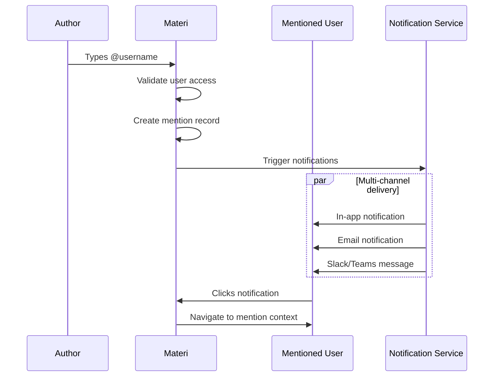

# @Mentions & Notifications

Materi's @mention system helps you bring the right people into conversations, create clear accountability, and ensure important updates reach the right team members instantly.

## How @Mentions Work



When you @mention someone, Materi creates a trackable reference that notifies the user across all their configured channels and provides them direct access to the relevant context.

## Creating @Mentions

<Steps>
  <Step title="Start Typing @">
    In any text field that supports mentions (comments, documents, descriptions), type the `@` symbol.
  </Step>
  <Step title="Search for User">
    A dropdown appears showing matching users. You can search by:
    - First name
    - Last name
    - Email address
    - Username
  </Step>
  <Step title="Select User">
    Click on the user or use arrow keys and Enter to select. The mention appears as a highlighted link.
  </Step>
  <Step title="Complete Your Message">
    Finish writing your message. The mentioned user will be notified when you submit.
  </Step>
</Steps>

<Tip>
  Type the first few letters after @ to quickly filter the user list. For example, `@sar` will show users like "Sarah", "Sarita", etc.
</Tip>

## Mention Types

<Tabs>
  <Tab title="User Mentions">
    **@username** - Mention a specific person

    The most common type. Notifies one individual and creates a direct link to them.

    ```
    @sarah.martinez Can you review this section?
    ```

    User mentions are available for:
    - Workspace members
    - Document collaborators
    - Guest users with access
  </Tab>
  <Tab title="Team Mentions">
    **@team-name** - Mention an entire team

    Notifies all members of a team. Useful for broader announcements or group requests.

    ```
    @engineering Please review the API documentation updates.
    ```

    <Note>
      Team mentions require the team to exist in your workspace settings. Contact your admin to create teams.
    </Note>
  </Tab>
  <Tab title="Role Mentions">
    **@role** - Mention by role

    Reach everyone with a specific role, regardless of team.

    ```
    @reviewers This document is ready for review.
    @admins Need help with permissions.
    ```

    Available roles depend on your workspace configuration.
  </Tab>
  <Tab title="Special Mentions">
    **@all** / **@here** - Broadcast mentions

    | Mention | Reaches | Use Case |
    |---------|---------|----------|
    | `@all` | Everyone with document access | Important announcements |
    | `@here` | Currently active users | Urgent, time-sensitive items |
    | `@owner` | Document owner | Ownership questions |
    | `@assigned` | All assignees | Task-related updates |

    <Warning>
      @all and @here should be used sparingly. Excessive use may result in notification fatigue and can be restricted by workspace admins.
    </Warning>
  </Tab>
</Tabs>

## Where You Can Use @Mentions

| Location | Supported | Notes |
|----------|-----------|-------|
| Comments | Yes | Full support with notifications |
| Document body | Yes | Creates inline mention link |
| Task descriptions | Yes | Notifies and shows in user's tasks |
| Chat messages | Yes | Real-time notification |
| Document titles | No | Not supported |
| File names | No | Not supported |
| Search queries | No | Use user: filter instead |

## Notification Delivery

### Notification Channels

<CardGroup cols={2}>
  <Card title="In-App" icon="bell">
    Instant notification in Materi's notification center. Badge count updates in real-time.
  </Card>
  <Card title="Email" icon="envelope">
    Email notification with mention context and direct link. Configurable digest options.
  </Card>
  <Card title="Mobile Push" icon="mobile">
    Push notification to Materi mobile apps (iOS/Android) with preview text.
  </Card>
  <Card title="Integrations" icon="plug">
    Slack, Microsoft Teams, and webhook notifications for workflow integration.
  </Card>
</CardGroup>

### Notification Content

Each mention notification includes:

```
+-----------------------------------------------------+
| New mention from Sarah Martinez                      |
+-----------------------------------------------------+
|                                                     |
| In: Q4 Planning Document                           |
| Section: Budget Overview                            |
|                                                     |
| "@james.kim Can you update the engineering          |
| budget projections for Q4? We need these           |
| before Friday's meeting."                          |
|                                                     |
| [View in Document]  [Reply]  [Mark as Read]        |
|                                                     |
| 2 minutes ago                                       |
+-----------------------------------------------------+
```

## Configuring Mention Notifications

<Steps>
  <Step title="Access Notification Settings">
    Click your avatar > **Settings** > **Notifications**.
  </Step>
  <Step title="Configure Mention Preferences">
    Set preferences for each mention type:

    | Setting | Options |
    |---------|---------|
    | Direct mentions (@you) | All channels, Email only, In-app only, None |
    | Team mentions | All channels, Email only, In-app only, None |
    | @all/@here | All channels, Email only, In-app only, None |
  </Step>
  <Step title="Set Delivery Timing">
    Choose when to receive notifications:

    | Option | Description |
    |--------|-------------|
    | Instant | Immediately when mentioned |
    | Batched | Grouped every 15 minutes |
    | Hourly digest | Summary every hour |
    | Daily digest | Once per day summary |
  </Step>
  <Step title="Configure Quiet Hours">
    Set times when you don't want to be disturbed:

    - Enable quiet hours
    - Set start and end time
    - Choose timezone
    - Select which days apply

    During quiet hours, mentions are queued and delivered when quiet hours end.
  </Step>
</Steps>

## Managing Mentions

### Viewing Your Mentions

Access all your mentions from the **Mentions** tab in the notification center:

| Filter | Shows |
|--------|-------|
| All | Every mention you've received |
| Unread | Mentions you haven't viewed |
| Documents | Mentions in document content |
| Comments | Mentions in comments |
| Tasks | Mentions in task descriptions |

### Mention Actions

<AccordionGroup>
  <Accordion title="Mark as Read">
    Click the mention or select **Mark as Read** from the menu. Read mentions move to the "Read" section but remain accessible.
  </Accordion>
  <Accordion title="Reply Directly">
    Click **Reply** to respond without navigating away. Your reply appears in context and notifies the original author.
  </Accordion>
  <Accordion title="Snooze">
    Temporarily hide a mention and get reminded later:
    - 1 hour
    - 4 hours
    - Tomorrow morning
    - Next week
    - Custom time
  </Accordion>
  <Accordion title="Mute Thread">
    Stop receiving notifications from a specific conversation:

    1. Click the mention
    2. Select **Mute Thread**
    3. Choose duration: Until resolved, 1 day, 1 week, Forever

    You can unmute anytime from the mention menu.
  </Accordion>
</AccordionGroup>

## Mention Best Practices

<Tabs>
  <Tab title="Do">
    **Effective @mention usage:**

    - Be specific about what you need
    - Use team mentions for group input
    - Mention the right level (individual vs. team)
    - Provide context in your message
    - Use @here for time-sensitive items
    - Follow up if no response after reasonable time

    ```
    Good: "@sarah.martinez Could you review the API
    section by Thursday? Specifically looking for
    feedback on the authentication flow."

    Good: "@engineering This affects your Q4 roadmap.
    Please review by EOD."
    ```
  </Tab>
  <Tab title="Don't">
    **Avoid these patterns:**

    - Mentioning people who don't have access
    - Using @all for non-urgent matters
    - Mentioning large groups unnecessarily
    - Multiple mentions for the same request
    - Mentions without context or action needed
    - Using mentions as read receipts

    ```
    Bad: "@all FYI we updated the logo"

    Bad: "@james @sarah @mike @lisa @tom
    @engineering @design thoughts?"

    Bad: "@sarah ?"
    ```
  </Tab>
</Tabs>

## Mention Permissions

| Mention Type | Who Can Use | Who Gets Notified |
|--------------|-------------|-------------------|
| @user | Anyone with comment access | Mentioned user (if has access) |
| @team | Team members and admins | All team members with access |
| @all | Edit permission or higher | All collaborators |
| @here | Edit permission or higher | Active collaborators only |
| @owner | Anyone with access | Document owner |

<Note>
  Users without access to a document won't be notified even if mentioned. The mention will appear but won't create a notification.
</Note>

## Mention Analytics

Track mention patterns for your workspace (Admin feature):

### Available Metrics

| Metric | Description |
|--------|-------------|
| Mentions sent | Total mentions created |
| Mentions received | Total mentions received per user |
| Response time | Average time to acknowledge mention |
| Response rate | Percentage of mentions that get responses |
| Top mentioners | Most active mention users |
| Top mentioned | Most frequently mentioned users |

### Accessing Analytics

1. Go to **Workspace Settings** > **Analytics**
2. Select **Collaboration** > **Mentions**
3. Choose date range
4. Export or view in dashboard

## Integration with Other Features

<AccordionGroup>
  <Accordion title="Tasks and Assignments">
    Mentions in task descriptions automatically:
    - Add mentioned users as watchers
    - Appear in their task-related notifications
    - Link to the task in notification

    Combine with assignment for clear ownership:
    ```
    @sarah.martinez Assigning this task to you.
    Please update the metrics by Friday.
    ```
  </Accordion>
  <Accordion title="Workflows and Automation">
    Use mentions in automated workflows:

    - **On document publish**: Mention reviewers
    - **On task overdue**: Mention assignee and manager
    - **On comment unresolved**: Mention document owner

    Configure in **Settings > Workflows > Notifications**.
  </Accordion>
  <Accordion title="Slack/Teams Integration">
    When integrated, mentions are delivered to connected platforms:

    ```
    Slack message:
    @sarah.martinez mentioned you in "Q4 Planning"

    "Can you review the budget section?"

    [Open in Materi] [Reply in Thread]
    ```

    Users can reply from Slack/Teams and it syncs back to Materi.
  </Accordion>
</AccordionGroup>

## Troubleshooting

<AccordionGroup>
  <Accordion title="User doesn't appear in mention dropdown">
    The user may not have access to the document or workspace:

    1. Verify the user is a workspace member
    2. Check if they have access to the specific document
    3. Ensure they haven't been deactivated
    4. Try searching by email instead of name
    5. Ask an admin to verify user status
  </Accordion>
  <Accordion title="Mentioned user didn't receive notification">
    Check these common causes:

    1. **Access**: User doesn't have access to the document
    2. **Settings**: User disabled mention notifications
    3. **Quiet hours**: User is in quiet hours
    4. **Muted**: User muted the thread or document
    5. **Spam**: Email went to spam folder
    6. **Integration**: Slack/Teams not connected

    The mentioned user can verify in **Settings > Notifications > Activity Log**.
  </Accordion>
  <Accordion title="Getting too many mention notifications">
    Reduce notification volume:

    1. Switch to digest mode (hourly/daily)
    2. Mute specific threads or documents
    3. Disable team/broadcast mentions
    4. Set up quiet hours
    5. Ask teammates to be more selective with mentions
    6. Contact admin about mention policies
  </Accordion>
  <Accordion title="Mention link is broken">
    If clicking a mention doesn't navigate correctly:

    1. The mentioned content may have been deleted
    2. Your access may have changed
    3. Try refreshing the page
    4. Clear browser cache
    5. The document may have been moved - check with owner
  </Accordion>
</AccordionGroup>

## API Reference

For programmatic mention handling:

```javascript
// Create a mention via API
const comment = await materi.comments.create({
  document_id: "doc_xyz789",
  content: "Please review this @[usr_abc123]",
  mentions: ["usr_abc123"]
});

// List mentions for current user
const mentions = await materi.mentions.list({
  unread: true,
  limit: 20
});

// Mark mention as read
await materi.mentions.markRead("mention_id");
```

See [Mentions API Reference](/api-reference/mentions) for full documentation.

## Related Documentation

- [Real-Time Collaboration Overview](/collaboration/overview)
- [Comments and Discussions](/collaboration/comments)
- [Notification Settings](/settings/notifications)
- [Teams and Groups](/workspaces/teams)
- [Integrations](/integrations/overview)

<Info>
  Questions about @mentions? Contact support@materi.io or visit our [Community Forum](https://community.materi.io).
</Info>
