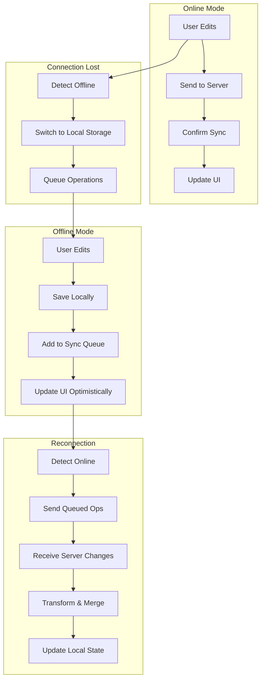
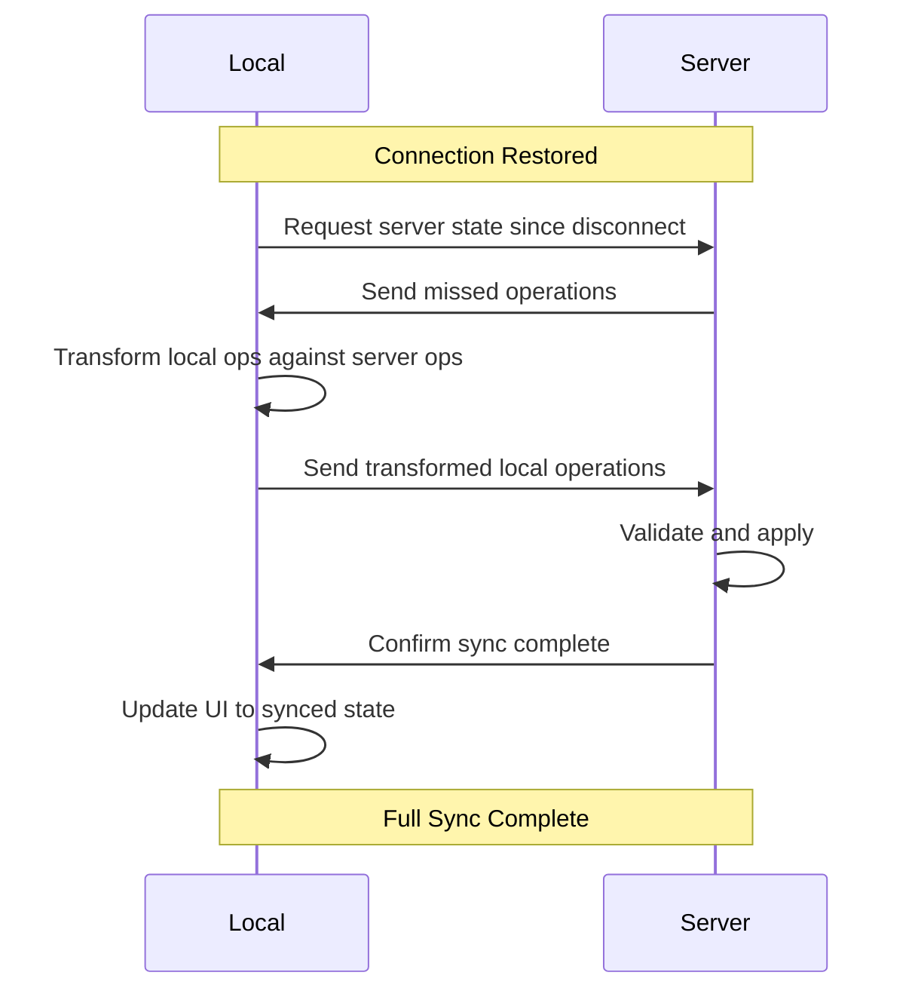

# Offline Mode

Materi's offline mode ensures you can keep working even when you lose internet connectivity. Your changes are saved locally and automatically synchronized when you come back online, with intelligent conflict resolution handling any concurrent edits.

## How Offline Mode Works



When connectivity is lost, Materi automatically switches to offline mode. All your edits are preserved in local storage and synchronized when you reconnect, ensuring you never lose work.

## Offline Capabilities

<CardGroup cols={2}>
  <Card title="Document Editing" icon="file-pen">
    Full text editing including formatting, comments, and structural changes.
  </Card>
  <Card title="Local Comments" icon="comment">
    Add comments to documents. They sync when you reconnect.
  </Card>
  <Card title="View Cached Content" icon="eye">
    Access any document you've recently viewed from cache.
  </Card>
  <Card title="Create Documents" icon="file-plus">
    Create new documents offline. They're uploaded on reconnect.
  </Card>
</CardGroup>

### Feature Availability

| Feature | Offline Support | Notes |
|---------|-----------------|-------|
| Text editing | Full | All formatting preserved |
| Comments | Full | Sync on reconnect |
| @Mentions | Partial | Cached users only |
| Image insert | Limited | From device only |
| Real-time cursors | No | Requires connection |
| Share/permissions | No | Requires connection |
| Search | Partial | Cached documents only |
| Version history | View only | Cached versions |
| File attachments | No | Requires upload |

## Enabling Offline Mode

<Steps>
  <Step title="Enable Offline Access">
    Go to **Settings** > **Offline** > Enable **Offline Mode**.

    <Note>
      Offline mode requires additional storage on your device. Ensure you have at least 500MB available.
    </Note>
  </Step>
  <Step title="Select Documents for Offline Access">
    Choose which documents to make available offline:

    - **Automatic**: Recently viewed documents (last 50)
    - **Manual**: Specific documents you select
    - **Workspace**: Entire workspaces for offline access

    Go to any document and click the **offline icon** (cloud with arrow) to manually add it.
  </Step>
  <Step title="Initial Sync">
    Materi downloads selected documents and their dependencies:

    - Document content
    - Embedded images (up to 10MB each)
    - Comment threads
    - User information for @mentions
    - Recent version history

    Progress is shown in **Settings** > **Offline** > **Sync Status**.
  </Step>
  <Step title="Verify Offline Access">
    Test by enabling airplane mode on your device, then opening Materi. You should see:

    - Offline indicator in header
    - Access to cached documents
    - Ability to edit and add comments
  </Step>
</Steps>

## Offline Indicators

Materi provides clear visual feedback about connectivity and sync status:

| Indicator | Location | Meaning |
|-----------|----------|---------|
| Cloud with checkmark | Header | Online and synced |
| Cloud with arrows | Header | Syncing changes |
| Cloud with slash | Header | Offline mode active |
| Orange dot on doc | Document list | Has unsynced changes |
| "Offline" badge | Document header | Currently offline |
| Sync progress bar | Settings/Header | Upload/download progress |

## Working Offline

<Tabs>
  <Tab title="Editing Documents">
    When offline, you can:

    - Edit text and formatting
    - Add, edit, delete paragraphs
    - Insert images from your device
    - Create tables and lists
    - Apply styles and themes

    All changes are timestamped and queued for sync.

    **Limitations**:
    - Cannot insert images from URLs
    - Cannot use AI features
    - Cannot access uncached templates
  </Tab>
  <Tab title="Adding Comments">
    Comment capabilities offline:

    - Add new comments
    - Reply to existing threads
    - Resolve comments
    - Add reactions

    **@mentions offline**:
    - Only cached users appear in dropdown
    - Mentions are validated on sync
    - Invalid mentions are converted to plain text
  </Tab>
  <Tab title="Creating Documents">
    Create new documents offline:

    1. Click **New Document** as usual
    2. Choose from cached templates (or blank)
    3. Edit as normal
    4. Document syncs on reconnect

    **Notes**:
    - New documents get temporary local IDs
    - Permanent IDs assigned on sync
    - Cannot share until synced
  </Tab>
  <Tab title="Viewing Content">
    While offline, you can view:

    - All cached documents
    - Embedded images (if cached)
    - Comments and threads
    - Cached version history

    **Cannot view**:
    - Uncached documents
    - External links/embeds
    - Real-time collaborator presence
    - Latest server changes
  </Tab>
</Tabs>

## Synchronization Process

When you come back online, Materi synchronizes your changes:



### Sync Priority

Operations sync in this order:

1. **Document content changes** - Your edits
2. **Comments and mentions** - Feedback and discussions
3. **New documents** - Documents created offline
4. **Cached document updates** - Refresh cached content
5. **Media uploads** - Images added offline

<Tip>
  Large files sync in the background. You can continue working while sync completes.
</Tip>

## Conflict Resolution During Sync

When your offline changes conflict with changes made by others:

<AccordionGroup>
  <Accordion title="Text Conflicts">
    **Scenario**: You edited text offline while someone else edited the same section.

    **Resolution**: Operational Transform merges both changes. Both edits are preserved, positioned based on timestamps.

    **Example**:
    ```
    Original: "Hello World"
    Your offline edit: "Hello Beautiful World"
    Their online edit: "Hello Amazing World"

    After sync: "Hello Beautiful Amazing World"
    ```

    See [Conflict Resolution](/collaboration/conflict-resolution) for details.
  </Accordion>
  <Accordion title="Deleted Content">
    **Scenario**: You edited content that was deleted by someone else.

    **Resolution**: Your edits are preserved as new content at the nearest valid position.

    **Notification**: You'll see a notification explaining that your edit location changed.
  </Accordion>
  <Accordion title="Permission Changes">
    **Scenario**: Your edit permission was revoked while you were offline.

    **Resolution**:
    - Your changes are saved to a personal copy
    - You're notified of the permission change
    - You can request access to submit your changes
  </Accordion>
  <Accordion title="Document Deleted">
    **Scenario**: The document was deleted while you were editing offline.

    **Resolution**:
    - Your changes are preserved in a recovery document
    - You're notified and given options to restore or export
    - Admins can help recover if needed
  </Accordion>
</AccordionGroup>

## Managing Offline Storage

### Storage Usage

View and manage offline storage in **Settings** > **Offline** > **Storage**:

| Category | Typical Size | Adjustable |
|----------|-------------|------------|
| Document content | 1-50 MB | Via document selection |
| Embedded images | 10-200 MB | Via image cache settings |
| Comments/metadata | 1-10 MB | Follows documents |
| Sync queue | 0-50 MB | Clears on sync |
| Version history | 5-50 MB | Via history depth setting |

### Clearing Offline Data

<Steps>
  <Step title="Open Storage Settings">
    Go to **Settings** > **Offline** > **Storage**.
  </Step>
  <Step title="Choose What to Clear">
    Options:
    - **Sync queue only**: Removes pending changes (use with caution)
    - **Cached documents**: Removes offline copies (will re-download)
    - **All offline data**: Complete reset
  </Step>
  <Step title="Confirm and Clear">
    Review the impact and confirm. Clearing may take a moment for large caches.
  </Step>
</Steps>

<Warning>
  Clearing the sync queue will permanently lose any unsynced changes. Only do this if you're certain the changes are not needed.
</Warning>

### Storage Limits

| Plan | Offline Storage Limit |
|------|----------------------|
| Starter | 500 MB |
| Professional | 2 GB |
| Enterprise | 10 GB |

When approaching limits:
1. You'll receive a warning notification
2. Oldest cached documents are automatically removed
3. Manually-pinned documents are preserved
4. Sync queue is never automatically cleared

## Offline Settings

Configure offline behavior in **Settings** > **Offline**:

<AccordionGroup>
  <Accordion title="Automatic Caching">
    | Setting | Options | Default |
    |---------|---------|---------|
    | Auto-cache viewed docs | Yes/No | Yes |
    | Cache retention | 7/14/30/90 days | 30 days |
    | Max cached documents | 25/50/100/unlimited | 50 |
    | Cache images | None/Small/All | Small (<5MB) |
  </Accordion>
  <Accordion title="Sync Behavior">
    | Setting | Options | Default |
    |---------|---------|---------|
    | Auto-sync on connect | Yes/No | Yes |
    | Sync on mobile data | Yes/No/Ask | Ask |
    | Background sync | Yes/No | Yes |
    | Sync notifications | All/Errors/None | Errors |
  </Accordion>
  <Accordion title="Conflict Handling">
    | Setting | Options | Default |
    |---------|---------|---------|
    | Auto-resolve conflicts | Yes/No | Yes |
    | Notify on conflicts | Yes/No | Yes |
    | Keep conflict copies | Yes/No | No |
  </Accordion>
</AccordionGroup>

## Mobile Offline Mode

Materi mobile apps have enhanced offline capabilities:

### iOS

- Documents cached to app storage
- Background sync when on WiFi
- Offline badge in document list
- Push notification when sync complete

### Android

- Uses Android Work Manager for reliable sync
- Respects battery optimization settings
- Can sync on specific WiFi networks only
- Offline documents in separate tab

### Mobile-Specific Settings

| Setting | Description |
|---------|-------------|
| WiFi-only sync | Only sync when on WiFi |
| Auto-cache favorites | Always cache starred documents |
| Low storage mode | Cache text only, skip images |
| Sync on charge | Defer large syncs until charging |

## Troubleshooting

<AccordionGroup>
  <Accordion title="Changes not syncing after reconnect">
    1. **Check sync status**: Look for the sync indicator in the header
    2. **Manual sync**: Go to Settings > Offline > Sync Now
    3. **Check for errors**: Settings > Offline > Sync Log
    4. **Clear and retry**: If stuck, clear sync queue for specific document

    Common causes:
    - Large files still uploading
    - Network is unstable
    - Authentication expired (log in again)
  </Accordion>
  <Accordion title="Document not available offline">
    Ensure the document is cached:

    1. Open the document while online
    2. Click the **offline icon** in the toolbar
    3. Wait for "Available offline" confirmation
    4. Check Settings > Offline > Cached Documents

    If still unavailable:
    - Storage limit may be reached
    - Document may be too large
    - Permission may restrict offline access
  </Accordion>
  <Accordion title="Unexpected content after sync">
    If content seems wrong after syncing:

    1. **Don't make more edits** - preserve current state
    2. Check **Version History** for what changed
    3. Look at **Sync Log** for conflict resolutions
    4. Use **Restore Version** if needed
    5. Contact support if data seems corrupted
  </Accordion>
  <Accordion title="Offline mode not activating">
    If Materi doesn't switch to offline mode:

    1. Verify offline mode is enabled in Settings
    2. Check browser supports Service Workers
    3. Clear browser cache and reload
    4. Ensure sufficient storage space
    5. Try a different browser

    **Browser requirements**:
    - Chrome 70+
    - Firefox 65+
    - Safari 14+
    - Edge 79+
  </Accordion>
  <Accordion title="Sync taking too long">
    Large syncs can be slow:

    1. Check progress in Settings > Offline > Sync Status
    2. Ensure stable network connection
    3. Large files sync in background - you can continue working
    4. Cancel specific items if needed

    **Speed up sync**:
    - Connect to faster network
    - Reduce cached document count
    - Disable image caching temporarily
  </Accordion>
</AccordionGroup>

## Security Considerations

<Note>
  Offline data is stored on your device. Take appropriate precautions.
</Note>

### Data Protection

| Measure | Description |
|---------|-------------|
| Encryption at rest | Offline data is encrypted using device encryption |
| Secure deletion | Cleared data is securely wiped |
| No sensitive cache | Passwords and tokens not cached offline |
| Auto-lock | Offline access requires re-authentication after timeout |

### Enterprise Controls

Workspace admins can configure offline policies:

- Disable offline mode workspace-wide
- Limit which documents can be cached
- Set maximum offline duration
- Require device encryption
- Remote wipe offline data

## Best Practices

<Tabs>
  <Tab title="Before Going Offline">
    Prepare for offline work:

    1. Ensure important documents are cached
    2. Check sync is complete (green cloud icon)
    3. Download any needed attachments
    4. Note any pending @mentions to follow up on
    5. Verify storage space is adequate
  </Tab>
  <Tab title="While Offline">
    Work effectively offline:

    1. Make focused edits - large structural changes increase conflict risk
    2. Add comments to mark areas needing online verification
    3. Avoid deleting large sections others might be editing
    4. Check the sync queue occasionally
    5. Don't clear app data or cache
  </Tab>
  <Tab title="After Reconnecting">
    Ensure clean sync:

    1. Wait for sync to complete
    2. Review any conflict notifications
    3. Check version history for unexpected changes
    4. Verify @mentions were delivered
    5. Clear unnecessary cached data
  </Tab>
</Tabs>

## Related Documentation

- [Real-Time Collaboration Overview](/collaboration/overview)
- [Conflict Resolution](/collaboration/conflict-resolution)
- [Version History](/documents/version-history)
- [Mobile Apps](/mobile/overview)
- [Security & Privacy](/security/overview)

<Info>
  Questions about offline mode? Contact support@materi.io or visit our [Community Forum](https://community.materi.io).
</Info>
