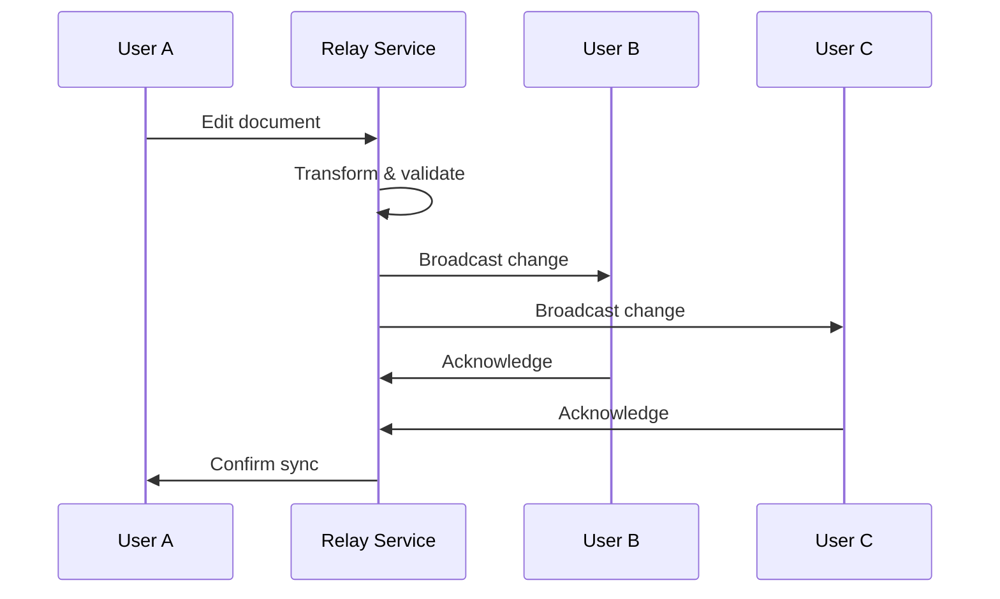

# Real-Time Collaboration Overview

Materi's collaboration suite enables teams to work together on documents simultaneously, with changes appearing instantly across all connected users. Built on enterprise-grade technology, our collaboration features scale from small teams to organizations with thousands of users.

## How Real-Time Collaboration Works



When you edit a document, your changes are instantly transmitted to Materi's Relay service, which handles conflict resolution and broadcasts updates to all connected collaborators. This entire process typically completes in under 50 milliseconds.

## Core Collaboration Features

<CardGroup cols={2}>
  <Card title="Live Presence" icon="eye" href="/collaboration/presence">
    See who's viewing and editing documents in real-time with cursor tracking and selection highlights.
  </Card>
  <Card title="Comments & Discussions" icon="comments" href="/collaboration/comments">
    Add contextual comments, start threaded discussions, and resolve feedback directly in documents.
  </Card>
  <Card title="@Mentions" icon="at" href="/collaboration/mentions">
    Notify team members with @mentions that trigger instant notifications and create trackable action items.
  </Card>
  <Card title="Conflict Resolution" icon="code-merge" href="/collaboration/conflict-resolution">
    Advanced Operational Transform technology ensures simultaneous edits never cause data loss.
  </Card>
  <Card title="Offline Mode" icon="wifi-slash" href="/collaboration/offline-mode">
    Continue working without internet connectivity with automatic sync when you reconnect.
  </Card>
  <Card title="Version History" icon="clock-rotate-left" href="/documents/version-history">
    Track every change with comprehensive version history and the ability to restore previous versions.
  </Card>
</CardGroup>

## Getting Started with Collaboration

<Steps>
  <Step title="Open a Document">
    Navigate to any document in your workspace. The collaboration toolbar appears at the top of the editor.
  </Step>
  <Step title="Share with Collaborators">
    Click the **Share** button to invite team members. You can set permissions for each collaborator:
    - **View**: Read-only access
    - **Comment**: Can view and add comments
    - **Edit**: Full editing capabilities
    - **Admin**: Can manage sharing settings
  </Step>
  <Step title="Start Collaborating">
    Once collaborators join, you'll see their avatars in the presence bar. Colored cursors indicate where each person is working.
  </Step>
  <Step title="Communicate in Context">
    Use comments and @mentions to discuss changes without leaving the document. Conversations stay attached to relevant content.
  </Step>
</Steps>

## Collaboration Modes

Materi supports different collaboration modes to fit your workflow:

<Tabs>
  <Tab title="Simultaneous Editing">
    **Best for**: Brainstorming, real-time co-authoring, live workshops

    Multiple users edit the same document simultaneously. All changes are instantly visible to everyone. Operational Transform ensures edits never conflict.

    ```
    Latency: < 50ms typical
    Max concurrent editors: 50 per document
    Supported content: All document types
    ```
  </Tab>
  <Tab title="Suggested Changes">
    **Best for**: Review workflows, editorial processes, approval chains

    Collaborators propose changes that appear as suggestions. Document owners review and accept or reject each suggestion.

    ```
    Suggestion types: Insert, delete, format, replace
    Batch actions: Accept all, reject all by author
    Notifications: On new suggestions, on resolution
    ```
  </Tab>
  <Tab title="Locked Sections">
    **Best for**: Structured documents, compliance content, templates

    Lock specific sections to prevent edits while allowing collaboration on other parts. Ideal for documents with approved boilerplate.

    ```
    Lock granularity: Section, paragraph, or element
    Lock types: Temporary (timed), permanent (admin only)
    Visual indicator: Lock icon with owner name
    ```
  </Tab>
</Tabs>

## Collaboration Indicators

Understanding the visual indicators helps you work effectively with your team:

| Indicator | Meaning |
|-----------|---------|
| Colored cursor | Another user's current position |
| Highlighted text | Another user's selection |
| Avatar with green dot | User is actively editing |
| Avatar with yellow dot | User is viewing (idle > 2 min) |
| Avatar grayed out | User is in offline mode |
| Typing indicator | User is currently typing |
| Save indicator | Document sync status |

## Performance and Limits

<AccordionGroup>
  <Accordion title="Concurrent User Limits">
    | Plan | Max Concurrent Editors | Max Viewers |
    |------|----------------------|-------------|
    | Starter | 5 | 25 |
    | Professional | 25 | 100 |
    | Enterprise | 50 | Unlimited |

    These limits are per document. Your workspace can have unlimited documents with active collaboration.
  </Accordion>
  <Accordion title="Network Requirements">
    For optimal collaboration performance:

    - **Minimum bandwidth**: 256 Kbps per user
    - **Recommended bandwidth**: 1 Mbps per user
    - **Latency tolerance**: < 200ms for real-time feel
    - **Protocols**: WebSocket (primary), HTTP long-polling (fallback)

    <Note>
      Materi automatically adjusts sync frequency based on network conditions to maintain responsiveness.
    </Note>
  </Accordion>
  <Accordion title="Document Size Limits">
    | Content Type | Max Size | Notes |
    |--------------|----------|-------|
    | Text content | 10 MB | ~5 million characters |
    | Embedded images | 50 MB total | Per document |
    | Attachments | 100 MB each | Stored separately |
    | Total document | 500 MB | Including all assets |
  </Accordion>
</AccordionGroup>

## Security and Privacy

<Warning>
  All collaboration data is encrypted in transit using TLS 1.3 and at rest using AES-256. Your content is never stored unencrypted.
</Warning>

### Access Control

Collaboration respects your workspace's permission model:

- **Workspace admins** can see all collaboration activity
- **Document owners** control who can access their documents
- **Collaborators** only see content they have permission to view
- **Guests** can be granted limited, time-bound access

### Audit Trail

Every collaboration action is logged for compliance:

```json
{
  "event": "document.edited",
  "user_id": "usr_abc123",
  "document_id": "doc_xyz789",
  "timestamp": "2024-01-15T10:30:00Z",
  "changes": {
    "type": "text_insert",
    "position": 1547,
    "content_length": 42
  }
}
```

<Tip>
  Enterprise customers can export audit logs to their SIEM system via our API or built-in integrations.
</Tip>

## Troubleshooting

<AccordionGroup>
  <Accordion title="Changes not appearing for other users">
    1. Check the sync indicator in the toolbar - it should show a green checkmark
    2. Verify your internet connection is stable
    3. Ask collaborators to refresh their browser
    4. If the issue persists, try disconnecting and reconnecting to the document

    <Note>
      Changes are always saved locally first. Even if sync is delayed, your work is never lost.
    </Note>
  </Accordion>
  <Accordion title="Can't see collaborator cursors">
    Cursor visibility requires:
    - Both users have **Edit** permission or higher
    - Presence sharing is enabled in document settings
    - Neither user has enabled "Ghost mode" in their preferences

    Check **Document Settings > Collaboration > Show cursors** to verify.
  </Accordion>
  <Accordion title="Performance is slow with many collaborators">
    For documents with 10+ simultaneous editors:

    1. Enable **Performance Mode** in document settings
    2. Reduce cursor update frequency: Settings > Collaboration > Update frequency
    3. Consider splitting large documents into linked sections
    4. Ensure all collaborators have stable internet connections
  </Accordion>
  <Accordion title="Collaboration features not available">
    Ensure:
    - Your plan includes collaboration features
    - You have Edit permission on the document
    - The document isn't in read-only or archived state
    - Your browser supports WebSocket connections
  </Accordion>
</AccordionGroup>

## Browser Support

| Browser | Minimum Version | Notes |
|---------|----------------|-------|
| Chrome | 90+ | Recommended |
| Firefox | 88+ | Full support |
| Safari | 14+ | Full support |
| Edge | 90+ | Full support |
| Opera | 76+ | Full support |

<Warning>
  Internet Explorer is not supported. Users on IE will see a read-only view of documents.
</Warning>

## Related Documentation

- [User Presence and Awareness](/collaboration/presence)
- [Comments and Discussions](/collaboration/comments)
- [@Mentions and Notifications](/collaboration/mentions)
- [Conflict Resolution](/collaboration/conflict-resolution)
- [Offline Mode](/collaboration/offline-mode)
- [Document Permissions](/documents/permissions)
- [Workspace Settings](/workspaces/settings)

## API Reference

For programmatic access to collaboration features, see:

- [Collaboration API](/api-reference/collaboration)
- [Presence WebSocket API](/api-reference/presence-websocket)
- [Comments API](/api-reference/comments)

<Info>
  Need help with collaboration? Contact support@materi.io or visit our [Community Forum](https://community.materi.io).
</Info>
