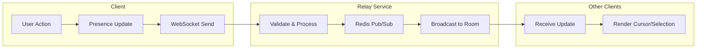

# User Presence & Awareness

Materi's presence system shows you exactly who's viewing and editing documents in real-time. See collaborator cursors, track selections, and understand team activity at a glance.

## How Presence Works



When you interact with a document, your presence information is transmitted via WebSocket to Materi's Relay service. The service broadcasts your position and status to all other users viewing the same document, typically within 30-50 milliseconds.

## Presence Features

<CardGroup cols={2}>
  <Card title="Live Cursors" icon="i-cursor">
    See exactly where each collaborator is positioned in the document with color-coded cursors showing their name.
  </Card>
  <Card title="Selection Highlighting" icon="highlighter">
    When someone selects text, their selection appears highlighted in their assigned color.
  </Card>
  <Card title="Activity Status" icon="signal">
    Know whether collaborators are actively editing, idle, or away based on their recent activity.
  </Card>
  <Card title="Viewport Awareness" icon="expand">
    See which section of the document each collaborator is currently viewing.
  </Card>
</CardGroup>

## Understanding Presence Indicators

### Avatar Bar

The avatar bar at the top of the document shows all connected users:

| Avatar State | Meaning | Visual Indicator |
|-------------|---------|------------------|
| Full color + green ring | Actively editing | Solid avatar with green border |
| Full color + yellow ring | Viewing (idle 2-5 min) | Solid avatar with yellow border |
| Dimmed + gray ring | Away (idle 5+ min) | Faded avatar with gray border |
| Outline only | Offline mode | Avatar outline, no fill |
| "+N" badge | Additional users | Number showing overflow count |

<Tip>
  Click on any avatar to jump to that user's current position in the document.
</Tip>

### Cursor Labels

Each collaborator's cursor displays their name and is assigned a unique color:

```
+---------------------------------------------+
| The quick brown fox jumps over the |        |
|                                    ^        |
|                              +---------+    |
|                              | Sarah M |    |
|                              +---------+    |
| lazy dog. The five boxing wizards jump      |
|          ^                                  |
|    +----------+                             |
|    | James K  |                             |
|    +----------+                             |
+---------------------------------------------+
```

### Selection Highlighting

When a collaborator selects text, it appears with a colored background:

<Tabs>
  <Tab title="Single User Selection">
    When one user selects text:
    - Selection appears in their assigned color (semi-transparent)
    - Small label shows the user's name at selection start
    - Your own selections appear in blue (default)
  </Tab>
  <Tab title="Overlapping Selections">
    When multiple users select overlapping text:
    - Colors blend where selections overlap
    - Each user's name label remains visible
    - Your selection takes visual priority
  </Tab>
  <Tab title="Large Selections">
    For selections spanning multiple paragraphs:
    - Entire selection range is highlighted
    - Scroll position indicator shows selection extent
    - Click the user's avatar to jump to selection start
  </Tab>
</Tabs>

## Configuring Presence

<Steps>
  <Step title="Access Presence Settings">
    Click your avatar in the top-right corner and select **Settings > Collaboration**.
  </Step>
  <Step title="Configure Display Options">
    Adjust how you appear to others:

    | Setting | Options | Default |
    |---------|---------|---------|
    | Display name | Full name, First name only, Initials | Full name |
    | Cursor color | Auto-assigned, Choose color | Auto |
    | Show my cursor | Always, Only when editing, Never | Always |
    | Activity status | Share, Hide | Share |
  </Step>
  <Step title="Configure Viewing Preferences">
    Control what you see from others:

    | Setting | Description | Default |
    |---------|-------------|---------|
    | Show other cursors | Display collaborator cursors | On |
    | Show selections | Highlight others' selections | On |
    | Cursor labels | Show names on cursors | On |
    | Viewport indicators | Show where others are scrolled | On |
  </Step>
  <Step title="Save Changes">
    Click **Save** to apply your preferences. Changes take effect immediately.
  </Step>
</Steps>

## Ghost Mode

Ghost mode allows you to view documents without appearing in the presence list:

<Warning>
  Ghost mode is only available to workspace administrators and document owners. Regular collaborators cannot hide their presence for transparency and security reasons.
</Warning>

To enable ghost mode:

1. Open the document you want to view
2. Click the **visibility icon** in the collaboration toolbar
3. Select **Enable Ghost Mode**
4. Your avatar will be hidden from other users

<Note>
  Even in ghost mode, your access is logged in the audit trail for compliance purposes.
</Note>

## Presence Data Structure

For developers integrating with the presence API, here's the data structure:

```json
{
  "user_id": "usr_abc123",
  "document_id": "doc_xyz789",
  "presence": {
    "status": "active",
    "cursor": {
      "position": 1547,
      "selection_start": null,
      "selection_end": null
    },
    "viewport": {
      "top_line": 45,
      "bottom_line": 78
    },
    "metadata": {
      "display_name": "Sarah Martinez",
      "avatar_url": "https://...",
      "color": "#E91E63"
    },
    "last_active": "2024-01-15T10:30:00Z"
  }
}
```

## Presence Performance

### Update Frequency

| Activity Type | Update Frequency | Latency Target |
|--------------|------------------|----------------|
| Cursor movement | 50ms throttle | < 100ms |
| Text selection | 100ms throttle | < 150ms |
| Viewport scroll | 200ms throttle | < 250ms |
| Status change | Immediate | < 100ms |

<Tip>
  Materi automatically adjusts update frequency based on network conditions and number of collaborators to maintain optimal performance.
</Tip>

### Bandwidth Usage

Presence data is highly optimized:

| Scenario | Bandwidth per User |
|----------|-------------------|
| Idle viewing | ~0.5 KB/min |
| Active editing | ~5 KB/min |
| Frequent selections | ~10 KB/min |
| High activity (10+ users) | ~2 KB/min per viewer |

## Advanced Features

<AccordionGroup>
  <Accordion title="Follow Mode">
    Lock your view to follow another user's position:

    1. Click on a collaborator's avatar
    2. Select **Follow [Name]**
    3. Your viewport will automatically track their position
    4. Click **Stop Following** or scroll manually to exit

    Follow mode is useful for:
    - Training sessions where learners follow an instructor
    - Code reviews where reviewers follow the author
    - Presentations where viewers follow the presenter
  </Accordion>
  <Accordion title="Presence History">
    View past presence data for a document:

    1. Open **Document Settings > Activity**
    2. Select **Presence History**
    3. Choose a time range
    4. View a timeline of who was present and when

    <Note>
      Presence history is retained for 30 days on Professional plans and 90 days on Enterprise plans.
    </Note>
  </Accordion>
  <Accordion title="Presence Webhooks">
    Enterprise customers can receive presence events via webhooks:

    ```json
    {
      "event": "presence.joined",
      "document_id": "doc_xyz789",
      "user_id": "usr_abc123",
      "timestamp": "2024-01-15T10:30:00Z"
    }
    ```

    Available events:
    - `presence.joined` - User opened document
    - `presence.left` - User closed document
    - `presence.idle` - User became idle
    - `presence.active` - User became active
  </Accordion>
  <Accordion title="Custom Presence Metadata">
    Add custom data to your presence for integrations:

    ```javascript
    materi.presence.setMetadata({
      role: "reviewer",
      department: "Engineering",
      custom_status: "Reviewing section 3"
    });
    ```

    Custom metadata is visible to other users and can be used for filtering or display purposes.
  </Accordion>
</AccordionGroup>

## Presence in Different Contexts

<Tabs>
  <Tab title="Documents">
    Full presence features including:
    - Live cursors with names
    - Selection highlighting
    - Viewport awareness
    - Activity status
  </Tab>
  <Tab title="Spreadsheets">
    Cell-based presence showing:
    - Currently selected cell(s)
    - Active editing cell
    - Cell range selections
    - Sheet navigation
  </Tab>
  <Tab title="Whiteboards">
    Canvas-based presence with:
    - Cursor position on canvas
    - Selection boxes around elements
    - Zoom level awareness
    - Tool currently in use
  </Tab>
  <Tab title="Code Editors">
    Enhanced presence for code:
    - Line-level cursor position
    - Multi-cursor support
    - Active file indicator
    - Terminal activity status
  </Tab>
</Tabs>

## Troubleshooting

<AccordionGroup>
  <Accordion title="Can't see other users' cursors">
    **Check your settings:**
    1. Go to Settings > Collaboration
    2. Ensure "Show other cursors" is enabled
    3. Refresh the document

    **Check document permissions:**
    - View-only users may not see edit cursors
    - Ghost mode users won't appear

    **Check browser:**
    - Ensure JavaScript is enabled
    - Try disabling browser extensions
    - Clear cache and reload
  </Accordion>
  <Accordion title="My cursor isn't showing for others">
    **Verify your settings:**
    1. Check that "Show my cursor" isn't set to "Never"
    2. Ensure you have Edit permission on the document
    3. Check if you accidentally enabled Ghost mode

    **Connection issues:**
    1. Check the sync indicator in the toolbar
    2. Verify WebSocket connection in browser dev tools
    3. Try refreshing the page
  </Accordion>
  <Accordion title="Presence updates are delayed">
    **Network issues:**
    - Check your internet connection stability
    - Try switching from WiFi to ethernet
    - Disable VPN temporarily to test

    **Performance mode:**
    - Documents with many users may throttle updates
    - Check if Performance Mode is enabled
    - Consider reducing cursor update frequency in settings
  </Accordion>
  <Accordion title="Avatar shows wrong status">
    Status updates have a small delay to prevent flickering:
    - Active to Idle: 2 minute delay
    - Idle to Away: 3 minute additional delay
    - Any activity immediately returns to Active

    If status seems stuck, the user may have lost connection. Their status will update to "Disconnected" after 30 seconds of no heartbeat.
  </Accordion>
</AccordionGroup>

## Privacy Considerations

<Info>
  Materi is committed to user privacy while enabling effective collaboration.
</Info>

### What's Shared

- Display name (configurable)
- Cursor position in document
- Text selections
- Current viewport area
- Activity status (active/idle/away)

### What's Never Shared

- Exact keystrokes or typing patterns
- Mouse movements outside selections
- Browser or device information
- Location data
- Content of drafts before saving

### Data Retention

| Data Type | Retention Period |
|-----------|-----------------|
| Real-time presence | Until disconnect |
| Presence history | 30-90 days (by plan) |
| Audit logs | 1-7 years (by plan) |

## Related Documentation

- [Real-Time Collaboration Overview](/collaboration/overview)
- [Comments and Discussions](/collaboration/comments)
- [@Mentions and Notifications](/collaboration/mentions)
- [Privacy Settings](/settings/privacy)
- [Presence API Reference](/api-reference/presence)

<Info>
  Have questions about presence features? Visit our [Community Forum](https://community.materi.io) or contact support@materi.io.
</Info>
