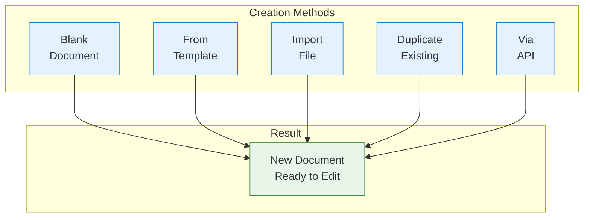

Documents are the core unit of content in Materi. This guide covers all the ways to create documents and get started with your content.

## Document Creation Methods



## Quick Create

The fastest way to create a new document:

| Method | Shortcut | Description |
|--------|----------|-------------|
| Keyboard | `Cmd/Ctrl + N` | Creates blank document |
| Menu | **+ New** > **Document** | Opens creation dialog |
| Context Menu | Right-click folder > **New Document** | Creates in specific folder |
| Slash Command | Type `/new` in any document | Quick create inline |

## Creating a Blank Document

<Steps>
  <Step title="Open Creation Dialog">
    Click the **+ New** button in the sidebar header or press `Cmd/Ctrl + N`.
  </Step>

  <Step title="Select Document Type">
    Choose **Document** from the options:
    - **Document** - Standard rich-text document
    - **Table** - Spreadsheet-style document
    - **Folder** - Organize documents
  </Step>

  <Step title="Add Title">
    1. Click "Untitled Document" at the top
    2. Enter a descriptive title
    3. Press Enter or click away

    <Tip>
    Good titles are specific and searchable: "Q1 Marketing Plan 2024" instead of "Plan"
    </Tip>
  </Step>

  <Step title="Start Writing">
    Click in the document body and start typing. Your content auto-saves as you work.
  </Step>
</Steps>

## Creating from Templates

Use templates for consistent document structure:

<Tabs>
  <Tab title="Browse Templates">
    1. Click **+ New** > **From Template**
    2. Browse categories:
       - **Meeting Notes** - Agendas, minutes, retrospectives
       - **Project Management** - PRDs, briefs, roadmaps
       - **Engineering** - RFCs, technical specs, runbooks
       - **Sales** - Proposals, call notes, battlecards
       - **HR** - Interview guides, onboarding, reviews
    3. Preview template before selecting
    4. Click **Use Template**
  </Tab>

  <Tab title="Search Templates">
    1. Click **+ New** > **From Template**
    2. Type in the search bar
    3. Results filter by name, description, and tags
    4. Select and create
  </Tab>

  <Tab title="Recent Templates">
    Your recently used templates appear at the top for quick access.
  </Tab>
</Tabs>

### Template Variables

Some templates include variables that get replaced on creation:

| Variable | Replaced With | Example |
|----------|---------------|---------|
| `{{date}}` | Current date | January 15, 2024 |
| `{{author}}` | Your name | Sarah Chen |
| `{{workspace}}` | Workspace name | Acme Corp |
| `{{title}}` | Document title | Q1 Planning |

## Importing Documents

Bring existing content into Materi:

### Supported Import Formats

| Format | Extension | Features Preserved |
|--------|-----------|-------------------|
| Microsoft Word | `.docx` | Headings, lists, tables, images |
| Markdown | `.md` | Full syntax support |
| Plain Text | `.txt` | Basic text content |
| HTML | `.html` | Structure, formatting, images |
| PDF | `.pdf` | Text extraction (OCR if needed) |
| Google Docs | Direct | Full formatting, comments |
| Notion | Export | Pages, databases, subpages |
| Confluence | Export | Pages, macros (best-effort) |

### Import Process

<Steps>
  <Step title="Start Import">
    Click **+ New** > **Import** or drag files directly into the sidebar.
  </Step>

  <Step title="Select Source">
    Choose your import method:

    <Tabs>
      <Tab title="File Upload">
        1. Click **Upload Files**
        2. Select one or multiple files
        3. Or drag and drop into the upload area
      </Tab>

      <Tab title="Google Drive">
        1. Click **Connect Google Drive**
        2. Authorize access
        3. Browse and select documents
        4. Choose import options
      </Tab>

      <Tab title="Notion">
        1. Export from Notion as Markdown
        2. Upload the exported folder
        3. Folder structure is preserved
      </Tab>

      <Tab title="Confluence">
        1. Export space as HTML
        2. Upload the export
        3. Review converted pages
      </Tab>
    </Tabs>
  </Step>

  <Step title="Configure Import">
    Set import options:
    - **Destination folder**: Where to place imported docs
    - **Preserve folder structure**: Keep original hierarchy
    - **Import images**: Include embedded images
    - **Create single doc**: Combine multiple files
  </Step>

  <Step title="Review and Complete">
    1. Preview the converted content
    2. Make any needed adjustments
    3. Click **Import**
    4. Documents appear in your workspace
  </Step>
</Steps>

### Import Tips

<AccordionGroup>
  <Accordion title="Large imports">
    For imports over 100 documents:
    - Use background import (continues while you work)
    - Import in batches for better control
    - Check import status in the activity panel
  </Accordion>

  <Accordion title="Preserving formatting">
    Best results for formatting:
    - Export as `.docx` from Word/Google Docs
    - Use Markdown for technical content
    - Complex formatting may need manual adjustment
  </Accordion>

  <Accordion title="Image handling">
    Images in imports:
    - Embedded images are uploaded to your workspace
    - External URLs are converted to embeds
    - Large images may be compressed
  </Accordion>
</AccordionGroup>

## Duplicating Documents

Create a copy of an existing document:

1. Right-click the document in the sidebar
2. Select **Duplicate**
3. The copy opens with "(Copy)" appended to the title
4. Rename as needed

**What's duplicated:**
- All content and formatting
- Embedded images and files
- Document settings

**What's NOT duplicated:**
- Comments and discussions
- Version history
- Sharing settings
- Analytics data

<Tip>
Use **Duplicate** to create variations of a template or start a new version of a document.
</Tip>

## Creating via API

Programmatically create documents using the API:

```typescript
import { Materi } from '@materi/sdk';

const materi = new Materi({ apiKey: 'your-api-key' });

// Create a blank document
const doc = await materi.documents.create({
  title: 'API Created Document',
  workspaceId: 'ws_abc123',
  folderId: 'folder_xyz789', // Optional
  content: {
    type: 'doc',
    content: [
      {
        type: 'heading',
        attrs: { level: 1 },
        content: [{ type: 'text', text: 'Hello World' }]
      },
      {
        type: 'paragraph',
        content: [{ type: 'text', text: 'Created via API' }]
      }
    ]
  }
});

console.log(`Created document: ${doc.id}`);
```

See [REST API - Create Document](/api/rest/documents/create-document) for complete reference.

## Document Settings

Configure document-level settings after creation:

| Setting | Description | Location |
|---------|-------------|----------|
| **Title** | Document name | Click title to edit |
| **Icon** | Visual identifier | Click icon area |
| **Cover Image** | Header image | **...** > **Add Cover** |
| **Full Width** | Expand content area | **...** > **Full Width** |
| **Font** | Document font | **...** > **Font** |
| **Small Text** | Compact text size | **...** > **Small Text** |

## Document Limits

Understand document size limits:

| Metric | Free | Team | Enterprise |
|--------|------|------|------------|
| Max document size | 5 MB | 25 MB | 100 MB |
| Max images per doc | 50 | 200 | Unlimited |
| Max nested depth | 5 levels | 10 levels | 20 levels |
| Max collaborators | 5 | 50 | Unlimited |

<Warning>
Documents approaching size limits may experience slower loading. Consider splitting large documents.
</Warning>

## Best Practices

<CardGroup cols={2}>
  <Card title="Descriptive Titles" icon="heading">
    Use specific, searchable titles that describe the content
  </Card>
  <Card title="Consistent Structure" icon="list">
    Use templates for recurring document types
  </Card>
  <Card title="Right Location" icon="folder">
    Create documents in the appropriate folder from the start
  </Card>
  <Card title="Add Context" icon="info">
    Include a brief summary at the top of each document
  </Card>
</CardGroup>

## Troubleshooting

<AccordionGroup>
  <Accordion title="Import failed">
    1. Check file size is within limits
    2. Verify file format is supported
    3. Try exporting to a different format
    4. Contact support with the error message
  </Accordion>

  <Accordion title="Formatting lost on import">
    1. Use `.docx` format for best results
    2. Some complex formatting may not transfer
    3. Manual cleanup may be needed
    4. Consider simplifying source formatting
  </Accordion>

  <Accordion title="Can't create documents">
    1. Verify you have Editor role or higher
    2. Check workspace storage limits
    3. Ensure you're in the correct workspace
  </Accordion>
</AccordionGroup>

## Next Steps

<CardGroup cols={2}>
  <Card title="Editing Documents" icon="pencil" href="/customer/documents/editing-documents">
    Learn to format and enhance your content
  </Card>
  <Card title="Document Templates" icon="copy" href="/customer/documents/templates">
    Create and manage reusable templates
  </Card>
  <Card title="Organizing Documents" icon="folder-tree" href="/customer/documents/organizing-documents">
    Structure your workspace effectively
  </Card>
  <Card title="Sharing Documents" icon="share" href="/customer/documents/sharing-documents">
    Collaborate with your team
  </Card>
</CardGroup>
