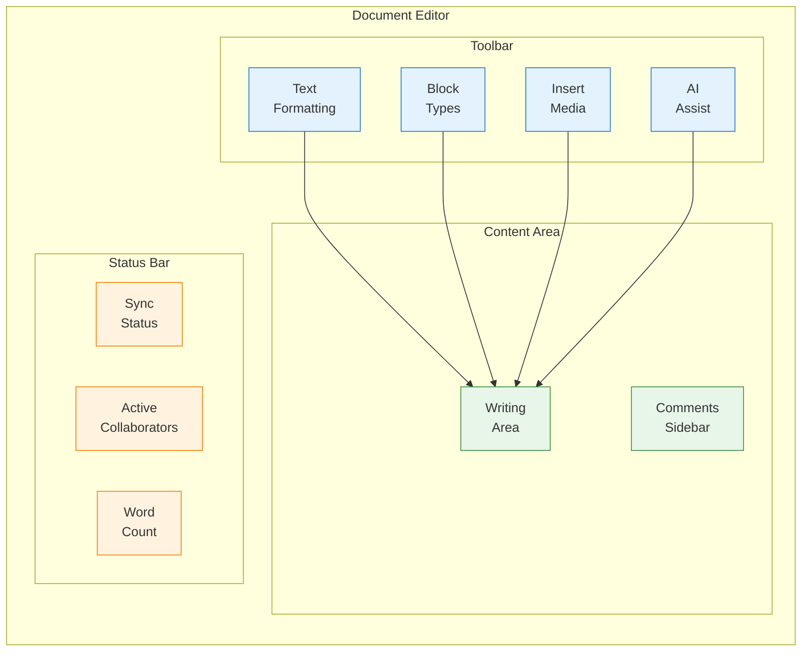
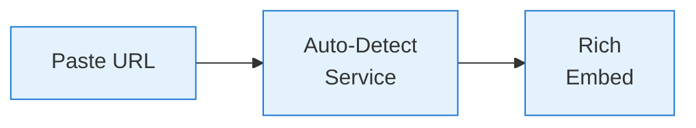
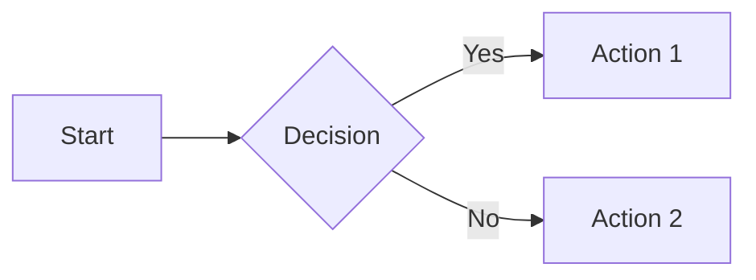
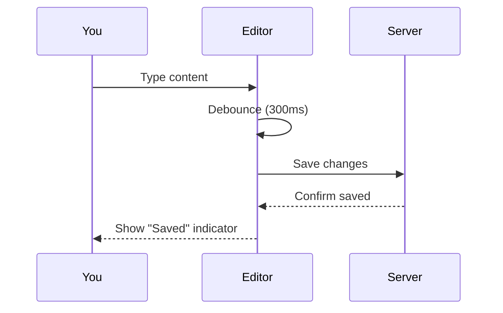

Materi's editor is designed for speed and flexibility. This guide covers everything from basic formatting to advanced content blocks.

## Editor Overview



## Text Formatting

### Inline Formatting

| Format | Keyboard | Markdown | Toolbar |
|--------|----------|----------|---------|
| **Bold** | `Cmd/Ctrl + B` | `**text**` | **B** button |
| *Italic* | `Cmd/Ctrl + I` | `*text*` | *I* button |
| ~~Strikethrough~~ | `Cmd/Ctrl + Shift + S` | `~~text~~` | ~~S~~ button |
| `Code` | `Cmd/Ctrl + E` | `` `code` `` | `<>` button |
| <u>Underline</u> | `Cmd/Ctrl + U` | N/A | **U** button |
| [Link](/) | `Cmd/Ctrl + K` | `[text](url)` | Link button |
| Highlight | `Cmd/Ctrl + Shift + H` | `==text==` | Highlighter |

### Text Colors

1. Select text
2. Click the **A** color button in the toolbar
3. Choose from:
   - **Text colors**: Red, orange, yellow, green, blue, purple
   - **Background colors**: Matching highlight colors

<Tip>
Use colors sparingly for emphasis. Overuse reduces their impact.
</Tip>

## Headings

Structure your document with headings:

| Level | Shortcut | Markdown | Use For |
|-------|----------|----------|---------|
| H1 | `Cmd/Ctrl + Alt + 1` | `# ` | Document title (one per doc) |
| H2 | `Cmd/Ctrl + Alt + 2` | `## ` | Main sections |
| H3 | `Cmd/Ctrl + Alt + 3` | `### ` | Subsections |
| H4-H6 | `Cmd/Ctrl + Alt + 4-6` | `####` etc. | Nested content |

<Note>
Headings automatically generate a table of contents in the document outline panel.
</Note>

## Block Types

### Paragraphs and Text

Standard paragraph is the default block. Press `Enter` to create new paragraphs.

**Keyboard tips:**
- `Shift + Enter` - Line break within paragraph
- `Backspace` at start - Convert to paragraph
- `/` anywhere - Open block menu

### Lists

<Tabs>
  <Tab title="Bullet Lists">
    Create with `-`, `*`, or `+` followed by space:

    - First item
    - Second item
      - Nested item
      - Another nested
    - Third item

    **Shortcuts:**
    - `Tab` - Indent item
    - `Shift + Tab` - Outdent item
    - `Enter` on empty - Exit list
  </Tab>

  <Tab title="Numbered Lists">
    Create with `1.` followed by space:

    1. First step
    2. Second step
       1. Sub-step A
       2. Sub-step B
    3. Third step

    Numbers auto-increment as you add items.
  </Tab>

  <Tab title="Task Lists">
    Create with `- [ ]` or `- [x]`:

    - [ ] Incomplete task
    - [x] Completed task
    - [ ] Another task

    Click the checkbox to toggle completion.
  </Tab>
</Tabs>

### Blockquotes

Create quotes with `>` followed by space:

> This is a blockquote. Use it for citations,
> callouts, or emphasized content.
>
> Multiple paragraphs work too.

### Dividers

Insert horizontal rules:
- Type `---` and press Enter
- Or use `/divider` slash command

---

### Code Blocks

Create code blocks with triple backticks:

~~~
```javascript
function greet(name) {
  console.log(`Hello, ${name}!`);
}
```
~~~

**Supported languages:** 100+ including JavaScript, TypeScript, Python, Go, Rust, SQL, Java, C++, Ruby, PHP, Swift, Kotlin, and more.

**Features:**
- Syntax highlighting
- Line numbers (toggleable)
- Copy button
- Language label
- Code wrapping option

### Tables

Create tables with the `/table` command or markdown:

```markdown
| Header 1 | Header 2 | Header 3 |
|----------|----------|----------|
| Cell 1   | Cell 2   | Cell 3   |
| Cell 4   | Cell 5   | Cell 6   |
```

**Table editing:**
- Click cells to edit
- Tab to move between cells
- Drag column borders to resize
- Right-click for row/column options
- Hover row/column for add/delete buttons

### Callouts

Use callouts to highlight important information:

<Info>
**Info callout** - General information or tips
</Info>

<Warning>
**Warning callout** - Cautions or potential issues
</Warning>

<Tip>
**Tip callout** - Helpful suggestions
</Tip>

<Note>
**Note callout** - Additional context
</Note>

Create with `/callout` or `:::info`, `:::warning`, etc.

### Toggle Blocks

Create collapsible sections:

<Accordion title="Click to expand">
  This content is hidden by default. Use toggles for:
  - FAQ answers
  - Optional details
  - Long code examples
  - Spoiler content
</Accordion>

Create with `/toggle` or `>` at line start.

## Embeds and Media

### Images

Insert images multiple ways:

1. **Paste** - Paste from clipboard (`Cmd/Ctrl + V`)
2. **Drag** - Drag file into document
3. **Upload** - `/image` then upload
4. **URL** - `/image` then paste URL
5. **Unsplash** - `/image` then search Unsplash

**Image options:**
- Resize by dragging corners
- Add caption below
- Add alt text for accessibility
- Align left, center, or right

### File Attachments

Embed any file type:

1. Use `/file` or drag file into document
2. Supported preview formats:
   - PDF (inline viewer)
   - Office docs (preview)
   - Images (display)
   - Audio (player)
   - Video (player)
3. Other files show download link

### External Embeds

Paste URLs directly or use `/embed`:

| Service | Example |
|---------|---------|
| YouTube | Video player |
| Vimeo | Video player |
| Loom | Recording player |
| Figma | Design preview |
| Miro | Board preview |
| GitHub Gist | Code viewer |
| CodePen | Live preview |
| Twitter/X | Tweet embed |
| Google Maps | Map view |



### Mermaid Diagrams

Create diagrams with code:

~~~

~~~

Supported diagram types:
- Flowcharts
- Sequence diagrams
- Class diagrams
- State diagrams
- Entity relationship
- Gantt charts
- Pie charts
- Journey maps

## Slash Commands

Type `/` to open the command menu:

| Command | Description |
|---------|-------------|
| `/heading` | Insert heading (1-6) |
| `/bullet` | Bullet list |
| `/numbered` | Numbered list |
| `/task` | Task/checkbox list |
| `/quote` | Blockquote |
| `/code` | Code block |
| `/table` | Insert table |
| `/divider` | Horizontal rule |
| `/image` | Insert image |
| `/file` | Attach file |
| `/embed` | Embed URL |
| `/callout` | Callout box |
| `/toggle` | Collapsible section |
| `/toc` | Table of contents |
| `/date` | Insert current date |
| `/mention` | Mention user |
| `/link` | Link to document |
| `/ai` | AI assistant |

<Tip>
Type `/` followed by any text to filter commands. For example, `/ta` shows table and task options.
</Tip>

## AI Writing Assistant

Access AI features with `/ai` or `Cmd/Ctrl + J`:

<CardGroup cols={2}>
  <Card title="Generate" icon="wand-magic-sparkles">
    Draft paragraphs, expand bullets, create outlines
  </Card>
  <Card title="Improve" icon="pencil">
    Fix grammar, improve clarity, adjust tone
  </Card>
  <Card title="Summarize" icon="compress">
    Create summaries of selected text
  </Card>
  <Card title="Translate" icon="language">
    Translate to different languages
  </Card>
  <Card title="Explain" icon="question">
    Simplify complex content
  </Card>
  <Card title="Continue" icon="arrow-right">
    Continue writing from cursor
  </Card>
</CardGroup>

See [AI Features](/customer/ai/overview) for complete guide.

## Selection and Navigation

### Text Selection

| Action | Shortcut |
|--------|----------|
| Select word | Double-click |
| Select paragraph | Triple-click |
| Select all | `Cmd/Ctrl + A` |
| Extend selection | `Shift + Arrow` |
| Select to line start | `Cmd/Ctrl + Shift + Left` |
| Select to line end | `Cmd/Ctrl + Shift + Right` |

### Block Selection

| Action | Shortcut |
|--------|----------|
| Select block | Click block handle (⋮⋮) |
| Select multiple | `Shift + Click` blocks |
| Move block | Drag block handle |
| Duplicate block | `Cmd/Ctrl + D` |
| Delete block | `Backspace` when selected |

### Navigation

| Action | Shortcut |
|--------|----------|
| Go to line start | `Cmd/Ctrl + Left` |
| Go to line end | `Cmd/Ctrl + Right` |
| Go to doc start | `Cmd/Ctrl + Home` |
| Go to doc end | `Cmd/Ctrl + End` |
| Search in document | `Cmd/Ctrl + F` |
| Go to heading | `Cmd/Ctrl + G` |

## Keyboard Shortcuts Reference

<AccordionGroup>
  <Accordion title="Essential Shortcuts">
    | Action | Mac | Windows |
    |--------|-----|---------|
    | Bold | `Cmd + B` | `Ctrl + B` |
    | Italic | `Cmd + I` | `Ctrl + I` |
    | Underline | `Cmd + U` | `Ctrl + U` |
    | Link | `Cmd + K` | `Ctrl + K` |
    | Undo | `Cmd + Z` | `Ctrl + Z` |
    | Redo | `Cmd + Shift + Z` | `Ctrl + Y` |
    | Save | Auto-save | Auto-save |
  </Accordion>

  <Accordion title="Block Shortcuts">
    | Action | Mac | Windows |
    |--------|-----|---------|
    | Heading 1 | `Cmd + Opt + 1` | `Ctrl + Alt + 1` |
    | Heading 2 | `Cmd + Opt + 2` | `Ctrl + Alt + 2` |
    | Heading 3 | `Cmd + Opt + 3` | `Ctrl + Alt + 3` |
    | Bullet list | `Cmd + Shift + 8` | `Ctrl + Shift + 8` |
    | Numbered list | `Cmd + Shift + 7` | `Ctrl + Shift + 7` |
    | Task list | `Cmd + Shift + 9` | `Ctrl + Shift + 9` |
    | Code block | `Cmd + Opt + C` | `Ctrl + Alt + C` |
    | Quote | `Cmd + Shift + .` | `Ctrl + Shift + .` |
  </Accordion>

  <Accordion title="Navigation Shortcuts">
    | Action | Mac | Windows |
    |--------|-----|---------|
    | Search | `Cmd + F` | `Ctrl + F` |
    | Find & Replace | `Cmd + H` | `Ctrl + H` |
    | Command palette | `Cmd + /` | `Ctrl + /` |
    | Document outline | `Cmd + Shift + O` | `Ctrl + Shift + O` |
  </Accordion>
</AccordionGroup>

## Auto-Save and Sync

Your document auto-saves continuously:



**Sync indicators:**
- **Saved** - All changes saved
- **Saving...** - Save in progress
- **Offline** - Working locally, will sync when online

<Note>
Changes are preserved locally even if you lose connection. They'll sync automatically when you reconnect.
</Note>

## Troubleshooting

<AccordionGroup>
  <Accordion title="Formatting not applying">
    1. Ensure text is selected before applying format
    2. Try clearing formatting: `Cmd/Ctrl + \`
    3. Check if the block type supports that format
    4. Refresh the page if issues persist
  </Accordion>

  <Accordion title="Images not uploading">
    1. Check file size (max 10MB per image)
    2. Verify format is supported (PNG, JPG, GIF, WebP)
    3. Check workspace storage limits
    4. Try a different browser
  </Accordion>

  <Accordion title="Embeds not loading">
    1. Verify the URL is correct
    2. Check if the service is supported
    3. Some embeds require public access
    4. Try refreshing the page
  </Accordion>

  <Accordion title="Changes not saving">
    1. Check your internet connection
    2. Look for error messages in status bar
    3. Try refreshing (changes are preserved locally)
    4. Contact support if issues persist
  </Accordion>
</AccordionGroup>

## Next Steps

<CardGroup cols={2}>
  <Card title="Organizing Documents" icon="folder-tree" href="/customer/documents/organizing-documents">
    Structure your content effectively
  </Card>
  <Card title="Sharing Documents" icon="share" href="/customer/documents/sharing-documents">
    Collaborate with your team
  </Card>
  <Card title="AI Features" icon="wand-magic-sparkles" href="/customer/ai/overview">
    Enhance your writing with AI
  </Card>
  <Card title="Keyboard Shortcuts" icon="keyboard" href="/customer/support/keyboard-shortcuts">
    Complete shortcut reference
  </Card>
</CardGroup>
