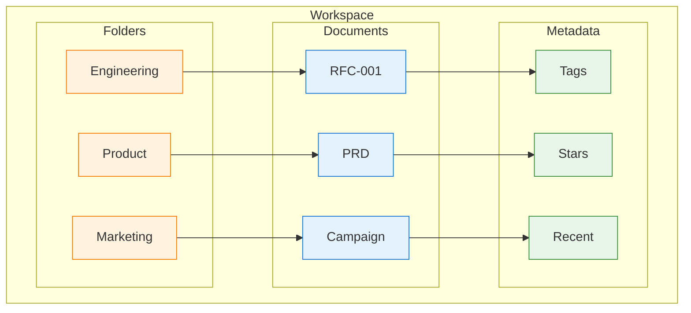
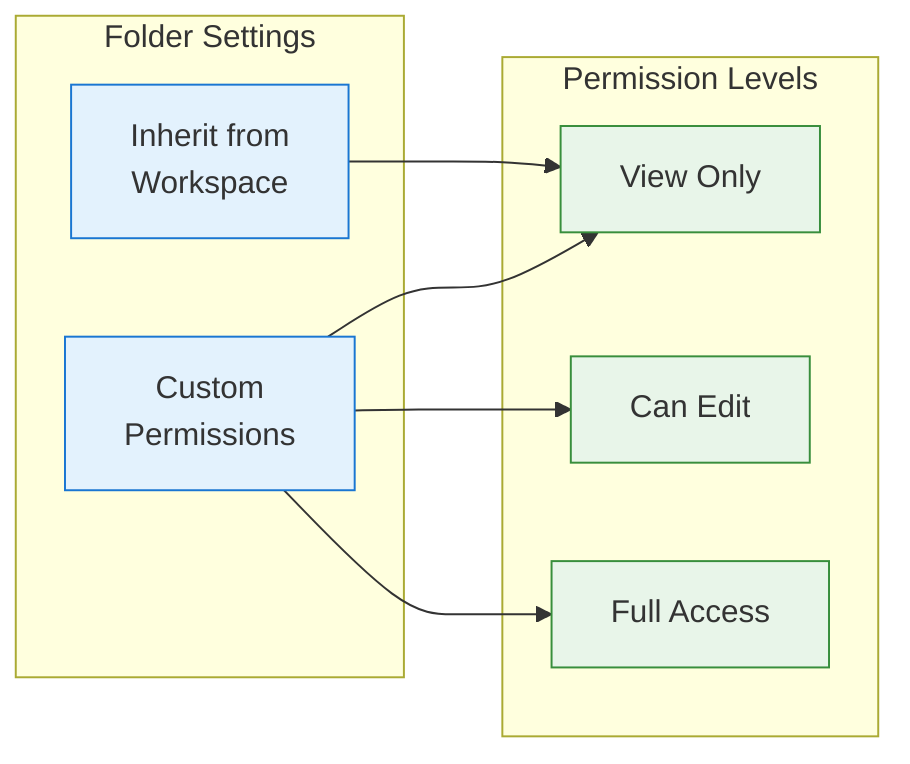
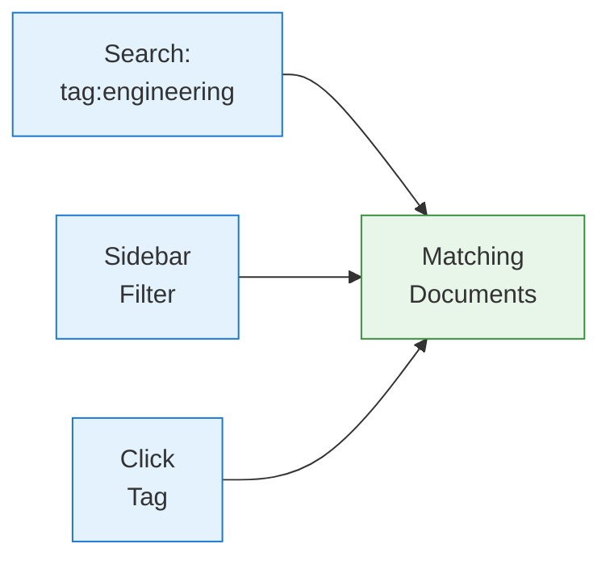
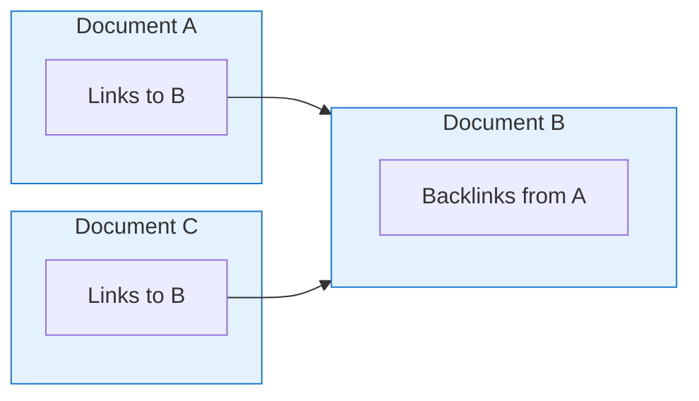

A well-organized workspace helps your team find content quickly and maintain productivity. This guide covers all the tools available for organizing your documents.

## Organization Hierarchy



## Folders

Folders are the primary way to organize documents hierarchically.

### Creating Folders

<Tabs>
  <Tab title="Sidebar">
    1. Right-click in the sidebar
    2. Select **New Folder**
    3. Enter the folder name
    4. Press Enter
  </Tab>

  <Tab title="Menu">
    1. Click **+ New** in the sidebar header
    2. Select **Folder**
    3. Enter the folder name
  </Tab>

  <Tab title="Keyboard">
    Press `Cmd/Ctrl + Shift + N` to create a new folder.
  </Tab>
</Tabs>

### Folder Structure Best Practices

<AccordionGroup>
  <Accordion title="By Team/Department">
    ```
    Workspace
    ├── Engineering
    │   ├── RFCs
    │   ├── Runbooks
    │   └── Architecture
    ├── Product
    │   ├── PRDs
    │   ├── Roadmaps
    │   └── Research
    └── Marketing
        ├── Campaigns
        └── Brand Assets
    ```
    Best for: Large organizations with distinct teams
  </Accordion>

  <Accordion title="By Project">
    ```
    Workspace
    ├── Project Alpha
    │   ├── Planning
    │   ├── Design
    │   └── Development
    ├── Project Beta
    │   ├── Planning
    │   ├── Design
    │   └── Development
    └── Archive
        └── Completed Projects
    ```
    Best for: Project-focused organizations
  </Accordion>

  <Accordion title="By Document Type">
    ```
    Workspace
    ├── Meeting Notes
    ├── Technical Specs
    ├── Product Requirements
    ├── Reports
    └── Templates
    ```
    Best for: Smaller teams, consistent document types
  </Accordion>

  <Accordion title="Hybrid Approach">
    ```
    Workspace
    ├── _Templates          (prefix for pinned)
    ├── _Company Wiki
    ├── Engineering
    │   ├── Active Projects
    │   └── Documentation
    └── Product
        ├── Active Projects
        └── Research
    ```
    Best for: Balance of team and function organization
  </Accordion>
</AccordionGroup>

### Moving Documents

Move documents to different folders:

| Method | How |
|--------|-----|
| **Drag & Drop** | Drag document to target folder in sidebar |
| **Context Menu** | Right-click > **Move to...** |
| **Keyboard** | `Cmd/Ctrl + Shift + M` |
| **Document Menu** | **...** > **Move** |

<Tip>
Hold `Shift` while dragging to move multiple selected documents at once.
</Tip>

### Folder Permissions

Control access at the folder level:



Set folder permissions:
1. Right-click the folder
2. Select **Share** or **Permissions**
3. Add people or groups
4. Set permission level
5. Documents inside inherit these permissions

### Nested Folders

Create folder hierarchies up to 10 levels deep:

1. Right-click a folder
2. Select **New Subfolder**
3. Or drag a folder onto another folder

<Warning>
Deeply nested structures can be hard to navigate. Consider using tags for cross-cutting organization instead of deep nesting.
</Warning>

## Tags

Tags provide flexible, non-hierarchical organization.

### Adding Tags

Add tags to documents:

1. Open the document
2. Click **+ Add tag** below the title
3. Type a tag name
4. Press Enter or select from suggestions

Or use the quick menu:
- Press `Cmd/Ctrl + T` to add tags
- Type `/tag` in the document

### Tag Naming Conventions

| Pattern | Example | Use Case |
|---------|---------|----------|
| `status:draft` | `status:in-review` | Document lifecycle |
| `team:engineering` | `team:product` | Team ownership |
| `project:alpha` | `project:beta` | Project association |
| `type:rfc` | `type:prd` | Document type |
| `priority:high` | `priority:low` | Urgency level |

### Filtering by Tags

Find documents with specific tags:

1. Click a tag to filter the sidebar
2. Use search: `tag:engineering`
3. Combine tags: `tag:rfc tag:approved`
4. Use the tag browser in the sidebar



### Managing Tags

Workspace admins can manage tags:

1. Go to **Settings** > **Tags**
2. View all tags and usage counts
3. Rename tags (updates all documents)
4. Merge duplicate tags
5. Delete unused tags
6. Set tag colors for visual distinction

## Starring and Favorites

Quickly access important documents:

### Star a Document

- Click the star icon next to the document title
- Or press `Cmd/Ctrl + Shift + S`
- Or right-click > **Add to Favorites**

### Access Starred Documents

- Click **Favorites** in the sidebar
- Or press `Cmd/Ctrl + Shift + F` to open favorites
- Starred documents appear at the top of search results

<Tip>
Use stars for documents you access frequently, like project dashboards or team wikis.
</Tip>

## Quick Access Views

Built-in views for fast navigation:

<CardGroup cols={3}>
  <Card title="Recent" icon="clock">
    Documents you've recently viewed or edited
  </Card>
  <Card title="Favorites" icon="star">
    Your starred documents
  </Card>
  <Card title="Shared with Me" icon="share">
    Documents others have shared
  </Card>
  <Card title="Created by Me" icon="user">
    Documents you've created
  </Card>
  <Card title="Drafts" icon="file-pen">
    Your unpublished drafts
  </Card>
  <Card title="Trash" icon="trash">
    Recently deleted documents
  </Card>
</CardGroup>

## Search and Filtering

### Quick Search

Press `Cmd/Ctrl + K` to open quick search:

- Type document title or content
- Results update as you type
- Press Enter to open top result
- Arrow keys to navigate results

### Advanced Search

Use search operators:

| Operator | Example | Description |
|----------|---------|-------------|
| `title:` | `title:roadmap` | Search in titles only |
| `content:` | `content:API` | Search in content |
| `tag:` | `tag:engineering` | Filter by tag |
| `folder:` | `folder:Product` | Filter by folder |
| `author:` | `author:sarah` | Filter by creator |
| `modified:` | `modified:7d` | Modified in last 7 days |
| `created:` | `created:2024` | Created in 2024 |
| `is:starred` | `is:starred` | Starred documents |
| `is:shared` | `is:shared` | Shared documents |

### Combining Operators

```
tag:rfc folder:Engineering modified:30d author:alex
```

This finds RFCs in Engineering folder, modified in the last 30 days, created by Alex.

## Document Links

Connect related documents:

### Creating Links

1. Type `[[` to search documents
2. Select the target document
3. The link appears as clickable text

Or use:
- `/link` slash command
- `Cmd/Ctrl + L` to insert link
- Paste a Materi document URL

### Backlinks

See which documents link to the current document:

1. Open the document
2. Click **Links** in the sidebar panel
3. View incoming links (backlinks)
4. View outgoing links



## Templates Folder

Designate a folder for templates:

1. Create a folder (e.g., "_Templates")
2. Right-click > **Set as Templates Folder**
3. Documents here appear in the template picker
4. Use `_` prefix to pin at top of sidebar

## Archive and Trash

### Archiving Documents

Archive documents you no longer need but want to keep:

1. Right-click the document
2. Select **Archive**
3. Document moves to Archive folder
4. Archived docs don't appear in search by default

To view archives:
- Toggle **Show Archived** in sidebar settings
- Search with `is:archived`

### Deleting Documents

Delete documents you no longer need:

1. Right-click the document
2. Select **Delete**
3. Document moves to Trash
4. Trash auto-empties after 30 days

### Restoring Documents

Recover deleted documents:

1. Click **Trash** in sidebar
2. Find the document
3. Click **Restore** to move back
4. Or **Delete Forever** to permanently remove

<Warning>
Permanently deleted documents cannot be recovered. The 30-day Trash retention gives you time to recover mistakes.
</Warning>

## Bulk Operations

Manage multiple documents at once:

### Select Multiple Documents

- `Cmd/Ctrl + Click` - Add to selection
- `Shift + Click` - Select range
- `Cmd/Ctrl + A` in sidebar - Select all visible

### Bulk Actions

With multiple documents selected:

| Action | How |
|--------|-----|
| Move | Drag to folder or right-click > **Move** |
| Tag | Right-click > **Add Tag** |
| Delete | Press `Delete` or right-click > **Delete** |
| Export | Right-click > **Export** |

## Workspace Analytics

Understand your workspace organization:

Go to **Settings** > **Analytics**:

| Metric | Description |
|--------|-------------|
| **Document Count** | Total documents by folder |
| **Storage Used** | Space used by folder |
| **Activity** | Recent document activity |
| **Top Collaborators** | Most active contributors |
| **Tag Usage** | Most used tags |
| **Orphaned Docs** | Documents with no tags or folder |

## Organization Tips

<AccordionGroup>
  <Accordion title="Start Simple">
    Begin with a flat structure and add folders as patterns emerge. Over-organizing early often leads to confusion.
  </Accordion>

  <Accordion title="Use Naming Conventions">
    Consistent naming helps search and scanning:
    - `RFC-001: Title` for numbered documents
    - `2024-01-15 Meeting Notes` for dated content
    - `[Draft] Title` for work in progress
  </Accordion>

  <Accordion title="Regular Cleanup">
    Schedule periodic organization:
    - Review and archive old documents
    - Clean up unused tags
    - Move orphaned documents
    - Empty trash
  </Accordion>

  <Accordion title="Document Your Structure">
    Create a "Workspace Guide" document explaining:
    - Folder purposes
    - Tag conventions
    - Where to put new documents
    - Naming guidelines
  </Accordion>
</AccordionGroup>

## Troubleshooting

<AccordionGroup>
  <Accordion title="Can't find a document">
    1. Check Trash - it may be deleted
    2. Check Archive - it may be archived
    3. Use search with `title:` to find by name
    4. Check "Shared with Me" if someone else owns it
    5. Ask workspace admin to check permissions
  </Accordion>

  <Accordion title="Folder structure is confusing">
    1. Review with team what's working and not
    2. Consider flattening deep hierarchies
    3. Use tags for cross-cutting concerns
    4. Create a workspace guide document
  </Accordion>

  <Accordion title="Tags are inconsistent">
    1. Go to Settings > Tags to see all tags
    2. Merge duplicates (e.g., "eng" and "engineering")
    3. Establish naming conventions
    4. Document in workspace guide
  </Accordion>
</AccordionGroup>

## Next Steps

<CardGroup cols={2}>
  <Card title="Sharing Documents" icon="share" href="/customer/documents/sharing-documents">
    Control access and collaborate
  </Card>
  <Card title="Version History" icon="clock-rotate-left" href="/customer/documents/version-history">
    Track changes over time
  </Card>
  <Card title="Templates" icon="copy" href="/customer/documents/templates">
    Create reusable document templates
  </Card>
  <Card title="Search Tips" icon="magnifying-glass" href="/customer/support/troubleshooting">
    Advanced search techniques
  </Card>
</CardGroup>
