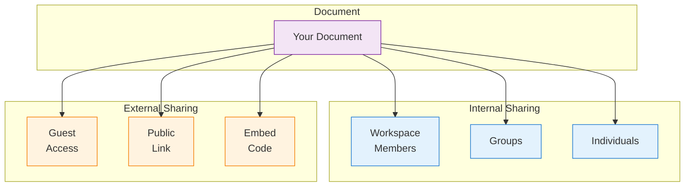
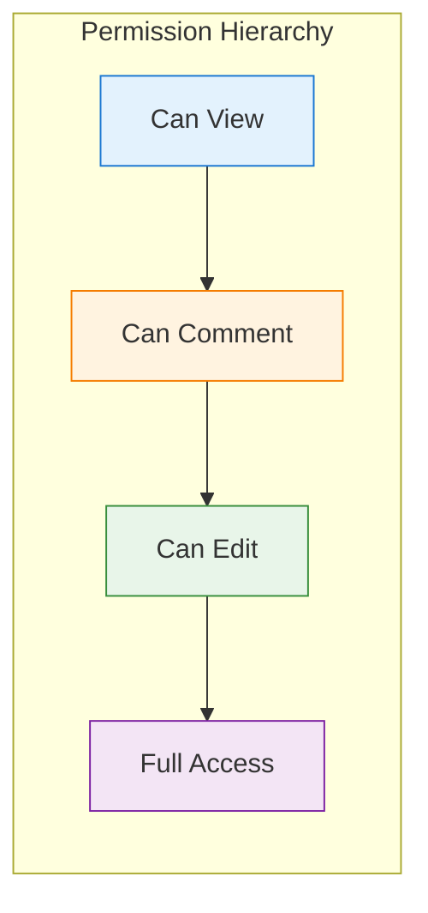
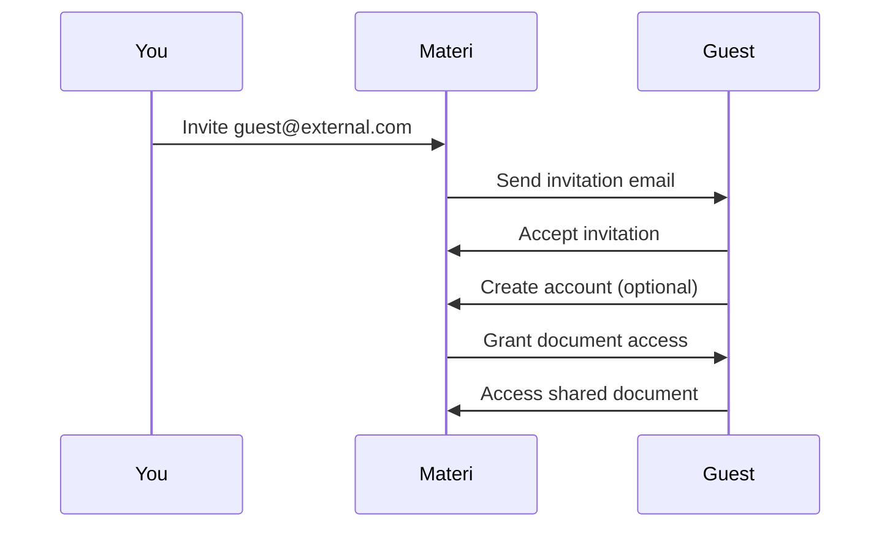
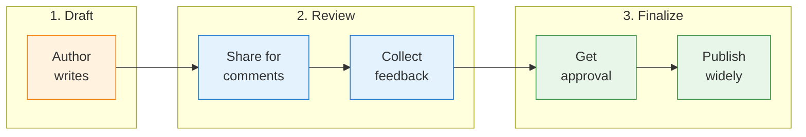

Materi provides flexible sharing options to collaborate with anyone while maintaining control over your content.

## Sharing Model Overview



## Permission Levels

Understand what each permission level allows:

| Level | View | Comment | Edit | Share | Delete |
|-------|:----:|:-------:|:----:|:-----:|:------:|
| **Can view** | Yes | No | No | No | No |
| **Can comment** | Yes | Yes | No | No | No |
| **Can edit** | Yes | Yes | Yes | No | No |
| **Full access** | Yes | Yes | Yes | Yes | Yes |



## Sharing with Individuals

Share with specific people in your workspace:

<Steps>
  <Step title="Open Share Dialog">
    1. Click the **Share** button in the document header
    2. Or press `Cmd/Ctrl + Shift + S`
    3. Or right-click document > **Share**
  </Step>

  <Step title="Add People">
    1. Type email addresses or names
    2. Select from dropdown suggestions
    3. Add multiple people at once (comma-separated)
  </Step>

  <Step title="Set Permissions">
    For each person, choose:
    - **Can view** - Read-only access
    - **Can comment** - View and leave comments
    - **Can edit** - Full editing capabilities
  </Step>

  <Step title="Send Invitation">
    1. Add an optional message
    2. Click **Share**
    3. Recipients receive an email notification
  </Step>
</Steps>

<Tip>
Type `@` followed by a name to quickly find workspace members.
</Tip>

## Sharing with Groups

Share with predefined groups for easier management:

1. Open the **Share** dialog
2. Type the group name (e.g., "Engineering")
3. Select the group from suggestions
4. Set permission level
5. All group members gain access

<Note>
Group permissions are managed by workspace admins. See [Roles & Permissions](/customer/workspaces/roles-permissions) for group setup.
</Note>

## Workspace-Wide Sharing

Make documents visible to everyone in the workspace:

<Tabs>
  <Tab title="Workspace View">
    All workspace members can view:

    1. Open **Share** dialog
    2. Toggle **Share with workspace**
    3. Select **Can view**
    4. Document appears in shared documents
  </Tab>

  <Tab title="Workspace Edit">
    All workspace members can edit:

    1. Open **Share** dialog
    2. Toggle **Share with workspace**
    3. Select **Can edit**
    4. Anyone can modify the document
  </Tab>

  <Tab title="Inherit from Folder">
    Use folder permissions:

    1. Move document to a shared folder
    2. Document inherits folder permissions
    3. Centralized permission management
  </Tab>
</Tabs>

## Link Sharing

Share via link without requiring login:

<Steps>
  <Step title="Enable Link Sharing">
    1. Open **Share** dialog
    2. Click **Create Link** or toggle **Link sharing**
    3. Choose link permissions
  </Step>

  <Step title="Configure Link Settings">
    | Setting | Options |
    |---------|---------|
    | **Permission** | View only, Can comment, Can edit |
    | **Expiration** | None, 1 day, 7 days, 30 days, custom |
    | **Password** | Optional password protection |
    | **Download** | Allow/prevent PDF download |
  </Step>

  <Step title="Share the Link">
    1. Click **Copy Link**
    2. Share via email, Slack, or any channel
    3. Recipients can access without Materi account
  </Step>
</Steps>

### Link Security Options

<AccordionGroup>
  <Accordion title="Password Protection">
    Add a password requirement:
    1. Enable **Require password**
    2. Enter a password
    3. Share password separately from link
    4. Recipients enter password to access
  </Accordion>

  <Accordion title="Expiration">
    Set link to expire:
    - **1 day** - Short-term sharing
    - **7 days** - Project duration
    - **30 days** - Extended access
    - **Custom** - Specific date
    - **Never** - Permanent (use carefully)
  </Accordion>

  <Accordion title="Download Prevention">
    Control content export:
    - Disable **Allow download**
    - Prevents PDF/export options
    - Screenshot still possible
    - Best effort protection
  </Accordion>
</AccordionGroup>

## Guest Access

Invite external collaborators with limited access:



### Inviting Guests

1. Open **Share** dialog
2. Enter external email address
3. System detects external domain
4. Select permission level
5. Guest receives invitation email

### Guest Limitations

| Feature | Workspace Member | Guest |
|---------|:----------------:|:-----:|
| See all documents | Yes | No |
| Access shared docs | Yes | Yes |
| Create documents | Yes | No |
| Use templates | Yes | No |
| See member list | Yes | Limited |
| Use integrations | Yes | No |
| Offline access | Yes | No |

<Warning>
Guests only see documents explicitly shared with them. They cannot browse the workspace.
</Warning>

## Embedding Documents

Embed documents in external sites:

<Steps>
  <Step title="Generate Embed Code">
    1. Open **Share** dialog
    2. Click **Embed**
    3. Configure embed options:
       - Width and height
       - Show/hide toolbar
       - Allow full screen
  </Step>

  <Step title="Copy Code">
    ```html
    <iframe
      src="https://app.materi.com/embed/doc_abc123"
      width="800"
      height="600"
      frameborder="0"
      allowfullscreen
    ></iframe>
    ```
  </Step>

  <Step title="Place in Website">
    Paste the iframe code in your:
    - Website HTML
    - Wiki or knowledge base
    - Internal portal
    - Learning management system
  </Step>
</Steps>

### Embed Options

| Option | Description |
|--------|-------------|
| **Read-only** | Viewers cannot edit (default) |
| **Hide toolbar** | Minimal UI for clean embed |
| **Auto-height** | Adjusts to content length |
| **Dark mode** | Match dark-themed sites |

## Managing Shared Access

### View Current Sharing

See who has access:

1. Open **Share** dialog
2. View list of people and groups
3. See their permission levels
4. Check active links

### Modify Permissions

Change someone's access:

1. Open **Share** dialog
2. Find the person
3. Click their permission level
4. Select new level
5. Changes apply immediately

### Remove Access

Revoke someone's access:

1. Open **Share** dialog
2. Find the person
3. Click **Remove**
4. They lose access immediately

<Note>
Removing access doesn't notify the person. They'll see an error when trying to access.
</Note>

### Disable Links

Revoke a shared link:

1. Open **Share** dialog
2. Find the link in **Link sharing**
3. Click **Revoke** or disable toggle
4. Link becomes invalid immediately

## Sharing Best Practices

<CardGroup cols={2}>
  <Card title="Principle of Least Privilege" icon="lock">
    Start with view-only, upgrade as needed
  </Card>
  <Card title="Use Groups" icon="users">
    Share with groups instead of individuals when possible
  </Card>
  <Card title="Set Expirations" icon="clock">
    Use expiring links for temporary access
  </Card>
  <Card title="Review Regularly" icon="magnifying-glass">
    Periodically audit who has access
  </Card>
</CardGroup>

## Sharing Workflows

### Document Review Workflow



### External Collaboration Workflow

1. Create document in private folder
2. Invite external guest with edit access
3. Collaborate on content
4. Remove guest access when complete
5. Move to permanent location

## Sharing via API

Programmatically manage sharing:

```typescript
import { Materi } from '@materi/sdk';

const materi = new Materi({ apiKey: 'your-api-key' });

// Share with a user
await materi.documents.share('doc_abc123', {
  email: 'colleague@company.com',
  permission: 'edit',
  notify: true,
  message: 'Please review this document'
});

// Create a public link
const link = await materi.documents.createLink('doc_abc123', {
  permission: 'view',
  expiresIn: '7d',
  password: 'optional-password'
});

console.log(link.url);
```

See [API Reference](/api/rest/documents/document-permissions) for complete details.

## Audit Trail

Track sharing changes:

1. Go to **Settings** > **Audit Log**
2. Filter by document or action type
3. View sharing events:
   - Who shared with whom
   - Permission changes
   - Link creation/revocation
   - Access attempts

| Event | Information Logged |
|-------|-------------------|
| Share added | User, permission, timestamp |
| Share modified | Old/new permission, modifier |
| Share removed | User, remover, timestamp |
| Link created | Settings, creator, timestamp |
| Link accessed | IP, user agent, timestamp |
| Link revoked | Revoker, timestamp |

## Troubleshooting

<AccordionGroup>
  <Accordion title="Person says they can't access document">
    1. Verify they're using the correct email
    2. Check they accepted the invitation
    3. Confirm permission level allows their action
    4. Check if link has expired
    5. Verify no IP restrictions are blocking them
  </Accordion>

  <Accordion title="Link not working">
    1. Check if link was revoked
    2. Verify expiration hasn't passed
    3. Confirm password is correct (if set)
    4. Try generating a new link
  </Accordion>

  <Accordion title="Can't share with external users">
    1. Check workspace settings allow guests
    2. Verify your role permits external sharing
    3. Check if domain is blocked
    4. Contact workspace admin
  </Accordion>

  <Accordion title="Embed not loading">
    1. Verify embed is enabled for the document
    2. Check domain isn't blocked
    3. Confirm link permissions
    4. Test in incognito window
  </Accordion>
</AccordionGroup>

## Next Steps

<CardGroup cols={2}>
  <Card title="Version History" icon="clock-rotate-left" href="/customer/documents/version-history">
    Track and restore document changes
  </Card>
  <Card title="Real-Time Collaboration" icon="users" href="/customer/collaboration/overview">
    Work together in real-time
  </Card>
  <Card title="Security Settings" icon="lock" href="/customer/security/overview">
    Configure security policies
  </Card>
  <Card title="Roles & Permissions" icon="shield" href="/customer/workspaces/roles-permissions">
    Manage workspace access
  </Card>
</CardGroup>
