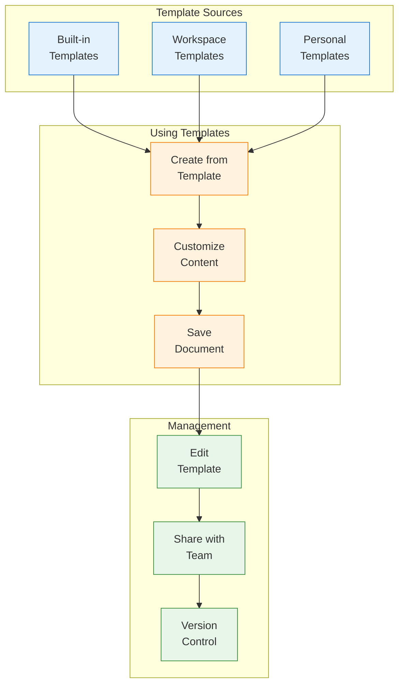
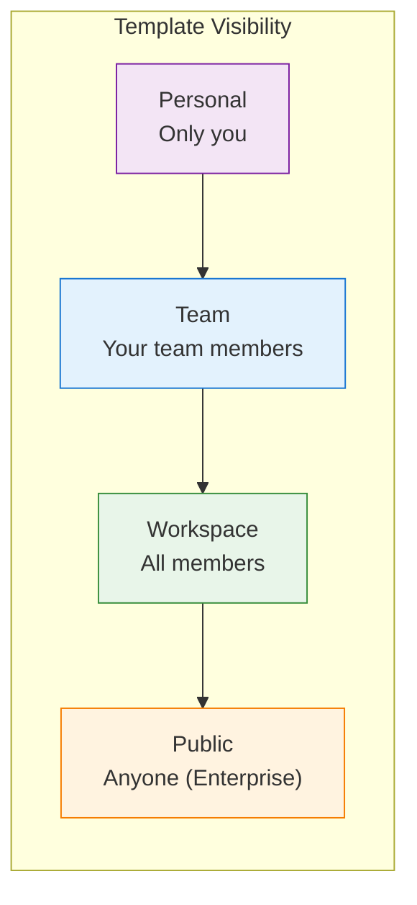
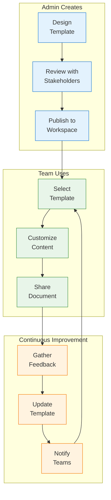

Templates help your team create consistent, high-quality documents quickly. This guide covers using built-in templates, creating custom templates, and managing your template library.

## Template System Overview



## Using Templates

### Creating from a Template

<Steps>
  <Step title="Open Template Gallery">
    Click **+ New** > **From Template** or press `Cmd/Ctrl + Shift + T`.
  </Step>

  <Step title="Browse Templates">
    Explore templates by:
    - **Category** - Meeting notes, specs, reports, etc.
    - **Source** - Built-in, workspace, or personal
    - **Search** - Find by name or keyword
    - **Recent** - Your recently used templates
  </Step>

  <Step title="Preview Template">
    Click any template to preview:
    - Full content structure
    - Placeholder descriptions
    - Expected sections
  </Step>

  <Step title="Create Document">
    Click **Use Template** to create your document:
    - Template content is copied
    - Placeholders are highlighted
    - Ready for customization
  </Step>
</Steps>

### Template Variables

Templates can include dynamic variables that auto-fill:

| Variable | Replaced With | Example |
|----------|---------------|---------|
| `{{date}}` | Current date | January 15, 2024 |
| `{{date:format}}` | Formatted date | 2024-01-15 |
| `{{time}}` | Current time | 2:30 PM |
| `{{author}}` | Your name | Sarah Chen |
| `{{author.email}}` | Your email | sarah@company.com |
| `{{workspace}}` | Workspace name | Acme Corp |
| `{{title}}` | Document title | Q1 Planning |
| `{{folder}}` | Parent folder | Engineering |

### Placeholder Guidance

Templates include placeholder text to guide users:

```markdown
## Executive Summary
<!-- Replace with a 2-3 sentence summary of the key points -->

## Background
<!-- Describe the context and why this document exists -->

## Proposal
<!-- Detail your proposed solution or approach -->
```

<Tip>
Look for highlighted placeholders and instructional comments. Delete them as you fill in real content.
</Tip>

## Built-in Templates

Materi includes professionally designed templates:

<Tabs>
  <Tab title="Meeting Notes">
    - **Meeting Notes** - General meeting documentation
    - **1:1 Meeting** - Manager/report discussions
    - **Team Standup** - Daily standup format
    - **Retrospective** - Sprint/project retrospectives
    - **All Hands** - Company-wide meeting notes
  </Tab>

  <Tab title="Project Management">
    - **Project Brief** - Project overview and goals
    - **PRD** - Product Requirements Document
    - **RFC** - Request for Comments
    - **Project Status** - Weekly status updates
    - **Launch Checklist** - Pre-launch preparation
  </Tab>

  <Tab title="Engineering">
    - **Technical Spec** - System design documents
    - **Architecture Decision Record** - ADRs
    - **Runbook** - Operational procedures
    - **Incident Report** - Post-incident analysis
    - **API Documentation** - Endpoint documentation
  </Tab>

  <Tab title="Business">
    - **Proposal** - Business proposals
    - **Report** - General business reports
    - **Competitive Analysis** - Market research
    - **Case Study** - Customer success stories
    - **Executive Summary** - High-level overviews
  </Tab>
</Tabs>

## Creating Custom Templates

### From Scratch

Create a new template document:

<Steps>
  <Step title="Create Base Document">
    Create a new document with your desired structure:
    - Add headings and sections
    - Include placeholder content
    - Add instructional comments
    - Format as needed
  </Step>

  <Step title="Save as Template">
    Click **...** > **Save as Template** or use the command palette.
  </Step>

  <Step title="Configure Template">
    Set template properties:

    | Property | Description |
    |----------|-------------|
    | **Name** | Descriptive template name |
    | **Description** | Brief explanation of use case |
    | **Category** | Group for organization |
    | **Icon** | Visual identifier |
    | **Visibility** | Personal, Team, or Workspace |
  </Step>

  <Step title="Save Template">
    Click **Save Template**. It's now available in the gallery.
  </Step>
</Steps>

### From Existing Document

Convert an existing document to a template:

1. Open the document you want to template
2. Replace specific content with placeholder text
3. Add instructional comments
4. Click **...** > **Save as Template**
5. Configure and save

### Template Content Guidelines

<AccordionGroup>
  <Accordion title="Structure">
    - Use clear, consistent headings
    - Include all expected sections
    - Order sections logically
    - Keep structure flexible for different use cases
  </Accordion>

  <Accordion title="Placeholders">
    - Use descriptive placeholder text
    - Include guidance comments
    - Mark required vs optional sections
    - Provide examples where helpful
  </Accordion>

  <Accordion title="Formatting">
    - Apply consistent styling
    - Use callouts for important notes
    - Include tables where structured data is expected
    - Add example content that can be replaced
  </Accordion>

  <Accordion title="Variables">
    - Use variables for auto-fill content
    - Test variables work correctly
    - Document any custom variables
    - Consider date/time formatting needs
  </Accordion>
</AccordionGroup>

## Template Visibility Levels

Control who can use your templates:



| Level | Who Can Use | Who Can Edit |
|-------|-------------|--------------|
| **Personal** | Only you | Only you |
| **Team** | Your team | Team admins |
| **Workspace** | All members | Workspace admins |
| **Public** | Anyone with link | Admins (Enterprise) |

## Managing Templates

### Editing Templates

Update an existing template:

1. Open **Template Gallery**
2. Find your template
3. Click **...** > **Edit Template**
4. Make changes
5. Click **Save Changes**

<Note>
Editing a template doesn't affect documents already created from it. They keep their content at creation time.
</Note>

### Template Categories

Organize templates with categories:

| Category | Suggested Use |
|----------|---------------|
| **Meetings** | All meeting-related templates |
| **Projects** | Project documentation |
| **Engineering** | Technical documents |
| **Product** | Product management docs |
| **Marketing** | Marketing materials |
| **HR** | Human resources documents |
| **Finance** | Financial documents |
| **Custom** | Workspace-specific categories |

### Template Versions

Track template changes over time:

1. Open template in edit mode
2. Click **Version History**
3. View all template versions
4. Restore previous versions if needed

## Templates Folder

Create a dedicated folder for template management:

<Steps>
  <Step title="Create Templates Folder">
    Create a folder named `_Templates` or similar.

    <Tip>
    Use `_` prefix to pin the folder at the top of the sidebar.
    </Tip>
  </Step>

  <Step title="Designate as Templates">
    Right-click folder > **Set as Templates Folder**.
  </Step>

  <Step title="Organize Templates">
    Create subfolders by category:
    ```
    _Templates/
    ├── Meetings/
    ├── Engineering/
    ├── Product/
    └── Business/
    ```
  </Step>

  <Step title="Use Documents as Templates">
    Documents in this folder appear in template gallery.
  </Step>
</Steps>

## Template Best Practices

<CardGroup cols={2}>
  <Card title="Clear Names" icon="tag">
    Use descriptive names: "RFC Template" not "Template 1"
  </Card>
  <Card title="Good Descriptions" icon="info">
    Explain when and how to use each template
  </Card>
  <Card title="Placeholder Guidance" icon="comment">
    Include instructions in placeholder sections
  </Card>
  <Card title="Regular Updates" icon="arrows-rotate">
    Review and update templates periodically
  </Card>
</CardGroup>

### Template Design Patterns

<AccordionGroup>
  <Accordion title="The Checklist Pattern">
    Include task lists for process-driven documents:

    ```markdown
    ## Pre-Launch Checklist

    ### Technical
    - [ ] All tests passing
    - [ ] Performance benchmarks met
    - [ ] Security review completed

    ### Documentation
    - [ ] User docs updated
    - [ ] API docs current
    - [ ] Changelog entry added
    ```
  </Accordion>

  <Accordion title="The Decision Matrix">
    Include structured tables for decision-making:

    ```markdown
    ## Options Analysis

    | Option | Pros | Cons | Effort | Risk |
    |--------|------|------|--------|------|
    | Option A | | | | |
    | Option B | | | | |
    | Option C | | | | |
    ```
  </Accordion>

  <Accordion title="The Standard Sections">
    Consistent sections across similar documents:

    ```markdown
    ## Summary
    <!-- One paragraph overview -->

    ## Background
    <!-- Context and history -->

    ## Details
    <!-- Main content -->

    ## Next Steps
    <!-- Action items -->
    ```
  </Accordion>

  <Accordion title="The Guided Questions">
    Use questions to prompt content:

    ```markdown
    ## Problem Statement

    **What problem are we solving?**
    <!-- Describe the core problem -->

    **Who is affected?**
    <!-- List stakeholders -->

    **What happens if we don't solve it?**
    <!-- Describe impact of inaction -->
    ```
  </Accordion>
</AccordionGroup>

## Template Gallery API

Manage templates programmatically:

```typescript
import { Materi } from '@materi/sdk';

const materi = new Materi({ apiKey: 'your-api-key' });

// List available templates
const templates = await materi.templates.list({
  category: 'Engineering',
  visibility: 'workspace'
});

// Get template details
const template = await materi.templates.get('template_abc123');

// Create document from template
const doc = await materi.documents.create({
  templateId: 'template_abc123',
  title: 'New RFC',
  folderId: 'folder_xyz'
});

// Create new template
const newTemplate = await materi.templates.create({
  name: 'Custom RFC',
  description: 'Engineering RFC with custom sections',
  category: 'Engineering',
  visibility: 'workspace',
  content: templateContent
});
```

See [API Reference](/api/rest/documents/templates) for complete documentation.

## Template Workflows

### Company-Wide Templates

Standardize documents across your organization:



### Department Templates

Each team maintains their own templates:

1. Create department template folder
2. Assign template owner
3. Regular review cycle
4. Document template usage guidelines

## Troubleshooting

<AccordionGroup>
  <Accordion title="Template not appearing in gallery">
    1. Check template visibility settings
    2. Verify you're in the correct workspace
    3. Ensure the template is published
    4. Check category filters in gallery
  </Accordion>

  <Accordion title="Variables not replacing">
    1. Verify variable syntax is correct: `{{variable}}`
    2. Check for typos in variable names
    3. Test with built-in variables first
    4. Custom variables need proper configuration
  </Accordion>

  <Accordion title="Can't edit workspace template">
    1. Check your permission level
    2. Workspace templates require admin role
    3. Contact workspace admin for changes
    4. Consider duplicating to personal
  </Accordion>

  <Accordion title="Template folder not recognized">
    1. Ensure folder is marked as templates folder
    2. Check folder permissions
    3. Verify documents are direct children
    4. Refresh the template gallery
  </Accordion>
</AccordionGroup>

## Next Steps

<CardGroup cols={2}>
  <Card title="Real-Time Collaboration" icon="users" href="/customer/collaboration/overview">
    Work together on documents
  </Card>
  <Card title="AI Content Generation" icon="wand-magic-sparkles" href="/customer/ai/content-generation">
    Use AI to fill in templates
  </Card>
  <Card title="Document Organization" icon="folder-tree" href="/customer/documents/organizing-documents">
    Structure your workspace
  </Card>
  <Card title="Sharing Documents" icon="share" href="/customer/documents/sharing-documents">
    Share template-based documents
  </Card>
</CardGroup>
