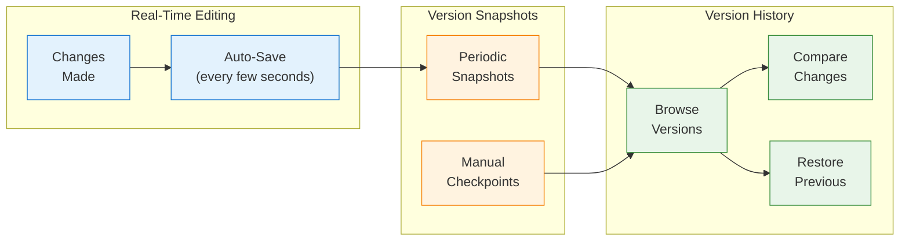
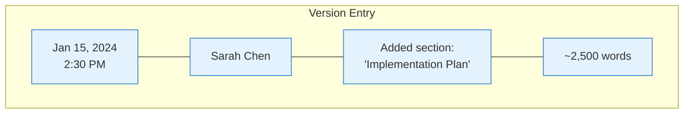
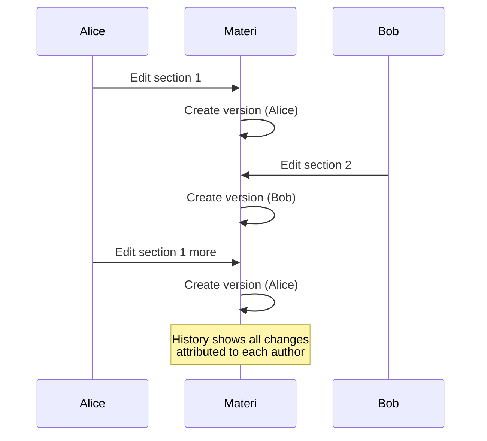

Materi automatically tracks every change to your documents. View the complete history, compare versions, and restore previous states at any time.

## How Version History Works



## Accessing Version History

<Steps>
  <Step title="Open the Menu">
    Click the **...** (more options) button in the document header.
  </Step>

  <Step title="Select Version History">
    Click **Version History** or press `Cmd/Ctrl + Shift + H`.
  </Step>

  <Step title="Browse Versions">
    The version panel opens showing:
    - Timeline of versions
    - Author of each change
    - Date and time
    - Change summary
  </Step>
</Steps>

<Tip>
You can also right-click the document in the sidebar and select **Version History**.
</Tip>

## Understanding Versions

### Automatic Snapshots

Materi creates version snapshots automatically:

| Trigger | When | Example |
|---------|------|---------|
| **Time-based** | Every 10 minutes of editing | Continuous work sessions |
| **Session-based** | When you stop editing | Leave for a meeting |
| **Collaboration** | When collaborators join/leave | Team editing |
| **Significant changes** | Large content additions/deletions | Major updates |

### Version Information

Each version shows:

| Field | Description |
|-------|-------------|
| **Timestamp** | When the version was created |
| **Author** | Who made the changes |
| **Summary** | Auto-generated change description |
| **Size** | Content length at that point |



## Viewing Versions

### Preview a Version

1. Click any version in the history panel
2. The document shows that version's content
3. A banner indicates you're viewing history
4. Click **Back to current** to return

### Version Details

Click the **...** on a version for:
- **View full document** - See complete content
- **Create named version** - Save as a named checkpoint
- **Copy version link** - Share link to this version
- **Restore this version** - Revert to this state

## Comparing Versions

See exactly what changed between versions:

<Steps>
  <Step title="Select First Version">
    Click on a version to select it as the base.
  </Step>

  <Step title="Enable Compare Mode">
    Click **Compare** or hold `Shift` and click another version.
  </Step>

  <Step title="View Differences">
    Changes are highlighted:
    - **Green** - Added content
    - **Red** - Removed content
    - **Yellow** - Modified content
  </Step>
</Steps>

### Comparison View Options

<Tabs>
  <Tab title="Side-by-Side">
    View both versions next to each other:
    - Left: Older version
    - Right: Newer version
    - Scroll synchronized
  </Tab>

  <Tab title="Inline Diff">
    View changes in a single document:
    - Strikethrough for deletions
    - Highlights for additions
    - Compact view
  </Tab>

  <Tab title="Changes Only">
    Show only modified sections:
    - Jump between changes
    - Hide unchanged content
    - Faster review
  </Tab>
</Tabs>

## Restoring Versions

Revert to a previous version of your document:

<Steps>
  <Step title="Find the Version">
    Browse history to find the version you want.
  </Step>

  <Step title="Preview Content">
    Click to preview and verify it's the right version.
  </Step>

  <Step title="Restore">
    Click **Restore this version** button.
  </Step>

  <Step title="Confirm">
    Confirm the restoration. The current content becomes a new version before restoring.

    <Note>
    Restoring creates a new version with the old content. The current version is preserved in history.
    </Note>
  </Step>
</Steps>

### Partial Restoration

Copy specific content from an old version:

1. Preview the old version
2. Select and copy the content you need
3. Return to current version
4. Paste the content where needed

<Tip>
Use partial restoration to recover deleted sections without losing other changes.
</Tip>

## Named Versions (Checkpoints)

Create named checkpoints for important milestones:

### Creating Named Versions

1. Click **...** > **Create named version**
2. Or press `Cmd/Ctrl + S` to save with name
3. Enter a descriptive name:
   - "Final draft - Q1 review"
   - "Before restructure"
   - "Approved by legal"
4. Click **Save**

### Benefits of Named Versions

<CardGroup cols={3}>
  <Card title="Easy to Find" icon="search">
    Named versions appear prominently in history
  </Card>
  <Card title="Never Auto-Deleted" icon="lock">
    Named versions are retained permanently
  </Card>
  <Card title="Clear Purpose" icon="tag">
    Names indicate why the checkpoint matters
  </Card>
</CardGroup>

### Managing Named Versions

| Action | How |
|--------|-----|
| **Rename** | Click version name to edit |
| **Remove name** | Convert back to regular version |
| **Pin** | Keep at top of history |
| **Delete** | Remove (requires admin) |

## Version Retention

How long versions are kept:

| Plan | Automatic Versions | Named Versions |
|------|-------------------|----------------|
| **Free** | 30 days | Unlimited |
| **Team** | 90 days | Unlimited |
| **Enterprise** | Custom (up to unlimited) | Unlimited |

<Info>
Named versions are never automatically deleted, regardless of your plan. Create named versions for important milestones you want to keep forever.
</Info>

## Collaborative Version History

When multiple people edit:



### Attribution

Each version shows:
- The **author** who made changes
- The **specific changes** they made
- The **time** of their edits

### Filtering by Author

1. Open version history
2. Click **Filter**
3. Select author(s) to show
4. View only their contributions

## Audit and Compliance

Version history supports compliance requirements:

| Feature | Description |
|---------|-------------|
| **Complete audit trail** | Every change is recorded |
| **Immutable history** | Versions cannot be modified |
| **Author attribution** | All changes tied to users |
| **Timestamps** | Precise timing of all edits |
| **Export capability** | Download complete history |

### Exporting Version History

For compliance or backup:

1. Open version history
2. Click **Export** > **Export History**
3. Choose format:
   - **PDF** - Complete version report
   - **JSON** - Machine-readable format
   - **ZIP** - All versions as separate files
4. Download the export

## Version History API

Access version history programmatically:

```typescript
import { Materi } from '@materi/sdk';

const materi = new Materi({ apiKey: 'your-api-key' });

// List versions
const versions = await materi.documents.versions.list('doc_abc123', {
  limit: 50,
  after: '2024-01-01'
});

// Get specific version content
const version = await materi.documents.versions.get(
  'doc_abc123',
  'version_xyz789'
);

// Compare two versions
const diff = await materi.documents.versions.compare(
  'doc_abc123',
  'version_older',
  'version_newer'
);

// Restore a version
await materi.documents.versions.restore(
  'doc_abc123',
  'version_xyz789'
);
```

See [API Reference](/api/rest/documents/document-versions) for complete documentation.

## Version History vs Backups

Understand the difference:

| Feature | Version History | Backups |
|---------|----------------|---------|
| **Granularity** | Every few minutes | Daily/weekly |
| **Self-service** | Users can restore | Admin only |
| **Scope** | Per-document | Entire workspace |
| **Retention** | Plan-based | Enterprise only |
| **Purpose** | Undo/recover changes | Disaster recovery |

<Note>
Version history is for day-to-day content recovery. Enterprise backups protect against catastrophic data loss.
</Note>

## Best Practices

<AccordionGroup>
  <Accordion title="Use named versions for milestones">
    Create named checkpoints at important stages:
    - Before major restructuring
    - After stakeholder approval
    - Before sharing externally
    - At project completion
  </Accordion>

  <Accordion title="Review before restoring">
    Always preview the old version before restoring. Consider:
    - What changes will be lost?
    - Can you merge instead of full restore?
    - Should you copy specific sections?
  </Accordion>

  <Accordion title="Document significant changes">
    When making major edits:
    - Create a named version first
    - Add a comment explaining changes
    - Makes history easier to navigate
  </Accordion>

  <Accordion title="Use compare for review">
    When reviewing collaborator changes:
    - Compare before/after versions
    - Identify what changed
    - Verify changes are intentional
  </Accordion>
</AccordionGroup>

## Troubleshooting

<AccordionGroup>
  <Accordion title="Can't find the version I need">
    1. Extend the date range filter
    2. Check if it was before your plan's retention period
    3. Look for named versions (never deleted)
    4. Try searching by author
    5. Contact support for Enterprise plans
  </Accordion>

  <Accordion title="Restore isn't working">
    1. Verify you have edit permission
    2. Check if document is locked
    3. Ensure you're online
    4. Try refreshing the page
  </Accordion>

  <Accordion title="Version history is slow to load">
    1. Documents with extensive history may take longer
    2. Try filtering by date range
    3. Filter to specific authors
    4. Contact support if persistent
  </Accordion>

  <Accordion title="Missing changes in history">
    1. Very rapid changes may be combined
    2. Check for network issues during editing
    3. Verify you're looking at the correct document
    4. Contact support if changes are missing
  </Accordion>
</AccordionGroup>

## Next Steps

<CardGroup cols={2}>
  <Card title="Templates" icon="copy" href="/customer/documents/templates">
    Create reusable document templates
  </Card>
  <Card title="Collaboration" icon="users" href="/customer/collaboration/overview">
    Work together in real-time
  </Card>
  <Card title="Comments" icon="comments" href="/customer/collaboration/comments">
    Discuss changes with your team
  </Card>
  <Card title="Audit Logs" icon="list-check" href="/customer/security/audit-logs">
    Track all document activity
  </Card>
</CardGroup>
