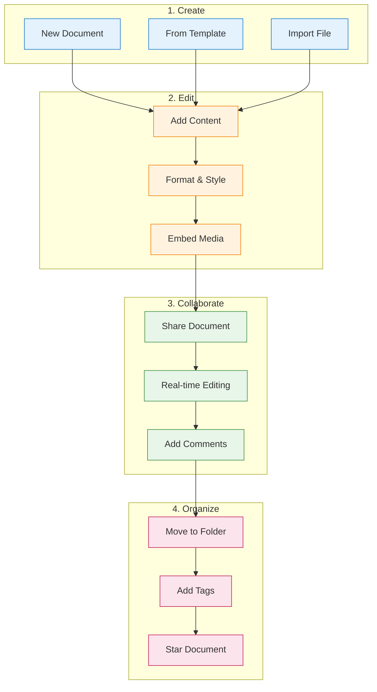

Now that you're signed up, let's create your first document and experience Materi's real-time collaboration features.

## Document Creation Flow



## Quick Start

<Steps>
  <Step title="Create a New Document">
    From your workspace dashboard:

    1. Click the **+ New** button in the top left corner
    2. Select **Document** from the dropdown menu
    3. A new untitled document opens in the editor

    <Tip>
    **Keyboard shortcut:** Press `Cmd/Ctrl + N` anywhere in the workspace to create a new document instantly.
    </Tip>

    ### Alternative Creation Methods

    <Tabs>
      <Tab title="From Template">
        1. Click **+ New** > **From Template**
        2. Browse available templates by category
        3. Preview templates before selecting
        4. Click **Use Template** to create your document

        Popular templates include:
        - Meeting Notes
        - Project Brief
        - Technical Specification
        - Product Requirements Document (PRD)
        - Weekly Status Report
      </Tab>

      <Tab title="Import File">
        1. Click **+ New** > **Import**
        2. Select your file source:
           - Upload from computer
           - Import from Google Docs
           - Import from Notion
           - Import from Confluence
        3. Select the file to import
        4. Review the converted content

        **Supported formats:** `.docx`, `.md`, `.txt`, `.html`, `.pdf` (text extraction)
      </Tab>

      <Tab title="Quick Create">
        From anywhere in the workspace:
        - Press `Cmd/Ctrl + N` for a new document
        - Press `Cmd/Ctrl + Shift + N` for a new document in the current folder
        - Right-click a folder and select **New Document**
      </Tab>
    </Tabs>
  </Step>

  <Step title="Add a Title">
    1. Click on **Untitled Document** at the top
    2. Type your document title
    3. Press **Enter** or click away to confirm

    <Note>
    The title also becomes the document's filename in your workspace. Choose something descriptive that helps teammates find it later.
    </Note>

    ### Title Best Practices

    | Good Titles | Why They Work |
    |-------------|---------------|
    | "Q1 2024 Marketing Plan" | Specific, dated, findable |
    | "API Authentication RFC" | Clear purpose, searchable |
    | "Team Standup Notes - Jan 15" | Dated, categorized |
    | "Product Roadmap v2" | Versioned, specific |
  </Step>

  <Step title="Write Your Content">
    Start typing in the document body. Materi supports rich content:

    ### Text Formatting

    | Format | Shortcut | Syntax |
    |--------|----------|--------|
    | **Bold** | `Cmd/Ctrl + B` | `**text**` |
    | *Italic* | `Cmd/Ctrl + I` | `*text*` |
    | ~~Strikethrough~~ | `Cmd/Ctrl + Shift + X` | `~~text~~` |
    | `Code` | `Cmd/Ctrl + E` | `` `code` `` |
    | [Link](/) | `Cmd/Ctrl + K` | `[text](url)` |

    ### Block Elements

    ```
    # Heading 1
    ## Heading 2
    ### Heading 3

    - Bullet list
    1. Numbered list
    - [ ] Task list

    > Blockquote

    ---  (horizontal rule)
    ```

    ### Special Blocks

    <AccordionGroup>
      <Accordion title="Code Blocks">
        Type ` ``` ` followed by a language name for syntax highlighting:

        ```javascript
        function greet(name) {
          return `Hello, ${name}!`;
        }
        ```

        Supported languages: JavaScript, TypeScript, Python, Go, Rust, SQL, and 50+ more.
      </Accordion>

      <Accordion title="Tables">
        Type `|` to start a table, or use the slash command `/table`:

        | Column 1 | Column 2 | Column 3 |
        |----------|----------|----------|
        | Data     | Data     | Data     |
      </Accordion>

      <Accordion title="Callouts">
        Use the slash command `/callout` or type `:::` for callout blocks:

        <Info>This is an info callout</Info>
        <Warning>This is a warning callout</Warning>
        <Tip>This is a tip callout</Tip>
      </Accordion>

      <Accordion title="Embeds">
        Paste URLs directly or use `/embed`:
        - YouTube videos
        - Figma designs
        - Loom recordings
        - GitHub gists
        - Mermaid diagrams
      </Accordion>
    </AccordionGroup>
  </Step>

  <Step title="Use Slash Commands">
    Type `/` anywhere to open the command palette:

    | Command | Description |
    |---------|-------------|
    | `/heading` | Insert a heading |
    | `/bullet` | Start a bullet list |
    | `/numbered` | Start a numbered list |
    | `/task` | Add a task checkbox |
    | `/code` | Insert a code block |
    | `/table` | Create a table |
    | `/image` | Upload or embed an image |
    | `/divider` | Add a horizontal divider |
    | `/callout` | Add a callout box |
    | `/ai` | Open AI assistant |

    <Tip>
    Type `/` followed by any text to filter commands. For example, `/tab` shows table options immediately.
    </Tip>
  </Step>

  <Step title="Share with Your Team">
    Ready to collaborate? Share your document:

    1. Click the **Share** button in the top right corner
    2. Choose how to share:

    <Tabs>
      <Tab title="Invite People">
        1. Enter email addresses of collaborators
        2. Select their permission level:
           - **Can edit** - Full editing access
           - **Can comment** - View and add comments
           - **Can view** - Read-only access
        3. Add an optional message
        4. Click **Send Invite**
      </Tab>

      <Tab title="Copy Link">
        1. Click **Copy Link**
        2. Choose link permissions:
           - **Anyone with link can view**
           - **Anyone with link can edit**
           - **Only invited people** (default)
        3. Share the link via Slack, email, etc.
      </Tab>

      <Tab title="Workspace Sharing">
        1. Toggle **Share with workspace**
        2. All workspace members can access based on:
           - Their role permissions
           - Document-level settings
      </Tab>
    </Tabs>

    ```mermaid
    flowchart LR
        subgraph Permissions["Permission Levels"]
            direction TB
            OWNER["Owner<br/>Full control"]
            EDIT["Editor<br/>Can edit"]
            COMMENT["Commenter<br/>Can comment"]
            VIEW["Viewer<br/>Read only"]
        end

        OWNER --> EDIT
        EDIT --> COMMENT
        COMMENT --> VIEW

        classDef owner fill:#4caf50,stroke:#2e7d32,color:#fff
        classDef edit fill:#2196f3,stroke:#1565c0,color:#fff
        classDef comment fill:#ff9800,stroke:#ef6c00,color:#fff
        classDef view fill:#9e9e9e,stroke:#616161,color:#fff

        class OWNER owner
        class EDIT edit
        class COMMENT comment
        class VIEW view
    ```
  </Step>

  <Step title="Experience Real-Time Collaboration">
    When teammates join the document:

    1. **See who's online** - Colored avatars appear in the top right
    2. **Watch live edits** - See cursors and changes in real-time
    3. **Follow mode** - Click a collaborator's avatar to follow their view

    ```mermaid
    sequenceDiagram
        participant You
        participant Materi as Materi (Relay)
        participant Teammate

        You->>Materi: Type "Hello"
        Materi-->>Teammate: Sync changes (~50ms)
        Teammate->>Materi: Type "World"
        Materi-->>You: Sync changes (~50ms)

        Note over You,Teammate: Both see "Hello World"<br/>with no conflicts
    ```

    <Info>
    Materi uses **Operational Transform** to handle simultaneous edits. Even if you and a teammate edit the same line, changes are merged intelligently without data loss.
    </Info>
  </Step>
</Steps>

## Advanced Features

### AI-Powered Writing

Type `/ai` or press `Cmd/Ctrl + J` to access AI features:

<CardGroup cols={2}>
  <Card title="Generate Content" icon="wand-magic-sparkles">
    Ask AI to draft sections, expand bullet points, or generate examples
  </Card>
  <Card title="Improve Writing" icon="pencil">
    Get suggestions for clarity, tone, and grammar
  </Card>
  <Card title="Summarize" icon="compress">
    Create executive summaries of long documents
  </Card>
  <Card title="Translate" icon="language">
    Translate content to different languages
  </Card>
</CardGroup>

### Comments and Discussions

1. Select any text in the document
2. Click the **Comment** icon or press `Cmd/Ctrl + Shift + M`
3. Type your comment and click **Post**

Comment features:
- **@mentions** - Notify specific teammates
- **Resolve** - Mark discussions as complete
- **Reply threads** - Keep conversations organized
- **Emoji reactions** - Quick feedback without cluttering

### Version History

Access previous versions:

1. Click **...** (more menu) in the top right
2. Select **Version History**
3. Browse snapshots by date
4. Click any version to preview
5. Click **Restore** to revert to that version

<Note>
**Auto-save:** Materi automatically saves your work every few seconds. You'll never lose changes due to a browser crash or network issue.
</Note>

## Document Organization

Keep your document organized within your workspace:

| Action | How | Shortcut |
|--------|-----|----------|
| Move to folder | Drag & drop or right-click > Move | - |
| Star document | Click star icon | `Cmd/Ctrl + Shift + S` |
| Add tags | Click **+ Add tag** below title | - |
| Duplicate | Right-click > Duplicate | `Cmd/Ctrl + D` |
| Archive | Right-click > Archive | - |
| Delete | Right-click > Delete | `Del` (with selection) |

## Troubleshooting

<AccordionGroup>
  <Accordion title="My changes aren't saving">
    1. Check your internet connection
    2. Look for the sync indicator (cloud icon) in the toolbar
    3. If it shows "Offline," wait for reconnection
    4. Refresh the page - your changes are preserved locally
    5. If issues persist, see [Troubleshooting](/customer/support/troubleshooting)
  </Accordion>

  <Accordion title="I can't see my teammate's edits">
    1. Ensure they have edit permissions
    2. Check if you're viewing an older version
    3. Refresh the page
    4. Verify both are in the same workspace
  </Accordion>

  <Accordion title="My teammate can't access the document">
    1. Verify they're a workspace member
    2. Check the document's sharing settings
    3. Resend the share invitation
    4. If using SSO, confirm their account is provisioned
  </Accordion>

  <Accordion title="Formatting looks different for teammates">
    1. Different browsers may render fonts slightly differently
    2. Ensure everyone is using a modern browser
    3. Check if custom CSS is applied (Enterprise feature)
  </Accordion>
</AccordionGroup>

## Next Steps

<CardGroup cols={2}>
  <Card title="Set Up Your Workspace" icon="gear" href="/customer/getting-started/workspace-setup">
    Configure workspace settings, branding, and defaults
  </Card>
  <Card title="Invite Your Team" icon="users" href="/customer/getting-started/invite-team">
    Add colleagues and set up permissions
  </Card>
  <Card title="Explore Templates" icon="copy" href="/customer/documents/templates">
    Discover templates to accelerate your work
  </Card>
  <Card title="Master Collaboration" icon="comments" href="/customer/collaboration/overview">
    Learn advanced collaboration features
  </Card>
</CardGroup>
