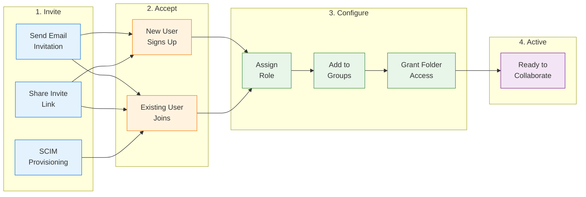
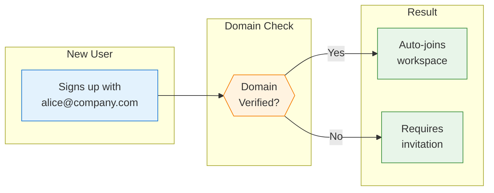
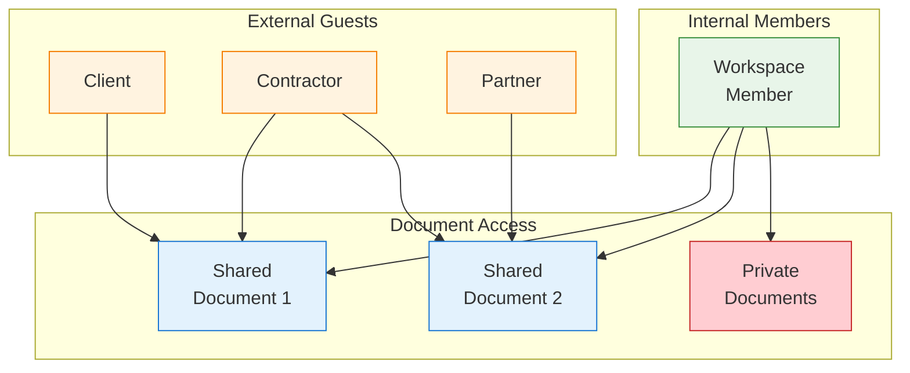

Collaboration is at the heart of Materi. This guide shows you how to invite team members, assign appropriate roles, and manage access effectively.

## Invitation Flow Overview



## Prerequisites

Before inviting team members:

<CardGroup cols={2}>
  <Card title="Admin or Owner Role" icon="crown">
    You need Admin or Owner permissions to invite members
  </Card>
  <Card title="Available Seats" icon="chair">
    Ensure your plan has available seats for new members
  </Card>
</CardGroup>

## Inviting Team Members

### Method 1: Email Invitations

The most common way to add team members:

<Steps>
  <Step title="Open Team Settings">
    1. Click your **workspace name** in the top left
    2. Select **Settings** > **Members**
    3. Or navigate directly: `Cmd/Ctrl + ,` → Members
  </Step>

  <Step title="Send Invitations">
    1. Click **Invite Members** or **+ Add**
    2. Enter email addresses (one per line or comma-separated)
    3. Select a default role for all invitees
    4. Add an optional personal message
    5. Click **Send Invitations**

    ```
    alice@company.com
    bob@company.com
    carol@company.com
    ```

    <Tip>
    **Bulk import:** Click **Import from CSV** to upload a list of emails with roles:
    ```csv
    email,role
    alice@company.com,editor
    bob@company.com,viewer
    carol@company.com,admin
    ```
    </Tip>
  </Step>

  <Step title="Track Invitation Status">
    View pending invitations in the **Pending** tab:

    | Status | Meaning | Action |
    |--------|---------|--------|
    | **Pending** | Invitation sent, not yet accepted | Resend or revoke |
    | **Expired** | Invitation expired (7 days) | Send new invitation |
    | **Accepted** | User joined workspace | Configure role |
    | **Bounced** | Email delivery failed | Verify email address |
  </Step>
</Steps>

### Method 2: Invite Links

Share a link that anyone can use to join:

<Steps>
  <Step title="Generate Invite Link">
    1. Go to **Settings** > **Members**
    2. Click **Create Invite Link**
    3. Configure link settings:
       - **Default role**: Role assigned to new members
       - **Expiration**: 24 hours, 7 days, 30 days, or never
       - **Max uses**: Unlimited or specific number
    4. Click **Create Link**
  </Step>

  <Step title="Share the Link">
    Copy the generated link and share via:
    - Slack channel announcement
    - Email to distribution list
    - Internal wiki or onboarding docs
    - Calendar invite for new hires
  </Step>

  <Step title="Manage Active Links">
    View and manage all active links:

    | Action | Description |
    |--------|-------------|
    | **Copy** | Copy link to clipboard |
    | **Edit** | Change role or expiration |
    | **Disable** | Temporarily pause the link |
    | **Delete** | Permanently remove the link |

    <Warning>
    Invite links can be used by anyone with access. Use email invitations for sensitive workspaces.
    </Warning>
  </Step>
</Steps>

### Method 3: Domain Auto-Join (Enterprise)

Allow anyone with a company email to join automatically:

1. Go to **Settings** > **Security** > **Domain Settings**
2. Click **Add Domain**
3. Enter your company domain (e.g., `company.com`)
4. Verify domain ownership via DNS TXT record
5. Enable **Auto-join** and set default role
6. Users with `@company.com` emails can now join without invitation



### Method 4: SCIM Provisioning (Enterprise)

Automatically sync users from your identity provider:

<Tabs>
  <Tab title="Setup">
    1. Navigate to **Settings** > **Security** > **SCIM**
    2. Click **Enable SCIM**
    3. Copy the **SCIM Base URL** and **Bearer Token**
    4. Configure your IdP with these credentials
    5. Map user attributes (email, name, role)
  </Tab>

  <Tab title="Supported IdPs">
    - Okta
    - Azure Active Directory
    - OneLogin
    - JumpCloud
    - Google Workspace
    - Custom SCIM 2.0 endpoints
  </Tab>

  <Tab title="Benefits">
    - **Automatic provisioning**: New employees get access immediately
    - **Automatic deprovisioning**: Departing employees lose access
    - **Group sync**: IdP groups map to Materi roles
    - **Centralized management**: Single source of truth
  </Tab>
</Tabs>

## Understanding Roles

Assign the right role based on what each member needs to do:

```mermaid
flowchart TB
    subgraph Roles["Workspace Roles"]
        direction LR
        OWNER["Owner"]
        ADMIN["Admin"]
        EDITOR["Editor"]
        COMMENTER["Commenter"]
        VIEWER["Viewer"]
        GUEST["Guest"]
    end

    OWNER -->|"Full control"| ADMIN
    ADMIN -->|"Manage members"| EDITOR
    EDITOR -->|"Create & edit"| COMMENTER
    COMMENTER -->|"Comment only"| VIEWER
    VIEWER -->|"Read only"| GUEST

    classDef owner fill:#4caf50,stroke:#2e7d32,color:#fff
    classDef admin fill:#2196f3,stroke:#1565c0,color:#fff
    classDef editor fill:#9c27b0,stroke:#7b1fa2,color:#fff
    classDef commenter fill:#ff9800,stroke:#ef6c00,color:#fff
    classDef viewer fill:#607d8b,stroke:#455a64,color:#fff
    classDef guest fill:#9e9e9e,stroke:#616161,color:#fff

    class OWNER owner
    class ADMIN admin
    class EDITOR editor
    class COMMENTER commenter
    class VIEWER viewer
    class GUEST guest
```



### Role Permissions Matrix

| Permission | Owner | Admin | Editor | Commenter | Viewer | Guest |
|------------|:-----:|:-----:|:------:|:---------:|:------:|:-----:|
| View documents | Yes | Yes | Yes | Yes | Yes | Limited |
| Edit documents | Yes | Yes | Yes | No | No | No |
| Create documents | Yes | Yes | Yes | No | No | No |
| Delete documents | Yes | Yes | Own only | No | No | No |
| Comment | Yes | Yes | Yes | Yes | No | No |
| Share documents | Yes | Yes | Yes | No | No | No |
| Manage members | Yes | Yes | No | No | No | No |
| Workspace settings | Yes | Yes | No | No | No | No |
| Billing | Yes | No | No | No | No | No |
| Transfer ownership | Yes | No | No | No | No | No |

### Role Descriptions

<AccordionGroup>
  <Accordion title="Owner">
    **Full control over the workspace**
    - All permissions including billing and ownership transfer
    - Cannot be removed (must transfer ownership first)
    - Only one owner per workspace
    - Best for: Workspace creator, account administrator
  </Accordion>

  <Accordion title="Admin">
    **Manage workspace and members**
    - All content permissions
    - Invite and remove members
    - Configure workspace settings
    - Cannot access billing or transfer ownership
    - Best for: Team leads, department heads
  </Accordion>

  <Accordion title="Editor">
    **Create and edit content**
    - Create, edit, and delete own documents
    - Share documents with others
    - Full commenting capabilities
    - Cannot manage members or settings
    - Best for: Most team members
  </Accordion>

  <Accordion title="Commenter">
    **Review and provide feedback**
    - View all accessible documents
    - Add and resolve comments
    - Cannot create or edit documents
    - Best for: Reviewers, stakeholders
  </Accordion>

  <Accordion title="Viewer">
    **Read-only access**
    - View documents shared with them
    - Cannot comment or edit
    - Best for: Executives, external stakeholders
  </Accordion>

  <Accordion title="Guest">
    **Limited external access**
    - Access only explicitly shared documents
    - No workspace-wide visibility
    - Email domain outside organization
    - Best for: Clients, contractors, partners
  </Accordion>
</AccordionGroup>

## Managing Team Members

### Change a Member's Role

1. Go to **Settings** > **Members**
2. Find the member in the list
3. Click the role dropdown next to their name
4. Select the new role
5. Changes take effect immediately

<Note>
Members receive an email notification when their role changes.
</Note>

### Remove a Member

1. Go to **Settings** > **Members**
2. Find the member to remove
3. Click **...** > **Remove from workspace**
4. Confirm removal

**What happens when a member is removed:**
- Immediate loss of workspace access
- Documents they own remain (ownership can be transferred)
- Comments and history are preserved
- They can be re-invited later

### Transfer Document Ownership

When someone leaves, transfer their documents:

1. Go to **Settings** > **Members**
2. Click on the departing member
3. Click **Transfer Content**
4. Select the new owner
5. Choose which documents to transfer
6. Click **Transfer**

## Working with Groups

Organize members into groups for easier permission management:

<Steps>
  <Step title="Create a Group">
    1. Go to **Settings** > **Groups**
    2. Click **Create Group**
    3. Enter group name (e.g., "Engineering", "Marketing")
    4. Add an optional description
    5. Click **Create**
  </Step>

  <Step title="Add Members to Groups">
    Add members to groups:
    - From the group page: Click **Add Members**
    - From member profile: Click **Add to Group**
    - Via SCIM: Map IdP groups automatically
  </Step>

  <Step title="Assign Group Permissions">
    Grant folder access to entire groups:

    1. Navigate to a folder
    2. Click **Share** > **Add people or groups**
    3. Search for the group name
    4. Select permission level
    5. All group members inherit access
  </Step>
</Steps>

### Group Best Practices

| Scenario | Recommended Groups |
|----------|-------------------|
| By department | Engineering, Product, Marketing, Sales |
| By project | Project Alpha Team, Launch Committee |
| By access level | All Hands, Leadership, Contractors |
| By location | SF Office, NYC Office, Remote |

## Guest Access

Invite external collaborators without full workspace access:



### Inviting Guests

1. Open the document to share
2. Click **Share**
3. Enter the guest's email address
4. Select permission: **Can view**, **Can comment**, or **Can edit**
5. Click **Send**

### Guest Limitations

| Feature | Full Member | Guest |
|---------|:-----------:|:-----:|
| See workspace sidebar | Yes | No |
| Browse all documents | Yes | No |
| Access shared documents | Yes | Yes |
| Create new documents | Yes | No |
| See other members | Yes | Limited |
| Use templates | Yes | No |
| Access integrations | Yes | No |

## Invitation Email Templates

Customize the invitation email sent to new members:

<Tabs>
  <Tab title="Default Template">
    ```
    Subject: You're invited to join [Workspace Name] on Materi

    Hi there,

    [Inviter Name] has invited you to collaborate in [Workspace Name] on Materi.

    Click the button below to accept your invitation and get started.

    [Accept Invitation Button]

    If you have questions, reach out to [Inviter Email].
    ```
  </Tab>

  <Tab title="Custom Template">
    Customize on Enterprise plans:

    1. Go to **Settings** > **Branding** > **Email Templates**
    2. Select **Invitation Email**
    3. Edit subject line and body
    4. Use variables: `{{inviter_name}}`, `{{workspace_name}}`, `{{role}}`
    5. Preview and save
  </Tab>
</Tabs>

## Troubleshooting

<AccordionGroup>
  <Accordion title="Invitation email not received">
    1. Check spam/junk folders
    2. Verify the email address is correct
    3. Ask them to add `noreply@materi.com` to contacts
    4. Resend the invitation
    5. Try using an invite link instead
  </Accordion>

  <Accordion title="Can't change member's role">
    1. Verify you have Admin or Owner permissions
    2. Owner role can only be transferred, not assigned
    3. Check if SCIM is controlling roles (Enterprise)
  </Accordion>

  <Accordion title="Invite link not working">
    1. Check if the link has expired
    2. Verify the link hasn't reached max uses
    3. Ensure the link hasn't been disabled
    4. Generate a new link
  </Accordion>

  <Accordion title="Guest can't access shared document">
    1. Verify the share was sent to correct email
    2. Check if guest has accepted the invitation
    3. Ensure document permissions allow guest access
    4. Check workspace guest settings aren't restricted
  </Accordion>

  <Accordion title="SCIM sync not working">
    1. Verify SCIM endpoint URL is correct
    2. Check bearer token hasn't expired
    3. Review IdP SCIM logs for errors
    4. Ensure attribute mapping is correct
    5. Contact support with debug info
  </Accordion>
</AccordionGroup>

## Invitation Checklist

Use this checklist when onboarding new team members:

- [ ] Send invitation (email or link)
- [ ] Assign appropriate role
- [ ] Add to relevant groups
- [ ] Share key folders/documents
- [ ] Send onboarding document link
- [ ] Schedule optional intro call
- [ ] Verify they can access needed content

## Next Steps

<CardGroup cols={2}>
  <Card title="Roles & Permissions" icon="shield" href="/customer/workspaces/roles-permissions">
    Deep dive into permission management
  </Card>
  <Card title="Collaboration Features" icon="users" href="/customer/collaboration/overview">
    Learn how to work together effectively
  </Card>
  <Card title="Security Settings" icon="lock" href="/customer/security/overview">
    Configure security for your team
  </Card>
  <Card title="Integrations" icon="plug" href="/customer/integrations/overview">
    Connect your team's other tools
  </Card>
</CardGroup>
