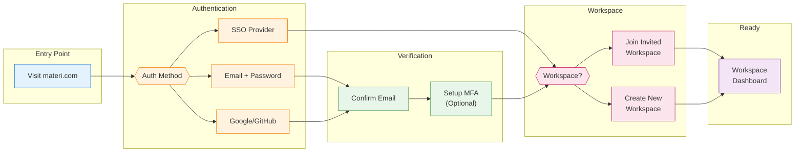

Get started with Materi in just a few minutes. This guide walks you through creating your account and accessing your first workspace.

## Sign-Up Flow Overview

## Prerequisites

<CardGroup cols={2}>
  <Card title="Email Address" icon="envelope">
    A valid email address you have access to for verification
  </Card>
  <Card title="SSO Access" icon="key">
    If your organization uses SSO, ensure you can access your identity provider
  </Card>
</CardGroup>

## Step-by-Step Guide

<Steps>
  <Step title="Navigate to Sign Up">
    Go to [app.materi.com/signup](https://app.materi.com/signup) or click **Get Started** on the Materi homepage.

    <Tip>
    If you received an invite link from a teammate, use that link instead - it will automatically connect you to their workspace.
    </Tip>
  </Step>

  <Step title="Choose Your Sign-Up Method">
    Select your preferred authentication method:

    <Tabs>
      <Tab title="Email + Password">
        1. Enter your email address
        2. Create a strong password (minimum 12 characters)
        3. Click **Create Account**

        <Note>
        Password requirements:
        - At least 12 characters
        - Mix of uppercase and lowercase letters
        - At least one number
        - At least one special character
        </Note>
      </Tab>

      <Tab title="Google">
        1. Click **Continue with Google**
        2. Select your Google account
        3. Review permissions and click **Allow**
      </Tab>

      <Tab title="GitHub">
        1. Click **Continue with GitHub**
        2. Sign in to GitHub if prompted
        3. Authorize Materi to access your account
      </Tab>

      <Tab title="Enterprise SSO">
        1. Enter your work email address
        2. Click **Continue with SSO**
        3. You'll be redirected to your organization's identity provider
        4. Complete authentication with your corporate credentials

        <Info>
        Your IT administrator configures SSO. If you're unsure whether your organization uses SSO, contact your IT team.
        </Info>
      </Tab>
    </Tabs>
  </Step>

  <Step title="Verify Your Email">
    If you signed up with email/password or OAuth:

    1. Check your inbox for a verification email from **noreply@materi.com**
    2. Click the **Verify Email** button in the email
    3. You'll be redirected back to Materi

    <Warning>
    The verification link expires after 24 hours. If it expires, you can request a new one from the sign-in page.
    </Warning>
  </Step>

  <Step title="Set Up Multi-Factor Authentication (Recommended)">
    For enhanced security, we recommend enabling MFA:

    1. Download an authenticator app (Google Authenticator, Authy, 1Password)
    2. Scan the QR code displayed on screen
    3. Enter the 6-digit code from your authenticator
    4. Save your backup codes in a secure location

    <Tip>
    Enterprise plans can enforce MFA for all users. See [Security Settings](/customer/security/authentication) for details.
    </Tip>
  </Step>

  <Step title="Join or Create a Workspace">
    After verification, you'll be prompted to join or create a workspace:

    <AccordionGroup>
      <Accordion title="I was invited to a workspace">
        If you received an invitation:
        1. You'll see pending invitations listed
        2. Click **Accept** to join the workspace
        3. You'll be taken directly to the workspace dashboard
      </Accordion>

      <Accordion title="I need to create a new workspace">
        To create your own workspace:
        1. Click **Create Workspace**
        2. Enter a workspace name (e.g., "Acme Corp" or "Marketing Team")
        3. Choose your workspace URL slug
        4. Select your plan (Free, Team, or Enterprise)
        5. Click **Create**
      </Accordion>

      <Accordion title="My company already uses Materi">
        If your organization uses Materi with SSO:
        1. You'll be automatically added to the correct workspace
        2. Your permissions are managed by your IT administrator
        3. Contact your admin if you need access to additional workspaces
      </Accordion>
    </AccordionGroup>
  </Step>
</Steps>

## What Happens Next

Once you're in your workspace, you're ready to:

<CardGroup cols={3}>
  <Card title="Create Your First Document" icon="file-plus" href="/customer/getting-started/first-document">
    Start collaborating with your team
  </Card>
  <Card title="Configure Your Workspace" icon="gear" href="/customer/getting-started/workspace-setup">
    Customize settings and preferences
  </Card>
  <Card title="Invite Team Members" icon="user-plus" href="/customer/getting-started/invite-team">
    Bring your colleagues on board
  </Card>
</CardGroup>

## Account Settings

After signing up, you can customize your account:

| Setting | Description | Location |
|---------|-------------|----------|
| **Display Name** | How your name appears to collaborators | Profile > General |
| **Avatar** | Your profile picture | Profile > General |
| **Email Notifications** | Control email frequency | Profile > Notifications |
| **Theme** | Light, dark, or system theme | Profile > Appearance |
| **Timezone** | For scheduling and timestamps | Profile > General |
| **Language** | Interface language | Profile > General |

## Troubleshooting

<AccordionGroup>
  <Accordion title="I didn't receive the verification email">
    1. Check your spam/junk folder
    2. Add `noreply@materi.com` to your contacts
    3. Wait a few minutes - emails can be delayed
    4. Click **Resend verification email** on the sign-in page
    5. If using a corporate email, check with IT about email filtering
  </Accordion>

  <Accordion title="My organization requires SSO but I can't connect">
    1. Ensure you're using your work email address
    2. Try accessing your company's SSO portal directly first
    3. Clear your browser cache and cookies
    4. Contact your IT administrator - they may need to provision your account
  </Accordion>

  <Accordion title="I can sign in but don't see my team's workspace">
    1. Confirm you used the same email address as your invitation
    2. Check if you have multiple Materi accounts
    3. Ask your team admin to resend the invitation
    4. Look in Settings > Workspaces for pending invitations
  </Accordion>

  <Accordion title="The verification link expired">
    1. Go to [app.materi.com/signin](https://app.materi.com/signin)
    2. Enter your email address
    3. Click **Resend verification email**
    4. Check your inbox for the new link
  </Accordion>

  <Accordion title="I forgot my password during sign-up">
    1. Go to [app.materi.com/forgot-password](https://app.materi.com/forgot-password)
    2. Enter your email address
    3. Click the reset link in your email
    4. Create a new password
  </Accordion>
</AccordionGroup>

## Security Best Practices

<Tip>
**Protect your account from day one:**

1. **Use a unique password** - Don't reuse passwords from other services
2. **Enable MFA** - Adds an extra layer of protection
3. **Verify the URL** - Always ensure you're on `app.materi.com`
4. **Don't share credentials** - Each team member should have their own account
5. **Review active sessions** - Periodically check Profile > Security > Active Sessions
</Tip>

## Next Steps

<Card title="Create Your First Document" icon="arrow-right" href="/customer/getting-started/first-document">
  Now that you're signed up, let's create your first document and start collaborating.
</Card>
