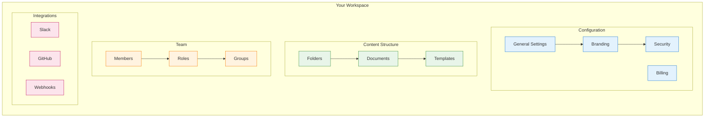
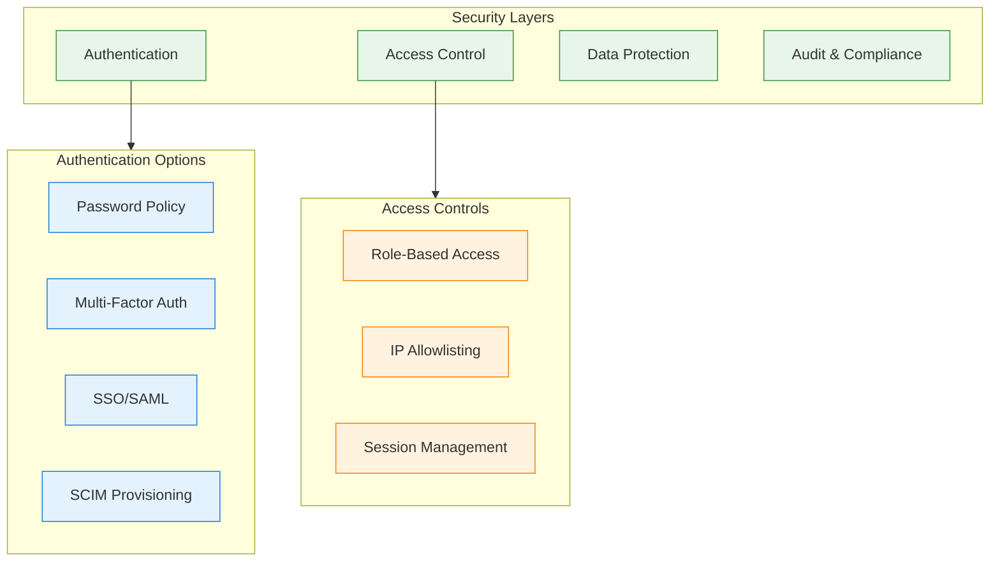

Your workspace is the central hub for your team's content. This guide walks you through configuring it for optimal productivity.

## Workspace Architecture



## Accessing Workspace Settings

1. Click the **workspace name** in the top left corner
2. Select **Settings** from the dropdown menu
3. Or use the keyboard shortcut: `Cmd/Ctrl + ,`

<Note>
You need **Admin** or **Owner** permissions to access most workspace settings.
</Note>

## General Settings

<Steps>
  <Step title="Workspace Name & URL">
    Configure your workspace identity:

    | Setting | Description | Example |
    |---------|-------------|---------|
    | **Workspace Name** | Display name shown to members | "Acme Corporation" |
    | **Workspace URL** | Unique slug for your workspace | `acme-corp.materi.com` |
    | **Description** | Brief description of the workspace | "Marketing team collaboration hub" |

    <Warning>
    Changing the workspace URL will break existing shared links. Redirect rules can be set up on Enterprise plans.
    </Warning>
  </Step>

  <Step title="Default Permissions">
    Set default sharing behavior for new documents:

    <Tabs>
      <Tab title="Private (Default)">
        - New documents are only visible to the creator
        - Must be explicitly shared with others
        - Best for: Sensitive organizations, draft-heavy workflows
      </Tab>

      <Tab title="Workspace Visible">
        - All workspace members can view new documents
        - Editing still requires explicit permission
        - Best for: Transparent teams, knowledge bases
      </Tab>

      <Tab title="Workspace Editable">
        - All workspace members can edit new documents
        - Maximum collaboration, minimum friction
        - Best for: Small teams, agile environments
      </Tab>
    </Tabs>

    ```mermaid
    flowchart LR
        subgraph Default["Default Permission Levels"]
            PRIVATE["Private<br/>Creator only"]
            VISIBLE["Workspace Visible<br/>Everyone can view"]
            EDITABLE["Workspace Editable<br/>Everyone can edit"]
        end

        PRIVATE -.->|"Lower friction"| VISIBLE
        VISIBLE -.->|"More open"| EDITABLE

        classDef private fill:#ffcdd2,stroke:#c62828
        classDef visible fill:#fff9c4,stroke:#f9a825
        classDef editable fill:#c8e6c9,stroke:#2e7d32

        class PRIVATE private
        class VISIBLE visible
        class EDITABLE editable
    ```
  </Step>

  <Step title="Regional Settings">
    Configure locale preferences:

    | Setting | Options | Impact |
    |---------|---------|--------|
    | **Timezone** | All standard timezones | Affects timestamps, scheduling |
    | **Date Format** | MM/DD/YYYY, DD/MM/YYYY, YYYY-MM-DD | Display format across workspace |
    | **Week Start** | Sunday, Monday | Calendar and scheduling views |
    | **Language** | 20+ languages | Interface language for new members |
  </Step>
</Steps>

## Branding & Appearance

Customize your workspace's look and feel:

<AccordionGroup>
  <Accordion title="Logo & Colors">
    **Logo Upload:**
    - Recommended size: 200x50 pixels (SVG preferred)
    - Appears in the sidebar and workspace switcher
    - Falls back to workspace initials if not set

    **Primary Color:**
    - Used for buttons, links, and accents
    - Enter a hex code (e.g., `#4A90E2`)
    - Or use the color picker

    **Sidebar Theme:**
    - Light: Clean, bright appearance
    - Dark: Reduced eye strain, modern look
    - System: Follows user's OS preference
  </Accordion>

  <Accordion title="Custom Domain (Enterprise)">
    Use your own domain for workspace access:

    1. Navigate to **Settings > Branding > Custom Domain**
    2. Enter your desired domain (e.g., `docs.acme.com`)
    3. Add the provided CNAME record to your DNS
    4. Wait for SSL certificate provisioning (up to 24 hours)
    5. Once verified, your workspace is accessible at your domain

    <Info>
    Custom domains are available on Enterprise plans. Contact sales for more information.
    </Info>
  </Accordion>

  <Accordion title="Email Branding">
    Customize notification emails:

    - **From Name**: "Acme Team" instead of "Materi"
    - **Reply-To Address**: `team@acme.com`
    - **Email Footer**: Custom legal text or unsubscribe info
    - **Logo in Emails**: Include your logo in email headers
  </Accordion>
</AccordionGroup>

## Security Settings

Protect your workspace with robust security controls:



### Authentication

<Tabs>
  <Tab title="Password Policy">
    Configure password requirements:

    | Setting | Options | Recommendation |
    |---------|---------|----------------|
    | **Minimum Length** | 8-128 characters | 12+ characters |
    | **Complexity** | Require numbers, symbols | Enable all |
    | **Expiration** | Never, 30/60/90 days | 90 days for regulated industries |
    | **History** | Prevent last N passwords | 5 passwords |
  </Tab>

  <Tab title="Multi-Factor Authentication">
    MFA options:

    - **Optional**: Users can enable MFA individually
    - **Required for Admins**: Admins must use MFA
    - **Required for All**: All users must enable MFA

    Supported MFA methods:
    - Authenticator apps (TOTP)
    - SMS codes (less secure, not recommended)
    - Hardware keys (FIDO2/WebAuthn)
  </Tab>

  <Tab title="SSO Configuration">
    Connect to your identity provider:

    1. Navigate to **Settings > Security > SSO**
    2. Select your IdP: Okta, Azure AD, Google Workspace, OneLogin, or Custom SAML
    3. Enter your IdP metadata URL or upload metadata XML
    4. Configure attribute mapping
    5. Test the connection
    6. Enable for all users or specific domains

    <Info>
    See [SSO/SAML Setup](/enterprise/security/sso-saml) for detailed instructions.
    </Info>
  </Tab>
</Tabs>

### Access Controls

| Feature | Description | Plan |
|---------|-------------|------|
| **IP Allowlisting** | Restrict access to specific IP ranges | Enterprise |
| **Session Timeout** | Auto-logout after inactivity | All plans |
| **Concurrent Sessions** | Limit active sessions per user | Enterprise |
| **Device Trust** | Require approved devices | Enterprise |

## Content Organization

Set up a logical structure for your workspace:

<Steps>
  <Step title="Create Folder Structure">
    Organize documents into folders:

    ```
    Workspace
    ├── Engineering
    │   ├── RFCs
    │   ├── Runbooks
    │   └── Architecture
    ├── Product
    │   ├── PRDs
    │   ├── Roadmaps
    │   └── Research
    ├── Marketing
    │   ├── Campaigns
    │   └── Brand Assets
    └── Company
        ├── Policies
        └── Announcements
    ```

    **Create folders:**
    1. Right-click in the sidebar
    2. Select **New Folder**
    3. Name the folder
    4. Drag documents into folders
  </Step>

  <Step title="Set Folder Permissions">
    Control access at the folder level:

    | Permission | Capability |
    |------------|------------|
    | **Inherit** | Uses parent folder/workspace permissions |
    | **View Only** | Members can read but not edit |
    | **Edit** | Members can create and edit documents |
    | **Manage** | Members can change folder settings |

    <Tip>
    Set permissions at the folder level to avoid managing individual document permissions.
    </Tip>
  </Step>

  <Step title="Configure Templates">
    Create reusable document templates:

    1. Create a document with your desired structure
    2. Click **...** > **Save as Template**
    3. Add a template name and description
    4. Choose visibility: Personal, Team, or Workspace
    5. Optionally set a default folder for new documents

    Popular template categories:
    - Meeting notes
    - Project briefs
    - Technical specs
    - Status updates
    - Interview feedback
  </Step>
</Steps>

## Notifications & Preferences

Configure how your team stays informed:

<AccordionGroup>
  <Accordion title="Email Notifications">
    Set workspace-wide email defaults:

    | Notification | Default | Configurable |
    |--------------|---------|--------------|
    | Document shared with you | On | Yes |
    | Mentioned in comment | On | Yes |
    | Comment on your document | On | Yes |
    | Weekly digest | On | Yes |
    | Product updates | Off | Yes |
  </Accordion>

  <Accordion title="Slack Integration">
    Connect Slack for real-time notifications:

    1. Go to **Settings > Integrations > Slack**
    2. Click **Connect to Slack**
    3. Authorize Materi in Slack
    4. Configure notification channels:
       - Document updates → #docs-updates
       - Comments → #document-comments
       - Mentions → DM to user

    See [Slack Integration](/customer/integrations/slack) for detailed setup.
  </Accordion>

  <Accordion title="In-App Notifications">
    Configure the notification center:

    - **Desktop notifications**: Browser push notifications
    - **Sound alerts**: Audio for mentions
    - **Badge counts**: Unread indicator on browser tab
  </Accordion>
</AccordionGroup>

## Integrations

Connect your workspace to other tools:

<CardGroup cols={3}>
  <Card title="GitHub" icon="github" href="/customer/integrations/github">
    Link repositories, embed code, sync issues
  </Card>
  <Card title="Slack" icon="slack" href="/customer/integrations/slack">
    Notifications, sharing, slash commands
  </Card>
  <Card title="Google Drive" icon="google-drive" href="/customer/integrations/google-drive">
    Import docs, embed files, sync folders
  </Card>
  <Card title="Notion" icon="n" href="/customer/integrations/notion">
    Import pages, migrate workspaces
  </Card>
  <Card title="Webhooks" icon="webhook" href="/customer/integrations/webhooks">
    Custom integrations, automation triggers
  </Card>
  <Card title="API" icon="code" href="/api/introduction/overview">
    Build custom integrations
  </Card>
</CardGroup>

## Billing & Plans

Manage your subscription:

| Section | Description |
|---------|-------------|
| **Current Plan** | View your plan tier and features |
| **Usage** | Monitor seats, storage, and API calls |
| **Invoices** | Download past invoices |
| **Payment Method** | Update credit card or billing info |
| **Upgrade/Downgrade** | Change your plan |

<Info>
See [Billing](/customer/workspaces/billing) for detailed billing management.
</Info>

## Workspace Setup Checklist

Use this checklist to ensure your workspace is properly configured:

<Steps>
  <Step title="Basic Setup">
    - [ ] Set workspace name and URL
    - [ ] Upload logo
    - [ ] Set primary brand color
    - [ ] Configure timezone and date format
  </Step>

  <Step title="Security">
    - [ ] Set password policy
    - [ ] Enable MFA requirement
    - [ ] Configure SSO (if applicable)
    - [ ] Set session timeout
  </Step>

  <Step title="Organization">
    - [ ] Create folder structure
    - [ ] Set default permissions
    - [ ] Create initial templates
    - [ ] Configure guest access policy
  </Step>

  <Step title="Integrations">
    - [ ] Connect Slack
    - [ ] Set up GitHub integration
    - [ ] Configure webhooks (if needed)
    - [ ] Test all connections
  </Step>

  <Step title="Team">
    - [ ] Define roles and permissions
    - [ ] Invite team members
    - [ ] Assign roles
    - [ ] Send onboarding materials
  </Step>
</Steps>

## Troubleshooting

<AccordionGroup>
  <Accordion title="I can't access workspace settings">
    1. Verify you have Admin or Owner role
    2. Check if your account is active
    3. Contact your workspace owner for permission
  </Accordion>

  <Accordion title="SSO configuration isn't working">
    1. Verify IdP metadata is correct
    2. Check attribute mapping matches your IdP
    3. Ensure the user exists in both systems
    4. Review SSO debug logs in **Settings > Security > SSO > Logs**
  </Accordion>

  <Accordion title="Custom domain shows certificate error">
    1. Verify CNAME record is correctly configured
    2. Wait up to 24 hours for SSL provisioning
    3. Check domain isn't already in use elsewhere
    4. Contact support if issues persist
  </Accordion>
</AccordionGroup>

## Next Steps

<CardGroup cols={2}>
  <Card title="Invite Your Team" icon="user-plus" href="/customer/getting-started/invite-team">
    Add team members and configure their roles
  </Card>
  <Card title="Roles & Permissions" icon="shield" href="/customer/workspaces/roles-permissions">
    Deep dive into permission management
  </Card>
  <Card title="Security Best Practices" icon="lock" href="/customer/security/overview">
    Learn about advanced security features
  </Card>
  <Card title="Integrations Guide" icon="plug" href="/customer/integrations/overview">
    Connect your favorite tools
  </Card>
</CardGroup>
