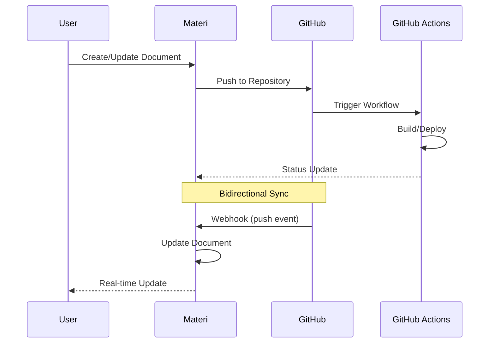

# GitHub Integration

The GitHub integration enables powerful bidirectional synchronization between your Materi workspace and GitHub repositories. Sync documentation to your codebase, trigger workflows on content changes, and maintain version-controlled content with full commit history.

## Integration Architecture



## Features

<CardGroup cols={2}>
  <Card title="Repository Sync" icon="code-branch">
    Automatically sync documentation to GitHub repositories with configurable paths and branch strategies.
  </Card>
  <Card title="Pull Request Integration" icon="code-pull-request">
    Create pull requests for content changes and require approvals before publishing.
  </Card>
  <Card title="GitHub Actions" icon="play">
    Trigger custom workflows when content changes, enabling automated builds and deployments.
  </Card>
  <Card title="Version History" icon="clock-rotate-left">
    Full Git history for all content changes with the ability to view diffs and restore previous versions.
  </Card>
</CardGroup>

## Prerequisites

Before setting up the GitHub integration, ensure you have:

- A GitHub account with repository access
- Admin or Maintainer permissions on the target repository
- Materi workspace with Editor or Admin role

## Setup Instructions

<Steps>
  <Step title="Navigate to Integrations">
    Go to **Settings > Integrations** in your Materi workspace and locate the GitHub integration card.
  </Step>
  <Step title="Connect GitHub Account">
    Click **Connect** to initiate the OAuth flow. You'll be redirected to GitHub to authorize Materi.

    <Note>
    Materi requests the following permissions:
    - `repo` - Full repository access for sync operations
    - `workflow` - Trigger GitHub Actions workflows
    - `read:org` - Read organization membership (for org repos)
    </Note>
  </Step>
  <Step title="Select Repository">
    After authorization, select the repository you want to connect. You can connect multiple repositories to different workspaces.
  </Step>
  <Step title="Configure Sync Settings">
    Configure your synchronization preferences:

    | Setting | Description | Default |
    |---------|-------------|---------|
    | Target Branch | Branch for content sync | `main` |
    | Base Path | Directory for documentation | `/docs` |
    | Auto-sync | Enable automatic sync on save | `true` |
    | Create PRs | Use pull requests for changes | `false` |
    | Commit Author | Use Materi user or bot account | `user` |
  </Step>
  <Step title="Test Connection">
    Click **Test Connection** to verify the integration is working correctly. Materi will create a test file in your repository.
  </Step>
</Steps>

## Configuration Options

<Tabs>
  <Tab title="Sync Settings">
    ### Synchronization Configuration

    | Option | Type | Description |
    |--------|------|-------------|
    | `target_branch` | string | Branch to sync content to |
    | `base_path` | string | Directory path in repository |
    | `file_format` | enum | Output format: `mdx`, `md`, `json` |
    | `auto_sync` | boolean | Sync on document save |
    | `sync_interval` | integer | Minutes between auto-syncs (if enabled) |
    | `include_frontmatter` | boolean | Include Materi frontmatter in files |
    | `preserve_local_changes` | boolean | Keep changes made directly in Git |

    ```json
    {
      "sync": {
        "target_branch": "main",
        "base_path": "docs/",
        "file_format": "mdx",
        "auto_sync": true,
        "sync_interval": 5,
        "include_frontmatter": true,
        "preserve_local_changes": false
      }
    }
    ```
  </Tab>

  <Tab title="Branch Strategy">
    ### Branch Configuration

    Choose from three branch strategies based on your workflow:

    **Direct Commit** (Default)
    - Changes sync directly to the target branch
    - Best for documentation-only repositories
    - Fastest workflow with minimal overhead

    **Pull Request**
    - Each sync creates a new branch and PR
    - Enables review workflow for content changes
    - Recommended for production documentation

    **Feature Branches**
    - Syncs to feature branches matching workspace structure
    - Best for large documentation projects
    - Supports parallel editing of different sections

    ```json
    {
      "branch_strategy": {
        "mode": "pull_request",
        "pr_title_template": "[Materi] Update {{document.title}}",
        "pr_body_template": "Automated sync from Materi workspace",
        "auto_merge": false,
        "required_reviewers": ["@docs-team"]
      }
    }
    ```
  </Tab>

  <Tab title="File Mapping">
    ### Document to File Mapping

    Configure how Materi documents map to files in your repository:

    | Materi Structure | GitHub Path | Notes |
    |------------------|-------------|-------|
    | `/Getting Started` | `/docs/getting-started.md` | Slugified path |
    | `/API/Authentication` | `/docs/api/authentication.md` | Nested structure |
    | `/Guides/Quick Start` | `/docs/guides/quick-start.mdx` | MDX format |

    Custom path templates are supported:

    ```json
    {
      "file_mapping": {
        "path_template": "{{workspace.slug}}/{{document.path}}.{{format}}",
        "slug_separator": "-",
        "lowercase": true,
        "preserve_structure": true
      }
    }
    ```
  </Tab>
</Tabs>

## GitHub Actions Integration

Trigger custom workflows when Materi syncs content to your repository.

### Example Workflow

Create `.github/workflows/materi-deploy.yml` in your repository:

```yaml
name: Deploy Documentation

on:
  push:
    branches: [main]
    paths:
      - 'docs/**'

jobs:
  deploy:
    runs-on: ubuntu-latest
    steps:
      - uses: actions/checkout@v4

      - name: Setup Node.js
        uses: actions/setup-node@v4
        with:
          node-version: '20'

      - name: Install Dependencies
        run: npm ci

      - name: Build Documentation
        run: npm run build

      - name: Deploy to Production
        run: npm run deploy
        env:
          DEPLOY_TOKEN: ${{ secrets.DEPLOY_TOKEN }}

      - name: Notify Materi
        uses: materi/notify-action@v1
        with:
          materi_token: ${{ secrets.MATERI_TOKEN }}
          status: ${{ job.status }}
```

### Workflow Events

Materi can listen for GitHub Actions status updates:

| Event | Trigger | Payload |
|-------|---------|---------|
| `workflow_run.completed` | Workflow finishes | Status, conclusion, logs URL |
| `workflow_run.requested` | Workflow starts | Workflow name, triggered by |
| `check_run.completed` | Check completes | Status, conclusion, details |

## Webhook Events

GitHub sends webhook events to Materi for bidirectional sync:

### Incoming Events (GitHub to Materi)

```json
{
  "event": "push",
  "repository": {
    "full_name": "org/repo",
    "default_branch": "main"
  },
  "commits": [
    {
      "id": "abc123",
      "message": "Update getting-started.md",
      "added": [],
      "modified": ["docs/getting-started.md"],
      "removed": []
    }
  ],
  "sender": {
    "login": "username",
    "type": "User"
  }
}
```

### Outgoing Events (Materi to GitHub)

| Event | Trigger | Action |
|-------|---------|--------|
| `document.created` | New document | Create file in repository |
| `document.updated` | Document saved | Update file or create PR |
| `document.deleted` | Document removed | Delete file (configurable) |
| `document.published` | Document published | Merge PR or sync to production branch |

## Advanced Features

<AccordionGroup>
  <Accordion title="Conflict Resolution">
    When the same file is modified in both Materi and GitHub, conflicts can occur.

    **Resolution Strategies:**

    1. **Materi Wins** - Materi changes overwrite GitHub changes
    2. **GitHub Wins** - GitHub changes overwrite Materi content
    3. **Manual Merge** - Creates a PR with conflict markers for manual resolution
    4. **Latest Wins** - Most recent change takes precedence based on timestamp

    Configure in **Settings > Integrations > GitHub > Conflict Resolution**.
  </Accordion>

  <Accordion title="Selective Sync">
    Sync only specific documents or collections:

    ```json
    {
      "selective_sync": {
        "enabled": true,
        "include": [
          "/API/*",
          "/Guides/*"
        ],
        "exclude": [
          "/Internal/*",
          "*.draft"
        ]
      }
    }
    ```

    Use glob patterns to include or exclude documents from sync.
  </Accordion>

  <Accordion title="Commit Signing">
    Enable GPG commit signing for verified commits:

    1. Generate a GPG key or use Materi's managed key
    2. Add the public key to your GitHub account
    3. Enable commit signing in integration settings

    All commits from Materi will show as "Verified" in GitHub.
  </Accordion>

  <Accordion title="Monorepo Support">
    For monorepos with multiple documentation sources:

    ```json
    {
      "monorepo": {
        "enabled": true,
        "workspaces": {
          "api-docs": "packages/api/docs",
          "user-guides": "apps/web/docs",
          "admin-docs": "apps/admin/docs"
        }
      }
    }
    ```

    Each Materi workspace can map to a different directory in the same repository.
  </Accordion>
</AccordionGroup>

## Permissions Reference

| Permission | Scope | Purpose |
|------------|-------|---------|
| `repo` | Full access | Read/write repository contents |
| `repo:status` | Commit status | Update commit statuses |
| `repo_deployment` | Deployments | Trigger deployment events |
| `public_repo` | Public repos | Access public repositories only |
| `workflow` | Actions | Trigger GitHub Actions workflows |
| `read:org` | Organizations | Access organization membership |
| `admin:repo_hook` | Webhooks | Manage repository webhooks |

<Warning>
The `repo` permission grants full access to all repositories your account can access. For organization repositories, consider using a GitHub App with granular permissions instead.
</Warning>

## Troubleshooting

<AccordionGroup>
  <Accordion title="Sync Fails with 403 Error">
    **Cause:** Insufficient permissions or token expiration.

    **Solutions:**
    1. Disconnect and reconnect the integration
    2. Ensure you have write access to the repository
    3. Check if the repository allows third-party access
    4. For organization repos, ensure OAuth app access is approved
  </Accordion>

  <Accordion title="Files Not Appearing in Repository">
    **Cause:** Path configuration or branch mismatch.

    **Solutions:**
    1. Verify the `base_path` setting matches your repository structure
    2. Check you're looking at the correct branch
    3. Review sync logs for error messages
    4. Ensure the document isn't excluded by selective sync rules
  </Accordion>

  <Accordion title="Webhook Events Not Received">
    **Cause:** Webhook configuration or network issues.

    **Solutions:**
    1. Check webhook delivery status in GitHub repository settings
    2. Verify the webhook URL is correct
    3. Ensure the webhook secret matches
    4. Check for IP allowlist restrictions
  </Accordion>

  <Accordion title="Merge Conflicts on Every Sync">
    **Cause:** Bidirectional changes without proper conflict resolution.

    **Solutions:**
    1. Choose a clear sync direction (Materi or GitHub as source of truth)
    2. Use PR mode for reviewed changes
    3. Enable "preserve_local_changes" for GitHub-originated edits
    4. Consider using separate branches for different editing contexts
  </Accordion>
</AccordionGroup>

## Best Practices

<Tip>
**Use Branch Protection:** Enable branch protection rules on your main branch and use PR mode for content changes that require review.
</Tip>

<Tip>
**Meaningful Commit Messages:** Configure commit message templates to include document titles and change summaries for better Git history.
</Tip>

<Tip>
**Regular Sync Audits:** Periodically review sync logs to identify and resolve any recurring issues before they impact your workflow.
</Tip>

<Note>
**Rate Limits:** GitHub's API has rate limits of 5,000 requests per hour for authenticated users. Large sync operations are automatically batched to stay within limits.
</Note>

## Related Resources

- [Webhooks Integration](/integrations/webhooks) - Custom webhook configuration
- [API Reference](/api-reference/github) - GitHub integration API endpoints
- [GitHub Documentation](https://docs.github.com) - Official GitHub docs
