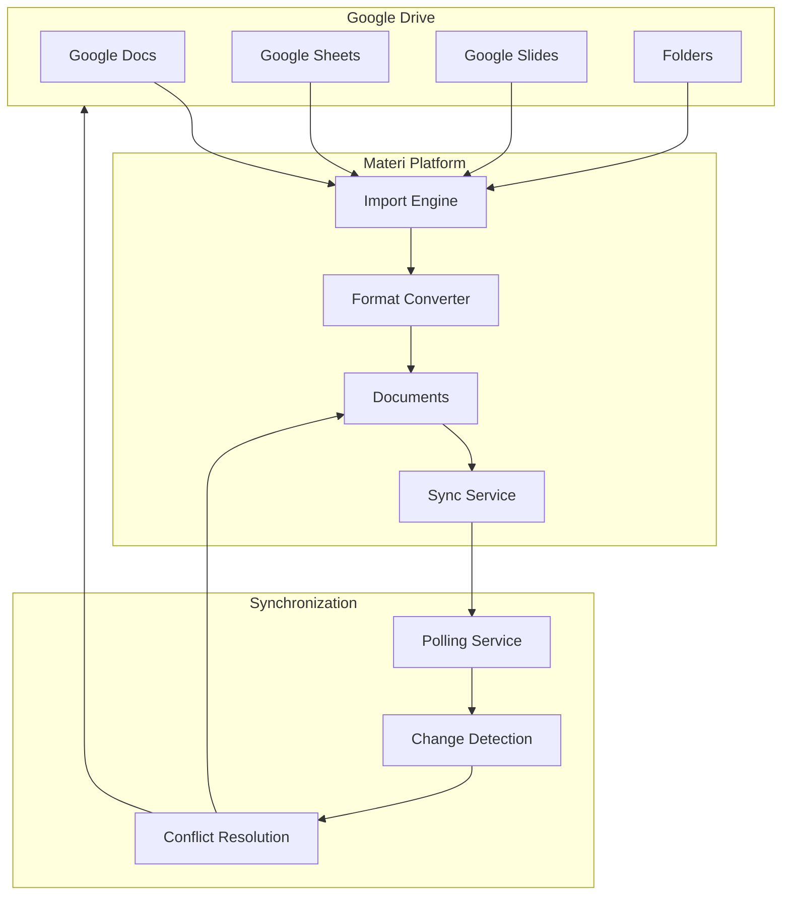
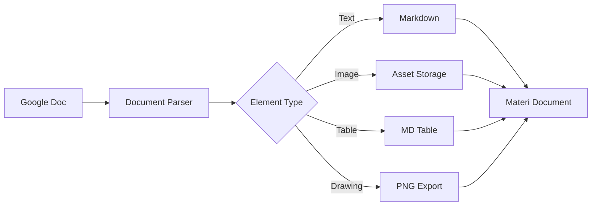

# Google Drive Integration

The Google Drive integration enables seamless import and synchronization of documents between Google Drive and Materi. Import existing Google Docs, Sheets, and Slides, maintain bidirectional sync, and collaborate across both platforms.

## Integration Architecture



## Features

<CardGroup cols={2}>
  <Card title="One-Click Import" icon="cloud-arrow-down">
    Import Google Docs, Sheets, and Slides with a single click while preserving formatting.
  </Card>
  <Card title="Folder Sync" icon="folder-open">
    Sync entire folders from Google Drive to maintain organized content hierarchies.
  </Card>
  <Card title="Bidirectional Updates" icon="arrows-rotate">
    Changes in either platform can sync to the other based on your configuration.
  </Card>
  <Card title="Format Conversion" icon="file-export">
    Automatic conversion between Google formats and Materi's native markdown.
  </Card>
</CardGroup>

## Supported File Types

| Google Format | Materi Format | Sync Support | Notes |
|--------------|---------------|--------------|-------|
| Google Docs | Markdown/MDX | Bidirectional | Full formatting preservation |
| Google Sheets | Tables/CSV | Import only | Complex formulas not supported |
| Google Slides | Documents | Import only | Converted to image + text |
| PDF | PDF viewer | Import only | Searchable text extracted |
| Images | Embedded assets | Import only | PNG, JPG, GIF, SVG |

## Prerequisites

Before setting up the Google Drive integration, ensure you have:

- A Google account with access to Google Drive
- Files you want to import accessible in your Drive
- Materi workspace with Editor or Admin role
- Google Workspace admin approval (for organization accounts)

## Setup Instructions

<Steps>
  <Step title="Navigate to Integrations">
    Go to **Settings > Integrations** in your Materi workspace and locate the Google Drive integration card.
  </Step>
  <Step title="Connect Google Account">
    Click **Connect with Google** to initiate the OAuth flow. You'll be redirected to Google to authorize Materi.

    <Note>
    Materi requests the following permissions:
    - View and manage files in Google Drive
    - View basic profile information
    - Maintain access when you're not using the app (for sync)
    </Note>
  </Step>
  <Step title="Select Sync Folders">
    Choose which folders or files to sync. You can select:
    - Specific folders for continuous sync
    - Individual files for one-time import
    - Shared drives (Google Workspace only)
  </Step>
  <Step title="Configure Sync Settings">
    Set up your synchronization preferences including sync direction, frequency, and conflict resolution.
  </Step>
  <Step title="Initial Import">
    Click **Start Import** to begin the initial synchronization. Large imports may take several minutes.
  </Step>
</Steps>

## Import Options

<Tabs>
  <Tab title="Single File Import">
    ### Import Individual Files

    For one-time imports without ongoing sync:

    1. Click **Import from Google Drive** in your workspace
    2. Browse or search for files
    3. Select files to import
    4. Choose destination folder in Materi
    5. Click **Import Selected**

    | Option | Description |
    |--------|-------------|
    | Preserve folder structure | Maintain Google Drive hierarchy |
    | Convert to Markdown | Convert Google Docs to MD |
    | Import as reference | Link without copying content |
    | Include comments | Import Google Doc comments |
  </Tab>

  <Tab title="Folder Sync">
    ### Continuous Folder Synchronization

    Set up ongoing sync for entire folders:

    ```json
    {
      "folder_sync": {
        "source_folder_id": "1abc123def456",
        "destination_path": "/Documentation/Google Imports",
        "sync_direction": "bidirectional",
        "sync_frequency": "hourly",
        "include_subfolders": true,
        "file_types": ["document", "spreadsheet"],
        "exclude_patterns": ["*-draft", "~*"]
      }
    }
    ```

    **Sync Frequencies:**
    - Real-time (Enterprise only)
    - Hourly
    - Every 6 hours
    - Daily
    - Manual only
  </Tab>

  <Tab title="Shared Drives">
    ### Google Workspace Shared Drives

    For organizations using Google Workspace:

    1. Ensure your admin has enabled Drive API access
    2. Connect with a Google Workspace account
    3. Select from available Shared Drives
    4. Configure permissions mapping

    <Warning>
    Shared Drive access requires Google Workspace Business or Enterprise. Personal Google accounts cannot access Shared Drives.
    </Warning>
  </Tab>
</Tabs>

## Format Conversion

### Google Docs to Markdown

Materi converts Google Docs to Markdown with high fidelity:

| Google Docs Feature | Markdown Equivalent | Supported |
|--------------------|---------------------|-----------|
| Headings (H1-H6) | `# Heading` | Yes |
| Bold/Italic | `**bold**` / `*italic*` | Yes |
| Bullet lists | `- item` | Yes |
| Numbered lists | `1. item` | Yes |
| Links | `[text](url)` | Yes |
| Images | `` | Yes |
| Tables | Markdown tables | Yes |
| Code blocks | Triple backticks | Yes |
| Comments | Preserved as notes | Yes |
| Suggestions | Converted to comments | Yes |
| Headers/Footers | Not supported | No |
| Page breaks | Horizontal rules | Partial |

### Handling Complex Formatting



## Sync Configuration

<AccordionGroup>
  <Accordion title="Sync Direction">
    Configure how changes flow between platforms:

    **Google Drive to Materi (Import)**
    - Changes in Google Drive update Materi documents
    - New files in synced folders auto-import
    - Deletions optionally propagate

    **Materi to Google Drive (Export)**
    - Materi edits update Google Drive files
    - New documents create Google Docs
    - Requires write permission to Drive

    **Bidirectional**
    - Changes sync both ways
    - Requires conflict resolution strategy
    - Most flexible but complex
  </Accordion>

  <Accordion title="Conflict Resolution">
    When the same file is modified in both places:

    | Strategy | Behavior |
    |----------|----------|
    | Last Write Wins | Most recent change takes precedence |
    | Google Drive Wins | Google Drive is source of truth |
    | Materi Wins | Materi is source of truth |
    | Manual Merge | Creates conflict notification for manual resolution |
    | Create Copy | Keeps both versions with conflict suffix |

    ```json
    {
      "conflict_resolution": {
        "strategy": "manual_merge",
        "notification_channel": "slack",
        "auto_resolve_threshold": 300,
        "preserve_history": true
      }
    }
    ```
  </Accordion>

  <Accordion title="Change Detection">
    Materi detects changes using multiple methods:

    1. **Polling** - Regular checks for file modifications
    2. **Push Notifications** - Google Drive webhooks (Enterprise)
    3. **Revision Comparison** - Compare document revision IDs

    Polling intervals by plan:

    | Plan | Minimum Interval | Push Notifications |
    |------|------------------|-------------------|
    | Free | 24 hours | No |
    | Pro | 1 hour | No |
    | Business | 15 minutes | Yes |
    | Enterprise | Real-time | Yes |
  </Accordion>

  <Accordion title="Selective Sync">
    Control which files sync using filters:

    ```json
    {
      "selective_sync": {
        "include_patterns": [
          "*.doc",
          "Documentation/*",
          "API/*"
        ],
        "exclude_patterns": [
          "*-draft",
          "*-old",
          "Archive/*",
          "*.tmp"
        ],
        "max_file_size_mb": 50,
        "file_types": ["document", "spreadsheet"],
        "owner_filter": ["user@company.com", "team@company.com"]
      }
    }
    ```
  </Accordion>
</AccordionGroup>

## Advanced Features

<Tabs>
  <Tab title="Embedded Spreadsheets">
    ### Google Sheets Integration

    Embed live Google Sheets in Materi documents:

    ```markdown
    <GoogleSheet
      id="1abc123def456"
      range="Sheet1!A1:D10"
      refresh="hourly"
    />
    ```

    **Options:**
    - Specific range selection
    - Auto-refresh intervals
    - Chart embedding
    - Interactive filtering (Enterprise)
  </Tab>

  <Tab title="Template Sync">
    ### Document Templates

    Sync Google Doc templates to Materi:

    1. Create a folder for templates in Google Drive
    2. Configure as template source in Materi
    3. Templates appear in Materi's template picker
    4. New documents created from templates maintain link

    Templates support:
    - Variable placeholders (`{{variable}}`)
    - Conditional sections
    - Dynamic content blocks
  </Tab>

  <Tab title="Backup & Archive">
    ### Automated Backups

    Use Google Drive as a backup destination:

    ```json
    {
      "backup": {
        "enabled": true,
        "destination_folder": "Materi Backups",
        "frequency": "daily",
        "retention_days": 90,
        "format": "markdown",
        "include_assets": true,
        "compress": true
      }
    }
    ```

    Backups include:
    - All workspace documents
    - Version history
    - Embedded assets
    - Metadata export
  </Tab>
</Tabs>

## Permissions and Security

### OAuth Scopes

| Scope | Purpose | Required |
|-------|---------|----------|
| `drive.readonly` | Read files for import | Yes |
| `drive.file` | Create/edit synced files | For export |
| `drive.metadata.readonly` | List files and folders | Yes |
| `userinfo.email` | Identify connected account | Yes |

### Permission Mapping

Map Google Drive sharing to Materi permissions:

| Google Drive | Materi Equivalent |
|--------------|-------------------|
| Owner | Admin |
| Editor | Editor |
| Commenter | Commenter |
| Viewer | Viewer |

<Note>
Permission mapping only applies during initial import. Subsequent permission changes in Google Drive do not automatically sync to Materi.
</Note>

## API Integration

### Programmatic Import

```bash
# Import a specific file
curl -X POST https://api.materi.io/v1/integrations/google-drive/import \
  -H "Authorization: Bearer $MATERI_API_KEY" \
  -H "Content-Type: application/json" \
  -d '{
    "file_id": "1abc123def456",
    "destination": "/API Documentation",
    "options": {
      "convert_to_markdown": true,
      "preserve_comments": true
    }
  }'
```

### Webhook Events

Materi emits events for Google Drive sync:

```json
{
  "event": "google_drive.sync.completed",
  "timestamp": "2024-01-15T10:30:00Z",
  "data": {
    "folder_id": "1abc123def456",
    "files_synced": 15,
    "files_created": 3,
    "files_updated": 12,
    "conflicts": 0,
    "duration_ms": 4500
  }
}
```

## Troubleshooting

<AccordionGroup>
  <Accordion title="Import Fails with Permission Error">
    **Symptoms:** Import fails with "Access denied" or similar error.

    **Solutions:**
    1. Verify you have access to the file in Google Drive
    2. Re-authenticate the Google Drive connection
    3. For Shared Drives, ensure you have at least Viewer access
    4. Check if organization policies restrict third-party app access
    5. For Google Workspace, request admin approval for the Materi app
  </Accordion>

  <Accordion title="Formatting Lost During Import">
    **Symptoms:** Document looks different after import.

    **Solutions:**
    1. Check if the specific formatting is supported (see conversion table)
    2. Use "Import as PDF" for complex formatting preservation
    3. Simplify Google Doc formatting before import
    4. Report unsupported formatting to support for feature requests
  </Accordion>

  <Accordion title="Sync Not Updating">
    **Symptoms:** Changes in Google Drive not appearing in Materi.

    **Solutions:**
    1. Check sync status in **Settings > Integrations > Google Drive**
    2. Verify the sync schedule hasn't been paused
    3. Confirm the file is within a synced folder
    4. Check if the file matches include/exclude filters
    5. Manually trigger sync with **Sync Now** button
  </Accordion>

  <Accordion title="Duplicate Files After Sync">
    **Symptoms:** Same file appears multiple times.

    **Solutions:**
    1. Check for multiple sync rules matching the same files
    2. Verify conflict resolution isn't set to "Create Copy"
    3. Review sync history for error patterns
    4. Consolidate duplicate documents manually
    5. Reset sync state if needed (contact support)
  </Accordion>
</AccordionGroup>

## Rate Limits

Google Drive API has usage limits:

| Quota | Limit | Scope |
|-------|-------|-------|
| Queries per day | 1,000,000,000 | Per project |
| Queries per user per 100 seconds | 1,000 | Per user |
| File uploads per user per day | 750 GB | Per user |

<Tip>
Materi batches API requests to stay within Google's limits. For large imports, consider breaking them into smaller batches over multiple days.
</Tip>

## Best Practices

<Tip>
**Organize Before Import:** Structure your Google Drive folders logically before setting up sync. This structure will be mirrored in Materi.
</Tip>

<Tip>
**Use Descriptive Names:** File names become document titles. Use clear, descriptive names in Google Drive for better organization in Materi.
</Tip>

<Tip>
**Review Conversion Results:** After importing, review documents to ensure formatting converted correctly. Make any necessary adjustments in Materi.
</Tip>

<Warning>
**Avoid Circular Sync:** If syncing bidirectionally, be careful not to create circular dependencies that cause infinite sync loops.
</Warning>

## Related Resources

- [Import/Export Guide](/guides/import-export) - General import and export documentation
- [Format Conversion Reference](/reference/format-conversion) - Detailed conversion specifications
- [Google Drive API Documentation](https://developers.google.com/drive) - Official Google documentation
