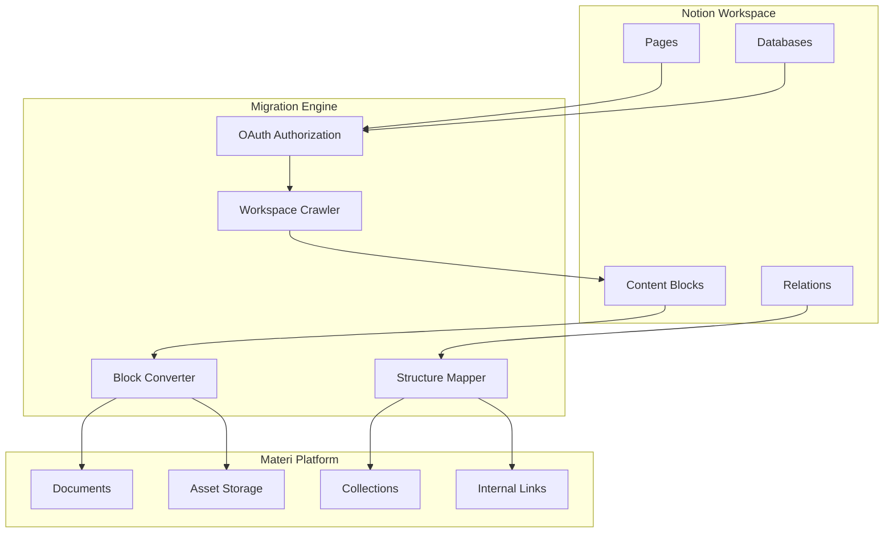

# Notion Integration

The Notion integration enables comprehensive migration of your Notion workspace to Materi. Import pages, databases, and entire workspaces while preserving formatting, structure, and relationships between documents.

## Migration Architecture



## Features

<CardGroup cols={2}>
  <Card title="Full Workspace Import" icon="building">
    Import your entire Notion workspace including all pages, databases, and nested content.
  </Card>
  <Card title="Database Conversion" icon="table">
    Convert Notion databases to Materi collections with preserved properties and views.
  </Card>
  <Card title="Block Preservation" icon="cube">
    High-fidelity conversion of Notion's block types to Materi-native formats.
  </Card>
  <Card title="Link Mapping" icon="link">
    Internal links between pages automatically updated to point to migrated content.
  </Card>
</CardGroup>

## Supported Content Types

| Notion Type | Materi Equivalent | Support Level | Notes |
|-------------|-------------------|---------------|-------|
| Pages | Documents | Full | All content preserved |
| Databases | Collections | Full | Properties, views, filters |
| Text blocks | Markdown | Full | All formatting |
| Code blocks | Code blocks | Full | Language detection |
| Images | Embedded images | Full | Uploaded to asset storage |
| Files | Attachments | Full | PDF, documents, etc. |
| Embeds | Embed blocks | Partial | YouTube, Figma supported |
| Synced blocks | Converted to copy | Partial | No live sync |
| Equations | LaTeX | Full | KaTeX rendering |
| Callouts | Admonitions | Full | Note, Tip, Warning |
| Toggle blocks | Accordions | Full | Collapsible content |
| Columns | Layout blocks | Full | Multi-column layouts |
| Tables | Markdown tables | Full | Simple tables |
| Linked databases | Reference links | Partial | Link to source collection |

## Prerequisites

Before migrating from Notion, ensure you have:

- Notion account with access to content you want to migrate
- Admin access to the Notion workspace (for full workspace migration)
- Materi workspace with Admin role
- Sufficient storage quota for assets

## Migration Process

<Steps>
  <Step title="Connect Notion Account">
    Go to **Settings > Integrations** and click **Connect** on the Notion card. Authorize Materi to access your Notion workspace.

    <Note>
    You can choose to grant access to:
    - All pages in workspace (requires admin)
    - Specific pages only (selective access)
    </Note>
  </Step>
  <Step title="Select Content to Migrate">
    Browse your Notion workspace and select pages, databases, or entire sections to migrate.

    **Selection Options:**
    - Individual pages
    - Entire databases
    - Parent pages (includes all children)
    - Full workspace
  </Step>
  <Step title="Configure Migration Settings">
    Set up how content should be converted and organized in Materi.

    | Setting | Options | Recommendation |
    |---------|---------|----------------|
    | Structure | Flat, Preserve hierarchy | Preserve hierarchy |
    | Database handling | Collection, Documents, Skip | Collection |
    | Asset handling | Upload, Link, Skip | Upload |
    | Link handling | Convert, Preserve, Remove | Convert |
  </Step>
  <Step title="Preview Migration">
    Review the migration preview to see how your content will appear in Materi.

    - Check converted document structure
    - Verify formatting preservation
    - Review any conversion warnings
  </Step>
  <Step title="Execute Migration">
    Click **Start Migration** to begin. Large migrations may take several minutes to hours.

    Monitor progress in the migration dashboard:
    - Pages migrated
    - Assets uploaded
    - Errors encountered
    - Estimated time remaining
  </Step>
  <Step title="Review and Verify">
    After migration completes:

    1. Browse migrated content
    2. Verify formatting and structure
    3. Check internal links work
    4. Review any error reports
    5. Make manual adjustments if needed
  </Step>
</Steps>

## Migration Configuration

<Tabs>
  <Tab title="Page Migration">
    ### Single Page Migration

    Import individual Notion pages:

    ```json
    {
      "migration": {
        "type": "page",
        "page_id": "abc123-def456",
        "options": {
          "include_children": true,
          "include_linked_pages": false,
          "destination": "/Imported/Notion",
          "preserve_dates": true
        }
      }
    }
    ```

    **Options:**
    - `include_children` - Import child pages
    - `include_linked_pages` - Import pages linked within content
    - `preserve_dates` - Keep original created/modified dates
  </Tab>

  <Tab title="Database Migration">
    ### Database to Collection Migration

    Convert Notion databases to Materi collections:

    ```json
    {
      "migration": {
        "type": "database",
        "database_id": "xyz789-abc123",
        "options": {
          "as_collection": true,
          "preserve_properties": true,
          "include_views": true,
          "property_mapping": {
            "Status": "status",
            "Priority": "priority",
            "Due Date": "due_date"
          }
        }
      }
    }
    ```

    **Property Mapping:**
    | Notion Property | Materi Field Type |
    |-----------------|-------------------|
    | Title | Document title |
    | Text | Text field |
    | Number | Number field |
    | Select | Single select |
    | Multi-select | Tags |
    | Date | Date field |
    | Person | User reference |
    | Checkbox | Boolean |
    | URL | URL field |
    | Email | Email field |
    | Phone | Text field |
    | Formula | Computed (if supported) |
    | Relation | Document link |
    | Rollup | Not supported |
  </Tab>

  <Tab title="Workspace Migration">
    ### Full Workspace Migration

    Migrate an entire Notion workspace:

    ```json
    {
      "migration": {
        "type": "workspace",
        "workspace_id": "workspace-123",
        "options": {
          "structure": "preserve",
          "exclude_private": true,
          "exclude_archived": true,
          "exclude_patterns": [
            "Personal/*",
            "Archive/*",
            "*-draft"
          ],
          "batch_size": 100,
          "parallel_imports": 5
        }
      }
    }
    ```

    <Warning>
    Full workspace migrations can be time-consuming for large workspaces. Consider running during off-peak hours.
    </Warning>
  </Tab>
</Tabs>

## Block Conversion Reference

### Text Formatting

| Notion Format | Materi Markdown |
|--------------|-----------------|
| **Bold** | `**text**` |
| *Italic* | `*text*` |
| ~~Strikethrough~~ | `~~text~~` |
| `Code` | `` `code` `` |
| [Link](url) | `[text](url)` |
| @mention | `@username` |
| 📅 Date | ISO date string |
| Equation | `$latex$` |

### Block Types

```mermaid
flowchart LR
    subgraph Notion
        H1[Heading 1]
        H2[Heading 2]
        H3[Heading 3]
        BQ[Quote]
        BL[Bullet List]
        NL[Numbered List]
        TL[Todo List]
        CO[Callout]
        TG[Toggle]
        CD[Code]
        DV[Divider]
    end

    subgraph Materi
        MH1["# Heading"]
        MH2["## Heading"]
        MH3["### Heading"]
        MBQ["> Blockquote"]
        MBL["- List item"]
        MNL["1. List item"]
        MTL["- [ ] Task"]
        MCO["<Note> or <Tip>"]
        MTG["<Accordion>"]
        MCD["```code```"]
        MDV["---"]
    end

    H1 --> MH1
    H2 --> MH2
    H3 --> MH3
    BQ --> MBQ
    BL --> MBL
    NL --> MNL
    TL --> MTL
    CO --> MCO
    TG --> MTG
    CD --> MCD
    DV --> MDV
```

### Callout Conversion

Notion callouts are converted based on icon:

| Notion Icon | Materi Component |
|-------------|------------------|
| ℹ️ | `<Note>` |
| 💡 | `<Tip>` |
| ⚠️ | `<Warning>` |
| 🚨 | `<Error>` |
| ✅ | `<Check>` |
| Other | `<Note>` (default) |

## Handling Special Content

<AccordionGroup>
  <Accordion title="Linked Databases">
    Linked databases (database views in other pages) are converted to:

    1. **Reference link** - Link to the migrated collection
    2. **Embedded view** - Static snapshot of the view
    3. **Inline data** - Copy of filtered/sorted data

    Configure preference in migration settings.
  </Accordion>

  <Accordion title="Synced Blocks">
    Notion synced blocks become independent copies in Materi:

    - Content is duplicated to each location
    - No ongoing synchronization
    - Consider consolidating synced content post-migration

    <Note>
    After migration, you can use Materi's content reuse features to re-establish shared content patterns.
    </Note>
  </Accordion>

  <Accordion title="Embeds">
    External embeds are handled based on type:

    | Embed Type | Materi Handling |
    |------------|-----------------|
    | YouTube | Native embed |
    | Vimeo | Native embed |
    | Figma | Native embed |
    | Loom | Native embed |
    | CodePen | Native embed |
    | Google Maps | Native embed |
    | Twitter/X | Link with preview |
    | Generic | iframe or link |
    | Notion-specific | Not supported |
  </Accordion>

  <Accordion title="Page Icons and Covers">
    Notion page icons and covers are preserved:

    - **Icons**: Converted to document icon (emoji or custom image)
    - **Covers**: Stored as document header image
    - **Unsplash covers**: Downloaded and stored locally

    ```json
    {
      "page_styling": {
        "preserve_icons": true,
        "preserve_covers": true,
        "download_external_images": true
      }
    }
    ```
  </Accordion>
</AccordionGroup>

## Post-Migration Tasks

After completing your migration, we recommend:

<Steps>
  <Step title="Review Error Report">
    Check the migration report for any failed items or conversion issues. Common issues include:
    - Unsupported block types
    - Missing permissions
    - Asset upload failures
  </Step>
  <Step title="Verify Internal Links">
    Navigate through migrated content to ensure internal links work correctly. Broken links are logged in the migration report.
  </Step>
  <Step title="Check Formatting">
    Review complex documents for formatting accuracy. Pay special attention to:
    - Tables with merged cells
    - Complex layouts
    - Code blocks with syntax highlighting
  </Step>
  <Step title="Update External Links">
    If you shared Notion links externally, consider:
    - Setting up redirects
    - Updating documentation
    - Notifying stakeholders
  </Step>
  <Step title="Archive Notion Workspace">
    Once verified, you may want to:
    - Export Notion workspace as backup
    - Restrict edit access
    - Plan deprecation timeline
  </Step>
</Steps>

## Migration API

### Start Migration

```bash
curl -X POST https://api.materi.io/v1/integrations/notion/migrate \
  -H "Authorization: Bearer $MATERI_API_KEY" \
  -H "Content-Type: application/json" \
  -d '{
    "source": {
      "type": "database",
      "id": "abc123-def456"
    },
    "destination": "/Migrated Content",
    "options": {
      "include_children": true,
      "preserve_hierarchy": true
    }
  }'
```

### Check Migration Status

```bash
curl https://api.materi.io/v1/integrations/notion/migrate/status/mig_xyz789 \
  -H "Authorization: Bearer $MATERI_API_KEY"
```

Response:
```json
{
  "id": "mig_xyz789",
  "status": "in_progress",
  "progress": {
    "pages_total": 150,
    "pages_completed": 87,
    "pages_failed": 2,
    "assets_uploaded": 234,
    "percent_complete": 58
  },
  "started_at": "2024-01-15T10:00:00Z",
  "estimated_completion": "2024-01-15T10:45:00Z"
}
```

## Troubleshooting

<AccordionGroup>
  <Accordion title="Migration Stuck or Very Slow">
    **Symptoms:** Progress bar not moving or migration taking much longer than expected.

    **Solutions:**
    1. Check your Notion API rate limits
    2. Reduce parallel import count
    3. Exclude large databases temporarily
    4. Run migration during off-peak hours
    5. Contact support if stuck for more than 1 hour
  </Accordion>

  <Accordion title="Missing Content After Migration">
    **Symptoms:** Some pages or blocks didn't migrate.

    **Solutions:**
    1. Check migration error report for specific failures
    2. Verify you have access to the content in Notion
    3. Some block types may not be supported (see conversion table)
    4. Re-run migration for specific failed pages
    5. Check if content was in an excluded pattern
  </Accordion>

  <Accordion title="Broken Internal Links">
    **Symptoms:** Links between migrated pages don't work.

    **Solutions:**
    1. Ensure all linked pages were included in migration
    2. Check link mapping report
    3. Pages migrated separately may not link correctly
    4. Manually update critical links if needed
    5. Use Materi's link checker tool to identify broken links
  </Accordion>

  <Accordion title="Formatting Differences">
    **Symptoms:** Content looks different than in Notion.

    **Solutions:**
    1. Some Notion features have no direct equivalent
    2. Complex layouts may simplify
    3. Use Materi's rich editor to adjust formatting
    4. Custom blocks may need manual recreation
    5. Report significant issues for future conversion improvements
  </Accordion>
</AccordionGroup>

## Best Practices

<Tip>
**Clean Up First:** Before migrating, archive or delete outdated content in Notion. This reduces migration time and keeps your Materi workspace organized.
</Tip>

<Tip>
**Migrate in Phases:** For large workspaces, migrate one section at a time. This makes it easier to verify each section and address issues incrementally.
</Tip>

<Tip>
**Test with Sample Content:** Before migrating your entire workspace, test with a few representative pages to verify the conversion meets your expectations.
</Tip>

<Warning>
**One-Way Migration:** The Notion integration is import-only. Changes made in Materi will not sync back to Notion. Plan your migration as a one-time move.
</Warning>

## Notion vs Materi Comparison

| Feature | Notion | Materi |
|---------|--------|--------|
| Real-time collaboration | Yes | Yes |
| Version history | Limited | Full Git-style |
| API access | Yes | Yes |
| Custom domains | Team/Enterprise | All plans |
| SSO | Enterprise | Business+ |
| Database/Collections | Yes | Yes |
| Offline access | Desktop app | PWA |
| Export options | Limited | Comprehensive |

## Related Resources

- [Import/Export Guide](/guides/import-export) - General import documentation
- [Collections Guide](/guides/collections) - Working with Materi collections
- [Notion API Documentation](https://developers.notion.com) - Official Notion docs
