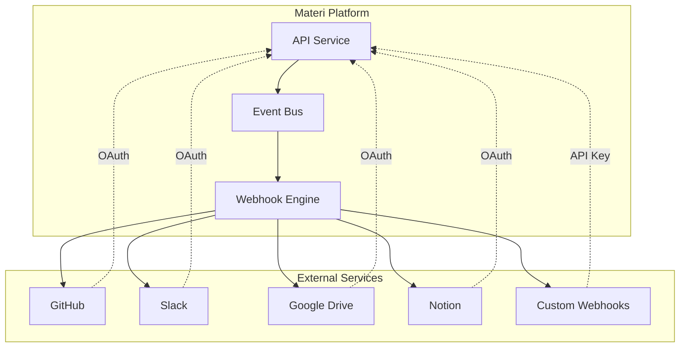

# Integrations Overview

Materi's integration ecosystem connects your content management workflow with the tools your team already uses. From version control with GitHub to real-time notifications in Slack, our integrations help you work more efficiently without switching contexts.

## Integration Architecture

All Materi integrations follow a secure, event-driven architecture that ensures your data stays synchronized across platforms while maintaining enterprise-grade security.



## Available Integrations

<CardGroup cols={2}>
  <Card title="GitHub" icon="github" href="/integrations/github">
    Connect repositories, sync documentation, and automate content workflows with GitHub Actions.
  </Card>
  <Card title="Slack" icon="slack" href="/integrations/slack">
    Get real-time notifications, collaborate on content, and manage approvals directly in Slack.
  </Card>
  <Card title="Google Drive" icon="google-drive" href="/integrations/google-drive">
    Import documents from Google Drive and keep content synchronized across platforms.
  </Card>
  <Card title="Notion" icon="book" href="/integrations/notion">
    Migrate your Notion workspace to Materi with full formatting and structure preservation.
  </Card>
  <Card title="Webhooks" icon="webhook" href="/integrations/webhooks">
    Build custom integrations with our comprehensive webhook system.
  </Card>
  <Card title="API" icon="code" href="/api-reference">
    Full REST API access for building custom integrations and automations.
  </Card>
</CardGroup>

## Integration Comparison

| Integration | Sync Direction | Real-time | OAuth | Webhooks | Enterprise |
|------------|----------------|-----------|-------|----------|------------|
| GitHub | Bidirectional | Yes | Yes | Yes | Yes |
| Slack | Outbound | Yes | Yes | N/A | Yes |
| Google Drive | Bidirectional | Polling | Yes | N/A | Yes |
| Notion | Import Only | No | Yes | N/A | Yes |
| Custom Webhooks | Outbound | Yes | N/A | Yes | Yes |

## Getting Started

<Steps>
  <Step title="Access Integration Settings">
    Navigate to **Settings > Integrations** in your workspace dashboard. You'll see all available integrations and their current status.
  </Step>
  <Step title="Choose Your Integration">
    Select the integration you want to configure. Each integration has its own setup wizard that guides you through the connection process.
  </Step>
  <Step title="Authorize Access">
    Most integrations use OAuth 2.0 for secure authorization. Click **Connect** and follow the prompts to grant Materi access to the external service.
  </Step>
  <Step title="Configure Settings">
    Customize sync preferences, notification channels, and other integration-specific settings to match your workflow.
  </Step>
  <Step title="Test the Connection">
    Use the **Test Connection** button to verify everything is working correctly before going live.
  </Step>
</Steps>

## Security and Permissions

<AccordionGroup>
  <Accordion title="OAuth 2.0 Authentication">
    All integrations use OAuth 2.0 for secure authorization. Materi never stores your passwords for external services. Instead, we use encrypted access tokens that can be revoked at any time.

    **Token Storage:**
    - Access tokens are encrypted at rest using AES-256
    - Tokens are stored in isolated, encrypted databases
    - Automatic token refresh prevents session expiration
  </Accordion>

  <Accordion title="Minimal Permissions">
    Materi requests only the minimum permissions required for each integration to function. We follow the principle of least privilege to protect your data.

    **Permission Auditing:**
    - View granted permissions in **Settings > Integrations > [Integration] > Permissions**
    - Revoke access at any time from the integration settings
    - Regular permission audits ensure compliance
  </Accordion>

  <Accordion title="Data Encryption">
    All data transferred between Materi and external services is encrypted in transit using TLS 1.3. Sensitive data such as API keys and tokens are encrypted at rest.

    **Encryption Standards:**
    - TLS 1.3 for data in transit
    - AES-256 for data at rest
    - RSA-4096 for key exchange
  </Accordion>

  <Accordion title="Audit Logging">
    All integration activities are logged for security and compliance purposes. Access audit logs from **Settings > Security > Audit Log**.

    **Logged Events:**
    - Integration connections and disconnections
    - Configuration changes
    - Data sync operations
    - Authentication events
  </Accordion>
</AccordionGroup>

## Integration Events

Materi's event system powers all integrations. Understanding these events helps you configure integrations effectively and troubleshoot issues.

### Core Event Types

| Event Category | Events | Description |
|---------------|--------|-------------|
| Document | `document.created`, `document.updated`, `document.deleted`, `document.published` | Content lifecycle events |
| Workspace | `workspace.created`, `workspace.member_added`, `workspace.settings_changed` | Workspace management events |
| User | `user.invited`, `user.joined`, `user.role_changed` | User lifecycle events |
| Comment | `comment.created`, `comment.resolved`, `comment.mentioned` | Collaboration events |
| Review | `review.requested`, `review.approved`, `review.rejected` | Content review events |

### Event Payload Structure

```json
{
  "id": "evt_1234567890",
  "type": "document.published",
  "timestamp": "2024-01-15T10:30:00Z",
  "workspace_id": "ws_abc123",
  "actor": {
    "id": "usr_xyz789",
    "email": "user@example.com",
    "name": "Jane Doe"
  },
  "resource": {
    "id": "doc_def456",
    "type": "document",
    "title": "Getting Started Guide"
  },
  "metadata": {
    "version": 5,
    "previous_state": "draft",
    "new_state": "published"
  }
}
```

## Rate Limits

To ensure platform stability, integrations are subject to rate limits:

| Plan | Webhook Events/Hour | API Calls/Hour | Sync Operations/Day |
|------|---------------------|----------------|---------------------|
| Free | 100 | 1,000 | 50 |
| Pro | 1,000 | 10,000 | 500 |
| Business | 10,000 | 100,000 | 5,000 |
| Enterprise | Unlimited | Unlimited | Unlimited |

<Note>
Rate limits are applied per workspace. If you need higher limits, contact our sales team to discuss enterprise options.
</Note>

## Troubleshooting

<AccordionGroup>
  <Accordion title="Integration Won't Connect">
    **Symptoms:** OAuth flow fails or connection times out.

    **Solutions:**
    1. Check that pop-ups are enabled for the OAuth flow
    2. Verify your account has admin permissions on the external service
    3. Clear browser cache and cookies, then try again
    4. Check the external service's status page for outages
  </Accordion>

  <Accordion title="Sync Not Working">
    **Symptoms:** Changes aren't appearing in connected services.

    **Solutions:**
    1. Verify the integration is enabled in **Settings > Integrations**
    2. Check the sync logs for error messages
    3. Ensure your access token hasn't expired
    4. Verify you have the correct permissions in the external service
  </Accordion>

  <Accordion title="Missing Events">
    **Symptoms:** Some events aren't triggering integrations.

    **Solutions:**
    1. Check event filters in integration settings
    2. Verify the event type is enabled for your plan
    3. Review rate limit status in the dashboard
    4. Check webhook delivery logs for failures
  </Accordion>

  <Accordion title="Authentication Errors">
    **Symptoms:** Integration shows "Authentication Failed" or similar errors.

    **Solutions:**
    1. Disconnect and reconnect the integration
    2. Verify your account is still active on the external service
    3. Check if your password changed on the external service
    4. Review API key permissions if using custom webhooks
  </Accordion>
</AccordionGroup>

## Best Practices

<Tip>
**Start Small:** Begin with one or two integrations and expand as your team becomes comfortable with the workflow.
</Tip>

<Tip>
**Use Filters:** Configure event filters to reduce noise and only receive notifications for important events.
</Tip>

<Tip>
**Regular Audits:** Periodically review your integration settings and remove unused connections to maintain security.
</Tip>

<Warning>
**Token Security:** Never share access tokens or API keys. If you suspect a token has been compromised, revoke it immediately and generate a new one.
</Warning>

## Need Help?

- **Documentation:** Detailed setup guides for each integration are available in the links above
- **Support:** Contact support@materi.io for integration assistance
- **Status:** Check [status.materi.io](https://status.materi.io) for service availability
- **API Reference:** Full API documentation at [docs.materi.io/api-reference](/api-reference)

---

Ready to connect your first integration? Choose from the cards above to get started with detailed setup instructions.
