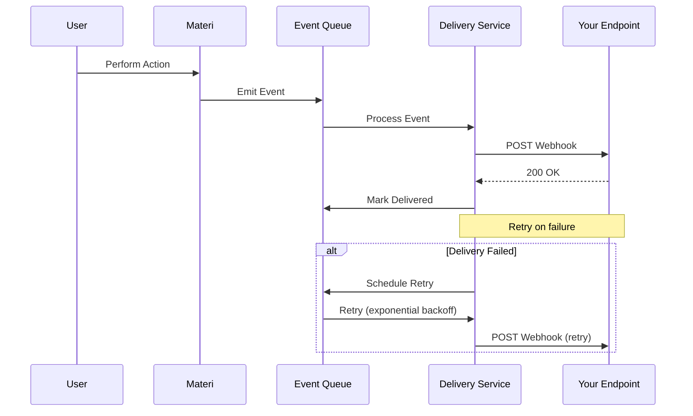
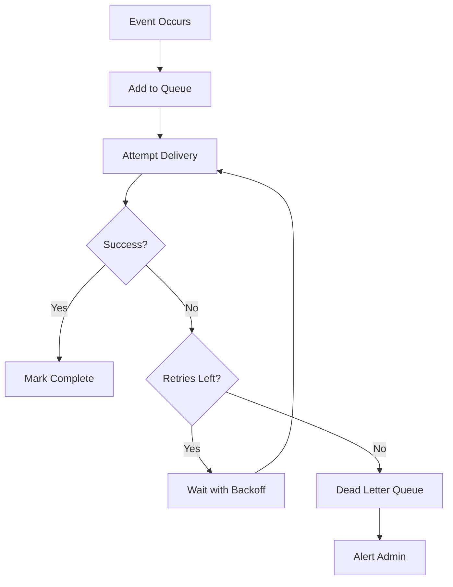

# Webhooks

Materi's webhook system enables you to build custom integrations by receiving real-time HTTP notifications when events occur in your workspace. Use webhooks to sync data with external systems, trigger automated workflows, and extend Materi's functionality.

## Webhook Architecture



## Features

<CardGroup cols={2}>
  <Card title="Real-time Events" icon="bolt">
    Receive instant notifications when documents, users, or workspaces change.
  </Card>
  <Card title="Secure Delivery" icon="shield-check">
    HMAC signatures verify webhook authenticity and prevent tampering.
  </Card>
  <Card title="Automatic Retries" icon="rotate">
    Failed deliveries are automatically retried with exponential backoff.
  </Card>
  <Card title="Event Filtering" icon="filter">
    Subscribe only to the events you need with granular filtering.
  </Card>
</CardGroup>

## Setting Up Webhooks

<Steps>
  <Step title="Navigate to Webhook Settings">
    Go to **Settings > Integrations > Webhooks** in your Materi workspace.
  </Step>
  <Step title="Create New Webhook">
    Click **Create Webhook** and configure the endpoint:

    | Field | Description | Required |
    |-------|-------------|----------|
    | Name | Descriptive name for this webhook | Yes |
    | URL | HTTPS endpoint to receive events | Yes |
    | Description | Purpose of this webhook | No |
    | Secret | Shared secret for signature verification | Auto-generated |
  </Step>
  <Step title="Select Events">
    Choose which events should trigger this webhook. You can select:
    - All events
    - Event categories (documents, users, etc.)
    - Specific event types
  </Step>
  <Step title="Configure Options">
    Set additional options:
    - Active/Inactive status
    - Content type (JSON)
    - Custom headers
    - Retry policy
  </Step>
  <Step title="Test Webhook">
    Click **Send Test Event** to verify your endpoint receives events correctly.
  </Step>
</Steps>

## Event Types

<Tabs>
  <Tab title="Document Events">
    ### Document Lifecycle Events

    | Event | Trigger | Payload |
    |-------|---------|---------|
    | `document.created` | New document created | Document object |
    | `document.updated` | Document content changed | Document + changes |
    | `document.deleted` | Document deleted | Document ID + metadata |
    | `document.published` | Document published | Document + publish info |
    | `document.unpublished` | Document unpublished | Document ID |
    | `document.archived` | Document archived | Document ID |
    | `document.restored` | Document restored from archive | Document object |
    | `document.moved` | Document moved to new location | Old/new paths |

    ```json
    {
      "event": "document.created",
      "timestamp": "2024-01-15T10:30:00Z",
      "data": {
        "document": {
          "id": "doc_abc123",
          "title": "Getting Started Guide",
          "path": "/Documentation/Getting Started",
          "created_by": "usr_xyz789",
          "workspace_id": "ws_def456"
        }
      }
    }
    ```
  </Tab>

  <Tab title="User Events">
    ### User Lifecycle Events

    | Event | Trigger | Payload |
    |-------|---------|---------|
    | `user.invited` | User invited to workspace | Invitation details |
    | `user.joined` | User accepted invitation | User object |
    | `user.updated` | User profile changed | User + changes |
    | `user.removed` | User removed from workspace | User ID |
    | `user.role_changed` | User role updated | Old/new roles |
    | `user.deactivated` | User account deactivated | User ID |

    ```json
    {
      "event": "user.joined",
      "timestamp": "2024-01-15T10:30:00Z",
      "data": {
        "user": {
          "id": "usr_abc123",
          "email": "jane@example.com",
          "name": "Jane Doe",
          "role": "editor"
        },
        "workspace_id": "ws_def456",
        "invited_by": "usr_xyz789"
      }
    }
    ```
  </Tab>

  <Tab title="Collaboration Events">
    ### Real-time Collaboration Events

    | Event | Trigger | Payload |
    |-------|---------|---------|
    | `comment.created` | New comment added | Comment object |
    | `comment.updated` | Comment edited | Comment + changes |
    | `comment.deleted` | Comment removed | Comment ID |
    | `comment.resolved` | Comment marked resolved | Comment object |
    | `mention.created` | User mentioned | Mention context |
    | `review.requested` | Review requested | Review details |
    | `review.submitted` | Review completed | Review + decision |

    ```json
    {
      "event": "comment.created",
      "timestamp": "2024-01-15T10:30:00Z",
      "data": {
        "comment": {
          "id": "cmt_abc123",
          "body": "Should we add more examples here?",
          "author": {
            "id": "usr_xyz789",
            "name": "John Smith"
          },
          "document_id": "doc_def456",
          "thread_id": "thr_ghi789"
        }
      }
    }
    ```
  </Tab>

  <Tab title="Workspace Events">
    ### Workspace Management Events

    | Event | Trigger | Payload |
    |-------|---------|---------|
    | `workspace.updated` | Settings changed | Workspace + changes |
    | `workspace.member_added` | Member added | Member details |
    | `workspace.member_removed` | Member removed | Member ID |
    | `workspace.plan_changed` | Subscription changed | Plan details |
    | `integration.connected` | Integration enabled | Integration info |
    | `integration.disconnected` | Integration disabled | Integration ID |

    ```json
    {
      "event": "workspace.member_added",
      "timestamp": "2024-01-15T10:30:00Z",
      "data": {
        "workspace_id": "ws_abc123",
        "member": {
          "user_id": "usr_xyz789",
          "email": "newmember@example.com",
          "role": "viewer"
        },
        "added_by": "usr_admin123"
      }
    }
    ```
  </Tab>
</Tabs>

## Webhook Payload Structure

All webhook payloads follow a consistent structure:

```json
{
  "id": "evt_1234567890abcdef",
  "event": "document.created",
  "timestamp": "2024-01-15T10:30:00Z",
  "api_version": "2024-01-01",
  "workspace_id": "ws_abc123",
  "actor": {
    "type": "user",
    "id": "usr_xyz789",
    "email": "user@example.com"
  },
  "data": {
    // Event-specific payload
  },
  "metadata": {
    "request_id": "req_abc123",
    "ip_address": "192.168.1.1",
    "user_agent": "Mozilla/5.0..."
  }
}
```

### Payload Fields

| Field | Type | Description |
|-------|------|-------------|
| `id` | string | Unique event identifier |
| `event` | string | Event type (e.g., `document.created`) |
| `timestamp` | ISO 8601 | When the event occurred |
| `api_version` | string | API version for payload format |
| `workspace_id` | string | Workspace where event occurred |
| `actor` | object | User or system that triggered the event |
| `data` | object | Event-specific data |
| `metadata` | object | Additional context (optional) |

## Security

### Signature Verification

All webhooks include an HMAC-SHA256 signature in the `X-Materi-Signature` header. Always verify this signature before processing events.

<Tabs>
  <Tab title="Node.js">
    ```javascript
    const crypto = require('crypto');

    function verifyWebhookSignature(payload, signature, secret) {
      const expectedSignature = crypto
        .createHmac('sha256', secret)
        .update(payload, 'utf8')
        .digest('hex');

      const expectedHeader = `sha256=${expectedSignature}`;

      return crypto.timingSafeEqual(
        Buffer.from(signature),
        Buffer.from(expectedHeader)
      );
    }

    // Express.js middleware
    app.post('/webhooks/materi', express.raw({ type: 'application/json' }), (req, res) => {
      const signature = req.headers['x-materi-signature'];
      const payload = req.body.toString();

      if (!verifyWebhookSignature(payload, signature, process.env.WEBHOOK_SECRET)) {
        return res.status(401).send('Invalid signature');
      }

      const event = JSON.parse(payload);
      // Process event...

      res.status(200).send('OK');
    });
    ```
  </Tab>

  <Tab title="Python">
    ```python
    import hmac
    import hashlib
    from flask import Flask, request, abort

    app = Flask(__name__)
    WEBHOOK_SECRET = os.environ.get('WEBHOOK_SECRET')

    def verify_signature(payload, signature, secret):
        expected = hmac.new(
            secret.encode('utf-8'),
            payload,
            hashlib.sha256
        ).hexdigest()

        expected_header = f'sha256={expected}'
        return hmac.compare_digest(signature, expected_header)

    @app.route('/webhooks/materi', methods=['POST'])
    def handle_webhook():
        signature = request.headers.get('X-Materi-Signature')
        payload = request.get_data()

        if not verify_signature(payload, signature, WEBHOOK_SECRET):
            abort(401)

        event = request.get_json()
        # Process event...

        return 'OK', 200
    ```
  </Tab>

  <Tab title="Go">
    ```go
    package main

    import (
        "crypto/hmac"
        "crypto/sha256"
        "encoding/hex"
        "fmt"
        "io"
        "net/http"
        "os"
        "strings"
    )

    func verifySignature(payload []byte, signature, secret string) bool {
        mac := hmac.New(sha256.New, []byte(secret))
        mac.Write(payload)
        expected := "sha256=" + hex.EncodeToString(mac.Sum(nil))

        return hmac.Equal([]byte(signature), []byte(expected))
    }

    func webhookHandler(w http.ResponseWriter, r *http.Request) {
        signature := r.Header.Get("X-Materi-Signature")
        payload, _ := io.ReadAll(r.Body)

        if !verifySignature(payload, signature, os.Getenv("WEBHOOK_SECRET")) {
            http.Error(w, "Invalid signature", http.StatusUnauthorized)
            return
        }

        // Process event...
        fmt.Fprint(w, "OK")
    }
    ```
  </Tab>

  <Tab title="Ruby">
    ```ruby
    require 'sinatra'
    require 'openssl'
    require 'json'

    WEBHOOK_SECRET = ENV['WEBHOOK_SECRET']

    def verify_signature(payload, signature, secret)
      expected = 'sha256=' + OpenSSL::HMAC.hexdigest(
        OpenSSL::Digest.new('sha256'),
        secret,
        payload
      )

      Rack::Utils.secure_compare(signature, expected)
    end

    post '/webhooks/materi' do
      request.body.rewind
      payload = request.body.read
      signature = request.env['HTTP_X_MATERI_SIGNATURE']

      unless verify_signature(payload, signature, WEBHOOK_SECRET)
        halt 401, 'Invalid signature'
      end

      event = JSON.parse(payload)
      # Process event...

      status 200
      'OK'
    end
    ```
  </Tab>
</Tabs>

### Security Headers

Each webhook request includes these security headers:

| Header | Description |
|--------|-------------|
| `X-Materi-Signature` | HMAC-SHA256 signature |
| `X-Materi-Event` | Event type |
| `X-Materi-Delivery` | Unique delivery ID |
| `X-Materi-Timestamp` | Unix timestamp of event |
| `User-Agent` | `Materi-Webhook/1.0` |

<Warning>
Always verify the signature before processing webhook events. Never trust the event data without verification, as it could be spoofed by malicious actors.
</Warning>

## Delivery and Retries

### Delivery Guarantees

Materi webhooks provide **at-least-once delivery**. Events may occasionally be delivered more than once, so your endpoint should be idempotent.



### Retry Policy

Failed deliveries are retried with exponential backoff:

| Attempt | Delay | Total Time |
|---------|-------|------------|
| 1 | Immediate | 0 |
| 2 | 1 minute | 1 min |
| 3 | 5 minutes | 6 min |
| 4 | 30 minutes | 36 min |
| 5 | 2 hours | 2h 36m |
| 6 | 8 hours | 10h 36m |
| 7 | 24 hours | 34h 36m |

After 7 failed attempts, the event is moved to the dead letter queue and an alert is sent to workspace admins.

### Response Requirements

Your endpoint must:

- Respond within **30 seconds**
- Return a **2xx status code** to acknowledge receipt
- Return **4xx** for permanent failures (no retry)
- Return **5xx** for temporary failures (will retry)

| Status Code | Meaning | Retry? |
|-------------|---------|--------|
| 200-299 | Success | No |
| 400-499 | Client error | No |
| 500-599 | Server error | Yes |
| Timeout | No response in 30s | Yes |

## Advanced Configuration

<AccordionGroup>
  <Accordion title="Event Filtering">
    Filter events by resource properties:

    ```json
    {
      "webhook": {
        "url": "https://example.com/webhooks",
        "events": ["document.*"],
        "filters": {
          "document.path": {
            "starts_with": "/API/"
          },
          "document.labels": {
            "contains": "important"
          },
          "actor.role": {
            "in": ["admin", "editor"]
          }
        }
      }
    }
    ```

    **Supported Operators:**
    - `equals` - Exact match
    - `not_equals` - Not equal
    - `starts_with` - String prefix
    - `ends_with` - String suffix
    - `contains` - Array contains or string includes
    - `in` - Value in array
    - `not_in` - Value not in array
  </Accordion>

  <Accordion title="Custom Headers">
    Add custom headers to webhook requests:

    ```json
    {
      "webhook": {
        "url": "https://example.com/webhooks",
        "headers": {
          "X-Custom-Header": "custom-value",
          "Authorization": "Bearer your-token"
        }
      }
    }
    ```

    <Note>
    Custom headers are encrypted at rest and not visible after creation. Update webhooks to change header values.
    </Note>
  </Accordion>

  <Accordion title="Batch Events">
    Receive multiple events in a single request (Enterprise):

    ```json
    {
      "webhook": {
        "url": "https://example.com/webhooks",
        "batch": {
          "enabled": true,
          "max_size": 100,
          "max_wait_ms": 5000
        }
      }
    }
    ```

    Batched payload format:
    ```json
    {
      "batch_id": "batch_abc123",
      "events": [
        { "id": "evt_1", "event": "document.created", ... },
        { "id": "evt_2", "event": "document.updated", ... }
      ],
      "count": 2
    }
    ```
  </Accordion>

  <Accordion title="IP Allowlisting">
    Materi webhooks originate from these IP addresses:

    ```
    52.1.100.0/24
    52.2.100.0/24
    52.3.100.0/24
    ```

    Configure your firewall to allow incoming connections from these ranges.

    <Note>
    IP ranges may change. Subscribe to our status page for updates.
    </Note>
  </Accordion>
</AccordionGroup>

## Webhook Management API

### List Webhooks

```bash
curl https://api.materi.io/v1/webhooks \
  -H "Authorization: Bearer $MATERI_API_KEY"
```

### Create Webhook

```bash
curl -X POST https://api.materi.io/v1/webhooks \
  -H "Authorization: Bearer $MATERI_API_KEY" \
  -H "Content-Type: application/json" \
  -d '{
    "name": "My Integration",
    "url": "https://example.com/webhooks/materi",
    "events": ["document.created", "document.updated"],
    "active": true
  }'
```

### Update Webhook

```bash
curl -X PATCH https://api.materi.io/v1/webhooks/wh_abc123 \
  -H "Authorization: Bearer $MATERI_API_KEY" \
  -H "Content-Type: application/json" \
  -d '{
    "events": ["document.*"],
    "active": true
  }'
```

### Delete Webhook

```bash
curl -X DELETE https://api.materi.io/v1/webhooks/wh_abc123 \
  -H "Authorization: Bearer $MATERI_API_KEY"
```

### View Delivery Logs

```bash
curl https://api.materi.io/v1/webhooks/wh_abc123/deliveries \
  -H "Authorization: Bearer $MATERI_API_KEY"
```

## Troubleshooting

<AccordionGroup>
  <Accordion title="Webhook Not Receiving Events">
    **Symptoms:** No requests reaching your endpoint.

    **Solutions:**
    1. Verify the webhook is active in settings
    2. Check the endpoint URL is correct and accessible
    3. Ensure your firewall allows Materi IP addresses
    4. Verify event types are selected
    5. Check delivery logs for errors
  </Accordion>

  <Accordion title="Signature Verification Failing">
    **Symptoms:** Your verification code rejects valid webhooks.

    **Solutions:**
    1. Use the raw request body (before JSON parsing)
    2. Ensure secret matches exactly (no extra whitespace)
    3. Check you're using HMAC-SHA256, not SHA1
    4. Verify you're reading the correct header
    5. Test with our signature verification tool
  </Accordion>

  <Accordion title="Events Arriving Out of Order">
    **Symptoms:** Events don't match expected chronological order.

    **Solutions:**
    1. Use the `timestamp` field to order events
    2. Implement event queuing in your handler
    3. Use the event `id` for deduplication
    4. Consider using our Batch Events feature
  </Accordion>

  <Accordion title="Duplicate Events Received">
    **Symptoms:** Same event delivered multiple times.

    **Solutions:**
    1. Implement idempotency using event `id`
    2. Store processed event IDs temporarily
    3. Use database transactions with unique constraints
    4. Ensure your endpoint returns 2xx consistently
  </Accordion>

  <Accordion title="Timeouts Causing Retries">
    **Symptoms:** Events retried despite successful processing.

    **Solutions:**
    1. Respond immediately, process asynchronously
    2. Optimize endpoint response time
    3. Check for network latency issues
    4. Increase server timeout settings
    5. Consider using a message queue for processing
  </Accordion>
</AccordionGroup>

## Testing Webhooks

### Test Endpoints

Use these tools to test webhook delivery:

- **[webhook.site](https://webhook.site)** - Inspect incoming webhooks
- **[ngrok](https://ngrok.com)** - Expose localhost to the internet
- **[Postman](https://postman.com)** - Test signature verification

### Send Test Event

```bash
curl -X POST https://api.materi.io/v1/webhooks/wh_abc123/test \
  -H "Authorization: Bearer $MATERI_API_KEY" \
  -H "Content-Type: application/json" \
  -d '{
    "event": "document.created"
  }'
```

### Replay Failed Delivery

```bash
curl -X POST https://api.materi.io/v1/webhooks/deliveries/del_xyz789/retry \
  -H "Authorization: Bearer $MATERI_API_KEY"
```

## Best Practices

<Tip>
**Respond Quickly:** Return a 200 response immediately and process events asynchronously. This prevents timeouts and ensures reliable delivery.
</Tip>

<Tip>
**Implement Idempotency:** Use the event `id` to prevent duplicate processing. Store processed IDs in a cache or database.
</Tip>

<Tip>
**Monitor Deliveries:** Regularly check webhook delivery logs for failures. Set up alerts for high failure rates.
</Tip>

<Tip>
**Use Event Filtering:** Subscribe only to events you need. This reduces load on your endpoint and simplifies processing.
</Tip>

<Warning>
**Secure Your Endpoint:** Always use HTTPS, verify signatures, and validate incoming data. Treat webhook endpoints as public-facing APIs.
</Warning>

## Rate Limits

| Plan | Webhooks | Events/Hour | Batch Size |
|------|----------|-------------|------------|
| Free | 2 | 1,000 | N/A |
| Pro | 10 | 10,000 | N/A |
| Business | 50 | 100,000 | 50 |
| Enterprise | Unlimited | Unlimited | 100 |

## Related Resources

- [API Reference](/api-reference/webhooks) - Complete webhook API documentation
- [Event Types Reference](/reference/events) - Full list of all event types
- [Integration Overview](/integrations/overview) - Other integration options
