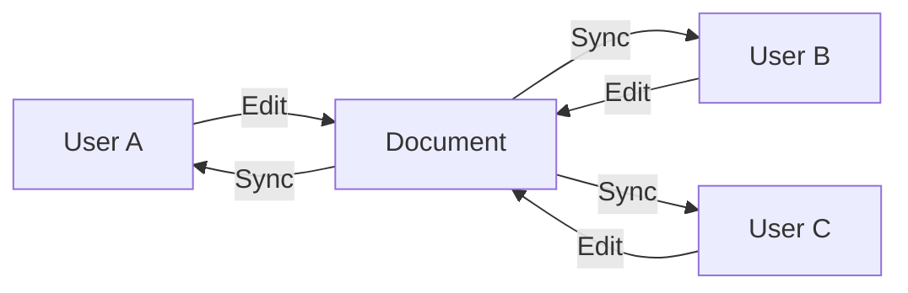

Materi combines powerful editing capabilities, intelligent AI assistance, and enterprise-grade collaboration into one unified platform. Here's everything you can do with Materi.

---

## Document Editing

### Rich Text Editor

Create beautifully formatted documents with our intuitive editor:

- **Headings** (H1-H6) with automatic table of contents
- **Text formatting**: bold, italic, underline, strikethrough, highlight
- **Lists**: ordered, unordered, and checklists
- **Tables** with full cell formatting
- **Blockquotes** and callouts
- **Horizontal dividers**
- **Links** with preview on hover

### Markdown Support

Write in Markdown and see instant formatting:

```markdown
# Heading 1
## Heading 2

**Bold** and *italic* text

- Bullet list
- [ ] Checkbox item

> Blockquote

`inline code`
```

<Tip>
Press `/` anywhere in a document to see all available block types and formatting options.
</Tip>

### Code Blocks

Write and share code with full syntax highlighting:

- **100+ languages** supported
- **Line numbers** toggle
- **Copy button** for easy sharing
- **Language auto-detection**
- **Dark/light** theme options

### Media & Embeds

Enhance documents with rich media:

| Content Type | Supported Formats |
|--------------|-------------------|
| Images | PNG, JPG, GIF, WebP, SVG |
| Videos | MP4, WebM (embedded or linked) |
| Files | PDF, Word, Excel, any file type |
| Embeds | YouTube, Loom, Figma, Miro |

---

## Real-Time Collaboration

### Live Editing

Multiple people can edit the same document simultaneously:



- Changes appear **instantly** (sub-100ms latency)
- No save button needed—everything auto-saves
- Works across desktop and mobile

### Presence Indicators

Always know who's viewing or editing:

- **Avatar stack** showing active users
- **Colored cursors** with names
- **Selection highlighting** to see what others select
- **Activity indicators** for recent actions

### Conflict Resolution

When two people edit the same text:

1. Both edits are preserved
2. Changes merge automatically using operational transforms
3. No data is ever lost
4. View the merge in version history if needed

### Comments & Discussions

Collaborate without changing the document:

- **Inline comments** on specific text
- **@mentions** to notify teammates
- **Thread replies** for discussions
- **Resolve** when addressed
- **Comment history** preserved

---

## AI Features

### Content Generation

Generate first drafts with AI:

- **Blog posts** from outlines
- **Documentation** from code
- **Emails** from bullet points
- **Meeting summaries** from notes

<Note>
AI features respect your workspace permissions. Generated content stays within your workspace and isn't used to train models.
</Note>

### Summarization

Get quick summaries of long documents:

- **Executive summaries** for leadership
- **Key points** extraction
- **Action items** from meeting notes
- **TL;DR** for quick scanning

### Code Analysis

Built-in intelligence for technical content:

- **Explain code** in plain language
- **Find bugs** and suggest fixes
- **Generate documentation** from functions
- **Convert** between languages

### Enhancement Suggestions

Improve your writing with AI assistance:

- **Grammar** and spelling fixes
- **Clarity** improvements
- **Tone** adjustments
- **Structure** recommendations

---

## Workspace Management

### Organization Structure

Organize content your way:

```
Workspace
├── Folder A
│   ├── Document 1
│   ├── Document 2
│   └── Subfolder
│       └── Document 3
└── Folder B
    └── Document 4
```

- **Unlimited folders** and nesting
- **Drag and drop** reorganization
- **Favorites** for quick access
- **Recent** documents list

### Roles & Permissions

Control access with granular permissions:

| Role | View | Edit | Delete | Manage Members | Billing |
|------|------|------|--------|----------------|---------|
| Owner | Yes | Yes | Yes | Yes | Yes |
| Admin | Yes | Yes | Yes | Yes | No |
| Member | Yes | Yes | Own only | No | No |
| Guest | Invited only | If granted | No | No | No |

### Templates

Start faster with templates:

- **Built-in templates** for common use cases
- **Custom templates** from any document
- **Team templates** shared across workspace
- **Variables** for dynamic content

---

## Version History

### Automatic Versioning

Every change is tracked:

- **Continuous auto-save** (every few seconds)
- **Named versions** for milestones
- **Compare** any two versions side-by-side
- **Restore** any previous version

### Audit Trail

See who changed what and when:

- Full **edit history** with timestamps
- **User attribution** for every change
- **Export** history for compliance
- **Retention** configurable by plan

---

## Search

### Full-Text Search

Find anything across your workspace:

- Search **titles** and **content**
- **Filters** by date, author, folder
- **Highlights** matching text
- **Instant results** as you type

### Advanced Filters

Narrow down results:

| Filter | Options |
|--------|---------|
| Type | Documents, Folders, Comments |
| Author | Any workspace member |
| Date | Created/Modified ranges |
| Location | Specific folders |

---

## Integrations

### Native Integrations

Connect your favorite tools:

<CardGroup cols={3}>
  <Card title="Slack" icon="slack">
    Get notifications, share documents, search from Slack
  </Card>
  <Card title="GitHub" icon="github">
    Link issues, embed code, sync documentation
  </Card>
  <Card title="Google Drive" icon="google-drive">
    Import from Drive, embed Google Docs
  </Card>
  <Card title="Notion" icon="n">
    Import Notion pages, one-click migration
  </Card>
  <Card title="Webhooks" icon="webhook">
    Build custom workflows and automations
  </Card>
  <Card title="API" icon="code">
    Full REST API for programmatic access
  </Card>
</CardGroup>

### Import & Export

Move content freely:

- **Import**: Markdown, HTML, Word, Notion, Confluence
- **Export**: Markdown, PDF, HTML, Word

---

## Offline Mode

### Work Without Internet

Keep working when disconnected:

1. Documents you've visited are cached locally
2. Edit and create while offline
3. Changes sync automatically when reconnected
4. Conflicts are resolved gracefully

<Warning>
Real-time collaboration requires an internet connection. Offline edits sync when you reconnect.
</Warning>

---

## Security & Compliance

### Data Protection

Your data is protected at every level:

- **Encryption at rest** (AES-256)
- **Encryption in transit** (TLS 1.3)
- **SOC 2 Type II** certified
- **GDPR** compliant

### Access Controls

Enterprise-grade access management:

- **SAML 2.0 SSO** with major providers
- **Two-factor authentication**
- **Session management**
- **IP allowlisting** (Enterprise)

### Audit & Compliance

Meet compliance requirements:

- **Audit logs** for all actions
- **Data retention** policies
- **Export** capabilities
- **DPA** available

---

## Related Documentation

- [What is Materi?](/customer/overview/what-is-materi) - Platform overview
- [Use Cases](/customer/overview/use-cases) - Common workflows
- [Pricing](/customer/overview/pricing) - Plans and features
- [AI Features](/customer/ai/overview) - Deep dive into AI capabilities
