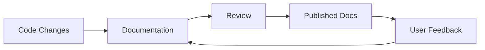
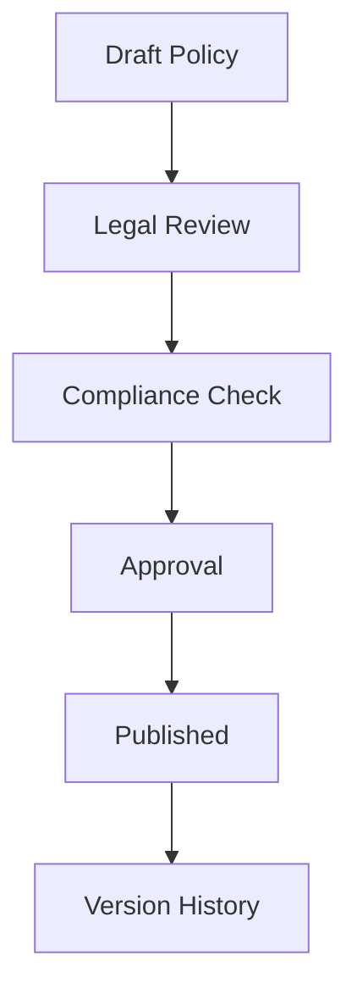

Materi is built for teams that need to create content together. Here's how different teams use Materi to work more effectively.

---

## Engineering Teams

### Technical Documentation

Maintain living documentation that evolves with your codebase:



**Key workflows:**

- **API documentation** with code examples that stay current
- **Architecture decision records** (ADRs) with full version history
- **Runbooks** for operational procedures
- **Onboarding guides** for new engineers

<Tip>
Use the GitHub integration to link documentation to specific commits and automatically surface when docs might be outdated.
</Tip>

### Incident Response

Document incidents in real-time with your team:

1. Create an incident document from template
2. Multiple responders add updates simultaneously
3. Use AI to summarize timeline into postmortem
4. Track action items with checklists

**Template sections:**

| Section | Purpose |
|---------|---------|
| Timeline | Chronological event log |
| Impact | Users/systems affected |
| Root Cause | Technical analysis |
| Action Items | Follow-up tasks |
| Lessons Learned | Process improvements |

### Code Review Notes

Supplement PRs with detailed context:

- Explain complex changes for reviewers
- Document trade-offs and alternatives considered
- Link to related architecture decisions
- Use code blocks for inline examples

---

## Product Teams

### Product Requirements Documents (PRDs)

Create comprehensive specs that everyone can contribute to:

**Typical PRD structure:**

```markdown
# Feature Name

## Problem Statement
What problem are we solving?

## User Stories
As a [user], I want [goal] so that [benefit]

## Requirements
### Must Have
### Nice to Have

## Design
[Embed Figma designs]

## Technical Notes
[Link to engineering docs]

## Success Metrics
How we'll measure success
```

### User Research Synthesis

Turn research into actionable insights:

- **Interview notes** with timestamps
- **Tag observations** for pattern analysis
- **AI summarization** of key themes
- **Share findings** with stakeholders

### Release Notes & Changelogs

Keep customers informed:

- **Version-controlled** release notes
- **Draft collaboratively** with engineering
- **Export to multiple formats** (blog, email, in-app)
- **Template** for consistency

---

## Marketing Teams

### Content Calendars

Plan and track content across channels:

| Date | Channel | Topic | Status | Owner |
|------|---------|-------|--------|-------|
| Jan 15 | Blog | Product Update | Draft | Sarah |
| Jan 18 | Email | Newsletter | Review | Mike |
| Jan 20 | Social | Launch Teaser | Scheduled | Alex |

**Benefits:**

- **Real-time updates** visible to whole team
- **Comments** for feedback without email
- **Links** to actual content drafts
- **Checklists** for publish workflows

### Blog Posts & Articles

Write and edit together:

1. **Outline** with AI assistance
2. **Draft** with real-time collaboration
3. **Review** with inline comments
4. **Polish** with AI enhancement suggestions
5. **Export** to your CMS

### Campaign Documentation

Keep campaign details organized:

- **Goals** and success metrics
- **Audience** definitions
- **Messaging** frameworks
- **Asset** links and status
- **Results** and learnings

---

## Legal & Compliance Teams

### Policy Documentation

Maintain authoritative policy documents:



**Key features:**

- **Version history** with full audit trail
- **Access controls** to restrict editing
- **Named versions** for approved policies
- **Export** for distribution

### Contract Templates

Standardize contract language:

- **Master templates** with approved language
- **Variables** for client-specific details
- **Approval workflow** via comments
- **Version comparison** for changes

### Compliance Procedures

Document compliance processes:

| Feature | Compliance Benefit |
|---------|-------------------|
| Audit Logs | Complete action history |
| Version History | Change tracking |
| Access Controls | Need-to-know enforcement |
| Export | External audit support |
| Retention | Policy enforcement |

---

## Customer Success Teams

### Knowledge Base

Build self-service documentation:

- **Structured content** for easy navigation
- **Search** across all articles
- **AI suggestions** for related content
- **Analytics** on popular articles

### Customer Onboarding

Guide new customers to success:

1. Create onboarding guide template
2. Customize for each customer
3. Share with edit access for questions
4. Track completion via checklists

### Meeting Notes & Action Items

Never lose customer context:

- **Shared notes** during calls
- **Action items** with owners and dates
- **AI summaries** of long discussions
- **History** across all customer interactions

---

## Human Resources

### Employee Handbook

Maintain a living handbook:

- **Easy updates** without IT involvement
- **Version tracking** for policy changes
- **Search** for employees to find answers
- **Access control** for sensitive sections

### Onboarding Documentation

Get new hires productive faster:

**Week 1 checklist:**
- [ ] Complete HR paperwork
- [ ] Set up accounts and tools
- [ ] Meet with manager
- [ ] Review team documentation
- [ ] Complete first task

### Performance Reviews

Streamline the review process:

- **Templates** for consistency
- **Self-review** drafts
- **Manager feedback** in same document
- **Private** by default with selective sharing

---

## Cross-Functional Use Cases

### Meeting Notes

Any team, any meeting:

```markdown
# Meeting: Weekly Sync
Date: January 15, 2025
Attendees: @sarah @mike @alex

## Agenda
1. Project updates
2. Blockers
3. Next steps

## Notes
[Real-time notes during meeting]

## Action Items
- [ ] @sarah: Update documentation by Friday
- [ ] @mike: Schedule follow-up with client
- [ ] @alex: Review PR #123
```

### Project Documentation

Organize project information:

- **Overview** and goals
- **Status updates** with timestamps
- **Decision log** with context
- **Resources** and links
- **Retrospective** notes

### Team Wiki

Build institutional knowledge:

- **How-to guides** for common tasks
- **Team processes** and workflows
- **Tool documentation** and tips
- **FAQ** for repeated questions

---

## Getting Started with Your Use Case

<Steps>
  <Step title="Start with a Template">
    Browse our [template gallery](/customer/documents/templates) for your use case or create your own.
  </Step>
  <Step title="Invite Collaborators">
    Add team members who need to contribute or review.
  </Step>
  <Step title="Set Up Structure">
    Create folders that match your workflow (by project, by type, by team).
  </Step>
  <Step title="Enable Integrations">
    Connect with your existing tools for a seamless workflow.
  </Step>
</Steps>

---

## Related Documentation

- [What is Materi?](/customer/overview/what-is-materi) - Platform overview
- [Key Features](/customer/overview/key-features) - Feature details
- [Templates](/customer/documents/templates) - Get started faster
- [Integrations](/customer/integrations/overview) - Connect your tools
