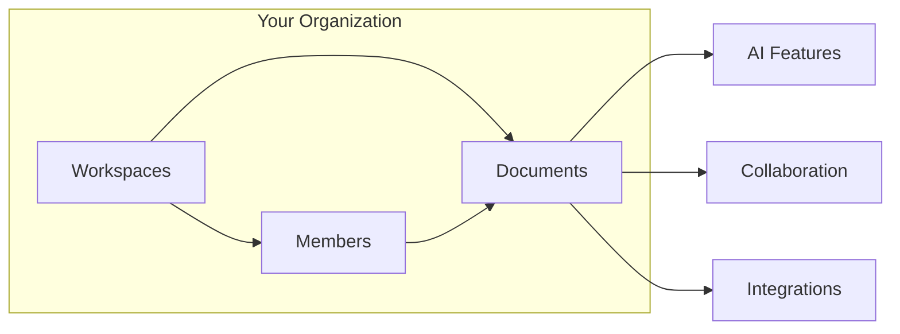

Materi is an AI-native content management platform designed for modern teams. Whether you're drafting documentation, collaborating on proposals, or managing knowledge bases, Materi brings together real-time collaboration, intelligent AI assistance, and enterprise-grade security in one seamless experience.

---

## Why Teams Choose Materi

<CardGroup cols={2}>
  <Card title="Real-Time Collaboration" icon="users">
    Work together on documents simultaneously. See teammates' cursors, edits, and presence in real-time with zero lag.
  </Card>
  <Card title="AI-Powered Writing" icon="wand-magic-sparkles">
    Generate content, summarize documents, analyze code, and get intelligent suggestions—all built into your workflow.
  </Card>
  <Card title="Enterprise Security" icon="shield-check">
    SOC 2 Type II compliant with end-to-end encryption, SAML SSO, and granular access controls.
  </Card>
  <Card title="Seamless Integrations" icon="puzzle-piece">
    Connect with GitHub, Slack, Google Drive, Notion, and more. Build custom workflows with webhooks.
  </Card>
</CardGroup>

---

## How Materi Works

Materi is built around three core concepts that work together:

### Workspaces

Workspaces are the organizational boundary for your team. Each workspace has:

- **Members** with assigned roles (Owner, Admin, Member, Guest)
- **Documents** organized in folders and collections
- **Settings** for permissions, integrations, and billing
- **Audit logs** for compliance and security

Most organizations use one workspace per team or department.

### Documents

Documents are where work happens. Materi documents support:

- **Rich text editing** with Markdown support
- **Code blocks** with syntax highlighting for 100+ languages
- **Embedded media** including images, videos, and files
- **Real-time collaboration** with multiple simultaneous editors
- **Version history** to track changes over time
- **Comments and mentions** for discussions

### Collaboration

When multiple people work on a document:

1. You see **live cursors** showing where teammates are editing
2. Changes sync **instantly** across all connected devices
3. Conflicts are **automatically resolved** using operational transforms
4. **Offline edits** sync when you reconnect

---

## Core Features at a Glance

| Feature | Description |
|---------|-------------|
| **Real-Time Editing** | Multiple users can edit simultaneously with instant sync |
| **AI Assistant** | Generate, summarize, analyze, and enhance content |
| **Version History** | Browse and restore any previous version |
| **Access Controls** | Granular permissions at workspace and document level |
| **Templates** | Start from pre-built templates for common use cases |
| **Search** | Full-text search across all your documents |
| **Integrations** | Connect with your existing tools and workflows |
| **Offline Mode** | Keep working without internet, sync when connected |
| **Audit Logs** | Track all changes for compliance |
| **SSO/SAML** | Enterprise single sign-on support |

---

## Who Uses Materi?

<AccordionGroup>
  <Accordion title="Engineering Teams">
    - Technical documentation and runbooks
    - Architecture decision records (ADRs)
    - API documentation with live code examples
    - Incident postmortems and retrospectives
  </Accordion>

  <Accordion title="Product Teams">
    - Product requirements documents (PRDs)
    - Feature specifications
    - User research synthesis
    - Release notes and changelogs
  </Accordion>

  <Accordion title="Marketing Teams">
    - Content calendars and briefs
    - Blog posts and articles
    - Campaign documentation
    - Brand guidelines
  </Accordion>

  <Accordion title="Legal & Compliance">
    - Policy documentation
    - Contract templates
    - Compliance procedures
    - Audit trail requirements
  </Accordion>
</AccordionGroup>

---

## Getting Started

Ready to try Materi? Here's how to get started:

<Steps>
  <Step title="Create an Account">
    [Sign up](/customer/getting-started/sign-up) with your email or through your organization's SSO.
  </Step>
  <Step title="Set Up Your Workspace">
    [Create a workspace](/customer/getting-started/workspace-setup) for your team and configure settings.
  </Step>
  <Step title="Create Your First Document">
    [Start writing](/customer/getting-started/first-document) and invite teammates to collaborate.
  </Step>
  <Step title="Invite Your Team">
    [Add members](/customer/getting-started/invite-team) and assign appropriate roles.
  </Step>
</Steps>

---

## Architecture Overview

For the technically curious, Materi is built on a modern, event-driven architecture:

- **Real-time sync** via WebSocket connections
- **Event-driven backend** for reliable cross-service communication
- **PostgreSQL** for durable storage with full-text search
- **Redis** for caching and real-time presence
- **Multi-region** deployment for low latency worldwide

This architecture ensures that collaboration feels instant while maintaining strong consistency and auditability.

---

## Related Resources

- [Key Features](/customer/overview/key-features) - Detailed feature breakdown
- [Use Cases](/customer/overview/use-cases) - Common workflows and examples
- [Pricing](/customer/overview/pricing) - Plans and pricing details
- [Security Overview](/customer/security/overview) - Security and compliance

---

**Have questions?** Check our [FAQ](/customer/support/faq) or [contact support](/customer/support/contact-support).
