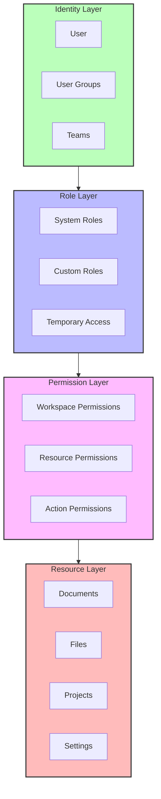
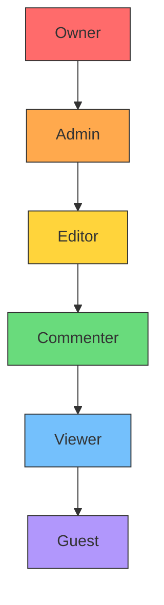
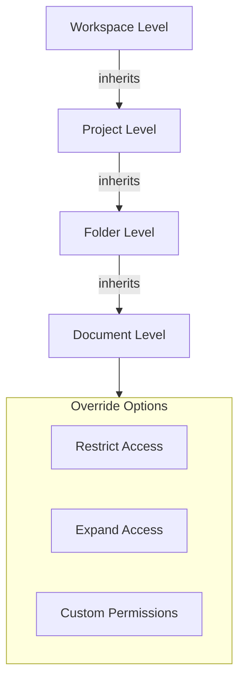

# Access Controls

Materi's access control system provides granular, role-based permissions that scale from small teams to large enterprises. Our RBAC implementation ensures users have exactly the access they need while maintaining security and compliance requirements.

## Access Control Architecture



## Role-Based Access Control (RBAC)

RBAC allows you to define roles with specific permissions and assign them to users, simplifying access management at scale.

### System Roles

Materi includes predefined system roles suitable for most organizations:

| Role | Description | Permissions |
|------|-------------|-------------|
| **Owner** | Full workspace control | All permissions, billing, deletion |
| **Admin** | Administrative access | User management, settings, all content |
| **Editor** | Content creation | Create, edit, delete own content |
| **Commenter** | Feedback and review | View, comment on shared content |
| **Viewer** | Read-only access | View shared content only |
| **Guest** | Limited external access | View specific shared items |

<Note>
  System roles cannot be modified, but you can create custom roles with similar permissions if you need variations.
</Note>

### Role Hierarchy



### Permission Categories

<Tabs>
  <Tab title="Workspace Permissions">
    Control access to workspace-level settings and features:

    | Permission | Description | Owner | Admin | Editor |
    |------------|-------------|-------|-------|--------|
    | `workspace.manage` | Modify workspace settings | Yes | Yes | No |
    | `workspace.delete` | Delete workspace | Yes | No | No |
    | `workspace.billing` | Manage billing | Yes | No | No |
    | `users.invite` | Invite new users | Yes | Yes | No |
    | `users.manage` | Manage user roles | Yes | Yes | No |
    | `users.remove` | Remove users | Yes | Yes | No |
    | `integrations.manage` | Configure integrations | Yes | Yes | No |
    | `security.manage` | Security settings | Yes | Yes | No |
  </Tab>
  <Tab title="Content Permissions">
    Control access to documents, files, and projects:

    | Permission | Description | Editor | Commenter | Viewer |
    |------------|-------------|--------|-----------|--------|
    | `content.create` | Create new content | Yes | No | No |
    | `content.edit` | Edit content | Yes | No | No |
    | `content.delete` | Delete content | Own only | No | No |
    | `content.share` | Share with others | Yes | No | No |
    | `content.comment` | Add comments | Yes | Yes | No |
    | `content.view` | View content | Yes | Yes | Yes |
    | `content.export` | Export content | Yes | Yes | No |
    | `content.history` | View version history | Yes | Yes | Yes |
  </Tab>
  <Tab title="Administrative Permissions">
    Advanced permissions for workspace management:

    | Permission | Description | Scope |
    |------------|-------------|-------|
    | `audit.view` | View audit logs | Admin+ |
    | `audit.export` | Export audit logs | Admin+ |
    | `api.manage` | Manage API keys | Admin+ |
    | `webhooks.manage` | Configure webhooks | Admin+ |
    | `sso.configure` | SSO configuration | Owner only |
    | `compliance.access` | Compliance reports | Owner only |
  </Tab>
</Tabs>

## Custom Roles

<Note>
  Custom roles are available on Business and Enterprise plans.
</Note>

Create roles tailored to your organization's specific needs.

### Creating Custom Roles

<Steps>
  <Step title="Navigate to Role Settings">
    Go to **Settings > Security > Roles & Permissions > Create Role**.
  </Step>
  <Step title="Define Role Properties">
    Configure basic role settings:

    | Field | Description | Example |
    |-------|-------------|---------|
    | Name | Role display name | "Content Manager" |
    | Description | Role purpose | "Manages all published content" |
    | Base Role | Inherit permissions from | Editor |
    | Color | Visual identifier | #3498db |
  </Step>
  <Step title="Configure Permissions">
    Select permissions to grant or revoke from the base role:

    - Enable specific permissions needed for the role
    - Disable any inherited permissions not appropriate
    - Review permission summary before saving
  </Step>
  <Step title="Set Scope Restrictions">
    Optionally limit where the role applies:

    - Specific projects or folders
    - Content with certain tags
    - Time-based restrictions
  </Step>
  <Step title="Save and Assign">
    Save the role and assign it to users or groups.
  </Step>
</Steps>

### Custom Role Examples

<AccordionGroup>
  <Accordion title="Content Reviewer">
    A role for team members who review and approve content:

    ```yaml
    name: Content Reviewer
    base_role: Commenter
    permissions:
      - content.view
      - content.comment
      - content.history
      - content.approve  # Custom permission
      - content.reject   # Custom permission
    restrictions:
      - content_status: pending_review
    ```
  </Accordion>
  <Accordion title="External Consultant">
    Limited access for external collaborators:

    ```yaml
    name: External Consultant
    base_role: Viewer
    permissions:
      - content.view
      - content.comment
      - content.export
    restrictions:
      - projects: [project_abc, project_xyz]
      - ip_allowlist: [203.0.113.0/24]
      - expires_at: 2025-12-31
    ```
  </Accordion>
  <Accordion title="Department Admin">
    Administrative access scoped to a department:

    ```yaml
    name: Department Admin
    base_role: Admin
    permissions:
      - users.invite
      - users.manage
      - content.manage
      - integrations.view
    restrictions:
      - team: engineering
    excluded_permissions:
      - workspace.billing
      - workspace.delete
      - sso.configure
    ```
  </Accordion>
</AccordionGroup>

## Resource-Level Permissions

Beyond role-based access, Materi supports granular permissions on individual resources.

### Permission Inheritance



### Setting Resource Permissions

<Tabs>
  <Tab title="Document Sharing">
    Share individual documents with specific access levels:

    <Steps>
      <Step title="Open Share Menu">
        Click the **Share** button on any document.
      </Step>
      <Step title="Add Collaborators">
        Enter email addresses or select users/groups.
      </Step>
      <Step title="Set Access Level">
        Choose from:
        - **Can edit**: Full editing access
        - **Can comment**: View and comment only
        - **Can view**: Read-only access
      </Step>
      <Step title="Configure Options">
        Set additional sharing options:
        - Notify via email
        - Set expiration date
        - Require authentication
      </Step>
    </Steps>
  </Tab>
  <Tab title="Project Permissions">
    Configure default permissions for all content within a project:

    | Setting | Options |
    |---------|---------|
    | Default visibility | Private, Team, Workspace |
    | Member access | Editor, Commenter, Viewer |
    | Guest access | Allowed, Restricted, Disabled |
    | Inheritance | Inherit from workspace, Custom |
  </Tab>
  <Tab title="Link Sharing">
    Create shareable links with controlled access:

    | Link Type | Authentication | Expiration | Tracking |
    |-----------|----------------|------------|----------|
    | Private | Required | Optional | Yes |
    | Anyone with link | None | Required | Yes |
    | Password protected | Password | Optional | Yes |
    | Embedded | Domain restricted | No | Limited |

    <Warning>
      "Anyone with link" sharing bypasses workspace membership requirements. Use with caution for sensitive content.
    </Warning>
  </Tab>
</Tabs>

## User Groups

Organize users into groups for simplified permission management.

### Group Types

<CardGroup cols={2}>
  <Card title="Teams" icon="users">
    Organizational units that map to your company structure:
    - Engineering, Marketing, Sales
    - Automatic membership via SSO groups
    - Nested team support
  </Card>
  <Card title="Project Groups" icon="folder-tree">
    Cross-functional groups for specific initiatives:
    - Product launch team
    - Manual membership management
    - Temporary or permanent
  </Card>
  <Card title="Access Groups" icon="key">
    Permission-focused groups:
    - Executives, Contractors
    - IP-restricted groups
    - Compliance-based grouping
  </Card>
  <Card title="Dynamic Groups" icon="filter">
    Automatically populated based on attributes (Enterprise):
    - All users in department X
    - Users with role Y
    - SCIM-synced groups
  </Card>
</CardGroup>

### Managing Groups

<Steps>
  <Step title="Create Group">
    Navigate to **Settings > Users & Groups > Groups > Create Group**.
  </Step>
  <Step title="Configure Group Settings">
    | Setting | Description |
    |---------|-------------|
    | Name | Display name for the group |
    | Description | Purpose and membership criteria |
    | Type | Team, Project, or Access group |
    | Visibility | Who can see group membership |
  </Step>
  <Step title="Add Members">
    Add users manually or configure automatic membership rules.
  </Step>
  <Step title="Assign Permissions">
    Grant roles or specific permissions to the group.
  </Step>
</Steps>

## Access Policies

<Note>
  Access policies are available on Enterprise plans only.
</Note>

Define conditional access rules based on context and risk signals.

### Policy Types

<AccordionGroup>
  <Accordion title="IP-Based Policies">
    Restrict access based on network location:

    ```yaml
    policy:
      name: Office Network Only
      conditions:
        - ip_range:
            - 203.0.113.0/24
            - 198.51.100.0/24
      actions:
        - allow_access: true
      fallback:
        - require_mfa: true
        - notify_admin: true
    ```
  </Accordion>
  <Accordion title="Time-Based Policies">
    Control access based on time windows:

    ```yaml
    policy:
      name: Business Hours Access
      conditions:
        - time_range:
            timezone: America/New_York
            days: [monday, tuesday, wednesday, thursday, friday]
            hours: 09:00-18:00
      actions:
        - allow_access: true
      fallback:
        - allow_access: false
        - log_attempt: true
    ```
  </Accordion>
  <Accordion title="Device-Based Policies">
    Require managed or compliant devices:

    ```yaml
    policy:
      name: Managed Devices Only
      conditions:
        - device_compliance: true
        - device_type: [desktop, laptop]
      actions:
        - allow_access: true
      fallback:
        - allow_access: false
        - redirect_to: enrollment_page
    ```
  </Accordion>
  <Accordion title="Risk-Based Policies">
    Dynamic access based on risk assessment:

    ```yaml
    policy:
      name: Adaptive Access
      conditions:
        - risk_score: low
      actions:
        - allow_access: true
      elevated_risk:
        - require_mfa: true
        - limit_permissions: viewer_only
      high_risk:
        - deny_access: true
        - alert_security: true
    ```
  </Accordion>
</AccordionGroup>

### Policy Evaluation Order

Policies are evaluated in the following order:

1. **Deny policies** - Explicit denials take precedence
2. **Allow policies** - Explicit allows are evaluated next
3. **Default policy** - Falls back to workspace default
4. **Role permissions** - Final permission check

## SCIM Provisioning

<Note>
  SCIM provisioning is available on Enterprise plans only.
</Note>

Automate user and group management through your identity provider.

### SCIM Capabilities

| Feature | Support |
|---------|---------|
| User provisioning | Create, update, deactivate |
| Group provisioning | Create, update, delete |
| Group membership sync | Add, remove members |
| Schema extensions | Custom attributes |
| Bulk operations | Supported |

### Configuring SCIM

<Steps>
  <Step title="Generate SCIM Token">
    Navigate to **Settings > Security > SCIM** and generate an API token.
  </Step>
  <Step title="Configure Your IdP">
    Add Materi as a SCIM application in your identity provider:

    | Setting | Value |
    |---------|-------|
    | Base URL | `https://your-workspace.materi.io/scim/v2` |
    | Authentication | Bearer Token |
    | Token | Generated SCIM token |
  </Step>
  <Step title="Map Attributes">
    Configure attribute mapping:

    | Materi Attribute | SCIM Attribute |
    |-----------------|----------------|
    | email | emails[primary].value |
    | firstName | name.givenName |
    | lastName | name.familyName |
    | role | urn:materi:scim:schemas:1.0:User:role |
  </Step>
  <Step title="Configure Sync">
    Enable automatic synchronization and set sync frequency.
  </Step>
  <Step title="Test Provisioning">
    Provision a test user and verify account creation in Materi.
  </Step>
</Steps>

## Access Control Best Practices

<CardGroup cols={2}>
  <Card title="Principle of Least Privilege" icon="user-lock">
    Grant users the minimum permissions required for their job function.
  </Card>
  <Card title="Regular Access Reviews" icon="clipboard-check">
    Periodically review and revoke unnecessary access (quarterly recommended).
  </Card>
  <Card title="Use Groups Over Individuals" icon="users">
    Assign permissions to groups rather than individual users for easier management.
  </Card>
  <Card title="Document Custom Roles" icon="file-lines">
    Maintain documentation explaining the purpose of each custom role.
  </Card>
</CardGroup>

## Troubleshooting

<AccordionGroup>
  <Accordion title="User cannot access shared document">
    If a user reports access issues:

    1. Verify the document sharing settings include the user
    2. Check if the user is part of a group that has access
    3. Review any access policies that might block access
    4. Confirm the user's role has the required permissions
    5. Check for conflicting deny rules
  </Accordion>
  <Accordion title="SCIM sync not updating group membership">
    When SCIM group sync fails:

    1. Verify the SCIM token has not expired
    2. Check IdP logs for sync errors
    3. Confirm group names match between systems
    4. Review SCIM attribute mapping for groups
    5. Test with a manual SCIM API call
  </Accordion>
  <Accordion title="Custom role permissions not working as expected">
    If custom roles behave unexpectedly:

    1. Review the base role and its inherited permissions
    2. Check for permission conflicts in the role definition
    3. Verify scope restrictions are not limiting access
    4. Test with a user who only has the custom role assigned
    5. Review audit logs for permission denial reasons
  </Accordion>
  <Accordion title="Access policy blocking legitimate users">
    When access policies cause false positives:

    1. Review policy conditions (IP, time, device)
    2. Check policy evaluation order
    3. Temporarily disable the policy to confirm it is the cause
    4. Add exceptions for legitimate use cases
    5. Consider adjusting risk thresholds
  </Accordion>
  <Accordion title="Cannot assign Owner role to another user">
    Ownership transfer limitations:

    1. Only current Owners can transfer ownership
    2. The target user must have MFA enabled
    3. Ownership transfer requires email confirmation
    4. Some plans limit the number of Owners
    5. Contact support if ownership transfer is blocked
  </Accordion>
</AccordionGroup>

## Related Documentation

<CardGroup cols={2}>
  <Card title="Authentication" href="/security/authentication" icon="key">
    Configure authentication methods for your users.
  </Card>
  <Card title="Audit Logs" href="/security/audit-logs" icon="scroll">
    Monitor access and permission changes.
  </Card>
  <Card title="Security Overview" href="/security/overview" icon="shield-halved">
    Comprehensive security architecture and controls.
  </Card>
  <Card title="GDPR Compliance" href="/security/gdpr-compliance" icon="eu">
    Access control requirements for privacy compliance.
  </Card>
</CardGroup>
