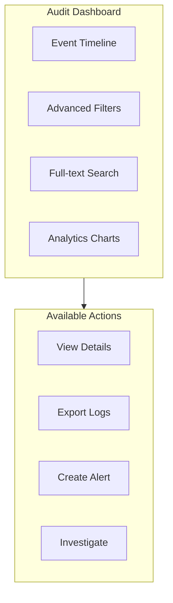

# Audit Logs

Materi's audit logging system provides comprehensive visibility into all activities within your workspace. From user authentication to document changes, every significant action is recorded to support security monitoring, compliance requirements, and forensic investigations.

## Audit Architecture Overview

```mermaid
flowchart LR
    subgraph Sources["Event Sources"]
        Auth["Authentication"]
        API["API Requests"]
        UI["User Interface"]
        Admin["Admin Actions"]
        System["System Events"]
    end

    subgraph Processing["Log Processing"]
        Collect["Event Collector"]
        Enrich["Enrichment"]
        Store["Secure Storage"]
    end

    subgraph Delivery["Delivery"]
        Dashboard["Audit Dashboard"]
        Export["Log Export"]
        SIEM["SIEM Integration"]
        Alerts["Real-time Alerts"]
    end

    Sources --> Processing
    Processing --> Delivery

    style Sources fill:#bfb,stroke:#333,stroke-width:2px
    style Processing fill:#bbf,stroke:#333,stroke-width:2px
    style Delivery fill:#fbf,stroke:#333,stroke-width:2px
```



## Audit Log Categories

All auditable events are organized into categories for easy filtering and analysis.

<Tabs>
  <Tab title="Authentication Events">
    Track all authentication and session-related activities:

    | Event Type | Description | Data Captured |
    |------------|-------------|---------------|
    | `auth.login.success` | Successful login | User, IP, device, method |
    | `auth.login.failure` | Failed login attempt | Email, IP, failure reason |
    | `auth.logout` | User logout | User, session duration |
    | `auth.mfa.enabled` | MFA enabled | User, MFA method |
    | `auth.mfa.disabled` | MFA disabled | User, admin override |
    | `auth.password.changed` | Password changed | User, change method |
    | `auth.password.reset` | Password reset requested | Email, IP |
    | `auth.session.expired` | Session expired | User, expiry reason |
    | `auth.sso.login` | SSO login | User, IdP, assertion |
    | `auth.api_key.created` | API key created | User, key prefix, scopes |
    | `auth.api_key.revoked` | API key revoked | User, key prefix, reason |
  </Tab>
  <Tab title="Content Events">
    Monitor all document and file activities:

    | Event Type | Description | Data Captured |
    |------------|-------------|---------------|
    | `content.document.created` | Document created | User, document ID, title |
    | `content.document.updated` | Document edited | User, document ID, changes |
    | `content.document.deleted` | Document deleted | User, document ID, title |
    | `content.document.viewed` | Document viewed | User, document ID, duration |
    | `content.document.shared` | Document shared | User, document ID, recipients |
    | `content.document.exported` | Document exported | User, document ID, format |
    | `content.file.uploaded` | File uploaded | User, file ID, size, type |
    | `content.file.downloaded` | File downloaded | User, file ID |
    | `content.file.deleted` | File deleted | User, file ID |
    | `content.comment.added` | Comment added | User, document ID, comment |
    | `content.version.restored` | Version restored | User, document ID, version |
  </Tab>
  <Tab title="Administrative Events">
    Track workspace and user management activities:

    | Event Type | Description | Data Captured |
    |------------|-------------|---------------|
    | `admin.user.invited` | User invited | Admin, invitee email, role |
    | `admin.user.removed` | User removed | Admin, user ID, reason |
    | `admin.user.role_changed` | Role changed | Admin, user ID, old/new role |
    | `admin.user.suspended` | User suspended | Admin, user ID, reason |
    | `admin.group.created` | Group created | Admin, group name |
    | `admin.group.modified` | Group modified | Admin, group ID, changes |
    | `admin.settings.changed` | Settings changed | Admin, setting, old/new value |
    | `admin.integration.enabled` | Integration enabled | Admin, integration type |
    | `admin.integration.disabled` | Integration disabled | Admin, integration type |
    | `admin.sso.configured` | SSO configured | Admin, IdP type |
    | `admin.policy.created` | Access policy created | Admin, policy name |
    | `admin.policy.modified` | Access policy modified | Admin, policy ID, changes |
  </Tab>
  <Tab title="Security Events">
    Monitor security-related activities:

    | Event Type | Description | Data Captured |
    |------------|-------------|---------------|
    | `security.permission.denied` | Access denied | User, resource, permission |
    | `security.rate_limit.exceeded` | Rate limit hit | User/IP, endpoint, limit |
    | `security.suspicious.activity` | Suspicious activity | User, activity type, details |
    | `security.data.export` | Bulk data export | User, data type, volume |
    | `security.key.rotated` | Encryption key rotated | Admin, key type |
    | `security.ip.blocked` | IP address blocked | IP, block reason |
    | `security.session.hijack` | Session hijack detected | User, old/new IP |
    | `security.brute_force.detected` | Brute force attempt | Target, attempts, IPs |
  </Tab>
</Tabs>

## Viewing Audit Logs

### Audit Dashboard

Access the audit log dashboard from **Settings > Security > Audit Logs**.



### Filtering and Search

<AccordionGroup>
  <Accordion title="Time-Based Filters">
    Filter logs by time range:

    | Preset | Description |
    |--------|-------------|
    | Last hour | Events in the past 60 minutes |
    | Last 24 hours | Events in the past day |
    | Last 7 days | Events in the past week |
    | Last 30 days | Events in the past month |
    | Custom range | Specify start and end dates |

    <Note>
      Available time ranges depend on your plan's audit log retention period.
    </Note>
  </Accordion>
  <Accordion title="Event Type Filters">
    Filter by event category or specific event types:

    - **Category**: Authentication, Content, Administrative, Security
    - **Severity**: Info, Warning, Error, Critical
    - **Outcome**: Success, Failure
    - **Resource Type**: Document, File, User, Group, Setting
  </Accordion>
  <Accordion title="Actor Filters">
    Filter by who performed the action:

    - **User**: Specific user or email
    - **Role**: Admin, Editor, Viewer, etc.
    - **Type**: User, API Key, System, Service Account
    - **IP Address**: Specific IP or CIDR range
  </Accordion>
  <Accordion title="Full-Text Search">
    Search across all log fields:

    ```
    # Search examples
    "john@example.com"           # Search for specific user
    document_id:abc123           # Search by field
    action:delete AND type:file  # Combine conditions
    ip:192.168.* AND failed      # Wildcard with condition
    ```
  </Accordion>
</AccordionGroup>

### Log Entry Details

Each audit log entry contains comprehensive information:

| Field | Description | Example |
|-------|-------------|---------|
| `timestamp` | UTC time of event | 2025-01-15T14:32:00Z |
| `event_type` | Event category and action | auth.login.success |
| `actor` | Who performed the action | user:john@example.com |
| `actor_ip` | IP address of actor | 203.0.113.42 |
| `actor_device` | Device information | Chrome/Windows 11 |
| `resource` | What was affected | document:doc_abc123 |
| `workspace` | Workspace context | ws_xyz789 |
| `outcome` | Success or failure | success |
| `details` | Event-specific details | {"method": "password"} |
| `correlation_id` | Request correlation ID | req_def456 |

## Log Retention

<Tabs>
  <Tab title="Team Plan">
    | Log Type | Retention |
    |----------|-----------|
    | Authentication logs | 30 days |
    | Content activity logs | 30 days |
    | Administrative logs | 30 days |
    | Security event logs | 30 days |
  </Tab>
  <Tab title="Business Plan">
    | Log Type | Retention |
    |----------|-----------|
    | Authentication logs | 90 days |
    | Content activity logs | 90 days |
    | Administrative logs | 1 year |
    | Security event logs | 1 year |

    <Tip>
      Export logs before retention expiry if you need longer-term storage.
    </Tip>
  </Tab>
  <Tab title="Enterprise Plan">
    | Log Type | Retention |
    |----------|-----------|
    | Authentication logs | Unlimited |
    | Content activity logs | Unlimited |
    | Administrative logs | Unlimited |
    | Security event logs | Unlimited |

    Enterprise customers can configure custom retention policies and automated archival to their own storage.
  </Tab>
</Tabs>

## Exporting Audit Logs

### Manual Export

<Steps>
  <Step title="Navigate to Audit Logs">
    Go to **Settings > Security > Audit Logs**.
  </Step>
  <Step title="Apply Filters">
    Set time range and filters for the data you need.
  </Step>
  <Step title="Select Export Format">
    Choose from available formats:

    | Format | Use Case |
    |--------|----------|
    | CSV | Spreadsheet analysis |
    | JSON | Programmatic processing |
    | PDF | Compliance reports |
  </Step>
  <Step title="Download or Send">
    Download immediately or schedule email delivery.
  </Step>
</Steps>

### Automated Export

<Note>
  Automated log export is available on Business and Enterprise plans.
</Note>

Configure scheduled exports to external storage:

<CardGroup cols={2}>
  <Card title="Cloud Storage" icon="cloud">
    Export to AWS S3, Google Cloud Storage, or Azure Blob:
    - Configurable schedule (hourly, daily, weekly)
    - Encrypted in transit and at rest
    - Automatic compression
  </Card>
  <Card title="SIEM Integration" icon="shield">
    Stream logs to your SIEM platform:
    - Splunk, Datadog, Sumo Logic
    - Real-time streaming
    - Custom field mapping
  </Card>
</CardGroup>

#### S3 Export Configuration

```yaml
export:
  destination: s3
  bucket: your-audit-logs-bucket
  prefix: materi/audit/
  format: json_lines
  schedule: "0 * * * *"  # Hourly
  encryption:
    type: aws_kms
    key_id: arn:aws:kms:us-east-1:123456789:key/abc123
  credentials:
    role_arn: arn:aws:iam::123456789:role/MateriAuditExport
```

## SIEM Integration

<Note>
  SIEM integration is available on Enterprise plans only.
</Note>

### Supported Platforms

| Platform | Integration Method | Real-time |
|----------|-------------------|-----------|
| Splunk | HTTP Event Collector | Yes |
| Datadog | Log Forwarding API | Yes |
| Sumo Logic | HTTP Source | Yes |
| Elastic SIEM | Filebeat/API | Yes |
| Microsoft Sentinel | Azure Event Hub | Yes |
| IBM QRadar | Syslog/API | Yes |
| Custom | Webhook/S3/API | Configurable |

### Configuring Splunk Integration

<Steps>
  <Step title="Create HTTP Event Collector">
    In Splunk, create an HEC token for Materi logs.
  </Step>
  <Step title="Configure in Materi">
    Navigate to **Settings > Security > Integrations > SIEM**.

    ```yaml
    siem:
      type: splunk
      endpoint: https://splunk.yourcompany.com:8088/services/collector
      token: ${SPLUNK_HEC_TOKEN}
      index: materi_audit
      source: materi
      sourcetype: materi:audit
    ```
  </Step>
  <Step title="Test Connection">
    Use the **Test Connection** button to verify log delivery.
  </Step>
  <Step title="Configure Alerts">
    Set up Splunk alerts for security events.
  </Step>
</Steps>

## Real-Time Alerts

Configure alerts for critical security events.

### Alert Configuration

<Tabs>
  <Tab title="Email Alerts">
    Receive email notifications for security events:

    | Event | Default Alert | Configurable |
    |-------|---------------|--------------|
    | Multiple failed logins | 5+ failures | Yes |
    | Admin role changes | Always | No |
    | Bulk data export | Always | Yes |
    | Suspicious activity | Always | No |
    | API key created | Optional | Yes |
    | SSO configuration changed | Always | No |
  </Tab>
  <Tab title="Webhook Alerts">
    Send alerts to external systems via webhook:

    ```json
    {
      "event_type": "security.brute_force.detected",
      "timestamp": "2025-01-15T14:32:00Z",
      "severity": "high",
      "target": "user:john@example.com",
      "details": {
        "attempts": 10,
        "source_ips": ["192.0.2.1", "192.0.2.2"],
        "time_window": "5m"
      },
      "workspace": {
        "id": "ws_xyz789",
        "name": "Acme Corp"
      }
    }
    ```
  </Tab>
  <Tab title="Slack/Teams">
    Send alerts to collaboration platforms:

    - Real-time notifications in designated channels
    - Configurable severity thresholds
    - Interactive alert actions
    - Alert acknowledgment tracking
  </Tab>
</Tabs>

### Creating Custom Alerts

<Steps>
  <Step title="Navigate to Alert Rules">
    Go to **Settings > Security > Audit Logs > Alert Rules**.
  </Step>
  <Step title="Create New Rule">
    Define the alert conditions:

    | Field | Description |
    |-------|-------------|
    | Name | Alert rule name |
    | Condition | Event matching criteria |
    | Threshold | Number of events to trigger |
    | Time Window | Period for threshold counting |
    | Severity | Alert severity level |
  </Step>
  <Step title="Configure Notifications">
    Select notification channels (email, webhook, Slack).
  </Step>
  <Step title="Test and Enable">
    Test the alert with sample data, then enable.
  </Step>
</Steps>

## Compliance Reporting

### Pre-Built Reports

<CardGroup cols={2}>
  <Card title="User Access Report" icon="users">
    Summary of all user access patterns:
    - Login frequency by user
    - Access by location/device
    - Failed authentication attempts
  </Card>
  <Card title="Content Activity Report" icon="file-lines">
    Document and file activity summary:
    - Most accessed documents
    - Export activity
    - Sharing patterns
  </Card>
  <Card title="Administrative Actions" icon="user-shield">
    All administrative changes:
    - Permission changes
    - User management
    - Configuration changes
  </Card>
  <Card title="Security Events" icon="triangle-exclamation">
    Security-relevant events:
    - Access denials
    - Suspicious activity
    - Policy violations
  </Card>
</CardGroup>

### Compliance Standards Mapping

| Standard | Relevant Log Categories | Report Available |
|----------|------------------------|------------------|
| SOC 2 | All categories | Yes |
| ISO 27001 | Administrative, Security | Yes |
| GDPR | User data access, Export | Yes |
| HIPAA | PHI access, Administrative | Yes (Enterprise) |
| PCI DSS | Authentication, Access | Yes (Enterprise) |

### Generating Compliance Reports

<Steps>
  <Step title="Select Report Type">
    Navigate to **Settings > Security > Compliance > Reports**.
  </Step>
  <Step title="Configure Parameters">
    Set report parameters:

    | Parameter | Options |
    |-----------|---------|
    | Time Period | Monthly, Quarterly, Annual, Custom |
    | Compliance Standard | SOC 2, ISO 27001, GDPR, HIPAA |
    | Scope | Full workspace, Specific projects |
    | Format | PDF, Excel, JSON |
  </Step>
  <Step title="Schedule or Generate">
    Generate immediately or schedule recurring reports.
  </Step>
  <Step title="Review and Distribute">
    Review the report and distribute to stakeholders.
  </Step>
</Steps>

## Audit Log API

Access audit logs programmatically via the API.

### Query Logs

```bash
curl -X GET "https://api.materi.io/v1/audit/logs" \
  -H "Authorization: Bearer $API_TOKEN" \
  -H "Content-Type: application/json" \
  -d '{
    "start_time": "2025-01-01T00:00:00Z",
    "end_time": "2025-01-15T23:59:59Z",
    "event_types": ["auth.login.success", "auth.login.failure"],
    "limit": 100,
    "offset": 0
  }'
```

### Response Format

```json
{
  "data": [
    {
      "id": "log_abc123",
      "timestamp": "2025-01-15T14:32:00Z",
      "event_type": "auth.login.success",
      "actor": {
        "type": "user",
        "id": "user_xyz789",
        "email": "john@example.com"
      },
      "context": {
        "ip": "203.0.113.42",
        "user_agent": "Mozilla/5.0...",
        "device": "Chrome/Windows"
      },
      "resource": null,
      "outcome": "success",
      "details": {
        "method": "password",
        "mfa_used": true
      }
    }
  ],
  "pagination": {
    "total": 1523,
    "limit": 100,
    "offset": 0,
    "has_more": true
  }
}
```

## Troubleshooting

<AccordionGroup>
  <Accordion title="Audit logs not appearing for some events">
    If certain events are missing from audit logs:

    1. Verify the event type is auditable (not all actions are logged)
    2. Check if the time filter includes the expected timeframe
    3. Confirm you have permission to view the relevant log category
    4. Review log retention settings (logs may have expired)
    5. Check if the event occurred in a different workspace
  </Accordion>
  <Accordion title="SIEM integration not receiving logs">
    When SIEM integration stops working:

    1. Test the connection from **Settings > Integrations > SIEM**
    2. Verify endpoint URL and authentication credentials
    3. Check for network connectivity issues (firewall rules)
    4. Review SIEM platform for ingestion errors
    5. Check if log volume exceeds rate limits
  </Accordion>
  <Accordion title="Export taking too long or timing out">
    For large exports that fail:

    1. Reduce the time range or add more filters
    2. Use scheduled exports for large datasets
    3. Export in smaller batches
    4. Consider using API with pagination
    5. Contact support for exports exceeding 1M records
  </Accordion>
  <Accordion title="Alerts not triggering as expected">
    If alert rules are not firing:

    1. Verify alert rule is enabled
    2. Check threshold and time window settings
    3. Review event type matching criteria
    4. Test with the **Test Alert** function
    5. Check notification channel configuration
  </Accordion>
  <Accordion title="Cannot access older audit logs">
    If historical logs are unavailable:

    1. Check your plan's retention period
    2. Verify exported archives for older data
    3. For Enterprise, check custom retention policies
    4. Contact support for log recovery requests
  </Accordion>
</AccordionGroup>

## Related Documentation

<CardGroup cols={2}>
  <Card title="Security Overview" href="/security/overview" icon="shield-halved">
    Comprehensive security architecture and controls.
  </Card>
  <Card title="Access Controls" href="/security/access-controls" icon="users-gear">
    Configure permissions that generate audit events.
  </Card>
  <Card title="GDPR Compliance" href="/security/gdpr-compliance" icon="eu">
    Audit requirements for privacy compliance.
  </Card>
  <Card title="Authentication" href="/security/authentication" icon="key">
    Authentication events and security.
  </Card>
</CardGroup>
