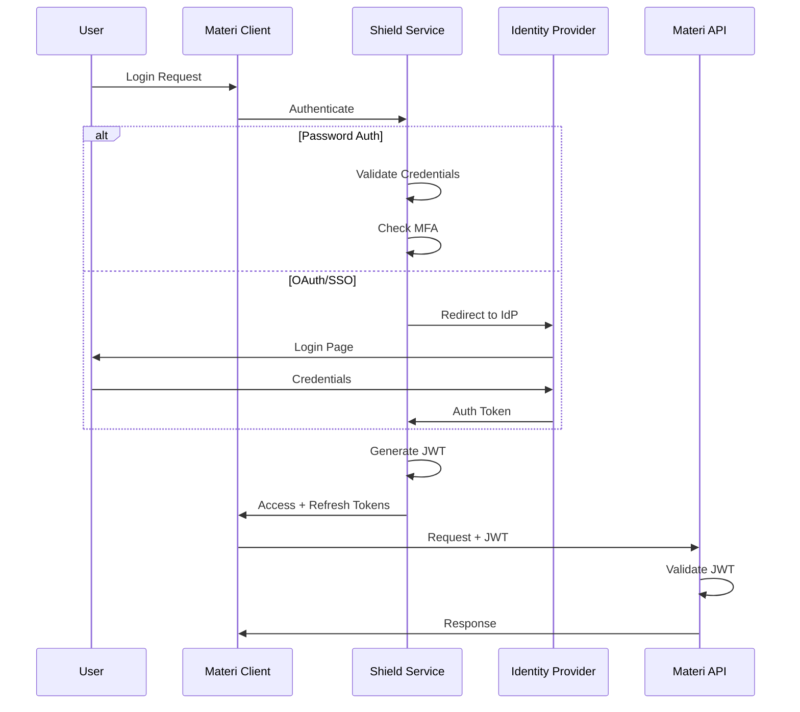
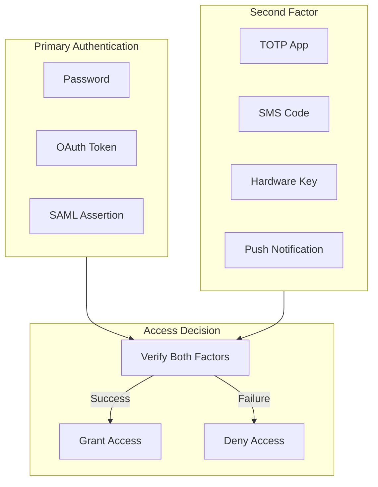

# Authentication

Materi provides flexible, enterprise-grade authentication options to meet your organization's security requirements. From simple password-based login to advanced SAML SSO integration, our authentication system ensures secure access while maintaining a seamless user experience.

## Authentication Flow Overview



## Authentication Methods

<Tabs>
  <Tab title="Password Authentication">
    ### Password-Based Login

    Available on all plans, password authentication provides secure local account management with industry-standard protections.

    #### Password Requirements

    | Requirement | Minimum | Recommended |
    |------------|---------|-------------|
    | Length | 10 characters | 14+ characters |
    | Complexity | 3 of 4 character types | All character types |
    | History | Last 5 passwords blocked | Last 12 passwords |
    | Expiration | 90 days (configurable) | 180 days with MFA |

    <Note>
      Password requirements can be customized by workspace administrators. Enterprise customers can enforce organizational password policies.
    </Note>

    #### Enabling Password Authentication

    <Steps>
      <Step title="Navigate to Security Settings">
        Go to **Settings > Security > Authentication Methods** in your workspace admin panel.
      </Step>
      <Step title="Configure Password Policy">
        Set minimum length, complexity requirements, and expiration periods based on your security policy.
      </Step>
      <Step title="Enable Account Lockout">
        Configure lockout threshold (recommended: 5 failed attempts) and lockout duration (recommended: 15 minutes).
      </Step>
      <Step title="Save and Test">
        Save your configuration and test with a non-admin account to verify the policy works as expected.
      </Step>
    </Steps>
  </Tab>
  <Tab title="OAuth 2.0">
    ### Social and OAuth Login

    **Available on Business and Enterprise plans**

    Connect your existing identity providers for streamlined authentication without managing separate passwords.

    #### Supported OAuth Providers

    <CardGroup cols={3}>
      <Card title="Google Workspace" icon="google">
        Full integration with Google accounts and Workspace domains.
      </Card>
      <Card title="Microsoft 365" icon="microsoft">
        Azure AD and Microsoft 365 account support.
      </Card>
      <Card title="GitHub" icon="github">
        OAuth integration for developer teams.
      </Card>
      <Card title="Okta" icon="shield">
        Enterprise identity provider integration.
      </Card>
      <Card title="Auth0" icon="lock">
        Universal identity platform support.
      </Card>
      <Card title="Custom OAuth" icon="code">
        Configure any OAuth 2.0 compliant provider.
      </Card>
    </CardGroup>

    #### Configuring Google OAuth

    <Steps>
      <Step title="Create Google Cloud Project">
        Navigate to the Google Cloud Console and create a new project or select an existing one.
      </Step>
      <Step title="Configure OAuth Consent Screen">
        Set up the OAuth consent screen with your application name, authorized domains, and required scopes.
      </Step>
      <Step title="Create OAuth Credentials">
        Create OAuth 2.0 Client ID credentials. Set the authorized redirect URI to:
        ```
        https://your-workspace.materi.io/auth/callback/google
        ```
      </Step>
      <Step title="Add Credentials to Materi">
        In Materi, go to **Settings > Security > OAuth Providers > Google** and enter your Client ID and Client Secret.
      </Step>
      <Step title="Configure Domain Restrictions">
        Optionally restrict authentication to specific Google Workspace domains for enhanced security.
      </Step>
    </Steps>

    <Tip>
      For production deployments, always restrict OAuth to your organization's verified domains to prevent unauthorized account creation.
    </Tip>
  </Tab>
  <Tab title="SAML 2.0 SSO">
    ### Enterprise Single Sign-On

    **Enterprise plan only**

    SAML 2.0 integration enables seamless authentication with your corporate identity provider, supporting just-in-time provisioning and centralized access management.

    #### Supported Identity Providers

    | Provider | Status | SCIM Support |
    |----------|--------|--------------|
    | Okta | Fully Supported | Yes |
    | Azure AD | Fully Supported | Yes |
    | OneLogin | Fully Supported | Yes |
    | Ping Identity | Fully Supported | Yes |
    | Google Workspace | Fully Supported | Limited |
    | ADFS | Fully Supported | No |
    | Custom SAML | Configurable | Varies |

    #### SAML Configuration

    <Steps>
      <Step title="Download Materi Metadata">
        Download your workspace's SAML metadata from **Settings > Security > SSO > SAML Configuration**.

        Service Provider details:
        - **Entity ID**: `https://your-workspace.materi.io/saml/metadata`
        - **ACS URL**: `https://your-workspace.materi.io/saml/acs`
        - **SLO URL**: `https://your-workspace.materi.io/saml/slo`
      </Step>
      <Step title="Configure Your Identity Provider">
        Add Materi as a SAML application in your IdP using the downloaded metadata or manual configuration.
      </Step>
      <Step title="Configure Attribute Mapping">
        Map the following SAML attributes:

        | Materi Attribute | SAML Claim |
        |-----------------|------------|
        | email | user.email |
        | firstName | user.firstName |
        | lastName | user.lastName |
        | groups | user.groups |
      </Step>
      <Step title="Upload IdP Metadata">
        Upload your IdP's metadata XML or manually enter the SSO URL and certificate.
      </Step>
      <Step title="Test SSO">
        Use the **Test SSO** button to validate the configuration before enabling for all users.
      </Step>
    </Steps>

    <Warning>
      Always test SSO configuration with a test account before enforcing SSO-only authentication. Ensure at least one admin account retains password access for emergency recovery.
    </Warning>
  </Tab>
</Tabs>

## Multi-Factor Authentication

MFA adds a critical second layer of security to protect accounts from credential compromise.

### MFA Architecture



### Available MFA Methods

<AccordionGroup>
  <Accordion title="Authenticator App (TOTP)">
    **Available on all plans**

    Time-based One-Time Passwords using apps like Google Authenticator, Authy, or 1Password.

    - 6-digit codes that refresh every 30 seconds
    - Works offline without cellular or internet connection
    - Recovery codes provided during setup for emergency access

    **Recommended for**: All users as the primary MFA method.
  </Accordion>
  <Accordion title="SMS Verification">
    **Available on Business and Enterprise plans**

    One-time codes sent via SMS to verified phone numbers.

    - Familiar user experience
    - No app installation required
    - Subject to SIM-swapping risks

    <Warning>
      SMS-based MFA is less secure than authenticator apps due to SIM-swapping attacks. Use only as a backup method or when app-based MFA is not feasible.
    </Warning>
  </Accordion>
  <Accordion title="Hardware Security Keys">
    **Enterprise plan only**

    FIDO2/WebAuthn hardware keys like YubiKey provide the strongest authentication security.

    - Phishing-resistant authentication
    - Cryptographic proof of possession
    - Supports multiple keys per account

    **Recommended for**: Admin accounts and high-security environments.
  </Accordion>
  <Accordion title="Push Notifications">
    **Enterprise plan only**

    Approve login requests via the Materi mobile app with biometric verification.

    - One-tap approval with biometric confirmation
    - Location and device information displayed
    - Automatic timeout after 60 seconds
  </Accordion>
</AccordionGroup>

### Enforcing MFA

<Tabs>
  <Tab title="Workspace-Wide">
    Require MFA for all workspace members:

    <Steps>
      <Step title="Access Security Settings">
        Navigate to **Settings > Security > Multi-Factor Authentication**.
      </Step>
      <Step title="Enable MFA Requirement">
        Toggle **Require MFA for all users** to enabled.
      </Step>
      <Step title="Set Grace Period">
        Configure a grace period (7-30 days recommended) for users to set up MFA.
      </Step>
      <Step title="Choose Allowed Methods">
        Select which MFA methods are permitted in your organization.
      </Step>
    </Steps>
  </Tab>
  <Tab title="Role-Based">
    Require MFA only for specific roles:

    - **Admins Only**: Require MFA for all workspace and billing administrators
    - **Sensitive Roles**: Require MFA for roles with access to sensitive documents
    - **Custom Policy**: Configure MFA requirements per role in role settings
  </Tab>
  <Tab title="Conditional">
    **Enterprise plan only**

    Apply MFA based on risk signals:

    - New device login
    - Login from unusual location
    - High-risk actions (bulk export, permission changes)
    - Time-based (outside business hours)
  </Tab>
</Tabs>

## Session Management

### Session Security Controls

| Control | Description | Default |
|---------|-------------|---------|
| Session Duration | Maximum session lifetime | 24 hours |
| Idle Timeout | Inactivity before re-authentication | 30 minutes |
| Concurrent Sessions | Maximum active sessions per user | 5 |
| Session Binding | Bind sessions to IP/device | Disabled |
| Force Logout | Terminate all sessions remotely | Admin only |

### Token Architecture

<AccordionGroup>
  <Accordion title="Access Tokens">
    - **Format**: JWT (JSON Web Token)
    - **Lifetime**: 15 minutes
    - **Contains**: User ID, roles, permissions, workspace ID
    - **Signed**: RS256 with rotating keys
  </Accordion>
  <Accordion title="Refresh Tokens">
    - **Format**: Opaque token
    - **Lifetime**: 7 days (configurable)
    - **Storage**: Encrypted in database
    - **Rotation**: New refresh token on each use
  </Accordion>
  <Accordion title="API Keys">
    - **Format**: Prefixed opaque token (mk_live_...)
    - **Lifetime**: No expiration (revocable)
    - **Scope**: Configurable permissions
    - **Audit**: Full request logging
  </Accordion>
</AccordionGroup>

## Account Security

### Account Lockout Protection

Prevent brute-force attacks with automatic account lockout:

| Setting | Default | Range |
|---------|---------|-------|
| Failed Attempts | 5 | 3-10 |
| Lockout Duration | 15 minutes | 5-60 minutes |
| Progressive Lockout | Enabled | Yes/No |
| Admin Notification | Enabled | Yes/No |

### Credential Security

<CardGroup cols={2}>
  <Card title="Password Hashing" icon="hashtag">
    Passwords are hashed using Argon2id with per-user salts. Original passwords are never stored.
  </Card>
  <Card title="Secure Recovery" icon="rotate">
    Password reset uses time-limited, single-use tokens sent to verified email addresses.
  </Card>
  <Card title="Breach Detection" icon="magnifying-glass">
    Passwords are checked against known breach databases using k-anonymity to protect privacy.
  </Card>
  <Card title="Credential Rotation" icon="clock-rotate-left">
    API keys and service credentials support automatic rotation on configurable schedules.
  </Card>
</CardGroup>

## Troubleshooting

<AccordionGroup>
  <Accordion title="SSO login fails with 'Invalid SAML Response'">
    This typically indicates a configuration mismatch between Materi and your IdP:

    1. Verify the ACS URL in your IdP matches exactly: `https://your-workspace.materi.io/saml/acs`
    2. Check that the clock on your IdP server is synchronized (SAML assertions are time-sensitive)
    3. Ensure the certificate in Materi matches your IdP's signing certificate
    4. Review the SAML response in browser developer tools for specific error messages
  </Accordion>
  <Accordion title="MFA codes are not working">
    If TOTP codes are consistently rejected:

    1. Verify your device clock is accurate (enable automatic time sync)
    2. Ensure you are using codes for the correct account
    3. Try generating a new code and entering it immediately
    4. If issues persist, use a recovery code and re-enroll in MFA
  </Accordion>
  <Accordion title="Users cannot access workspace after SSO is enabled">
    When enabling SSO-only authentication:

    1. Ensure all users have accounts in your IdP with matching email addresses
    2. Verify attribute mapping includes required fields (email is mandatory)
    3. Check that the user's IdP groups map to Materi workspace access
    4. Temporarily enable password fallback for debugging
  </Accordion>
  <Accordion title="OAuth login redirects to wrong workspace">
    This occurs when OAuth credentials are shared across workspaces:

    1. Create separate OAuth applications for each workspace
    2. Verify the redirect URI includes the correct workspace subdomain
    3. Check for cached authentication state in the browser
  </Accordion>
  <Accordion title="Sessions are expiring too quickly">
    If users report frequent logouts:

    1. Check session timeout settings in **Settings > Security > Sessions**
    2. Verify idle timeout is not set too low for your use case
    3. Review if concurrent session limits are being exceeded
    4. Check for issues with refresh token rotation
  </Accordion>
</AccordionGroup>

## Related Documentation

<CardGroup cols={2}>
  <Card title="Access Controls" href="/security/access-controls" icon="users-gear">
    Configure roles and permissions after authentication.
  </Card>
  <Card title="Audit Logs" href="/security/audit-logs" icon="scroll">
    Monitor authentication events and access patterns.
  </Card>
  <Card title="GDPR Compliance" href="/security/gdpr-compliance" icon="eu">
    Understand authentication data handling and privacy.
  </Card>
  <Card title="Security Overview" href="/security/overview" icon="shield-halved">
    Learn about our comprehensive security architecture.
  </Card>
</CardGroup>
