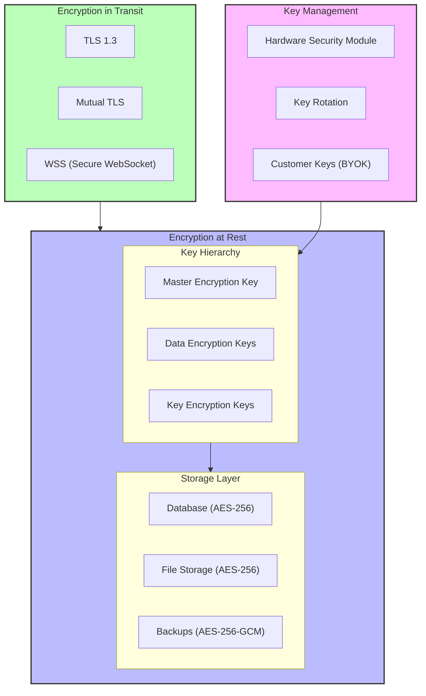
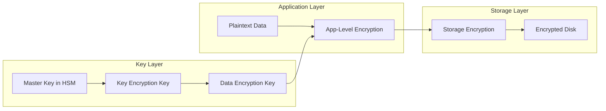
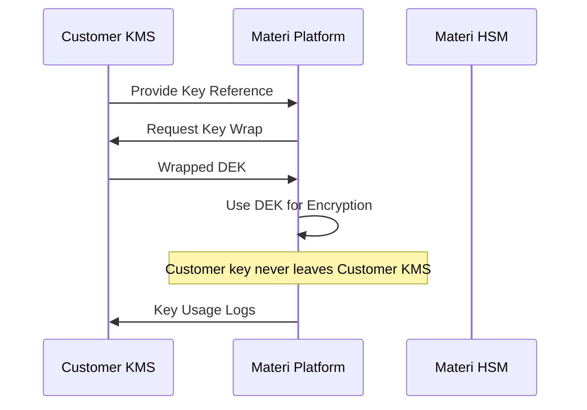

# Data Encryption

Materi employs comprehensive encryption strategies to protect your content throughout its lifecycle. All data is encrypted both at rest and in transit using industry-standard algorithms and key management practices that meet the most stringent compliance requirements.

## Encryption Architecture Overview



## Encryption in Transit

All data transmitted to and from Materi is protected using TLS 1.3, the latest and most secure transport layer security protocol.

### TLS Configuration

| Setting | Configuration |
|---------|---------------|
| Protocol Version | TLS 1.3 (TLS 1.2 supported for legacy) |
| Cipher Suites | TLS_AES_256_GCM_SHA384, TLS_CHACHA20_POLY1305_SHA256 |
| Key Exchange | X25519, secp384r1 |
| Certificate Type | RSA-4096 or ECDSA P-384 |
| HSTS | Enabled with 1-year max-age |
| Certificate Transparency | Required for all certificates |

<Tip>
  Use [SSL Labs](https://www.ssllabs.com/ssltest/) to verify our TLS configuration. Materi consistently achieves an A+ rating.
</Tip>

### Connection Security by Service

<Tabs>
  <Tab title="API Connections">
    All REST API connections use HTTPS with TLS 1.3:

    ```bash
    # Verify TLS configuration
    curl -v https://api.materi.io/health 2>&1 | grep "SSL connection"
    # SSL connection using TLSv1.3 / TLS_AES_256_GCM_SHA384
    ```

    **Security Headers Applied:**
    - `Strict-Transport-Security: max-age=31536000; includeSubDomains; preload`
    - `X-Content-Type-Options: nosniff`
    - `X-Frame-Options: DENY`
    - `Content-Security-Policy: default-src 'self'`
  </Tab>
  <Tab title="WebSocket Connections">
    Real-time collaboration uses secure WebSocket connections (WSS):

    - TLS 1.3 encryption on all WebSocket connections
    - Per-message authentication using JWT tokens
    - Connection heartbeat with encrypted health checks
    - Automatic reconnection with session resumption

    <Note>
      WebSocket connections inherit the same TLS configuration as HTTPS connections, ensuring consistent security.
    </Note>
  </Tab>
  <Tab title="Internal Services">
    Service-to-service communication uses mutual TLS (mTLS):

    - Both client and server present certificates
    - Certificates issued by internal CA with 24-hour validity
    - Automatic certificate rotation
    - Service mesh encryption (Istio/Linkerd compatible)
  </Tab>
</Tabs>

### Certificate Management

<AccordionGroup>
  <Accordion title="Certificate Authority">
    Materi uses certificates issued by trusted Certificate Authorities:

    - Production: DigiCert, Let's Encrypt (backup)
    - Certificates renewed 30 days before expiration
    - Certificate pinning available for mobile applications
    - CAA DNS records restrict certificate issuance
  </Accordion>
  <Accordion title="Certificate Transparency">
    All certificates are logged to public CT logs:

    - Enables monitoring for unauthorized certificate issuance
    - CT log monitoring alerts on unexpected certificates
    - Supports SCT (Signed Certificate Timestamp) validation
  </Accordion>
  <Accordion title="Custom Domains">
    For custom domains (Enterprise):

    - Automatic TLS certificate provisioning via Let's Encrypt
    - Option to upload your own certificates
    - Wildcard certificate support
    - DNS validation or HTTP-01 challenge support
  </Accordion>
</AccordionGroup>

## Encryption at Rest

All stored data is encrypted using AES-256, the gold standard for symmetric encryption approved by NIST and used by government agencies worldwide.

### Data Encryption Layers



### Storage Encryption Details

| Data Type | Encryption Method | Key Rotation |
|-----------|------------------|--------------|
| Database Records | AES-256-GCM | 90 days |
| Document Content | AES-256-GCM | Per-document key |
| File Attachments | AES-256-GCM | 90 days |
| Metadata | AES-256-CBC | 90 days |
| Backups | AES-256-GCM | Per-backup key |
| Audit Logs | AES-256-GCM | 365 days |

<Tabs>
  <Tab title="Database Encryption">
    ### PostgreSQL Encryption

    All database storage uses encryption at rest:

    - **Tablespace Encryption**: AES-256 encrypted storage volumes
    - **Column Encryption**: Sensitive columns encrypted at application layer
    - **Connection Encryption**: TLS 1.3 for all database connections
    - **Backup Encryption**: Encrypted with separate backup keys

    Sensitive fields with additional application-level encryption:
    - Personal identifiable information (PII)
    - API keys and tokens
    - OAuth client secrets
    - Webhook signing keys
  </Tab>
  <Tab title="File Storage Encryption">
    ### Object Storage Encryption

    Files stored in our object storage system are encrypted:

    - **Server-Side Encryption**: AES-256 applied before writing to disk
    - **Unique Keys**: Each file encrypted with a unique DEK
    - **Envelope Encryption**: DEKs encrypted with workspace KEK
    - **Secure Deletion**: Cryptographic erasure via key deletion

    <Note>
      File encryption keys are rotated every 90 days. Existing files are re-encrypted during the next access or during scheduled maintenance.
    </Note>
  </Tab>
  <Tab title="Backup Encryption">
    ### Backup Security

    All backups are encrypted before leaving the source system:

    - **Encryption**: AES-256-GCM with authenticated encryption
    - **Key Isolation**: Backup keys stored separately from data keys
    - **Geographic Distribution**: Encrypted backups replicated across regions
    - **Integrity Verification**: SHA-256 checksums verified on restore

    Backup retention:
    | Backup Type | Retention | Encryption |
    |-------------|-----------|------------|
    | Continuous | 24 hours | Per-backup key |
    | Daily | 30 days | Workspace KEK |
    | Weekly | 90 days | Workspace KEK |
    | Monthly | 1 year | Archive key |
  </Tab>
</Tabs>

## Key Management

Materi implements a hierarchical key management system that balances security with operational efficiency.

### Key Hierarchy

<Steps>
  <Step title="Master Encryption Keys (MEK)">
    Root keys stored in Hardware Security Modules (HSMs):

    - FIPS 140-2 Level 3 certified HSMs
    - Never exported from HSM boundary
    - Dual-control, split-knowledge key ceremonies
    - Annual key rotation with automated re-encryption
  </Step>
  <Step title="Key Encryption Keys (KEK)">
    Intermediate keys that encrypt data encryption keys:

    - One KEK per workspace (isolation boundary)
    - Encrypted by MEK and stored in secure key store
    - Rotated every 90 days automatically
    - Support for customer-managed keys (BYOK)
  </Step>
  <Step title="Data Encryption Keys (DEK)">
    Keys that directly encrypt your data:

    - Unique per resource (document, file, etc.)
    - Short-lived with frequent rotation
    - Encrypted by KEK (envelope encryption)
    - Enables granular access control
  </Step>
</Steps>

### Key Rotation

<CardGroup cols={2}>
  <Card title="Automatic Rotation" icon="clock-rotate-left">
    Keys rotate automatically based on policy:
    - MEK: Annually
    - KEK: Every 90 days
    - DEK: Per resource or 30 days

    No action required from customers.
  </Card>
  <Card title="On-Demand Rotation" icon="rotate">
    Enterprise customers can trigger immediate rotation:
    - Via admin dashboard
    - Via API call
    - After suspected compromise
    - For compliance requirements
  </Card>
</CardGroup>

## Customer-Managed Keys (BYOK)

<Note>
  Customer-managed keys are available on the Enterprise plan only.
</Note>

Bring Your Own Key (BYOK) gives you full control over your encryption keys while leveraging Materi's infrastructure.

### BYOK Architecture



### Supported Key Management Systems

| Provider | Integration | Key Types |
|----------|-------------|-----------|
| AWS KMS | Native | RSA, AES |
| Google Cloud KMS | Native | RSA, AES, EC |
| Azure Key Vault | Native | RSA, AES, EC |
| HashiCorp Vault | API | Any supported |
| Thales Luna HSM | PKCS#11 | RSA, AES |
| Custom KMS | REST API | Configurable |

### Configuring BYOK

<Steps>
  <Step title="Generate Your Key">
    Create a 256-bit AES key or RSA-4096 key in your KMS:

    ```bash
    # AWS KMS example
    aws kms create-key \
      --description "Materi workspace encryption key" \
      --key-usage ENCRYPT_DECRYPT \
      --key-spec SYMMETRIC_DEFAULT
    ```
  </Step>
  <Step title="Configure IAM Permissions">
    Grant Materi access to use (not manage) your key:

    ```json
    {
      "Version": "2012-10-17",
      "Statement": [{
        "Effect": "Allow",
        "Principal": {
          "AWS": "arn:aws:iam::123456789:role/MateriEncryption"
        },
        "Action": [
          "kms:Encrypt",
          "kms:Decrypt",
          "kms:GenerateDataKey"
        ],
        "Resource": "*"
      }]
    }
    ```
  </Step>
  <Step title="Register Key in Materi">
    Navigate to **Settings > Security > Encryption > Customer Keys** and add your key ARN or reference.
  </Step>
  <Step title="Enable for Workspace">
    Select which workspaces should use your customer-managed key.
  </Step>
  <Step title="Verify Encryption">
    Create a test document and verify encryption uses your key in KMS logs.
  </Step>
</Steps>

<Warning>
  If your customer-managed key becomes unavailable, Materi cannot decrypt your data. Ensure high availability for your KMS and maintain secure key backups.
</Warning>

### BYOK Responsibilities

<Tabs>
  <Tab title="Materi Responsibilities">
    - Secure key usage and caching
    - Encryption/decryption operations
    - Key rotation coordination
    - Audit logging of key usage
    - Failover handling
  </Tab>
  <Tab title="Customer Responsibilities">
    - Key generation and storage
    - Key availability (99.99% SLA recommended)
    - Key backup and disaster recovery
    - Access policy management
    - Key rotation scheduling
  </Tab>
</Tabs>

## Encryption Compliance

### Standards and Certifications

| Standard | Status | Details |
|----------|--------|---------|
| FIPS 140-2 | Certified | Level 3 for HSMs, Level 1 for software |
| SOC 2 Type II | Audited Annually | Encryption controls verified |
| ISO 27001 | Certified | A.10 Cryptography controls |
| GDPR Article 32 | Compliant | Encryption as technical measure |
| HIPAA | BAA Available | Encryption meets requirements |
| PCI DSS | Level 1 | Requirement 3 and 4 compliant |

### Encryption Algorithms

<AccordionGroup>
  <Accordion title="Symmetric Encryption">
    - **Primary**: AES-256-GCM (authenticated encryption)
    - **Legacy Support**: AES-256-CBC with HMAC-SHA256
    - **Key Derivation**: HKDF-SHA256 or Argon2id
  </Accordion>
  <Accordion title="Asymmetric Encryption">
    - **Key Exchange**: X25519, ECDH P-384
    - **Digital Signatures**: Ed25519, ECDSA P-384
    - **RSA**: 4096-bit minimum for legacy systems
  </Accordion>
  <Accordion title="Hashing">
    - **Passwords**: Argon2id (time=3, memory=64MB, parallelism=4)
    - **Integrity**: SHA-256, SHA-384
    - **Fast Hashing**: BLAKE3 for non-security uses
  </Accordion>
</AccordionGroup>

## Data Isolation

### Workspace Encryption Isolation

Each workspace maintains cryptographic separation:

- **Unique KEK**: Every workspace has its own key encryption key
- **No Cross-Access**: Keys cannot decrypt data from other workspaces
- **Tenant Isolation**: Separate database schemas with separate keys
- **Key Destruction**: Workspace deletion includes cryptographic erasure

### Multi-Region Encryption

<CardGroup cols={2}>
  <Card title="Data Residency" icon="globe">
    Keys and data co-located in the same region:
    - US (us-east-1, us-west-2)
    - EU (eu-west-1, eu-central-1)
    - APAC (ap-southeast-1)
  </Card>
  <Card title="Cross-Region Backup" icon="database">
    Encrypted backups can replicate across regions while maintaining key isolation.
  </Card>
</CardGroup>

## Troubleshooting

<AccordionGroup>
  <Accordion title="Encryption errors when uploading files">
    If you encounter encryption errors during file upload:

    1. Check file size limits (encryption adds overhead)
    2. Verify your browser supports required cryptographic APIs
    3. Check for network interruptions during upload
    4. Try a different browser or disable browser extensions
    5. Contact support if using BYOK with key access issues
  </Accordion>
  <Accordion title="BYOK key access denied errors">
    When customer-managed keys fail:

    1. Verify IAM/access policies grant Materi the required permissions
    2. Check key state (enabled, not pending deletion)
    3. Verify network connectivity between Materi and your KMS
    4. Review KMS logs for specific error details
    5. Test key access using your cloud provider's CLI
  </Accordion>
  <Accordion title="Performance impact from encryption">
    If you notice performance degradation:

    1. Encryption overhead is typically less than 5%
    2. Large file operations may take longer due to encryption
    3. BYOK adds latency for KMS calls (cache TTL: 5 minutes)
    4. Contact support for performance optimization recommendations
  </Accordion>
  <Accordion title="Verifying data is encrypted">
    To confirm your data is encrypted:

    1. Request an encryption verification report from **Settings > Security > Reports**
    2. Enterprise customers can audit encryption via API
    3. SOC 2 reports include encryption control testing
    4. Request a data export and verify files are encrypted at rest
  </Accordion>
</AccordionGroup>

## Related Documentation

<CardGroup cols={2}>
  <Card title="Security Overview" href="/security/overview" icon="shield-halved">
    Comprehensive security architecture and controls.
  </Card>
  <Card title="Access Controls" href="/security/access-controls" icon="users-gear">
    Permission-based access to encrypted data.
  </Card>
  <Card title="GDPR Compliance" href="/security/gdpr-compliance" icon="eu">
    How encryption supports privacy compliance.
  </Card>
  <Card title="Audit Logs" href="/security/audit-logs" icon="scroll">
    Track encryption key usage and data access.
  </Card>
</CardGroup>
