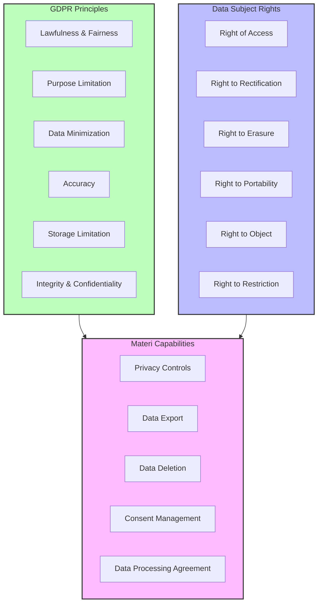
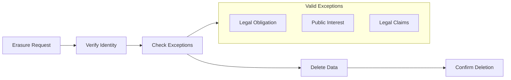
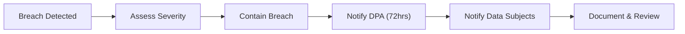

# GDPR Compliance

Materi is designed to help organizations comply with the General Data Protection Regulation (GDPR) and other privacy regulations. Our platform provides comprehensive tools for data protection, consent management, and exercising data subject rights.

## GDPR Compliance Overview



## Data Processing Roles

Understanding the roles in GDPR compliance:

<CardGroup cols={2}>
  <Card title="Materi as Data Processor" icon="server">
    When you use Materi, we act as a **Data Processor**, processing personal data on your behalf according to your instructions.
  </Card>
  <Card title="You as Data Controller" icon="building">
    Your organization is the **Data Controller**, determining the purposes and means of processing personal data.
  </Card>
</CardGroup>

### Data Processing Agreement

<Note>
  A Data Processing Agreement (DPA) is required for GDPR compliance. All Materi customers receive our standard DPA upon request.
</Note>

Our DPA covers:

| Topic | Coverage |
|-------|----------|
| Processing scope | What data we process and why |
| Sub-processors | List of approved sub-processors |
| Security measures | Technical and organizational measures |
| Data transfers | International transfer mechanisms |
| Audit rights | Your right to audit our processing |
| Breach notification | 72-hour notification commitment |
| Data deletion | Procedures for data return/deletion |

<Steps>
  <Step title="Request DPA">
    Contact your account manager or email privacy@materi.io to request the DPA.
  </Step>
  <Step title="Review Terms">
    Review the DPA with your legal and compliance team.
  </Step>
  <Step title="Sign Agreement">
    Sign electronically or return signed copy to complete the agreement.
  </Step>
  <Step title="Receive Confirmation">
    You will receive a countersigned copy for your records.
  </Step>
</Steps>

## Personal Data We Process

### Categories of Personal Data

<Tabs>
  <Tab title="User Account Data">
    Information collected during account creation and management:

    | Data Type | Purpose | Legal Basis |
    |-----------|---------|-------------|
    | Email address | Account identification, communication | Contract performance |
    | Full name | User identification | Contract performance |
    | Password hash | Authentication | Contract performance |
    | Profile photo | User identification | Consent |
    | Phone number | MFA, recovery | Contract performance |
    | Job title | User context | Consent |
    | Company name | Billing, support | Contract performance |
  </Tab>
  <Tab title="Usage Data">
    Information generated through platform usage:

    | Data Type | Purpose | Legal Basis |
    |-----------|---------|-------------|
    | IP address | Security, fraud prevention | Legitimate interest |
    | Device info | Security, optimization | Legitimate interest |
    | Access logs | Security, audit | Legal obligation |
    | Feature usage | Product improvement | Legitimate interest |
    | Session data | Service delivery | Contract performance |
  </Tab>
  <Tab title="Content Data">
    Data created or uploaded by users:

    | Data Type | Controller | Processor |
    |-----------|------------|-----------|
    | Documents | Customer | Materi |
    | Comments | Customer | Materi |
    | Files | Customer | Materi |
    | Metadata | Customer | Materi |

    <Warning>
      As Data Controller, you are responsible for ensuring you have appropriate legal basis to process any personal data contained in your content.
    </Warning>
  </Tab>
</Tabs>

## Data Subject Rights

Materi provides tools to help you fulfill data subject rights requests.

### Right of Access (Article 15)

Data subjects can request a copy of their personal data.

<Steps>
  <Step title="Receive Request">
    Data subject submits access request to your organization.
  </Step>
  <Step title="Verify Identity">
    Verify the identity of the requestor before proceeding.
  </Step>
  <Step title="Generate Export">
    Navigate to **Settings > Privacy > Data Subject Requests > New Request**.
  </Step>
  <Step title="Export Data">
    Select the user and generate a comprehensive data export:

    | Export Type | Contents |
    |-------------|----------|
    | Profile data | Account information |
    | Activity data | Login history, actions |
    | Content data | Documents, comments, files |
    | System data | Preferences, settings |
  </Step>
  <Step title="Deliver to Subject">
    Provide the exported data to the data subject within 30 days.
  </Step>
</Steps>

### Right to Erasure (Article 17)

Also known as the "right to be forgotten."



<Tabs>
  <Tab title="User Deletion">
    To delete a user and their personal data:

    <Steps>
      <Step title="Navigate to User Management">
        Go to **Settings > Users > [Select User]**.
      </Step>
      <Step title="Initiate Deletion">
        Click **Delete User** and confirm the action.
      </Step>
      <Step title="Select Deletion Options">
        Choose what to delete:

        | Option | Effect |
        |--------|--------|
        | Personal data only | Remove PII, anonymize content |
        | All data | Delete all user data and content |
        | Transfer ownership | Reassign content to another user |
      </Step>
      <Step title="Confirm Deletion">
        Deletion begins immediately. A confirmation is logged in audit logs.
      </Step>
    </Steps>
  </Tab>
  <Tab title="Content Deletion">
    To delete specific content containing personal data:

    <Steps>
      <Step title="Identify Content">
        Use search or audit logs to identify content to delete.
      </Step>
      <Step title="Delete Content">
        Delete documents, files, or comments as needed.
      </Step>
      <Step title="Empty Trash">
        Navigate to **Trash** and permanently delete items.
      </Step>
      <Step title="Verify Deletion">
        Confirm content is removed from all backups within 30 days.
      </Step>
    </Steps>
  </Tab>
</Tabs>

<Warning>
  Deletion is permanent and cannot be undone. Ensure you have met any legal retention requirements before deleting data.
</Warning>

### Right to Data Portability (Article 20)

Export data in a machine-readable format.

<CardGroup cols={2}>
  <Card title="Standard Export" icon="file-export">
    Export formats:
    - JSON (recommended for portability)
    - CSV (for spreadsheet import)
    - ZIP (bundled with files)
  </Card>
  <Card title="API Export" icon="code">
    Programmatic export:
    - Full data export API
    - Incremental export
    - Scheduled exports
  </Card>
</CardGroup>

#### Export API Example

```bash
curl -X POST "https://api.materi.io/v1/privacy/export" \
  -H "Authorization: Bearer $API_TOKEN" \
  -H "Content-Type: application/json" \
  -d '{
    "user_id": "user_abc123",
    "format": "json",
    "include": ["profile", "content", "activity"],
    "notify_email": "dpo@yourcompany.com"
  }'
```

### Right to Rectification (Article 16)

Users can update their personal data directly:

| Data Type | How to Update |
|-----------|---------------|
| Profile information | **Account Settings > Profile** |
| Email address | **Account Settings > Email** (requires verification) |
| Password | **Account Settings > Security > Change Password** |
| Preferences | **Account Settings > Preferences** |

For data you cannot self-service update, contact your workspace administrator.

### Right to Restriction (Article 18)

Temporarily restrict processing of personal data:

<Steps>
  <Step title="Receive Request">
    Data subject requests processing restriction.
  </Step>
  <Step title="Apply Restriction">
    Navigate to **Settings > Privacy > Data Subject Requests > Restrict Processing**.
  </Step>
  <Step title="Select User">
    Choose the user whose processing should be restricted.
  </Step>
  <Step title="Configure Restriction">
    | Restriction Type | Effect |
    |------------------|--------|
    | Full restriction | User cannot access or modify any data |
    | Read-only | User can view but not modify data |
    | Archive | Data archived but not processed |
  </Step>
  <Step title="Document Reason">
    Record the reason for restriction in the request log.
  </Step>
</Steps>

## Privacy Controls

### Data Minimization

<AccordionGroup>
  <Accordion title="Collection Controls">
    Configure what data you collect:

    - Disable optional fields (job title, phone, photo)
    - Limit third-party integrations
    - Configure data retention periods
    - Enable anonymization for analytics
  </Accordion>
  <Accordion title="Retention Settings">
    Configure automatic data retention:

    | Data Type | Default Retention | Configurable |
    |-----------|------------------|--------------|
    | Audit logs | Per plan | Yes (Enterprise) |
    | Deleted content | 30 days | Yes (7-90 days) |
    | Session data | 90 days | Yes |
    | Analytics | 2 years | Yes |
  </Accordion>
  <Accordion title="Anonymization">
    Anonymize data for analytics and testing:

    - Remove personal identifiers
    - Replace names with pseudonyms
    - Aggregate usage statistics
    - Hash email addresses
  </Accordion>
</AccordionGroup>

### Consent Management

<Note>
  Consent management tools are available on Business and Enterprise plans.
</Note>

#### Consent Types

| Consent Type | Purpose | Required |
|--------------|---------|----------|
| Terms of Service | Service usage | Yes |
| Privacy Policy | Data processing | Yes |
| Marketing | Promotional emails | No |
| Analytics | Usage tracking | No (legitimate interest) |
| Cookies | Non-essential cookies | Yes (EU) |

#### Managing Consent

<Steps>
  <Step title="Configure Consent Options">
    Navigate to **Settings > Privacy > Consent Management**.
  </Step>
  <Step title="Customize Consent Banner">
    Configure the consent banner for your workspace:

    - Banner text and design
    - Cookie categories
    - Opt-in vs opt-out defaults
    - Geographic targeting
  </Step>
  <Step title="Track Consent">
    View consent records in **Privacy > Consent Logs**.
  </Step>
  <Step title="Export Consent Records">
    Export consent records for compliance documentation.
  </Step>
</Steps>

## International Data Transfers

### Transfer Mechanisms

Materi supports GDPR-compliant international data transfers:

<Tabs>
  <Tab title="Standard Contractual Clauses">
    We use EU-approved SCCs for transfers outside the EEA:

    - Controller-to-Processor SCCs
    - Processor-to-Sub-processor SCCs
    - Updated 2021 SCCs implemented

    <Tip>
      SCCs are included in our Data Processing Agreement.
    </Tip>
  </Tab>
  <Tab title="Data Residency">
    **Enterprise plan only**

    Keep your data within specific regions:

    | Region | Data Centers |
    |--------|--------------|
    | EU | Frankfurt, Dublin |
    | US | Virginia, Oregon |
    | APAC | Singapore, Sydney |

    Configure data residency in **Settings > Security > Data Residency**.
  </Tab>
  <Tab title="Supplementary Measures">
    Additional protections for international transfers:

    - Encryption in transit and at rest
    - Pseudonymization where possible
    - Access controls and logging
    - Regular security assessments
  </Tab>
</Tabs>

### Sub-Processors

We maintain a list of approved sub-processors:

| Sub-Processor | Purpose | Location |
|---------------|---------|----------|
| AWS | Cloud infrastructure | US/EU |
| Stripe | Payment processing | US |
| SendGrid | Transactional email | US |
| Datadog | Monitoring | US |
| Intercom | Customer support | US |

<Note>
  View the complete sub-processor list at [materi.io/legal/sub-processors](https://materi.io/legal/sub-processors). Subscribe to receive notifications of changes.
</Note>

## Breach Notification

### Breach Response Timeline



### Notification Commitments

| Action | Timeline | Condition |
|--------|----------|-----------|
| Internal detection | Immediate | All incidents |
| Customer notification | 72 hours | If customer data affected |
| DPA notification support | Provide details for your filing | If personal data breach |
| Data subject notification | Assist with communication | If high risk to individuals |

<Warning>
  You are responsible for notifying your supervisory authority and data subjects. Materi will provide all necessary information to support your notifications.
</Warning>

## Privacy by Design

### Technical Measures

<CardGroup cols={2}>
  <Card title="Encryption" icon="lock">
    - AES-256 encryption at rest
    - TLS 1.3 encryption in transit
    - Customer-managed keys (Enterprise)
  </Card>
  <Card title="Access Control" icon="users-gear">
    - Role-based access control
    - Principle of least privilege
    - Regular access reviews
  </Card>
  <Card title="Audit Logging" icon="scroll">
    - Comprehensive activity logs
    - Tamper-evident logging
    - Configurable retention
  </Card>
  <Card title="Data Isolation" icon="shield">
    - Workspace-level isolation
    - Encrypted tenant separation
    - Secure multi-tenancy
  </Card>
</CardGroup>

### Organizational Measures

| Measure | Implementation |
|---------|----------------|
| Staff training | Annual privacy and security training |
| Background checks | All employees and contractors |
| Confidentiality | NDAs with all personnel |
| Vendor management | Privacy assessment of all vendors |
| Incident response | Documented breach response procedures |
| Regular audits | Annual SOC 2 Type II audit |

## Compliance Documentation

### Available Documentation

<AccordionGroup>
  <Accordion title="Data Processing Agreement">
    Standard DPA covering GDPR requirements:
    - Processing terms
    - Security measures
    - Sub-processor list
    - Data transfer mechanisms
  </Accordion>
  <Accordion title="Security Whitepaper">
    Technical security documentation:
    - Architecture overview
    - Encryption details
    - Access controls
    - Incident response
  </Accordion>
  <Accordion title="SOC 2 Report">
    **Enterprise plan only**

    Annual SOC 2 Type II report:
    - Security controls
    - Availability measures
    - Confidentiality controls
  </Accordion>
  <Accordion title="Privacy Impact Assessment">
    **Enterprise plan only**

    Template and guidance for conducting PIAs:
    - Risk assessment methodology
    - Data flow mapping
    - Mitigation measures
  </Accordion>
</AccordionGroup>

### Requesting Documentation

Contact privacy@materi.io or your account manager to request:

- Data Processing Agreement
- Security questionnaire responses
- SOC 2 report (under NDA)
- Custom compliance documentation

## Troubleshooting

<AccordionGroup>
  <Accordion title="How do I respond to a data subject access request?">
    To fulfill a DSAR:

    1. Verify the identity of the requestor
    2. Navigate to **Settings > Privacy > Data Subject Requests**
    3. Create a new access request for the user
    4. Generate the export in the requested format
    5. Deliver within 30 days (extendable to 90 for complex requests)
    6. Document the request and response in your records
  </Accordion>
  <Accordion title="Can I delete data while retaining audit logs?">
    Yes, audit logs can be retained for compliance while deleting user data:

    1. Audit logs are anonymized when user is deleted
    2. Personal identifiers are replaced with pseudonyms
    3. Activity history is preserved without PII
    4. Configure retention separately for each data type
  </Accordion>
  <Accordion title="How do I configure data residency for EU compliance?">
    Enterprise customers can configure data residency:

    1. Navigate to **Settings > Security > Data Residency**
    2. Select your preferred region (EU, US, APAC)
    3. New data will be stored in the selected region
    4. Contact support to migrate existing data
  </Accordion>
  <Accordion title="What happens to data when a user leaves the organization?">
    When removing a user:

    1. Personal profile data is deleted or anonymized
    2. Content they created can be transferred or deleted
    3. Activity logs are anonymized
    4. You can export their data before deletion
    5. Shared content permissions are updated
  </Accordion>
  <Accordion title="How do I handle consent for marketing communications?">
    Manage marketing consent:

    1. Navigate to **Settings > Privacy > Consent Management**
    2. Configure marketing consent options
    3. Users can opt-in during registration
    4. Provide unsubscribe option in all communications
    5. Export consent records for compliance
  </Accordion>
</AccordionGroup>

## Related Documentation

<CardGroup cols={2}>
  <Card title="Security Overview" href="/security/overview" icon="shield-halved">
    Comprehensive security controls and certifications.
  </Card>
  <Card title="Data Encryption" href="/security/data-encryption" icon="lock">
    Encryption implementation details.
  </Card>
  <Card title="Audit Logs" href="/security/audit-logs" icon="scroll">
    Activity logging for compliance.
  </Card>
  <Card title="Access Controls" href="/security/access-controls" icon="users-gear">
    Permission management and access policies.
  </Card>
</CardGroup>
