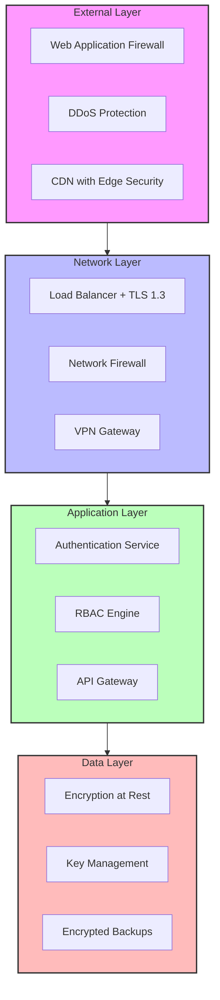
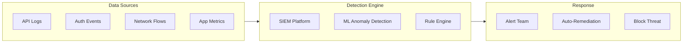

# Security Overview

Materi is built with security at its core, implementing defense-in-depth strategies to protect your organization's most valuable content. Our security architecture combines enterprise-grade encryption, robust access controls, and comprehensive audit capabilities to meet the most stringent compliance requirements.

## Security Architecture

Our multi-layered security model ensures protection at every level of the platform.

## Core Security Principles

<CardGroup cols={2}>
  <Card title="Zero Trust Architecture" icon="lock">
    Every request is authenticated and authorized, regardless of network location. No implicit trust is granted based on network segmentation alone.
  </Card>
  <Card title="Defense in Depth" icon="layer-group">
    Multiple overlapping security controls ensure that the failure of one control does not compromise the entire system.
  </Card>
  <Card title="Least Privilege Access" icon="user-lock">
    Users and services receive only the minimum permissions required to perform their functions.
  </Card>
  <Card title="Security by Design" icon="drafting-compass">
    Security is integrated into every phase of development, not added as an afterthought.
  </Card>
</CardGroup>

## Security Controls Matrix

| Control Category | Implementation | Compliance Mapping |
|-----------------|----------------|-------------------|
| **Identity & Access** | OAuth 2.0, SAML 2.0, MFA, RBAC | SOC 2 CC6.1, ISO 27001 A.9 |
| **Data Protection** | AES-256 encryption, TLS 1.3 | SOC 2 CC6.7, GDPR Art. 32 |
| **Network Security** | WAF, DDoS protection, VPN | SOC 2 CC6.6, ISO 27001 A.13 |
| **Monitoring** | Real-time alerts, audit logs | SOC 2 CC7.2, ISO 27001 A.12 |
| **Incident Response** | 24/7 SOC, automated response | SOC 2 CC7.4, ISO 27001 A.16 |
| **Business Continuity** | Multi-region failover, backups | SOC 2 A1.2, ISO 27001 A.17 |

## Security Features by Plan

<Tabs>
  <Tab title="Team Plan">
    ### Included Security Features
    - TLS 1.3 encryption in transit
    - AES-256 encryption at rest
    - Password authentication with strength requirements
    - Basic role-based access control (Admin, Editor, Viewer)
    - 30-day audit log retention
    - Two-factor authentication (TOTP)
    - Session management

    <Note>
      Team plan provides essential security controls suitable for small teams with standard security requirements.
    </Note>
  </Tab>
  <Tab title="Business Plan">
    ### All Team Features Plus
    - OAuth 2.0 social login (Google, Microsoft, GitHub)
    - Custom roles and permissions
    - 90-day audit log retention
    - IP allowlisting
    - Advanced session controls
    - API key management
    - Webhook security with HMAC signing

    <Tip>
      Business plan is ideal for growing organizations that need flexible access control and extended audit capabilities.
    </Tip>
  </Tab>
  <Tab title="Enterprise Plan">
    ### All Business Features Plus
    - SAML 2.0 SSO integration
    - SCIM user provisioning
    - Customer-managed encryption keys (BYOK)
    - Unlimited audit log retention
    - Advanced threat protection
    - Dedicated security review
    - Custom security policies
    - SOC 2 Type II attestation access
    - HIPAA BAA available
    - 24/7 security support

    <Warning>
      Enterprise security features require additional configuration. Contact your account team for implementation support.
    </Warning>
  </Tab>
</Tabs>

## Infrastructure Security

### Cloud Provider Security

Materi runs on enterprise-grade cloud infrastructure with the following certifications:

<AccordionGroup>
  <Accordion title="AWS Infrastructure">
    - SOC 1/2/3 certified data centers
    - ISO 27001, 27017, 27018 certified
    - FedRAMP authorized
    - HIPAA eligible services
    - PCI DSS Level 1 compliant

    Data residency options available for US, EU, and APAC regions.
  </Accordion>
  <Accordion title="Network Isolation">
    - Virtual Private Cloud (VPC) isolation
    - Private subnets for application and data tiers
    - Network ACLs and security groups
    - No public internet access to backend services
    - VPN and PrivateLink connectivity options
  </Accordion>
  <Accordion title="Physical Security">
    - 24/7 security personnel
    - Biometric access controls
    - Video surveillance with 90-day retention
    - Environmental controls (fire, flood, power)
    - Secure media destruction
  </Accordion>
</AccordionGroup>

## Application Security

### Secure Development Lifecycle

<Steps>
  <Step title="Design Review">
    Security architecture review for all new features, including threat modeling using STRIDE methodology.
  </Step>
  <Step title="Secure Coding">
    Development follows OWASP guidelines with mandatory security training for all engineers.
  </Step>
  <Step title="Code Analysis">
    Automated SAST/DAST scanning integrated into CI/CD pipeline with blocking on critical findings.
  </Step>
  <Step title="Security Testing">
    Dedicated security testing phase including penetration testing for major releases.
  </Step>
  <Step title="Deployment">
    Immutable infrastructure with signed container images and runtime protection.
  </Step>
</Steps>

### Vulnerability Management

| Severity | Response Time | Resolution Target |
|----------|--------------|-------------------|
| Critical | 1 hour | 24 hours |
| High | 4 hours | 7 days |
| Medium | 24 hours | 30 days |
| Low | 7 days | 90 days |

<Tip>
  Subscribe to our security advisories at [status.materi.io](https://status.materi.io) to receive notifications about security updates.
</Tip>

## Security Monitoring

### Real-Time Threat Detection

### Security Metrics Dashboard

Our security operations team monitors key metrics 24/7:

- Authentication failure rates
- API abuse patterns
- Data exfiltration indicators
- Privilege escalation attempts
- Configuration drift detection

## Incident Response

<Warning>
  If you believe your account has been compromised, immediately contact security@materi.io and reset your credentials.
</Warning>

### Response Process

<Steps>
  <Step title="Detection">
    Automated alerts trigger from SIEM, user reports, or monitoring systems.
  </Step>
  <Step title="Triage">
    Security team assesses severity and scope within 15 minutes for critical issues.
  </Step>
  <Step title="Containment">
    Affected systems isolated, credentials rotated, and threats blocked.
  </Step>
  <Step title="Investigation">
    Full forensic analysis with root cause identification.
  </Step>
  <Step title="Recovery">
    Systems restored from clean backups with enhanced monitoring.
  </Step>
  <Step title="Communication">
    Affected customers notified per contractual and regulatory requirements.
  </Step>
</Steps>

## Compliance and Certifications

<CardGroup cols={3}>
  <Card title="SOC 2 Type II" icon="certificate">
    Annual audit covering security, availability, and confidentiality.
  </Card>
  <Card title="ISO 27001" icon="globe">
    Certified information security management system.
  </Card>
  <Card title="GDPR" icon="eu">
    Full compliance with EU data protection regulations.
  </Card>
  <Card title="HIPAA" icon="hospital">
    BAA available for healthcare customers (Enterprise).
  </Card>
  <Card title="CCPA" icon="flag-usa">
    California Consumer Privacy Act compliance.
  </Card>
  <Card title="CSA STAR" icon="star">
    Cloud Security Alliance certification.
  </Card>
</CardGroup>

## Troubleshooting

<AccordionGroup>
  <Accordion title="How do I report a security vulnerability?">
    Submit security vulnerabilities through our responsible disclosure program at security@materi.io. We offer a bug bounty program for qualifying submissions. Please encrypt sensitive reports using our PGP key available at [materi.io/.well-known/security.txt](https://materi.io/.well-known/security.txt).
  </Accordion>
  <Accordion title="Where can I access compliance documentation?">
    Enterprise customers can access SOC 2 reports, penetration test summaries, and compliance documentation through the Security Center in the admin dashboard. Contact your account manager for NDA-protected materials.
  </Accordion>
  <Accordion title="How often are security assessments performed?">
    We conduct annual SOC 2 audits, quarterly penetration tests, and continuous automated security scanning. Major infrastructure changes trigger additional security reviews.
  </Accordion>
  <Accordion title="What is your data breach notification policy?">
    We notify affected customers within 72 hours of confirming a data breach, per GDPR requirements. Enterprise customers with custom SLAs may have expedited notification agreements.
  </Accordion>
</AccordionGroup>

## Related Documentation

<CardGroup cols={2}>
  <Card title="Authentication" href="/security/authentication" icon="key">
    Learn about authentication methods and SSO configuration.
  </Card>
  <Card title="Data Encryption" href="/security/data-encryption" icon="lock">
    Understand our encryption architecture and key management.
  </Card>
  <Card title="Access Controls" href="/security/access-controls" icon="users-gear">
    Configure roles, permissions, and access policies.
  </Card>
  <Card title="Audit Logs" href="/security/audit-logs" icon="scroll">
    Monitor activity and maintain compliance records.
  </Card>
</CardGroup>
