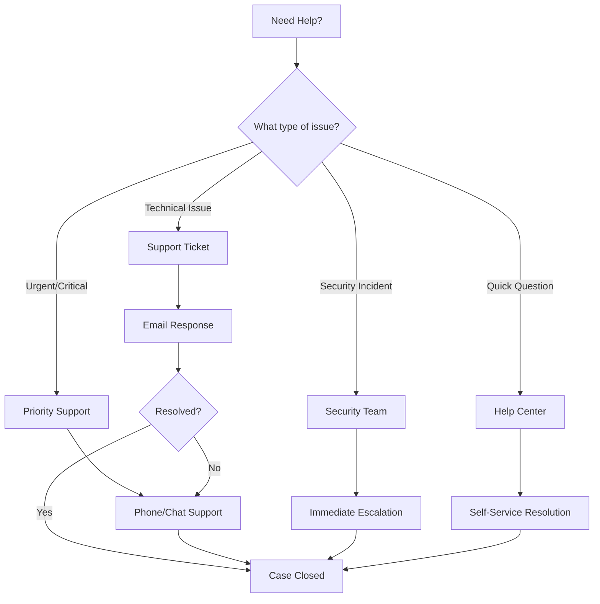
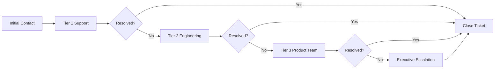

# Contact Materi Support

Our dedicated support team is here to help you get the most out of Materi. Whether you have a quick question or need assistance with a complex workflow, we offer multiple channels to ensure you receive timely and effective support.

<Note>
For security incidents or suspected data breaches, please contact our Security Response Team immediately at **security@materi.io** or call our 24/7 security hotline.
</Note>

## Support Channels Overview

## Contact Methods

<CardGroup cols={2}>
  <Card title="Support Portal" icon="ticket" href="https://support.materi.io">
    Submit and track support tickets through our dedicated portal. Access your ticket history and communicate directly with support engineers.
  </Card>
  <Card title="Email Support" icon="envelope">
    Send detailed inquiries to **support@materi.io**. Include your organization ID and relevant screenshots for faster resolution.
  </Card>
  <Card title="Live Chat" icon="comments">
    Available for Professional and Enterprise plans. Access real-time support directly within the Materi application.
  </Card>
  <Card title="Phone Support" icon="phone">
    Enterprise customers can reach our support team at **+1 (888) 555-MTRX**. Available during extended business hours.
  </Card>
</CardGroup>

## Support Hours by Region

<Tabs>
  <Tab title="Americas">
    | Region | Hours (Local Time) | Days |
    |--------|-------------------|------|
    | US East | 8:00 AM - 8:00 PM EST | Monday - Friday |
    | US West | 6:00 AM - 6:00 PM PST | Monday - Friday |
    | Canada | 8:00 AM - 8:00 PM EST | Monday - Friday |
    | Latin America | 9:00 AM - 6:00 PM Local | Monday - Friday |

    <Tip>
    Enterprise customers in the Americas have access to 24/7 phone support for critical issues.
    </Tip>
  </Tab>
  <Tab title="Europe">
    | Region | Hours (Local Time) | Days |
    |--------|-------------------|------|
    | UK & Ireland | 9:00 AM - 6:00 PM GMT | Monday - Friday |
    | Central Europe | 9:00 AM - 6:00 PM CET | Monday - Friday |
    | Eastern Europe | 9:00 AM - 6:00 PM EET | Monday - Friday |
    | Nordics | 9:00 AM - 5:00 PM Local | Monday - Friday |

    <Note>
    Support is available in English, German, French, and Spanish for European customers.
    </Note>
  </Tab>
  <Tab title="Asia-Pacific">
    | Region | Hours (Local Time) | Days |
    |--------|-------------------|------|
    | Australia | 9:00 AM - 6:00 PM AEST | Monday - Friday |
    | Japan | 9:00 AM - 6:00 PM JST | Monday - Friday |
    | Singapore | 9:00 AM - 6:00 PM SGT | Monday - Friday |
    | India | 9:00 AM - 6:00 PM IST | Monday - Friday |

    <Tip>
    Japanese language support is available for customers in Japan.
    </Tip>
  </Tab>
</Tabs>

## Service Level Agreements (SLAs)

Our SLAs define response and resolution times based on issue severity and your subscription plan.

### Severity Definitions

| Severity | Definition | Examples |
|----------|------------|----------|
| **Critical (S1)** | Production system down, data loss risk, security breach | Platform completely inaccessible, active security incident |
| **High (S2)** | Major functionality impaired, significant business impact | Unable to save documents, collaboration features failing |
| **Medium (S3)** | Non-critical functionality affected, workaround available | Export feature slow, formatting issues |
| **Low (S4)** | Minor issues, questions, feature requests | UI improvements, documentation clarification |

### Response Time SLAs

<Tabs>
  <Tab title="Starter Plan">
    | Severity | First Response | Target Resolution |
    |----------|---------------|-------------------|
    | Critical | 4 hours | 24 hours |
    | High | 8 hours | 48 hours |
    | Medium | 24 hours | 5 business days |
    | Low | 48 hours | 10 business days |

    <Note>
    Response times are measured during business hours only.
    </Note>
  </Tab>
  <Tab title="Professional Plan">
    | Severity | First Response | Target Resolution |
    |----------|---------------|-------------------|
    | Critical | 2 hours | 8 hours |
    | High | 4 hours | 24 hours |
    | Medium | 8 hours | 3 business days |
    | Low | 24 hours | 7 business days |

    <Tip>
    Professional plans include live chat support for faster issue resolution.
    </Tip>
  </Tab>
  <Tab title="Enterprise Plan">
    | Severity | First Response | Target Resolution |
    |----------|---------------|-------------------|
    | Critical | 15 minutes | 4 hours |
    | High | 1 hour | 8 hours |
    | Medium | 4 hours | 24 hours |
    | Low | 8 hours | 3 business days |

    <Tip>
    Enterprise customers receive 24/7 support with dedicated account managers and priority routing.
    </Tip>
  </Tab>
</Tabs>

## Submitting a Support Request

<Steps>
  <Step title="Gather Information">
    Before contacting support, collect the following information:
    - Your organization ID (found in Settings > Organization)
    - Affected user email addresses
    - Steps to reproduce the issue
    - Screenshots or screen recordings
    - Browser version and operating system
    - Any error messages received
  </Step>
  <Step title="Choose the Right Channel">
    Select the appropriate support channel based on urgency:
    - **Critical issues**: Phone support or emergency chat
    - **Technical problems**: Support portal ticket
    - **Questions**: Email or live chat
    - **Feature requests**: Support portal or feedback form
  </Step>
  <Step title="Submit Your Request">
    Provide a clear, detailed description including:
    - Summary of the issue
    - Expected vs. actual behavior
    - Impact on your workflow
    - Any troubleshooting steps already attempted
  </Step>
  <Step title="Track Progress">
    Monitor your ticket status through:
    - Email notifications
    - Support portal dashboard
    - In-app notification center (Professional and Enterprise)
  </Step>
</Steps>

## Escalation Process

If your issue requires escalation, our support team follows a structured process:

### Requesting an Escalation

<Warning>
Escalations are reserved for issues that have not been resolved within SLA timeframes or require specialized expertise. Please allow the standard support process to complete before requesting escalation.
</Warning>

To request an escalation:
1. Reply to your existing ticket with "ESCALATION REQUEST"
2. Explain why escalation is necessary
3. Include any additional context or business impact
4. Your Customer Success Manager (Enterprise) will be notified

## Dedicated Support Resources

### Enterprise Customers

<CardGroup cols={2}>
  <Card title="Dedicated Account Manager" icon="user-tie">
    Your single point of contact for all account-related matters, strategic planning, and high-level support coordination.
  </Card>
  <Card title="Technical Account Manager" icon="user-gear">
    Proactive technical guidance, architecture reviews, and custom integration support for complex deployments.
  </Card>
  <Card title="Priority Support Queue" icon="bolt">
    All tickets are automatically prioritized and routed to senior support engineers for faster resolution.
  </Card>
  <Card title="Quarterly Business Reviews" icon="chart-line">
    Regular check-ins to review usage metrics, discuss roadmap, and align on strategic objectives.
  </Card>
</CardGroup>

### Professional Services

For complex implementations, migrations, or custom development needs:

| Service | Description | Availability |
|---------|-------------|--------------|
| Implementation Services | Guided setup and configuration assistance | All plans |
| Data Migration | Assisted migration from other platforms | Professional+ |
| Custom Integrations | API integration development support | Enterprise |
| Training Sessions | Live training for your team | Professional+ |
| Security Audit | Comprehensive security review | Enterprise |

## Self-Service Resources

Before contacting support, explore our comprehensive self-service options:

<CardGroup cols={3}>
  <Card title="Knowledge Base" icon="book" href="/support/faq">
    Searchable articles covering common questions and how-to guides.
  </Card>
  <Card title="Video Tutorials" icon="video" href="/support/video-tutorials">
    Step-by-step video guides for all Materi features.
  </Card>
  <Card title="Troubleshooting" icon="wrench" href="/support/troubleshooting">
    Common issues and their solutions.
  </Card>
  <Card title="API Documentation" icon="code" href="/api-reference">
    Complete API reference for developers.
  </Card>
  <Card title="System Status" icon="signal" href="https://status.materi.io">
    Real-time platform status and incident history.
  </Card>
  <Card title="Community Forum" icon="users" href="https://community.materi.io">
    Connect with other Materi users and share best practices.
  </Card>
</CardGroup>

## Feedback and Suggestions

We value your feedback and continuously improve based on customer input.

<AccordionGroup>
  <Accordion title="How do I submit a feature request?">
    Feature requests can be submitted through the support portal under the "Feature Request" category, or by using the feedback button within the Materi application. All requests are reviewed by our product team during sprint planning.
  </Accordion>
  <Accordion title="How do I report a bug?">
    Bugs should be reported through the support portal with detailed reproduction steps. Include screenshots, browser information, and any error messages. Our QA team triages all bug reports within 24 hours.
  </Accordion>
  <Accordion title="Can I participate in beta testing?">
    Yes! Enterprise and Professional customers can join our beta program to get early access to new features. Contact your account manager or submit a request through the support portal.
  </Accordion>
</AccordionGroup>

## Emergency Contact Information

<Warning>
Use emergency contacts only for critical production issues affecting multiple users or security incidents. Misuse may result in delayed response for legitimate emergencies.
</Warning>

| Emergency Type | Contact | Availability |
|---------------|---------|--------------|
| Critical Production Issue | +1 (888) 555-MTRX ext. 1 | 24/7 |
| Security Incident | security@materi.io | 24/7 |
| Data Breach Report | privacy@materi.io | 24/7 |
| Executive Escalation | escalation@materi.io | Business hours |

---

<Tip>
**Pro Tip**: Enable in-app notifications in your profile settings to receive real-time updates on your support tickets and platform announcements.
</Tip>
