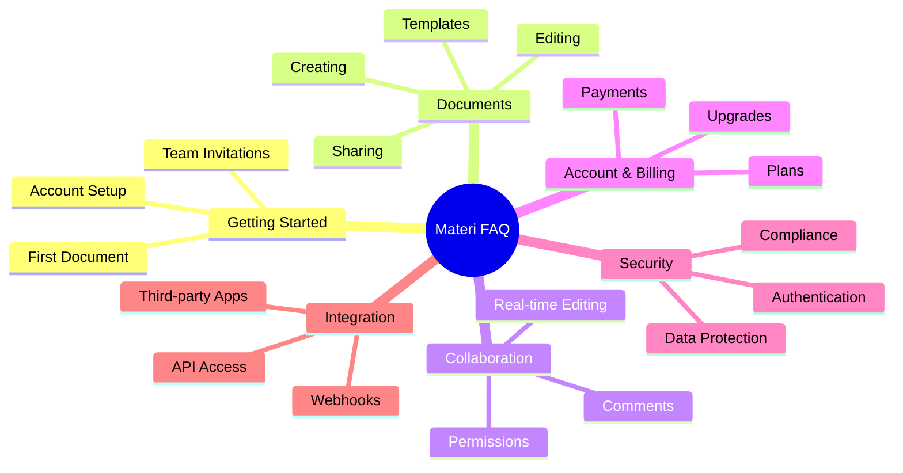

# Frequently Asked Questions

Welcome to the Materi FAQ. Here you will find answers to the most common questions about our platform, features, billing, and more. Use the categories below to quickly find what you are looking for.

<Note>
Cannot find what you are looking for? [Contact our support team](/support/contact-support) for personalized assistance.
</Note>

## FAQ Categories Overview



---

## Getting Started

<AccordionGroup>
  <Accordion title="How do I create a Materi account?">
    Creating a Materi account is simple:

    1. Visit [materi.io/signup](https://materi.io/signup)
    2. Enter your email address and create a password
    3. Verify your email by clicking the link sent to your inbox
    4. Complete your profile setup
    5. Choose your plan (you can start with a free trial)

    <Tip>
    If your organization already uses Materi, ask your admin to send you an invitation link for automatic team assignment.
    </Tip>
  </Accordion>

  <Accordion title="What browsers are supported?">
    Materi supports the following browsers with full functionality:

    | Browser | Minimum Version | Recommended |
    |---------|----------------|-------------|
    | Google Chrome | 90+ | Latest |
    | Mozilla Firefox | 88+ | Latest |
    | Microsoft Edge | 90+ | Latest |
    | Safari | 14+ | Latest |
    | Opera | 76+ | Latest |

    <Warning>
    Internet Explorer is not supported. For the best experience, we recommend using the latest version of Chrome or Firefox.
    </Warning>
  </Accordion>

  <Accordion title="Is there a mobile app available?">
    Yes! Materi offers native mobile applications for both iOS and Android:

    - **iOS**: Available on the App Store for iPhone and iPad (iOS 14+)
    - **Android**: Available on Google Play (Android 8.0+)

    Mobile apps support viewing, editing, commenting, and real-time collaboration. Some advanced features like template creation are available only on desktop.
  </Accordion>

  <Accordion title="How do I invite team members to my workspace?">
    To invite team members:

    1. Navigate to **Settings** > **Team Members**
    2. Click **Invite Members**
    3. Enter email addresses (comma-separated for multiple)
    4. Select their role (Viewer, Editor, or Admin)
    5. Click **Send Invitations**

    Invitees will receive an email with a link to join your workspace. Pending invitations can be managed from the Team Members page.
  </Accordion>

  <Accordion title="Can I import documents from other platforms?">
    Absolutely! Materi supports importing from multiple sources:

    - **Microsoft Word** (.docx, .doc)
    - **Google Docs** (via direct integration)
    - **Notion** (export and import)
    - **Confluence** (export and import)
    - **Markdown files** (.md)
    - **HTML files** (.html)
    - **Plain text** (.txt)

    To import, go to **Documents** > **Import** and select your source. Formatting and basic structure are preserved during import.
  </Accordion>
</AccordionGroup>

---

## Documents & Editing

<AccordionGroup>
  <Accordion title="What is the maximum document size?">
    Document size limits vary by plan:

    | Plan | Max Document Size | Max Total Storage |
    |------|------------------|-------------------|
    | Starter | 25 MB per document | 5 GB |
    | Professional | 100 MB per document | 100 GB |
    | Enterprise | 500 MB per document | Unlimited |

    <Note>
    Document size includes all embedded images, attachments, and version history. Large files are automatically optimized for performance.
    </Note>
  </Accordion>

  <Accordion title="How does version history work?">
    Every change in Materi is automatically saved and versioned:

    - **Auto-save**: Changes are saved every few seconds
    - **Version snapshots**: Major versions created every 30 minutes of activity
    - **Named versions**: Manually create named versions at any time
    - **Version retention**: Starter (30 days), Professional (1 year), Enterprise (unlimited)

    To access version history, click the **History** icon in the document toolbar or press `Cmd/Ctrl + Shift + H`.
  </Accordion>

  <Accordion title="Can I use templates?">
    Yes! Materi offers extensive template support:

    - **Built-in templates**: Over 50 professionally designed templates for common use cases
    - **Custom templates**: Create and save your own templates
    - **Team templates**: Share templates across your organization (Professional+)
    - **Template library**: Access community-contributed templates

    Access templates from **Documents** > **New** > **From Template**.
  </Accordion>

  <Accordion title="How do I export documents?">
    Export your documents in multiple formats:

    1. Open the document you want to export
    2. Click **File** > **Export** or press `Cmd/Ctrl + Shift + E`
    3. Select your desired format:
       - PDF (with customizable options)
       - Microsoft Word (.docx)
       - Markdown (.md)
       - HTML
       - Plain Text
    4. Configure export settings if needed
    5. Click **Export**

    <Tip>
    Enable "Include comments" or "Include tracked changes" in export settings for review documents.
    </Tip>
  </Accordion>

  <Accordion title="What formatting options are available?">
    Materi provides comprehensive formatting capabilities:

    **Text Formatting**
    - Bold, italic, underline, strikethrough
    - Headings (H1-H6)
    - Font size and color
    - Highlights and background colors

    **Structure**
    - Bullet and numbered lists
    - Task lists with checkboxes
    - Tables with advanced features
    - Code blocks with syntax highlighting
    - Blockquotes and callouts

    **Media**
    - Images with captions
    - Embedded videos
    - File attachments
    - Mathematical equations (LaTeX)
    - Diagrams (Mermaid integration)
  </Accordion>
</AccordionGroup>

---

## Collaboration

<AccordionGroup>
  <Accordion title="How many people can edit simultaneously?">
    Simultaneous editing limits depend on your plan:

    | Plan | Max Simultaneous Editors |
    |------|-------------------------|
    | Starter | 5 users |
    | Professional | 25 users |
    | Enterprise | 100 users |

    All users see real-time cursors, selections, and changes from other collaborators. There is no conflict resolution needed as all edits are merged automatically.
  </Accordion>

  <Accordion title="How do comments and mentions work?">
    Comments enable rich discussion within documents:

    **Adding Comments**
    - Select text and click the comment icon (or press `Cmd/Ctrl + Alt + M`)
    - Type your comment and click Post
    - Comments appear in a sidebar and inline

    **Mentions**
    - Type `@` followed by a name to mention someone
    - Mentioned users receive email and in-app notifications
    - Click a mention to view the user's profile

    **Resolving Comments**
    - Click "Resolve" to mark a comment as addressed
    - Resolved comments are hidden but accessible in history
  </Accordion>

  <Accordion title="Can I restrict editing to specific sections?">
    Yes, with document locking (Professional and Enterprise plans):

    - **Full document lock**: Prevent all editing temporarily
    - **Section locks**: Lock specific sections while keeping others editable
    - **Permission-based locks**: Only certain roles can edit locked sections

    To lock a section, right-click the section header and select **Lock Section**. Admins can always unlock.
  </Accordion>

  <Accordion title="How do I share documents externally?">
    Share documents with people outside your organization:

    1. Click the **Share** button in the document header
    2. Select **Share externally**
    3. Choose access level:
       - **View only**: Recipients can read but not edit
       - **Comment**: Recipients can add comments
       - **Edit**: Recipients can make changes (requires sign-in)
    4. Set optional expiration date and password
    5. Copy the share link

    <Warning>
    External sharing may be restricted by your organization's security policies. Contact your admin if you cannot share externally.
    </Warning>
  </Accordion>

  <Accordion title="What permissions can I assign to collaborators?">
    Materi offers granular permission controls:

    | Permission | View | Comment | Edit | Manage |
    |------------|------|---------|------|--------|
    | Read document | Yes | Yes | Yes | Yes |
    | Add comments | No | Yes | Yes | Yes |
    | Edit content | No | No | Yes | Yes |
    | Delete document | No | No | No | Yes |
    | Manage sharing | No | No | No | Yes |
    | View history | Yes | Yes | Yes | Yes |
    | Restore versions | No | No | Yes | Yes |
  </Accordion>
</AccordionGroup>

---

## Account & Billing

<AccordionGroup>
  <Accordion title="What plans are available?">
    Materi offers three main plans:

    **Starter** - $0/month
    - Up to 3 team members
    - 5 GB storage
    - Basic collaboration features
    - Community support

    **Professional** - $12/user/month
    - Unlimited team members
    - 100 GB storage
    - Advanced collaboration
    - Priority support
    - Custom templates

    **Enterprise** - Custom pricing
    - Everything in Professional
    - Unlimited storage
    - SSO/SAML integration
    - Advanced security controls
    - Dedicated support
    - Custom contracts

    Visit our [pricing page](https://materi.io/pricing) for complete details.
  </Accordion>

  <Accordion title="How do I upgrade or downgrade my plan?">
    To change your plan:

    1. Go to **Settings** > **Billing**
    2. Click **Change Plan**
    3. Select your new plan
    4. Review the changes and confirm

    **Upgrades** take effect immediately, with prorated charges for the current billing period.

    **Downgrades** take effect at the end of your current billing period. Ensure your usage is within the new plan's limits before downgrading.
  </Accordion>

  <Accordion title="What payment methods are accepted?">
    We accept the following payment methods:

    - Credit/debit cards (Visa, Mastercard, American Express, Discover)
    - PayPal
    - Bank transfer (Enterprise plans, annual billing only)
    - Wire transfer (Enterprise plans)

    <Note>
    All payments are processed securely through Stripe. We never store your full credit card information on our servers.
    </Note>
  </Accordion>

  <Accordion title="Can I get a refund?">
    Our refund policy:

    - **Monthly plans**: Cancel anytime, no refunds for partial months
    - **Annual plans**: Full refund within 30 days of purchase
    - **Enterprise**: Subject to contract terms

    To request a refund, contact [billing@materi.io](mailto:billing@materi.io) with your account details and reason for the request.
  </Accordion>

  <Accordion title="How do I cancel my subscription?">
    To cancel your subscription:

    1. Navigate to **Settings** > **Billing**
    2. Click **Cancel Subscription**
    3. Select your reason for canceling (optional)
    4. Confirm cancellation

    Your access continues until the end of the current billing period. You can export all your data before cancellation. Reactivation is possible anytime.
  </Accordion>
</AccordionGroup>

---

## Security & Privacy

<AccordionGroup>
  <Accordion title="How is my data protected?">
    Materi employs multiple layers of security:

    **Encryption**
    - Data at rest: AES-256 encryption
    - Data in transit: TLS 1.3
    - End-to-end encryption available for Enterprise

    **Infrastructure**
    - SOC 2 Type II certified data centers
    - Geographic redundancy
    - Regular security audits
    - DDoS protection

    **Access Control**
    - Multi-factor authentication (MFA)
    - Session management
    - IP allowlisting (Enterprise)
    - Audit logs
  </Accordion>

  <Accordion title="Is Materi GDPR compliant?">
    Yes, Materi is fully GDPR compliant:

    - **Data Processing Agreement (DPA)**: Available for all customers
    - **Data portability**: Export all your data anytime
    - **Right to erasure**: Delete your account and all data
    - **Data residency**: Choose EU or US data centers (Enterprise)
    - **Privacy by design**: Minimal data collection

    Request our DPA at [privacy@materi.io](mailto:privacy@materi.io).
  </Accordion>

  <Accordion title="Does Materi support Single Sign-On (SSO)?">
    SSO is available on Enterprise plans:

    **Supported Providers**
    - Okta
    - Azure AD
    - Google Workspace
    - OneLogin
    - PingIdentity
    - Any SAML 2.0 compliant provider

    **Features**
    - Automatic user provisioning (SCIM)
    - Just-in-time provisioning
    - Role mapping
    - Group synchronization

    Contact sales to enable SSO for your organization.
  </Accordion>

  <Accordion title="How long is data retained after account deletion?">
    Our data retention policy:

    | Data Type | Retention After Deletion |
    |-----------|-------------------------|
    | Documents | 30 days (recoverable) |
    | User data | Immediately deleted |
    | Backups | 90 days (then purged) |
    | Audit logs | 1 year (compliance) |
    | Analytics | Anonymized, retained |

    Enterprise customers can customize retention policies based on compliance requirements.
  </Accordion>

  <Accordion title="Can I enable two-factor authentication?">
    Yes! Two-factor authentication (2FA) adds an extra layer of security:

    **Supported Methods**
    - Authenticator apps (Google Authenticator, Authy, 1Password)
    - SMS codes (backup option)
    - Hardware security keys (YubiKey, etc.)

    **To Enable 2FA**
    1. Go to **Settings** > **Security**
    2. Click **Enable Two-Factor Authentication**
    3. Scan the QR code with your authenticator app
    4. Enter the verification code
    5. Save your backup codes securely

    <Warning>
    Store your backup codes in a safe place. They are the only way to recover your account if you lose access to your 2FA device.
    </Warning>
  </Accordion>
</AccordionGroup>

---

## Integrations & API

<AccordionGroup>
  <Accordion title="What integrations are available?">
    Materi integrates with popular tools:

    <CardGroup cols={3}>
      <Card title="Productivity" icon="briefcase">
        - Slack
        - Microsoft Teams
        - Zoom
        - Google Calendar
      </Card>
      <Card title="Development" icon="code">
        - GitHub
        - GitLab
        - Jira
        - Linear
      </Card>
      <Card title="Storage" icon="cloud">
        - Google Drive
        - Dropbox
        - OneDrive
        - Box
      </Card>
    </CardGroup>

    Browse all integrations in **Settings** > **Integrations**.
  </Accordion>

  <Accordion title="How do I access the API?">
    API access is available on Professional and Enterprise plans:

    1. Go to **Settings** > **API**
    2. Click **Generate API Key**
    3. Copy your key (it is shown only once)
    4. Use the key in your API requests

    ```bash
    curl -H "Authorization: Bearer YOUR_API_KEY" \
         https://api.materi.io/v1/documents
    ```

    Full API documentation is available at [docs.materi.io/api](/api-reference).
  </Accordion>

  <Accordion title="Are webhooks supported?">
    Yes, webhooks enable real-time event notifications:

    **Supported Events**
    - Document created/updated/deleted
    - Comment added/resolved
    - User joined/left workspace
    - Permission changes
    - Export completed

    **Setup**
    1. Go to **Settings** > **Webhooks**
    2. Click **Add Webhook**
    3. Enter your endpoint URL
    4. Select events to subscribe to
    5. Save and test

    All webhook payloads are signed for verification.
  </Accordion>

  <Accordion title="Can I embed Materi documents?">
    Yes, documents can be embedded in external websites:

    1. Open the document to embed
    2. Click **Share** > **Embed**
    3. Configure embed options:
       - Width and height
       - Show/hide toolbar
       - Allow interactions
    4. Copy the embed code

    ```html
    <iframe src="https://materi.io/embed/doc_xxxxx"
            width="100%" height="600"
            frameborder="0">
    </iframe>
    ```

    <Note>
    Embedded documents respect the original sharing permissions. Viewers need appropriate access to view embedded content.
    </Note>
  </Accordion>
</AccordionGroup>

---

## Troubleshooting

<AccordionGroup>
  <Accordion title="Why are my changes not saving?">
    If changes are not saving, try these steps:

    1. **Check your internet connection** - Materi requires an active connection to save
    2. **Look for the save indicator** - A spinning icon means saving is in progress
    3. **Refresh the page** - Sometimes a refresh resolves sync issues
    4. **Check for conflicts** - Another user may have made conflicting changes
    5. **Clear browser cache** - Old cached data can cause issues

    If problems persist, [contact support](/support/contact-support) with your document URL.
  </Accordion>

  <Accordion title="I cannot log in to my account">
    Login issues can usually be resolved:

    1. **Verify your email** - Ensure you are using the correct email address
    2. **Reset your password** - Click "Forgot password" on the login page
    3. **Check for SSO** - Your organization may require SSO login
    4. **Try incognito mode** - Browser extensions can interfere with login
    5. **Check account status** - Your account may be suspended or deleted

    For persistent issues, contact [support@materi.io](mailto:support@materi.io).
  </Accordion>
</AccordionGroup>

---

## Still Have Questions?

<CardGroup cols={2}>
  <Card title="Contact Support" icon="headset" href="/support/contact-support">
    Reach out to our support team for personalized assistance with any questions not covered here.
  </Card>
  <Card title="Community Forum" icon="users" href="https://community.materi.io">
    Connect with other Materi users, share tips, and get advice from the community.
  </Card>
  <Card title="Video Tutorials" icon="play" href="/support/video-tutorials">
    Watch step-by-step video guides for visual learners who prefer seeing features in action.
  </Card>
  <Card title="Troubleshooting Guide" icon="wrench" href="/support/troubleshooting">
    Find solutions to common technical issues and step-by-step fixes.
  </Card>
</CardGroup>
