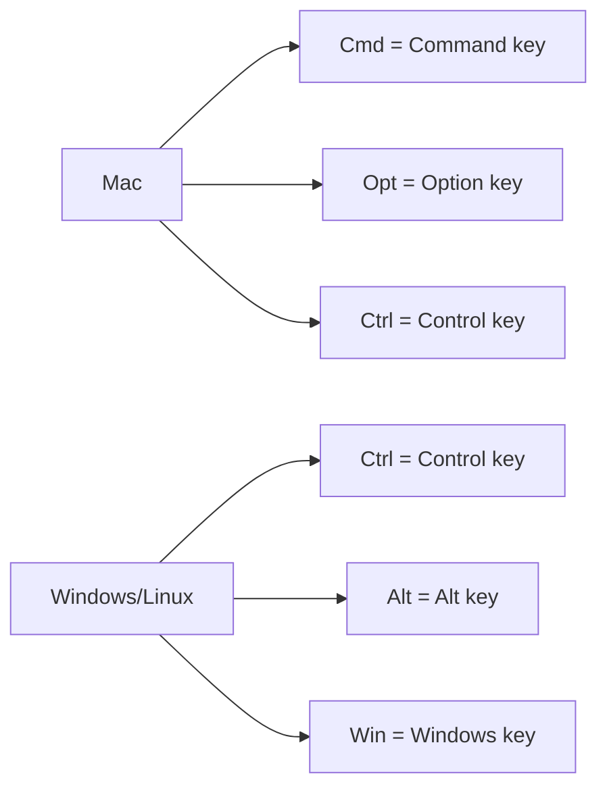

# Keyboard Shortcuts

Master Materi with keyboard shortcuts to work faster and more efficiently. This comprehensive guide covers all available shortcuts for Mac and Windows/Linux users.

<Tip>
**Quick Reference**: Press `Cmd + /` (Mac) or `Ctrl + /` (Windows) anywhere in Materi to open the keyboard shortcuts quick reference panel.
</Tip>

## Shortcut Conventions



<Note>
Throughout this guide, Mac shortcuts are shown first, followed by Windows/Linux equivalents. Most shortcuts follow the pattern where `Cmd` on Mac equals `Ctrl` on Windows.
</Note>

---

## General Navigation

Essential shortcuts for navigating the Materi interface.

<Tabs>
  <Tab title="Mac">
    | Action | Shortcut |
    |--------|----------|
    | Open command palette | `Cmd + K` |
    | Quick search | `Cmd + P` |
    | Open keyboard shortcuts help | `Cmd + /` |
    | Go to home/dashboard | `Cmd + Shift + H` |
    | Go to settings | `Cmd + ,` |
    | Go to notifications | `Cmd + Shift + N` |
    | Open recent documents | `Cmd + Shift + O` |
    | Switch workspaces | `Cmd + Shift + W` |
    | Toggle sidebar | `Cmd + \` |
    | Toggle full screen | `Cmd + Ctrl + F` |
    | Zoom in | `Cmd + +` |
    | Zoom out | `Cmd + -` |
    | Reset zoom | `Cmd + 0` |
    | Refresh page | `Cmd + R` |
    | Hard refresh | `Cmd + Shift + R` |
  </Tab>
  <Tab title="Windows/Linux">
    | Action | Shortcut |
    |--------|----------|
    | Open command palette | `Ctrl + K` |
    | Quick search | `Ctrl + P` |
    | Open keyboard shortcuts help | `Ctrl + /` |
    | Go to home/dashboard | `Ctrl + Shift + H` |
    | Go to settings | `Ctrl + ,` |
    | Go to notifications | `Ctrl + Shift + N` |
    | Open recent documents | `Ctrl + Shift + O` |
    | Switch workspaces | `Ctrl + Shift + W` |
    | Toggle sidebar | `Ctrl + \` |
    | Toggle full screen | `F11` |
    | Zoom in | `Ctrl + +` |
    | Zoom out | `Ctrl + -` |
    | Reset zoom | `Ctrl + 0` |
    | Refresh page | `Ctrl + R` or `F5` |
    | Hard refresh | `Ctrl + Shift + R` |
  </Tab>
</Tabs>

---

## Document Management

Shortcuts for creating, opening, saving, and managing documents.

<Tabs>
  <Tab title="Mac">
    | Action | Shortcut |
    |--------|----------|
    | Create new document | `Cmd + N` |
    | Create new document in folder | `Cmd + Shift + N` |
    | Open document | `Cmd + O` |
    | Save document | `Cmd + S` |
    | Save as/Duplicate | `Cmd + Shift + S` |
    | Close document | `Cmd + W` |
    | Close all documents | `Cmd + Opt + W` |
    | Print document | `Cmd + P` |
    | Export document | `Cmd + Shift + E` |
    | Share document | `Cmd + Shift + S` |
    | View document info | `Cmd + I` |
    | Move to folder | `Cmd + Shift + M` |
    | Duplicate document | `Cmd + D` |
    | Delete document | `Cmd + Backspace` |
    | Archive document | `Cmd + Shift + A` |
    | Restore from trash | `Cmd + Shift + Z` |
  </Tab>
  <Tab title="Windows/Linux">
    | Action | Shortcut |
    |--------|----------|
    | Create new document | `Ctrl + N` |
    | Create new document in folder | `Ctrl + Shift + N` |
    | Open document | `Ctrl + O` |
    | Save document | `Ctrl + S` |
    | Save as/Duplicate | `Ctrl + Shift + S` |
    | Close document | `Ctrl + W` |
    | Close all documents | `Ctrl + Alt + W` |
    | Print document | `Ctrl + P` |
    | Export document | `Ctrl + Shift + E` |
    | Share document | `Ctrl + Shift + S` |
    | View document info | `Ctrl + I` |
    | Move to folder | `Ctrl + Shift + M` |
    | Duplicate document | `Ctrl + D` |
    | Delete document | `Delete` or `Ctrl + Backspace` |
    | Archive document | `Ctrl + Shift + A` |
    | Restore from trash | `Ctrl + Shift + Z` |
  </Tab>
</Tabs>

---

## Text Editing

Comprehensive shortcuts for editing text content.

### Basic Text Operations

<Tabs>
  <Tab title="Mac">
    | Action | Shortcut |
    |--------|----------|
    | Undo | `Cmd + Z` |
    | Redo | `Cmd + Shift + Z` or `Cmd + Y` |
    | Cut | `Cmd + X` |
    | Copy | `Cmd + C` |
    | Paste | `Cmd + V` |
    | Paste without formatting | `Cmd + Shift + V` |
    | Paste and match style | `Cmd + Opt + Shift + V` |
    | Select all | `Cmd + A` |
    | Find | `Cmd + F` |
    | Find and replace | `Cmd + H` or `Cmd + Opt + F` |
    | Find next | `Cmd + G` |
    | Find previous | `Cmd + Shift + G` |
    | Go to line | `Cmd + L` |
    | Delete word before cursor | `Opt + Backspace` |
    | Delete word after cursor | `Opt + Delete` |
    | Delete line | `Cmd + Shift + K` |
    | Delete to end of line | `Cmd + Delete` |
    | Delete to start of line | `Cmd + Backspace` |
  </Tab>
  <Tab title="Windows/Linux">
    | Action | Shortcut |
    |--------|----------|
    | Undo | `Ctrl + Z` |
    | Redo | `Ctrl + Shift + Z` or `Ctrl + Y` |
    | Cut | `Ctrl + X` |
    | Copy | `Ctrl + C` |
    | Paste | `Ctrl + V` |
    | Paste without formatting | `Ctrl + Shift + V` |
    | Paste and match style | `Ctrl + Alt + Shift + V` |
    | Select all | `Ctrl + A` |
    | Find | `Ctrl + F` |
    | Find and replace | `Ctrl + H` |
    | Find next | `F3` or `Ctrl + G` |
    | Find previous | `Shift + F3` or `Ctrl + Shift + G` |
    | Go to line | `Ctrl + L` |
    | Delete word before cursor | `Ctrl + Backspace` |
    | Delete word after cursor | `Ctrl + Delete` |
    | Delete line | `Ctrl + Shift + K` |
    | Delete to end of line | `Shift + End` then `Delete` |
    | Delete to start of line | `Shift + Home` then `Delete` |
  </Tab>
</Tabs>

### Text Selection

<Tabs>
  <Tab title="Mac">
    | Action | Shortcut |
    |--------|----------|
    | Select word | `Double-click` or `Opt + Shift + Arrow` |
    | Select line | `Triple-click` or `Cmd + Shift + Arrow` |
    | Select paragraph | `Quadruple-click` |
    | Extend selection left | `Shift + Left Arrow` |
    | Extend selection right | `Shift + Right Arrow` |
    | Extend selection up | `Shift + Up Arrow` |
    | Extend selection down | `Shift + Down Arrow` |
    | Select word left | `Opt + Shift + Left Arrow` |
    | Select word right | `Opt + Shift + Right Arrow` |
    | Select to line start | `Cmd + Shift + Left Arrow` |
    | Select to line end | `Cmd + Shift + Right Arrow` |
    | Select to document start | `Cmd + Shift + Up Arrow` |
    | Select to document end | `Cmd + Shift + Down Arrow` |
    | Select all in block | `Cmd + Opt + A` |
    | Add cursor above | `Cmd + Opt + Up Arrow` |
    | Add cursor below | `Cmd + Opt + Down Arrow` |
    | Add cursor at click | `Opt + Click` |
  </Tab>
  <Tab title="Windows/Linux">
    | Action | Shortcut |
    |--------|----------|
    | Select word | `Double-click` or `Ctrl + Shift + Arrow` |
    | Select line | `Triple-click` |
    | Select paragraph | `Quadruple-click` |
    | Extend selection left | `Shift + Left Arrow` |
    | Extend selection right | `Shift + Right Arrow` |
    | Extend selection up | `Shift + Up Arrow` |
    | Extend selection down | `Shift + Down Arrow` |
    | Select word left | `Ctrl + Shift + Left Arrow` |
    | Select word right | `Ctrl + Shift + Right Arrow` |
    | Select to line start | `Shift + Home` |
    | Select to line end | `Shift + End` |
    | Select to document start | `Ctrl + Shift + Home` |
    | Select to document end | `Ctrl + Shift + End` |
    | Select all in block | `Ctrl + Alt + A` |
    | Add cursor above | `Ctrl + Alt + Up Arrow` |
    | Add cursor below | `Ctrl + Alt + Down Arrow` |
    | Add cursor at click | `Alt + Click` |
  </Tab>
</Tabs>

---

## Text Formatting

Shortcuts for applying styles and formatting to text.

### Basic Formatting

<Tabs>
  <Tab title="Mac">
    | Action | Shortcut |
    |--------|----------|
    | Bold | `Cmd + B` |
    | Italic | `Cmd + I` |
    | Underline | `Cmd + U` |
    | Strikethrough | `Cmd + Shift + X` |
    | Subscript | `Cmd + ,` |
    | Superscript | `Cmd + .` |
    | Highlight text | `Cmd + Shift + H` |
    | Clear formatting | `Cmd + \` |
    | Increase font size | `Cmd + Shift + >` |
    | Decrease font size | `Cmd + Shift + <` |
    | Insert link | `Cmd + K` |
    | Remove link | `Cmd + Shift + K` |
  </Tab>
  <Tab title="Windows/Linux">
    | Action | Shortcut |
    |--------|----------|
    | Bold | `Ctrl + B` |
    | Italic | `Ctrl + I` |
    | Underline | `Ctrl + U` |
    | Strikethrough | `Ctrl + Shift + X` |
    | Subscript | `Ctrl + ,` |
    | Superscript | `Ctrl + .` |
    | Highlight text | `Ctrl + Shift + H` |
    | Clear formatting | `Ctrl + \` |
    | Increase font size | `Ctrl + Shift + >` |
    | Decrease font size | `Ctrl + Shift + <` |
    | Insert link | `Ctrl + K` |
    | Remove link | `Ctrl + Shift + K` |
  </Tab>
</Tabs>

### Headings and Paragraphs

<Tabs>
  <Tab title="Mac">
    | Action | Shortcut |
    |--------|----------|
    | Heading 1 | `Cmd + Opt + 1` |
    | Heading 2 | `Cmd + Opt + 2` |
    | Heading 3 | `Cmd + Opt + 3` |
    | Heading 4 | `Cmd + Opt + 4` |
    | Heading 5 | `Cmd + Opt + 5` |
    | Heading 6 | `Cmd + Opt + 6` |
    | Normal paragraph | `Cmd + Opt + 0` |
    | Blockquote | `Cmd + Opt + Q` |
    | Code block | `Cmd + Opt + C` |
    | Inline code | `Cmd + E` |
    | Callout/Note | `Cmd + Opt + N` |
    | Divider/Horizontal rule | `Cmd + Opt + -` |
  </Tab>
  <Tab title="Windows/Linux">
    | Action | Shortcut |
    |--------|----------|
    | Heading 1 | `Ctrl + Alt + 1` |
    | Heading 2 | `Ctrl + Alt + 2` |
    | Heading 3 | `Ctrl + Alt + 3` |
    | Heading 4 | `Ctrl + Alt + 4` |
    | Heading 5 | `Ctrl + Alt + 5` |
    | Heading 6 | `Ctrl + Alt + 6` |
    | Normal paragraph | `Ctrl + Alt + 0` |
    | Blockquote | `Ctrl + Alt + Q` |
    | Code block | `Ctrl + Alt + C` |
    | Inline code | `Ctrl + E` |
    | Callout/Note | `Ctrl + Alt + N` |
    | Divider/Horizontal rule | `Ctrl + Alt + -` |
  </Tab>
</Tabs>

### Lists and Alignment

<Tabs>
  <Tab title="Mac">
    | Action | Shortcut |
    |--------|----------|
    | Bullet list | `Cmd + Shift + 8` |
    | Numbered list | `Cmd + Shift + 7` |
    | Task list/Checklist | `Cmd + Shift + 9` |
    | Toggle checkbox | `Cmd + Enter` |
    | Indent list item | `Tab` |
    | Outdent list item | `Shift + Tab` |
    | Move list item up | `Cmd + Opt + Up Arrow` |
    | Move list item down | `Cmd + Opt + Down Arrow` |
    | Align left | `Cmd + Shift + L` |
    | Align center | `Cmd + Shift + E` |
    | Align right | `Cmd + Shift + R` |
    | Justify | `Cmd + Shift + J` |
  </Tab>
  <Tab title="Windows/Linux">
    | Action | Shortcut |
    |--------|----------|
    | Bullet list | `Ctrl + Shift + 8` |
    | Numbered list | `Ctrl + Shift + 7` |
    | Task list/Checklist | `Ctrl + Shift + 9` |
    | Toggle checkbox | `Ctrl + Enter` |
    | Indent list item | `Tab` |
    | Outdent list item | `Shift + Tab` |
    | Move list item up | `Ctrl + Alt + Up Arrow` |
    | Move list item down | `Ctrl + Alt + Down Arrow` |
    | Align left | `Ctrl + Shift + L` |
    | Align center | `Ctrl + Shift + E` |
    | Align right | `Ctrl + Shift + R` |
    | Justify | `Ctrl + Shift + J` |
  </Tab>
</Tabs>

---

## Tables

Shortcuts for creating and editing tables.

<Tabs>
  <Tab title="Mac">
    | Action | Shortcut |
    |--------|----------|
    | Insert table | `Cmd + Opt + T` |
    | Add row above | `Cmd + Shift + Up Arrow` |
    | Add row below | `Cmd + Shift + Down Arrow` |
    | Add column left | `Cmd + Shift + Left Arrow` |
    | Add column right | `Cmd + Shift + Right Arrow` |
    | Delete row | `Cmd + Opt + Backspace` |
    | Delete column | `Cmd + Opt + Delete` |
    | Delete table | `Cmd + Opt + Shift + Backspace` |
    | Move to next cell | `Tab` |
    | Move to previous cell | `Shift + Tab` |
    | Move to row below | `Enter` |
    | Select cell | `Cmd + Click` |
    | Select row | `Cmd + Shift + Click` on row |
    | Select column | `Cmd + Opt + Click` on column |
    | Merge cells | `Cmd + Opt + M` |
    | Split cell | `Cmd + Opt + S` |
    | Toggle header row | `Cmd + Opt + H` |
  </Tab>
  <Tab title="Windows/Linux">
    | Action | Shortcut |
    |--------|----------|
    | Insert table | `Ctrl + Alt + T` |
    | Add row above | `Ctrl + Shift + Up Arrow` |
    | Add row below | `Ctrl + Shift + Down Arrow` |
    | Add column left | `Ctrl + Shift + Left Arrow` |
    | Add column right | `Ctrl + Shift + Right Arrow` |
    | Delete row | `Ctrl + Alt + Backspace` |
    | Delete column | `Ctrl + Alt + Delete` |
    | Delete table | `Ctrl + Alt + Shift + Backspace` |
    | Move to next cell | `Tab` |
    | Move to previous cell | `Shift + Tab` |
    | Move to row below | `Enter` |
    | Select cell | `Ctrl + Click` |
    | Select row | `Ctrl + Shift + Click` on row |
    | Select column | `Ctrl + Alt + Click` on column |
    | Merge cells | `Ctrl + Alt + M` |
    | Split cell | `Ctrl + Alt + S` |
    | Toggle header row | `Ctrl + Alt + H` |
  </Tab>
</Tabs>

---

## Collaboration

Shortcuts for collaborative features.

<Tabs>
  <Tab title="Mac">
    | Action | Shortcut |
    |--------|----------|
    | Add comment | `Cmd + Opt + M` |
    | Next comment | `Cmd + ]` |
    | Previous comment | `Cmd + [` |
    | Resolve comment | `Cmd + Opt + R` |
    | Delete comment | `Cmd + Opt + Backspace` |
    | Toggle comments panel | `Cmd + Shift + C` |
    | View version history | `Cmd + Shift + H` |
    | Restore version | `Cmd + Shift + R` |
    | Create named version | `Cmd + Opt + V` |
    | Show collaborators | `Cmd + Shift + U` |
    | Follow collaborator | `Cmd + Opt + F` |
    | Stop following | `Escape` |
    | Start presentation mode | `Cmd + Opt + P` |
  </Tab>
  <Tab title="Windows/Linux">
    | Action | Shortcut |
    |--------|----------|
    | Add comment | `Ctrl + Alt + M` |
    | Next comment | `Ctrl + ]` |
    | Previous comment | `Ctrl + [` |
    | Resolve comment | `Ctrl + Alt + R` |
    | Delete comment | `Ctrl + Alt + Backspace` |
    | Toggle comments panel | `Ctrl + Shift + C` |
    | View version history | `Ctrl + Shift + H` |
    | Restore version | `Ctrl + Shift + R` |
    | Create named version | `Ctrl + Alt + V` |
    | Show collaborators | `Ctrl + Shift + U` |
    | Follow collaborator | `Ctrl + Alt + F` |
    | Stop following | `Escape` |
    | Start presentation mode | `Ctrl + Alt + P` |
  </Tab>
</Tabs>

---

## Media and Embeds

Shortcuts for inserting and managing media content.

<Tabs>
  <Tab title="Mac">
    | Action | Shortcut |
    |--------|----------|
    | Insert image | `Cmd + Opt + I` |
    | Insert video | `Cmd + Opt + V` |
    | Insert file attachment | `Cmd + Opt + A` |
    | Insert embed (URL) | `Cmd + Opt + E` |
    | Insert diagram | `Cmd + Opt + D` |
    | Insert equation | `Cmd + Opt + X` |
    | Insert emoji | `Cmd + Ctrl + Space` |
    | Insert date | `Cmd + ;` |
    | Insert mention | `@` |
    | Insert page link | `[[` |
    | Resize image smaller | `Cmd + -` (when selected) |
    | Resize image larger | `Cmd + +` (when selected) |
    | Reset image size | `Cmd + 0` (when selected) |
  </Tab>
  <Tab title="Windows/Linux">
    | Action | Shortcut |
    |--------|----------|
    | Insert image | `Ctrl + Alt + I` |
    | Insert video | `Ctrl + Alt + V` |
    | Insert file attachment | `Ctrl + Alt + A` |
    | Insert embed (URL) | `Ctrl + Alt + E` |
    | Insert diagram | `Ctrl + Alt + D` |
    | Insert equation | `Ctrl + Alt + X` |
    | Insert emoji | `Win + .` or `Win + ;` |
    | Insert date | `Ctrl + ;` |
    | Insert mention | `@` |
    | Insert page link | `[[` |
    | Resize image smaller | `Ctrl + -` (when selected) |
    | Resize image larger | `Ctrl + +` (when selected) |
    | Reset image size | `Ctrl + 0` (when selected) |
  </Tab>
</Tabs>

---

## Markdown Shortcuts

Type these characters followed by `Space` to quickly format content.

| Input | Result |
|-------|--------|
| `# ` | Heading 1 |
| `## ` | Heading 2 |
| `### ` | Heading 3 |
| `#### ` | Heading 4 |
| `##### ` | Heading 5 |
| `###### ` | Heading 6 |
| `- ` or `* ` | Bullet list |
| `1. ` | Numbered list |
| `[] ` or `[ ] ` | Task list item |
| `[x] ` | Checked task item |
| `> ` | Blockquote |
| ``` ` ` ` ``` | Code block |
| `---` | Horizontal divider |
| `**text**` | **Bold** |
| `*text*` | *Italic* |
| `~~text~~` | ~~Strikethrough~~ |
| `` `code` `` | `Inline code` |
| `[text](url)` | Link |
| `` | Image |

<Tip>
Markdown shortcuts work as you type, providing instant formatting without memorizing complex key combinations.
</Tip>

---

## Accessibility Shortcuts

Shortcuts designed for accessibility and navigation without a mouse.

<Tabs>
  <Tab title="Mac">
    | Action | Shortcut |
    |--------|----------|
    | Move focus to toolbar | `Opt + F10` |
    | Move focus to editor | `Escape` |
    | Navigate toolbar items | `Arrow keys` |
    | Activate toolbar item | `Enter` or `Space` |
    | Skip to main content | `Cmd + Opt + S` |
    | Open accessibility menu | `Cmd + Opt + A` |
    | Announce current selection | `Cmd + Opt + I` |
    | High contrast mode | `Cmd + Opt + H` |
    | Increase text size | `Cmd + +` |
    | Decrease text size | `Cmd + -` |
  </Tab>
  <Tab title="Windows/Linux">
    | Action | Shortcut |
    |--------|----------|
    | Move focus to toolbar | `Alt + F10` |
    | Move focus to editor | `Escape` |
    | Navigate toolbar items | `Arrow keys` |
    | Activate toolbar item | `Enter` or `Space` |
    | Skip to main content | `Ctrl + Alt + S` |
    | Open accessibility menu | `Ctrl + Alt + A` |
    | Announce current selection | `Ctrl + Alt + I` |
    | High contrast mode | `Ctrl + Alt + H` |
    | Increase text size | `Ctrl + +` |
    | Decrease text size | `Ctrl + -` |
  </Tab>
</Tabs>

---

## Customizing Shortcuts

You can customize keyboard shortcuts to match your preferences.

<Steps>
  <Step title="Open Preferences">
    Navigate to **Settings** > **Preferences** > **Keyboard Shortcuts** or press `Cmd/Ctrl + ,` and select the Keyboard tab.
  </Step>
  <Step title="Find the shortcut">
    Use the search box to find the action you want to customize, or browse by category.
  </Step>
  <Step title="Edit the shortcut">
    Click on the current shortcut and press your desired key combination. The system will warn you if there is a conflict.
  </Step>
  <Step title="Save changes">
    Click **Save** to apply your custom shortcuts. Changes take effect immediately.
  </Step>
</Steps>

<Warning>
Custom shortcuts sync across your devices. Resetting to defaults will restore all original shortcuts.
</Warning>

---

## Printable Reference Card

Download our printable keyboard shortcuts reference card for quick access.

<CardGroup cols={2}>
  <Card title="Mac Reference Card" icon="apple" href="https://materi.io/downloads/shortcuts-mac.pdf">
    Download a printable PDF with all Mac keyboard shortcuts.
  </Card>
  <Card title="Windows Reference Card" icon="windows" href="https://materi.io/downloads/shortcuts-windows.pdf">
    Download a printable PDF with all Windows keyboard shortcuts.
  </Card>
</CardGroup>

---

## Tips for Learning Shortcuts

<AccordionGroup>
  <Accordion title="Start with the essentials">
    Begin with these five shortcuts that will save you the most time:
    - `Cmd/Ctrl + K` - Command palette (does everything)
    - `Cmd/Ctrl + B/I/U` - Bold, italic, underline
    - `Cmd/Ctrl + Z` - Undo
    - `Cmd/Ctrl + F` - Find
    - `Cmd/Ctrl + S` - Save
  </Accordion>
  <Accordion title="Use the command palette">
    Press `Cmd/Ctrl + K` to open the command palette. You can search for any action and see its shortcut, then execute it directly.
  </Accordion>
  <Accordion title="Learn shortcuts gradually">
    Do not try to memorize everything at once. Pick 2-3 new shortcuts each week and practice until they become muscle memory.
  </Accordion>
  <Accordion title="Create muscle memory">
    When you catch yourself using the mouse for a common action, pause and use the keyboard shortcut instead. Repetition builds habits.
  </Accordion>
</AccordionGroup>
